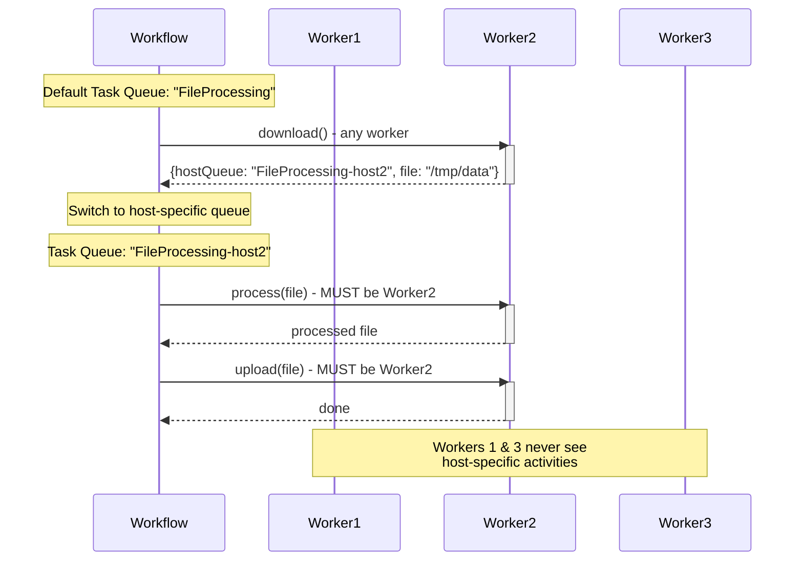

import Tabs from '@theme/Tabs';
import TabItem from '@theme/TabItem';

## Overview

The Worker-Specific Task Queues pattern enables routing Activities to specific Worker hosts when Activities must execute on the same machine.
This is essential for Workflows where subsequent Activities depend on local state, files, or resources created by previous Activities on a particular host.

## Problem

In distributed systems, you often need Workflows that download a file to a Worker's local disk and then process and upload it from the same location, establish a connection or session that subsequent Activities must reuse, create temporary resources on one host that later Activities need to access, or maintain affinity to a specific Worker for performance or data locality.

Without Worker-specific routing, Activities execute on different hosts and cannot access local files or state.
You must set up complex distributed file systems or shared storage, handle race conditions when multiple Workers access the same resources, and accept that you cannot guarantee Activity colocation.

## Solution

You use a two-tier Task Queue architecture: a default shared Task Queue for initial Activities, and dynamically-named host-specific Task Queues for Activities that must run on the same Worker.
The first Activity returns its host-specific Task Queue name, and subsequent Activities use that queue.



The following describes each step in the diagram:

1. The Workflow dispatches the download Activity on the default Task Queue. Any available Worker picks it up.
2. Worker 2 downloads the file and returns both the local file path and its host-specific Task Queue name.
3. The Workflow creates new Activity options targeting Worker 2's host-specific Task Queue.
4. The process and upload Activities execute on Worker 2, where the file is already on disk.
5. Workers 1 and 3 never see the host-specific Activities.

The following snippet shows how the Workflow switches from the default Task Queue to the host-specific queue:

<Tabs groupId="language" queryString>
<TabItem value="python" label="Python">

```python
# workflows.py
downloaded = await workflow.execute_activity(
    download,
    source,
    start_to_close_timeout=timedelta(seconds=20),
)

processed = await workflow.execute_activity(
    process,
    downloaded.file_name,
    task_queue=downloaded.host_task_queue,
    schedule_to_start_timeout=timedelta(seconds=10),
    start_to_close_timeout=timedelta(seconds=20),
)
await workflow.execute_activity(
    upload,
    args=[processed, destination],
    task_queue=downloaded.host_task_queue,
    schedule_to_start_timeout=timedelta(seconds=10),
    start_to_close_timeout=timedelta(seconds=20),
)
```

</TabItem>
<TabItem value="go" label="Go">

```go
// workflow.go
var defaultActivities *StoreActivities
downloaded, err := defaultActivities.Download(ctx, source)
if err != nil {
    return err
}

hostOptions := workflow.ActivityOptions{
    TaskQueue:              downloaded.HostTaskQueue,
    ScheduleToStartTimeout: 10 * time.Second,
    StartToCloseTimeout:    20 * time.Second,
}
hostCtx := workflow.WithActivityOptions(ctx, hostOptions)

var hostActivities *StoreActivities
processed, err := hostActivities.Process(hostCtx, downloaded.FileName)
if err != nil {
    return err
}
err = hostActivities.Upload(hostCtx, processed, destination)
```

</TabItem>
<TabItem value="java" label="Java">

```java
// FileProcessingWorkflowImpl.java
TaskQueueFileNamePair downloaded = defaultTaskQueueActivities.download(source);

ActivityOptions hostOptions = ActivityOptions.newBuilder()
    .setTaskQueue(downloaded.getHostTaskQueue())
    .setScheduleToStartTimeout(Duration.ofSeconds(10))
    .setStartToCloseTimeout(Duration.ofSeconds(20))
    .build();
StoreActivities hostSpecificActivities =
    Workflow.newActivityStub(StoreActivities.class, hostOptions);

String processed = hostSpecificActivities.process(downloaded.getFileName());
hostSpecificActivities.upload(processed, destination);
```

</TabItem>
<TabItem value="typescript" label="TypeScript">

```typescript
// workflows.ts
const { download } = proxyActivities<StoreActivities>({
  startToCloseTimeout: '20s',
});

const downloaded = await download(source);

const hostSpecificActivities = proxyActivities<StoreActivities>({
  taskQueue: downloaded.hostTaskQueue,
  scheduleToStartTimeout: '10s',
  startToCloseTimeout: '20s',
});

const processed = await hostSpecificActivities.process(downloaded.fileName);
await hostSpecificActivities.upload(processed, destination);
```

</TabItem>
</Tabs>

The `taskQueue` option (or `setTaskQueue()` in Java) routes subsequent Activities to the specific Worker that downloaded the file.
The `scheduleToStartTimeout` (or `setScheduleToStartTimeout()` in Java) is critical — if the specific Worker is unavailable, the Activity Task cannot sit in the host-specific queue indefinitely.
This timeout is non-retryable: when it expires, the Activity fails rather than retrying, because a retry would only place the Task back on the same queue.
The Workflow catches that failure and retries the entire sequence so the work can restart on a different host.

## Implementation

### Activity definition with host-specific return

The download Activity returns both the file path and the host-specific Task Queue name:

<Tabs groupId="language" queryString>
<TabItem value="python" label="Python">

```python
# activities.py
from dataclasses import dataclass
from temporalio import activity

@dataclass
class TaskQueueFileNamePair:
    host_task_queue: str
    file_name: str

@activity.defn
async def download(source: str) -> TaskQueueFileNamePair:
    local_file = await download_to_local_disk(source)
    return TaskQueueFileNamePair(
        host_task_queue=host_specific_task_queue,
        file_name=local_file,
    )

@activity.defn
async def process(file_name: str) -> str:
    return await process_local_file(file_name)

@activity.defn
async def upload(file_name: str, destination: str) -> None:
    await upload_from_local_disk(file_name, destination)
```

</TabItem>
<TabItem value="go" label="Go">

```go
// activities.go
type TaskQueueFileNamePair struct {
    HostTaskQueue string
    FileName      string
}

type StoreActivities struct {
    HostSpecificTaskQueue string
}

func (a *StoreActivities) Download(ctx context.Context, source string) (*TaskQueueFileNamePair, error) {
    localFile, err := downloadToLocalDisk(source)
    if err != nil {
        return nil, err
    }
    return &TaskQueueFileNamePair{
        HostTaskQueue: a.HostSpecificTaskQueue,
        FileName:      localFile,
    }, nil
}

func (a *StoreActivities) Process(ctx context.Context, fileName string) (string, error) {
    return processLocalFile(fileName)
}

func (a *StoreActivities) Upload(ctx context.Context, fileName string, destination string) error {
    return uploadFromLocalDisk(fileName, destination)
}
```

</TabItem>
<TabItem value="java" label="Java">

```java
// StoreActivities.java
public interface StoreActivities {

  class TaskQueueFileNamePair {
    private final String hostTaskQueue;
    private final String fileName;

    public TaskQueueFileNamePair(String hostTaskQueue, String fileName) {
      this.hostTaskQueue = hostTaskQueue;
      this.fileName = fileName;
    }

    public String getHostTaskQueue() { return hostTaskQueue; }
    public String getFileName() { return fileName; }
  }

  TaskQueueFileNamePair download(URL source);
  String process(String fileName);
  void upload(String fileName, URL destination);
}
```

</TabItem>
<TabItem value="typescript" label="TypeScript">

```typescript
// activities.ts
export interface TaskQueueFileNamePair {
  hostTaskQueue: string;
  fileName: string;
}

export async function download(source: string): Promise<TaskQueueFileNamePair> {
  const localFile = await downloadToLocalDisk(source);
  return {
    hostTaskQueue: getHostSpecificTaskQueue(),
    fileName: localFile,
  };
}

export async function process(fileName: string): Promise<string> {
  return await processLocalFile(fileName);
}

export async function upload(fileName: string, destination: string): Promise<void> {
  await uploadFromLocalDisk(fileName, destination);
}
```

</TabItem>
</Tabs>

The download Activity bundles the local file path with the Task Queue name so the Workflow knows where to route subsequent Activities.

### Activity implementation

The Activity implementation receives the host-specific Task Queue name at construction time and includes it in the download result:

<Tabs groupId="language" queryString>
<TabItem value="python" label="Python">

```python
# activities.py
# In Python, the host-specific Task Queue name is injected at Worker
# startup and captured by the activity closure or class instance.

host_specific_task_queue: str = ""

@activity.defn
async def download(source: str) -> TaskQueueFileNamePair:
    local_file = await download_to_local_disk(source)
    return TaskQueueFileNamePair(
        host_task_queue=host_specific_task_queue,
        file_name=local_file,
    )

@activity.defn
async def process(file_name: str) -> str:
    processed = await process_local_file(file_name)
    return processed

@activity.defn
async def upload(file_name: str, destination: str) -> None:
    await upload_from_local_disk(file_name, destination)
```

</TabItem>
<TabItem value="go" label="Go">

```go
// activities.go
// In Go, the host-specific Task Queue name is set on the struct
// at Worker startup and returned by the Download method.

func (a *StoreActivities) Download(ctx context.Context, source string) (*TaskQueueFileNamePair, error) {
    localFile, err := downloadToLocalDisk(source)
    if err != nil {
        return nil, err
    }
    return &TaskQueueFileNamePair{
        HostTaskQueue: a.HostSpecificTaskQueue,
        FileName:      localFile,
    }, nil
}

func (a *StoreActivities) Process(ctx context.Context, fileName string) (string, error) {
    return processLocalFile(fileName)
}

func (a *StoreActivities) Upload(ctx context.Context, fileName string, destination string) error {
    return uploadFromLocalDisk(fileName, destination)
}
```

</TabItem>
<TabItem value="java" label="Java">

```java
// StoreActivitiesImpl.java
public class StoreActivitiesImpl implements StoreActivities {
  private final String hostSpecificTaskQueue;

  public StoreActivitiesImpl(String hostSpecificTaskQueue) {
    this.hostSpecificTaskQueue = hostSpecificTaskQueue;
  }

  @Override
  public TaskQueueFileNamePair download(URL source) {
    File localFile = downloadToLocalDisk(source);
    return new TaskQueueFileNamePair(
        hostSpecificTaskQueue,
        localFile.getAbsolutePath());
  }

  @Override
  public String process(String fileName) {
    File processed = processLocalFile(new File(fileName));
    return processed.getAbsolutePath();
  }

  @Override
  public void upload(String fileName, URL destination) {
    uploadFromLocalDisk(new File(fileName), destination);
  }
}
```

</TabItem>
<TabItem value="typescript" label="TypeScript">

```typescript
// activities.ts
// In TypeScript, the host-specific Task Queue name is captured via
// closure when defining the activity functions. A common approach is
// to initialize it at Worker startup and reference it from activities.

let hostSpecificTaskQueue: string;

export function initActivities(taskQueue: string) {
  hostSpecificTaskQueue = taskQueue;
}

function getHostSpecificTaskQueue(): string {
  return hostSpecificTaskQueue;
}

export async function download(source: string): Promise<TaskQueueFileNamePair> {
  const localFile = await downloadToLocalDisk(source);
  return {
    hostTaskQueue: getHostSpecificTaskQueue(),
    fileName: localFile,
  };
}

export async function process(fileName: string): Promise<string> {
  return await processLocalFile(fileName);
}

export async function upload(fileName: string, destination: string): Promise<void> {
  await uploadFromLocalDisk(fileName, destination);
}
```

</TabItem>
</Tabs>

The `download` method returns the host-specific Task Queue name alongside the file path.
The `process` and `upload` methods operate on local files, which are guaranteed to exist because they run on the same host.

### Workflow implementation

The Workflow uses the default Task Queue for the initial download and switches to the host-specific queue for subsequent Activities:

<Tabs groupId="language" queryString>
<TabItem value="python" label="Python">

```python
# workflows.py
from datetime import timedelta
from temporalio import workflow

with workflow.unsafe.imports_passed_through():
    from activities import download, process, upload

@workflow.defn
class FileProcessingWorkflow:
    @workflow.run
    async def run(self, source: str, destination: str) -> None:
        downloaded = await workflow.execute_activity(
            download,
            source,
            start_to_close_timeout=timedelta(seconds=20),
        )

        processed = await workflow.execute_activity(
            process,
            downloaded.file_name,
            task_queue=downloaded.host_task_queue,
            schedule_to_start_timeout=timedelta(seconds=10),
            start_to_close_timeout=timedelta(seconds=20),
        )

        await workflow.execute_activity(
            upload,
            args=[processed, destination],
            task_queue=downloaded.host_task_queue,
            schedule_to_start_timeout=timedelta(seconds=10),
            start_to_close_timeout=timedelta(seconds=20),
        )
```

</TabItem>
<TabItem value="go" label="Go">

```go
// workflow.go
func FileProcessingWorkflow(ctx workflow.Context, source string, destination string) error {
    defaultOptions := workflow.ActivityOptions{
        StartToCloseTimeout: 20 * time.Second,
    }
    defaultCtx := workflow.WithActivityOptions(ctx, defaultOptions)

    var activities *StoreActivities
    var downloaded TaskQueueFileNamePair
    err := workflow.ExecuteActivity(defaultCtx, activities.Download, source).Get(ctx, &downloaded)
    if err != nil {
        return err
    }

    hostOptions := workflow.ActivityOptions{
        TaskQueue:              downloaded.HostTaskQueue,
        ScheduleToStartTimeout: 10 * time.Second,
        StartToCloseTimeout:    20 * time.Second,
    }
    hostCtx := workflow.WithActivityOptions(ctx, hostOptions)

    var processed string
    err = workflow.ExecuteActivity(hostCtx, activities.Process, downloaded.FileName).Get(ctx, &processed)
    if err != nil {
        return err
    }

    return workflow.ExecuteActivity(hostCtx, activities.Upload, processed, destination).Get(ctx, nil)
}
```

</TabItem>
<TabItem value="java" label="Java">

```java
// FileProcessingWorkflowImpl.java
public class FileProcessingWorkflowImpl implements FileProcessingWorkflow {
  private final StoreActivities defaultTaskQueueActivities;

  public FileProcessingWorkflowImpl() {
    ActivityOptions defaultOptions = ActivityOptions.newBuilder()
        .setStartToCloseTimeout(Duration.ofSeconds(20))
        .build();
    this.defaultTaskQueueActivities =
        Workflow.newActivityStub(StoreActivities.class, defaultOptions);
  }

  @Override
  public void processFile(URL source, URL destination) {
    TaskQueueFileNamePair downloaded =
        defaultTaskQueueActivities.download(source);

    ActivityOptions hostOptions = ActivityOptions.newBuilder()
        .setTaskQueue(downloaded.getHostTaskQueue())
        .setScheduleToStartTimeout(Duration.ofSeconds(10))
        .setStartToCloseTimeout(Duration.ofSeconds(20))
        .build();
    StoreActivities hostSpecificActivities =
        Workflow.newActivityStub(StoreActivities.class, hostOptions);

    String processed = hostSpecificActivities.process(downloaded.getFileName());
    hostSpecificActivities.upload(processed, destination);
  }
}
```

</TabItem>
<TabItem value="typescript" label="TypeScript">

```typescript
// workflows.ts
import { proxyActivities } from '@temporalio/workflow';
import type * as activities from './activities';

const { download } = proxyActivities<typeof activities>({
  startToCloseTimeout: '20s',
});

export async function fileProcessingWorkflow(
  source: string,
  destination: string,
): Promise<void> {
  const downloaded = await download(source);

  const hostSpecificActivities = proxyActivities<typeof activities>({
    taskQueue: downloaded.hostTaskQueue,
    scheduleToStartTimeout: '10s',
    startToCloseTimeout: '20s',
  });

  const processed = await hostSpecificActivities.process(downloaded.fileName);
  await hostSpecificActivities.upload(processed, destination);
}
```

</TabItem>
</Tabs>

The Workflow creates two sets of Activity options: one for the default Task Queue and one for the host-specific queue returned by the download Activity.

### Worker setup

Each Worker registers with both the default Task Queue and its own host-specific Task Queue:

<Tabs groupId="language" queryString>
<TabItem value="python" label="Python">

```python
# worker.py
import asyncio
import uuid
import socket
from temporalio.client import Client
from temporalio.worker import Worker
from workflows import FileProcessingWorkflow
from activities import download, process, upload, host_specific_task_queue
import activities as act_module

async def main():
    client = await Client.connect("localhost:7233")

    default_task_queue = "FileProcessing"
    host_task_queue = f"FileProcessing-{socket.gethostname()}-{uuid.uuid4()}"

    act_module.host_specific_task_queue = host_task_queue

    default_worker = Worker(
        client,
        task_queue=default_task_queue,
        workflows=[FileProcessingWorkflow],
        activities=[download, process, upload],
    )
    host_worker = Worker(
        client,
        task_queue=host_task_queue,
        activities=[download, process, upload],
    )

    await asyncio.gather(default_worker.run(), host_worker.run())

if __name__ == "__main__":
    asyncio.run(main())
```

</TabItem>
<TabItem value="go" label="Go">

```go
// worker/main.go
func main() {
    c, err := client.Dial(client.Options{})
    if err != nil {
        log.Fatalln("Unable to create client", err)
    }
    defer c.Close()

    defaultTaskQueue := "FileProcessing"
    hostTaskQueue := fmt.Sprintf("FileProcessing-%s-%s", getHostName(), uuid.New().String())

    activities := &StoreActivities{HostSpecificTaskQueue: hostTaskQueue}

    defaultWorker := worker.New(c, defaultTaskQueue, worker.Options{})
    defaultWorker.RegisterWorkflow(FileProcessingWorkflow)
    defaultWorker.RegisterActivity(activities)

    hostWorker := worker.New(c, hostTaskQueue, worker.Options{})
    hostWorker.RegisterActivity(activities)

    err = defaultWorker.Start()
    if err != nil {
        log.Fatalln("Unable to start default worker", err)
    }
    err = hostWorker.Start()
    if err != nil {
        log.Fatalln("Unable to start host worker", err)
    }

    // Block until interrupted
    select {}
}
```

</TabItem>
<TabItem value="java" label="Java">

```java
// FileProcessingWorker.java
public class FileProcessingWorker {
  public static void main(String[] args) {
    WorkflowClient client = WorkflowClient.newInstance(service);

    String defaultTaskQueue = "FileProcessing";
    String hostTaskQueue = "FileProcessing-" + getHostName();

    WorkerFactory factory = WorkerFactory.newInstance(client);

    Worker defaultWorker = factory.newWorker(defaultTaskQueue);
    defaultWorker.registerWorkflowImplementationTypes(
        FileProcessingWorkflowImpl.class);
    defaultWorker.registerActivitiesImplementations(
        new StoreActivitiesImpl(hostTaskQueue));

    Worker hostWorker = factory.newWorker(hostTaskQueue);
    hostWorker.registerActivitiesImplementations(
        new StoreActivitiesImpl(hostTaskQueue));

    factory.start();
  }
}
```

</TabItem>
<TabItem value="typescript" label="TypeScript">

```typescript
// worker.ts
import { Worker, NativeConnection } from '@temporalio/worker';
import * as activities from './activities';
import { v4 as uuid } from 'uuid';
import os from 'os';

async function run() {
  const defaultTaskQueue = 'FileProcessing';
  const hostTaskQueue = `FileProcessing-${os.hostname()}-${uuid()}`;

  activities.initActivities(hostTaskQueue);

  const defaultWorker = await Worker.create({
    workflowsPath: require.resolve('./workflows'),
    activities,
    taskQueue: defaultTaskQueue,
  });

  const hostWorker = await Worker.create({
    activities,
    taskQueue: hostTaskQueue,
  });

  await Promise.all([defaultWorker.run(), hostWorker.run()]);
}

run().catch((err) => {
  console.error(err);
  process.exit(1);
});
```

</TabItem>
</Tabs>

The default Worker handles Workflows and initial Activities.
The host-specific Worker handles only Activities that require Worker affinity.
Both Workers receive the same Activity implementation, but only the host-specific Worker receives Activities routed to its queue.

## When to use

The Worker-Specific Task Queues pattern is a good fit for file processing Workflows (download, process, upload on the same host), database connection pooling (maintain a connection across Activities), GPU-bound operations (route to Workers with specific hardware), session-based external API calls, and temporary resource management (cache, temp files, locks).

It is not a good fit for stateless Activities that can run anywhere, Activities that use shared storage (S3, databases), high-availability requirements (host failure blocks the Workflow), or Workflows without local state dependencies.

## Benefits and trade-offs

Activities access local files and state without network overhead.
You do not need distributed file systems or state management.
Data transfer between Workers is eliminated.
The first Activity can run on any Worker; only subsequent ones are pinned.
Task Queue routing is recorded in Workflow history, ensuring deterministic behavior.

The trade-offs to consider are that if the specific Worker crashes, Activities cannot proceed until the ScheduleToStartTimeout expires.
Host-specific queues may have uneven load distribution.
You must manage multiple Task Queues per Worker.
You must set ScheduleToStartTimeout to handle Worker unavailability.
You need to handle cleanup if the Workflow fails mid-process.

## Comparison with alternatives

| Approach | Locality | Complexity | Availability |
| :--- | :--- | :--- | :--- |
| Worker-Specific Queues | Guaranteed | Medium | Lower |
| Shared Storage (S3) | None | Low | Higher |
| Session Framework (Go) | Guaranteed | Low | Lower |

## Best practices

- **Set ScheduleToStartTimeout.** Always configure this for host-specific queues to handle Worker failures.
- **Implement cleanup.** Use try-finally or cancellation scopes to clean up local resources.
- **Use unique queue names.** Use hostname, IP, or UUID to ensure unique Task Queue names.
- **Monitor queue depth.** Alert on growing host-specific queue backlogs.
- **Drain gracefully.** Drain host-specific queues before stopping Workers.
- **Retry the entire sequence.** Wrap the sequence in retry logic to restart on a different host if needed.
- **Limit concurrent Workflows.** Limit concurrent Workflows per Worker to prevent resource exhaustion.
- **Add health checks.** Verify Worker health before accepting work on host-specific queues.

## Common pitfalls

- **Missing ScheduleToStartTimeout on host-specific queues.** Without this timeout, if the target Worker is down, the Activity waits indefinitely. Always set `ScheduleToStartTimeout` so the Workflow can detect unavailability and retry on a different host.
- **Not registering the Worker on both queues.** Each Worker must listen on both the default shared Task Queue (for Workflows and initial Activities) and its own host-specific queue. Forgetting the host-specific queue means routed Activities are never picked up.
- **Assuming the host-specific Worker is always available.** The pinned Worker can crash or be restarted. Design the Workflow to retry the entire sequence on a different host when the `ScheduleToStartTimeout` expires.
- **Leaking temporary files on failure.** If the Workflow fails after downloading but before uploading, temporary files remain on disk. Use cleanup logic (defer, try-finally, or cancellation scopes) to remove local resources.
- **Using host-specific queues when shared storage suffices.** If all Workers can access the same storage (S3, NFS), Worker-specific routing adds unnecessary complexity and reduces availability.

## Related patterns

- **[Long-Running Activity](/design-patterns/long-running-activity)**: For tracking progress and handling cancellation when the colocated Activities run for minutes or hours.

## Sample code

- [Java Sample](https://github.com/temporalio/samples-java/tree/main/core/src/main/java/io/temporal/samples/fileprocessing) — Complete file processing implementation.
- [TypeScript Sample](https://github.com/temporalio/samples-typescript/tree/main/worker-specific-task-queues) — Worker-specific Task Queues with file processing.
- [Python Sample](https://github.com/temporalio/samples-python/tree/main/worker_specific_task_queues) — Worker-specific Task Queues with file processing.
- [Go Sample](https://github.com/temporalio/samples-go/tree/main/worker-specific-task-queues) — Worker-specific Task Queues with file processing.
