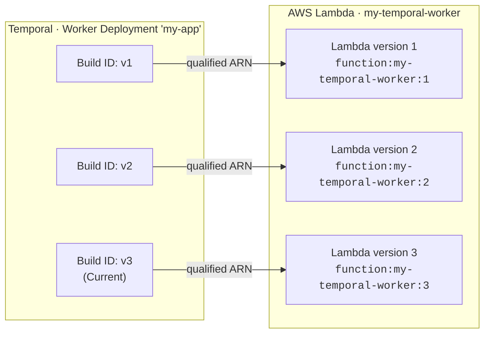

import { ReleaseNoteHeader } from '@site/src/components';

<ReleaseNoteHeader featureName="serverlessWorkers">
  To request access during Pre-release, create a [support ticket](/cloud/support#support-ticket) or contact your account
  team. APIs are experimental and may be subject to backwards-incompatible changes. [Sign up for
  updates](https://temporal.io/pages/serverless-workers-updates) to be notified when Serverless Workers reach Public
  Preview.
</ReleaseNoteHeader>

This page covers how Serverless Workers work on AWS Lambda, including the invocation lifecycle, autoscaling behavior, and how Worker Versioning maps to Lambda function versions.

For a step-by-step deployment guide, see [Deploy a Serverless Worker on AWS Lambda](/production-deployment/worker-deployments/serverless-workers/aws-lambda).

## Autoscaling {/* #autoscaling */}

The Lambda autoscaling algorithm is event-driven and reactive.
Sync match failure is the primary control signal, and backlog aids sizing.

When the [WCI](/serverless-workers#worker-controller-instance) needs more capacity, it calls the Lambda `InvokeFunction` API to start new Workers.
Each call is a discrete action ("invoke N more functions"), not a target state.
The WCI does not manage a fleet of instances.

### Scale-out {/* #scale-out */}

On sync match failure, the WCI invokes new Lambda functions.
Because Lambda cold start is sub-second to low single-digit seconds, reactive-only control does not create meaningful backlog overshoot.
The WCI can scale from zero with low latency.

### Scale-in {/* #scale-in */}

Scale-in is automatic.
Each Lambda invocation runs until the Worker has finished processing available Tasks or approaches the 15-minute execution time limit, then shuts down.
There is no drain logic or stabilization window.
The WCI does not need to actively remove capacity.

### Instance model {/* #instance-model */}

Each invocation is independent.
The Worker starts, creates a fresh client connection, processes multiple Tasks until near the execution time limit, and then shuts down gracefully.
There is no shared state across invocations.

## Worker Versioning {/* #worker-versioning */}

Serverless Workers require [Worker Versioning](/worker-versioning), and the compute provider must invoke a stable,
immutable build for each Worker Deployment Version. With AWS Lambda, this means aligning two versioning systems:

- **Temporal Worker Deployment Versions** — identified by deployment name and Build ID. Each Workflow runs against a
  specific Worker Deployment Version (Pinned) or moves between them on routing changes (Auto-Upgrade).
- **AWS Lambda function versions** — immutable numbered snapshots of your Lambda function code (`1`, `2`, `3`, ...).

A Worker Deployment Version is an immutable build identifier. For production workloads, keep the Lambda function code it
invokes immutable as well: map each Worker Deployment Version to exactly one Lambda function version, and configure the
compute provider with the qualified
[versioned ARN](https://docs.aws.amazon.com/lambda/latest/dg/configuration-versions.html) for that Lambda version (for
example, `arn:aws:lambda:us-east-1:123:function:my-worker:5`).

For development or non-critical workloads, you can use an unqualified ARN to iterate without publishing a new Lambda
function version each time.

:::caution

An unqualified ARN (no version suffix) points at `$LATEST`, which changes on every redeploy. Without a versioned ARN,
deploying replay-unsafe code causes non-determinism errors for in-flight Workflows, even for Workflows annotated as
Pinned.

:::

### How the Versioning Behavior changes rollout {/* #rollout-by-behavior */}

The choice of Pinned or Auto-Upgrade controls how _Workflows_ move between Worker Deployment Versions in Temporal. It
does not change how a Worker Deployment Version targets Lambda. Both behaviors expect a versioned ARN that points at one
immutable Lambda function version.
The following table shows what happens to existing Workflows when you set a new Current Version, with and without versioned Lambda ARNs.

| Versioning Behavior | With versioned Lambda ARN | Without versioned Lambda ARN |
| ------------------- | ------------------------- | ---------------------------- |
| **Pinned**          | Existing Workflows stay on their original Lambda function version until they complete. | Existing Workflows stay on their original Worker Deployment Version, but the underlying Lambda code has already changed since `$LATEST` updated at redeploy. The new code must be replay-compatible. |
| **Auto-Upgrade**    | Existing Workflows move to the new Worker Deployment Version and its new Lambda function version at the next Workflow Task after you move the Current Version. | The Lambda redeploy already changed the code for all versions. Setting the Current Version only changes routing, not which code runs. |

For step-by-step instructions on publishing Lambda versions and configuring the compute provider with a versioned ARN,
see
[Publish a Lambda function version](/production-deployment/worker-deployments/serverless-workers/aws-lambda#publish-lambda-version).
