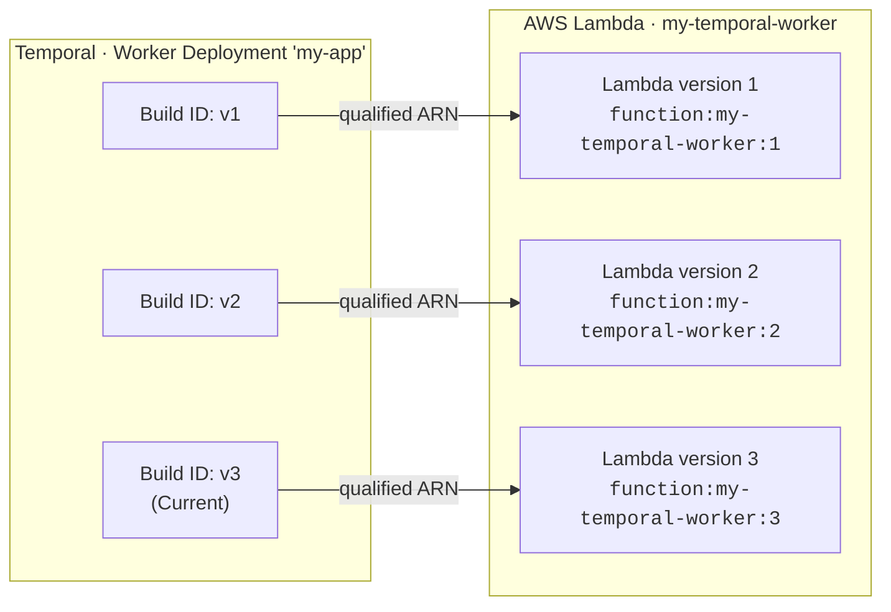

import { CaptionedImage, ReleaseNoteHeader } from '@site/src/components';

<ReleaseNoteHeader featureName="serverlessWorkersLambda" />

This page covers how Serverless Workers work on AWS Lambda, including the invocation lifecycle, autoscaling behavior, and how Worker Versioning maps to Lambda function versions.

For a step-by-step deployment guide, see [Deploy a Serverless Worker on AWS Lambda](/production-deployment/worker-deployments/serverless-workers/aws-lambda).

## Autoscaling {/* #autoscaling */}

The Lambda autoscaling algorithm is event-driven and reactive.
Sync match failure is the primary control signal, and backlog aids sizing.

When the [WCI](/serverless-workers#worker-controller-instance) needs more capacity, it calls the Lambda `InvokeFunction` API to start new Workers.
Each call is a discrete action ("invoke N more functions"), not a target state.
The WCI does not manage a fleet of instances.

### Scale-out {/* #scale-out */}

On sync match failure, the WCI invokes new Lambda functions.
Because Lambda cold start is sub-second to low single-digit seconds, reactive-only control does not create meaningful backlog overshoot.
The WCI can scale from zero with low latency.

### Scale-in {/* #scale-in */}

Scale-in is automatic.
Each Lambda invocation runs until the Worker has finished processing available Tasks or approaches the 15-minute execution time limit, then shuts down.
There is no drain logic or stabilization window.
The WCI does not need to actively remove capacity.

### Instance model {/* #instance-model */}

Each invocation is independent.
The Worker starts, creates a fresh client connection, processes multiple Tasks until near the execution time limit, and then shuts down gracefully.
There is no shared state across invocations.

## Worker Versioning {/* #worker-versioning */}

Serverless Workers require [Worker Versioning](/worker-versioning), and the compute provider must invoke a stable,
immutable build for each Worker Deployment Version. With AWS Lambda, this means aligning two versioning systems:

- **Temporal Worker Deployment Versions** — identified by deployment name and Build ID. Each Workflow runs against a
  specific Worker Deployment Version (Pinned) or moves between them on routing changes (Auto-Upgrade).
- **AWS Lambda function versions** — immutable numbered snapshots of your Lambda function code (`1`, `2`, `3`, ...).

A Worker Deployment Version is an immutable build identifier. For production workloads, keep the Lambda function code it
invokes immutable as well: map each Worker Deployment Version to exactly one Lambda function version, and configure the
compute provider with the qualified
[versioned ARN](https://docs.aws.amazon.com/lambda/latest/dg/configuration-versions.html) for that Lambda version (for
example, `arn:aws:lambda:us-east-1:123:function:my-worker:5`).

```mermaid
flowchart LR
    subgraph Temporal["Temporal · Worker Deployment 'my-app'"]
        direction TB
        b1["Build ID: v1"]
        b2["Build ID: v2"]
        b3["Build ID: v3<br/>(Current)"]
    end
    subgraph AWS["AWS Lambda · my-temporal-worker"]
        direction TB
        l1["Lambda version 1<br/><code>function:my-temporal-worker:1</code>"]
        l2["Lambda version 2<br/><code>function:my-temporal-worker:2</code>"]
        l3["Lambda version 3<br/><code>function:my-temporal-worker:3</code>"]
    end
    b1 -- qualified ARN --> l1
    b2 -- qualified ARN --> l2
    b3 -- qualified ARN --> l3
```

For development or non-critical workloads, you can use an unqualified ARN to iterate without publishing a new Lambda
function version each time.

:::caution

An unqualified ARN (no version suffix) points at `$LATEST`, which changes on every redeploy. Without a versioned ARN,
deploying replay-unsafe code causes non-determinism errors for in-flight Workflows, even for Workflows annotated as
Pinned.

:::

### How the versioning behavior changes rollout {/* #rollout-by-behavior */}

The choice of Pinned or Auto-Upgrade controls how _Workflows_ move between Worker Deployment Versions in Temporal. It
does not change how a Worker Deployment Version targets Lambda. Both behaviors expect a versioned ARN that points at one
immutable Lambda function version.
The following table shows what happens to existing Workflows when you set a new Current Version, with and without versioned Lambda ARNs.

| Versioning Behavior | With versioned Lambda ARN | Without versioned Lambda ARN |
| ------------------- | ------------------------- | ---------------------------- |
| **Pinned**          | Existing Workflows stay on their original Lambda function version until they complete. | Existing Workflows stay on their original Worker Deployment Version, but the underlying Lambda code has already changed since `$LATEST` updated at redeploy. The new code must be replay-compatible. |
| **Auto-Upgrade**    | Existing Workflows move to the new Worker Deployment Version and its new Lambda function version at the next Workflow Task after you move the Current Version. | The Lambda redeploy already changed the code for all versions. Setting the Current Version only changes routing, not which code runs. |

For step-by-step instructions on publishing Lambda versions and configuring the compute provider with a versioned ARN,
see
[Publish a Lambda function version](/production-deployment/worker-deployments/serverless-workers/aws-lambda#publish-lambda-version).

## Lifecycle {/* #lifecycle */}

A single Serverless Worker invocation has three phases: init, work, and shutdown.

<CaptionedImage
  src="/diagrams/serverless-worker-lifecycle.svg"
  srcDark="/diagrams/serverless-worker-lifecycle-dark.svg"
  alt="Serverless Worker lifecycle"
  title="Diagram is not to scale. The shutdown deadline buffer controls when the Worker stops polling, and the Worker stop timeout controls how long the Worker waits for in-flight Tasks to finish before shutdown hooks run. Shutdown hooks typically take less than a few seconds."
/>

During the **init** phase, the Worker initializes and establishes a client connection to Temporal.

During the **work** phase, the Worker polls the Task Queue and processes Tasks.

During the **shutdown** phase, the Worker stops polling, waits for in-flight Tasks to finish, and runs any shutdown
hooks (for example, OpenTelemetry telemetry flushes). Shutdown begins before the invocation deadline so the Worker can
exit cleanly before the compute provider forcibly terminates the execution environment.

### Tuning for long-running Activities

If your Worker handles long-running Activities, set these three values together:

- **Worker stop timeout > longest Activity runtime.** Gives in-flight Activities enough time to finish after polling
  stops.
- **Shutdown deadline buffer > Worker stop timeout + shutdown hook time.** Ensures the drain and any shutdown hooks
  complete before the compute provider terminates the environment.
- **Invocation deadline > longest Activity runtime + shutdown deadline buffer.** Set on the compute provider to give
  each invocation enough total runtime.

  :::tip

  If your longest-running Activity runs longer than half the maximum invocation deadline, this constraint may be
  difficult or impossible to meet. In this case, use
  [Activity Heartbeats](/encyclopedia/detecting-activity-failures#activity-heartbeat) to record the state of the
  Activity execution so that the next retry can pick up where it left off.

  :::

For example, if your longest Activity runtime is 5 minutes, and your shutdown hooks take 3 seconds to run, set the
Worker stop timeout to more than 5 minutes, and the shutdown deadline buffer to more than 303 seconds (5 minutes + 3
seconds). Set your invocation deadline to at least 10 minutes and 3 seconds (5 minutes + 303 seconds).

The Worker stop timeout controls how long the Worker waits for in-flight Tasks to finish after it stops polling. The
shutdown deadline buffer controls how much time before the invocation deadline the Worker stops polling for Tasks.

Raising only the shutdown deadline buffer makes the Worker stop polling earlier, but does not give in-flight Tasks any
more time to complete.

Raising only the Worker stop timeout does not make the Worker stop polling earlier, which means the compute provider
might terminate the Worker before the full stop timeout completes. In-flight Activities then do not get the full stop
timeout to finish, and the shutdown hooks may not run.
