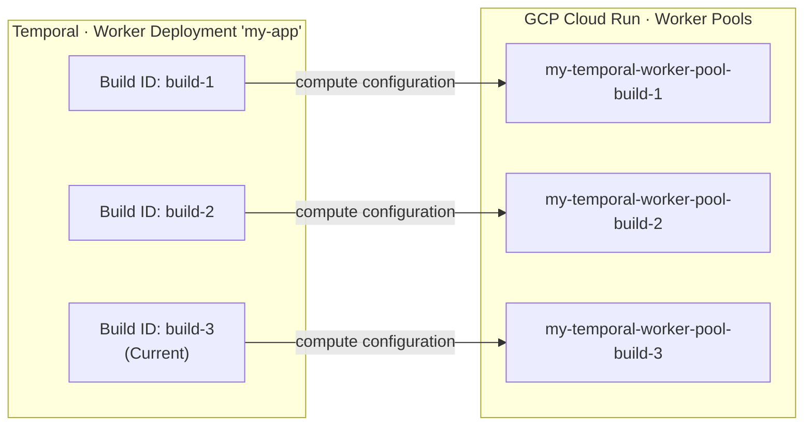

import { ReleaseNoteHeader } from '@site/src/components';

<ReleaseNoteHeader featureName="serverlessWorkersCloudRun">
  Cloud Run support is in Pre-release, and its APIs may change in backwards-incompatible ways.
  Create a [support ticket](/cloud/support#support-ticket) or contact your account team for access, and
  [sign up for updates](https://temporal.io/pages/serverless-workers-updates) to hear when Cloud Run reaches Public Preview.
  Serverless Workers are also supported on [AWS Lambda](/serverless-workers/aws-lambda).
</ReleaseNoteHeader>

This page covers how Serverless Workers work on GCP Cloud Run, including the instance lifecycle, autoscaling behavior, and how Worker Versioning maps to Cloud Run Worker Pools.

On Cloud Run, a Serverless Worker runs in a Worker Pool: a set of long-lived instances that poll the Task Queue continuously for as long as they remain in the pool.
Each instance runs standard Worker code and processes Tasks for its whole lifetime.
The [Worker Controller Instance (WCI)](/serverless-workers#worker-controller-instance) controls how many instances run; each instance manages its own polling and Task processing.

## Autoscaling {/* #autoscaling */}

The WCI keeps the Worker Pool sized to the amount of work arriving on the Task Queue. It combines two mechanisms:

- Immediately bring up new instances when a Task arrives and no Worker is free to take it (a sync match failure).
- Resize the Worker Pool periodically based on incoming work.

The immediate reaction absorbs bursts without waiting on the evaluation cycle. The periodic re-sizing is where the WCI does its rate-based planning.

For that planning, the WCI measures two rates over time:

- How fast Tasks arrive.
- How fast a single Worker processes them.

From these, it calculates how many Workers it takes to handle the incoming work, sets the pool's target instance count accordingly, and adjusts it as the arrival rate changes.

The WCI holds back some spare capacity rather than loading every Worker to 100%.
It sizes the pool to a target utilization (80% by default), so there is room to pick up newly arriving Tasks right away instead of queuing them.
When Tasks are already waiting in the backlog, the WCI adds more instances on top to work through them faster.

It applies the resulting count to the pool through the Cloud Run admin API, and keeps the count within a minimum and maximum bound.

### Scale-out {/* #scale-out */}

When arrivals rise or backlog builds, the WCI raises the pool's target instance count and Cloud Run starts more instances.
Because the WCI keeps a utilization buffer, the pool adds capacity ahead of demand rather than waiting until Tasks pile up.
Since a new instance takes time to start and connect before it can poll for Tasks, provisioning ahead of demand keeps the backlog from growing during that startup window.

### Scale-in {/* #scale-in */}

When arrivals and backlog fall, the WCI lowers the target instance count and Cloud Run stops surplus instances.
Scale-in is more conservative than scale-out.
The WCI holds capacity while sync match failures are still occurring, and it applies a cooldown before reducing the pool, so it does not remove instances that are about to be needed again.
When there is no work, the WCI can scale the pool to zero; the next sync match failure or backlog scales it back up.

## Worker Versioning {/* #worker-versioning */}

Serverless Workers require [Worker Versioning](/worker-versioning), and the compute provider must run a stable,
immutable build for each Worker Deployment Version. With GCP Cloud Run, this means aligning two systems:

- **Temporal Worker Deployment Versions.** Identified by deployment name and Build ID. Each Workflow runs against a
  specific Worker Deployment Version (Pinned) or moves between them on routing changes (Auto-Upgrade).
- **Cloud Run Worker Pools.** Each pool runs one container image, deployed as a
  [revision](https://cloud.google.com/run/docs/managing/revisions). Deploying again creates another revision.

AWS Lambda pins a build through the compute configuration itself, because a qualified ARN names one immutable function
version. Cloud Run has no equivalent. The compute configuration names a project, region, and Worker Pool, and nothing
else. Temporal scales that pool and runs whichever revision the pool currently serves.

The pool, not the revision, is therefore the unit that maps to a Worker Deployment Version. Map each Worker Deployment
Version to exactly one Worker Pool, and carry the Build ID in the pool name.

Each Worker Deployment Version runs its own [WCI](/serverless-workers#worker-controller-instance), and each WCI sets the
instance count on the pool named in its compute configuration. Two Worker Deployment Versions that name the same pool
would both be setting that pool's instance count.

:::caution

Deploying a new image into an existing Worker Pool creates a new revision, and by default Cloud Run moves every instance
to it. The Worker Deployment Version does not change, but the code running behind it does. This is the same hazard as an
unqualified Lambda ARN: deploying replay-unsafe code causes non-determinism errors for in-flight Workflows, even for
Workflows annotated as Pinned.

:::

### How the versioning behavior changes rollout {/* #rollout-by-behavior */}

The choice of Pinned or Auto-Upgrade controls how _Workflows_ move between Worker Deployment Versions in Temporal. It
does not change how a Worker Deployment Version targets Cloud Run. The following table shows what happens to existing
Workflows when you set a new Current Version.

| Versioning Behavior | One pool per Worker Deployment Version | One pool reused across versions |
| ------------------- | -------------------------------------- | ------------------------------- |
| **Pinned**          | Existing Workflows keep running on their original pool and image until they complete. | Existing Workflows stay on their original Worker Deployment Version, but the pool's image already changed at deploy. The new code must be replay-compatible. |
| **Auto-Upgrade**    | Existing Workflows move to the new Worker Deployment Version, and to its pool, at the next Workflow Task after you set the Current Version. | The deploy already changed the code for every version sharing the pool. Setting the Current Version changes routing, not which code runs. |

While Pinned Workflows are still running on an older Worker Deployment Version, keep that version's pool in place. The
pool can sit at zero instances, and its WCI scales it back up when a Task arrives for that version.

For step-by-step instructions, see
[Create the Worker Pool](/production-deployment/worker-deployments/serverless-workers/cloud-run#create-worker-pool).

## Lifecycle {/* #lifecycle */}

A Cloud Run Serverless Worker is an ordinary long-lived Temporal Worker. Each instance runs the same Worker code you
would run anywhere else: it connects to Temporal, registers its Workflows and Activities, and polls the Task Queue for
its whole lifetime. You do not start or stop instances yourself. Cloud Run runs the containers, and the WCI sets how many
run through its [scaling operations](#autoscaling).

An instance's lifetime is bounded by scale-in. The WCI decides when to remove an instance from Task Queue activity, not
from what any individual instance is doing. It waits `no_sync_quiet_ms` after the most recent sync match failure, and
applies a cooldown between successive reductions, before lowering the target instance count. It does not track how long a
given instance has been running or whether that instance is mid-Activity, so the instance Cloud Run stops may be one that
is still executing work.

To keep the WCI from reclaiming an instance while a long Activity is still running, set `no_sync_quiet_ms` longer than
your longest-running Activity. This holds the pool steady until the Task Queue has been quiet for longer than an Activity
takes to complete. As an additional safeguard, use
[Activity Heartbeats](/encyclopedia/detecting-activity-failures#activity-heartbeat) so that if an Activity is
interrupted, a retry resumes from the last recorded progress instead of restarting from the beginning.
