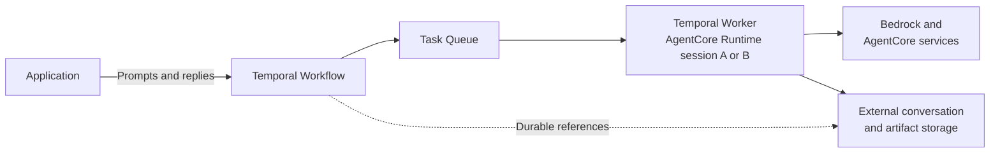

import { ReleaseNoteHeader } from '@site/src/components';

<ReleaseNoteHeader type="prerelease">
  Amazon Bedrock AgentCore Runtime support is in Pre-release, and its APIs may change in backwards-incompatible ways.
</ReleaseNoteHeader>

This guide builds a data-analysis agent that can continue a conversation after the compute running it has stopped. A
Temporal Workflow coordinates each turn and preserves the state needed to continue. Strands defines how the agent uses
a model and tools. Amazon Bedrock AgentCore Runtime supplies serverless compute for the Temporal Worker, and AgentCore
Code Interpreter supplies an isolated environment for running code.

The result separates the lifetime of the agent from the lifetime of its compute. The Workflow can remain open for days
or months without keeping an AgentCore Runtime active.

## What you will build

The agent has one Workflow Execution for each conversation. The application starts that Workflow and sends prompts to
an `ask` Update handler through Temporal. It does not send prompts to the AgentCore Runtime endpoint. Each Update
returns the agent's answer to the application.

The agent uses Amazon Bedrock for model inference and AgentCore Code Interpreter for calculations. After a turn, its
Worker retires while the Workflow remains open. A later prompt starts new Worker capacity and continues the same
conversation.

## Architecture

The application sends prompts to a Temporal Workflow through an Update. The Workflow identifies the conversation and
records its execution progress. When its Task Queue has work, Serverless Workers starts an AgentCore Runtime session
that hosts a Temporal Worker. A later Task can run on a different Runtime session because Temporal reconstructs the
Workflow from Event History before it continues.

Strands runs the agent loop for each turn. The Temporal Strands integration schedules model calls and tool calls as
Activities. Each call has its own timeout, Retry Policy, and recorded result. After the Worker returns the answer, the
Workflow can wait for another prompt without keeping an AgentCore Runtime session active.



Place state according to how long it must remain available:

| State | Location |
|---|---|
| Execution progress and bounded working context | Temporal Workflow |
| Large or unbounded conversation content, uploads, and artifacts | Durable external storage, with stable references in the Workflow |
| Temporary caches and Code Interpreter files | AgentCore Runtime or tool session, when the application can tolerate losing them |

For clarity, this sample keeps its complete Strands message list in Workflow state. That works for a bounded
conversation. For a conversation that can grow without a fixed limit, store its raw content externally and carry a
reference or bounded summary in the Workflow. Retrieve external content through an Activity before using it in a model
call. Use [Continue-As-New](/develop/python/integrations/strands-agents#handle-long-running-chat-sessions) to start a new
Event History with only the references and working context that the next execution needs.

## Prerequisites

To build and run the agent locally, you need:

- Python 3.10 or later and [`uv`](https://docs.astral.sh/uv/).
- [Temporal CLI v1.8.3](https://github.com/temporalio/cli/releases/tag/v1.8.3) or later. This version adds the AgentCore
  options used to create a Worker Deployment Version.
- AWS credentials with access to Amazon Nova Lite through Bedrock and permission to use AgentCore Code Interpreter.
  The sample includes the required Code Interpreter IAM policy.

To deploy the Worker, you also need:

- A Temporal Cloud account with an AWS-hosted Namespace and access to the AgentCore Serverless Workers Pre-release.
- An AWS account in an [AgentCore-supported Region](https://docs.aws.amazon.com/bedrock-agentcore/latest/devguide/agentcore-regions.html).
- The AWS and AgentCore tools and permissions listed in the
  [Serverless Worker deployment prerequisites](/production-deployment/worker-deployments/serverless-workers/agentcore#prerequisites).

## 1. Get and run the agent locally {/* #build-the-agent-locally */}

Clone the sample repository and install the application dependencies:

```bash
git clone --branch docs/durable-agent-agentcore-sample --single-branch \
  https://github.com/temporalio/documentation-sdk-code-examples.git
cd documentation-sdk-code-examples/python-agentcore-durable-agent
uv sync
```

The [durable AgentCore sample](https://github.com/temporalio/documentation-sdk-code-examples/tree/docs/durable-agent-agentcore-sample/python-agentcore-durable-agent)
defines `execute_code` as a Temporal Activity. It uses the Workflow Id as the Code Interpreter session name so two
Workflow Executions handled by the same process do not share a sandbox. The name does not make the sandbox durable
across Worker replacement.

<!--SNIPSTART python-agentcore-durable-agent-code-activity-->
[python-agentcore-durable-agent/activities.py](https://github.com/temporalio/documentation-sdk-code-examples/blob/docs/durable-agent-agentcore-sample/python-agentcore-durable-agent/activities.py)
```py
@activity.defn
def execute_code(
    code: str, language: LanguageType = LanguageType.PYTHON
) -> dict[str, Any]:
    interpreter = AgentCoreCodeInterpreter(
        region=os.environ.get("AWS_REGION", "us-west-2"),
        session_name=activity.info().workflow_id,
    )
    return interpreter.execute_code(
        ExecuteCodeAction(type="executeCode", code=code, language=language)
    )


```
<!--SNIPEND-->

The Activity boundary gives the tool call a separate timeout, Retry Policy, and result in Event History. It also keeps
AWS calls out of deterministic Workflow code.

The sample defines a Workflow that accepts multiple prompts. It sets `MODEL_NAME` to `nova-lite` and maps it to the
Bedrock model identifier `amazon.nova-lite-v1:0` when it configures `StrandsPlugin`. The Workflow refers to the
registered model by name, so model construction and AWS access remain in the Worker process.

<!--SNIPSTART python-agentcore-durable-agent-workflow-->
[python-agentcore-durable-agent/workflows.py](https://github.com/temporalio/documentation-sdk-code-examples/blob/docs/durable-agent-agentcore-sample/python-agentcore-durable-agent/workflows.py)
```py
@workflow.defn
class DurableAgentWorkflow:
    def __init__(self) -> None:
        self._done = False
        self._lock = asyncio.Lock()
        self._agent = TemporalAgent(
            model=MODEL_NAME,
            start_to_close_timeout=timedelta(seconds=60),
            system_prompt=SYSTEM_PROMPT,
            tools=[
                activity_as_tool(
                    execute_code,
                    start_to_close_timeout=timedelta(minutes=2),
                )
            ],
        )

    @workflow.update
    async def ask(self, prompt: str) -> str:
        async with self._lock:
            result = await self._agent.invoke_async(prompt)
            return str(result).strip()

    @workflow.signal
    def finish(self) -> None:
        self._done = True

    @workflow.run
    async def run(self) -> None:
        await workflow.wait_condition(lambda: self._done)
        await workflow.wait_condition(workflow.all_handlers_finished)


```
<!--SNIPEND-->

`TemporalAgent` is a Strands `Agent` adapted to run inside a Workflow. It retains the Strands message list between
calls to `invoke_async`. The Temporal Strands plugin runs model calls as Activities, and `activity_as_tool` runs the
Code Interpreter tool as an Activity. Configure retries through Temporal Activity Retry Policies rather than a Strands
retry strategy.

The lock makes the agent process one prompt at a time. The `run` method waits until the `finish` Signal arrives, so the
Workflow remains available between turns. This wait is durable and does not keep a Python process running.

Register `DurableAgentWorkflow`, `execute_code`, and `StrandsPlugin` on a local Worker. The
[sample Worker](https://github.com/temporalio/documentation-sdk-code-examples/blob/docs/durable-agent-agentcore-sample/python-agentcore-durable-agent/local_worker.py)
also creates the executor required by the synchronous `execute_code` Activity:

<!--SNIPSTART python-agentcore-durable-agent-local-worker-->
[python-agentcore-durable-agent/local_worker.py](https://github.com/temporalio/documentation-sdk-code-examples/blob/docs/durable-agent-agentcore-sample/python-agentcore-durable-agent/local_worker.py)
```py
async def main() -> None:
    client = await Client.connect(
        "localhost:7233",
        plugins=[
            StrandsPlugin(models={MODEL_NAME: lambda: BedrockModel(model_id=MODEL_ID)})
        ],
    )

    with ThreadPoolExecutor(max_workers=4) as activity_executor:
        worker = Worker(
            client,
            task_queue=TASK_QUEUE,
            workflows=[DurableAgentWorkflow],
            activities=[execute_code],
            activity_executor=activity_executor,
        )
        await worker.run()


```
<!--SNIPEND-->

Start the Temporal development server, then start the Worker in another terminal:

```bash
temporal server start-dev
```

```bash
uv run python local_worker.py
```

The sample's chat client starts a Workflow and sends each prompt as an Update:

<!--SNIPSTART python-agentcore-durable-agent-chat-client-->
[python-agentcore-durable-agent/chat.py](https://github.com/temporalio/documentation-sdk-code-examples/blob/docs/durable-agent-agentcore-sample/python-agentcore-durable-agent/chat.py)
```py
async def main() -> None:
    client = await Client.connect(
        "localhost:7233",
        plugins=[
            StrandsPlugin(models={MODEL_NAME: lambda: BedrockModel(model_id=MODEL_ID)})
        ],
    )
    handle = await client.start_workflow(
        DurableAgentWorkflow.run,
        id=f"durable-agent-{uuid.uuid4()}",
        task_queue=TASK_QUEUE,
    )

    while prompt := input("You: "):
        if prompt == "/finish":
            await handle.signal(DurableAgentWorkflow.finish)
            return
        answer = await handle.execute_update(DurableAgentWorkflow.ask, prompt)
        print(f"Agent: {answer}")


```
<!--SNIPEND-->

Run the client in a third terminal:

```bash
uv run python chat.py
```

Ask a question that requires calculation, then ask a follow-up that depends on the first answer. Enter `/finish` to
close the Workflow. In the Temporal Web UI, the Event History shows the `ask` Update, model Activities, and
`execute_code` Activity for each turn.

## 2. Configure and deploy the Worker Runtime {/* #run-the-worker-on-agentcore-runtime */}

Local development uses a continuously running Worker. On AgentCore Runtime, the HTTP handler starts the Worker in a
background task and immediately returns an acknowledgment. The Worker continues polling until its idle policy decides
to release the compute.

The AgentCore Runtime handler registers the `DurableAgentWorkflow` and `execute_code` definitions from
[Get and run the agent locally](#build-the-agent-locally). It adds Worker Versioning and the Activity-based idle tracker from
the [Python AgentCore Worker guide](/develop/python/workers/serverless-workers/agentcore#stop-and-drain-the-worker).
The entry point registers the background Worker as an AgentCore asynchronous task, prevents another invocation in the
same Runtime session from starting a duplicate Worker, and clears the task after the Worker drains or fails:

<!--SNIPSTART python-agentcore-durable-agent-runtime-handler-->
[python-agentcore-durable-agent/agentcore_worker.py](https://github.com/temporalio/documentation-sdk-code-examples/blob/docs/durable-agent-agentcore-sample/python-agentcore-durable-agent/agentcore_worker.py)
```py
_worker: asyncio.Task[None] | None = None


async def _run_until_idle(task_id: int) -> None:
    try:
        await run_worker()
    except Exception:
        log.exception("worker failed in background task")
    finally:
        app.complete_async_task(task_id)


@app.entrypoint
async def invoke(payload: dict) -> dict:
    global _worker
    if _worker is not None and not _worker.done():
        return {"message": "Worker already polling", "task_queue": TASK_QUEUE}

    task_id = app.add_async_task("temporal-worker")
    _worker = asyncio.create_task(_run_until_idle(task_id))

    return {"message": "Worker starting", "task_queue": TASK_QUEUE}


```
<!--SNIPEND-->

The invocation payload does not contain a user prompt. Temporal invokes the Runtime endpoint to add Worker capacity.
The acknowledgment does not wait for the Worker to drain. AgentCore reports the Runtime as busy while the asynchronous
task is registered. Clients continue to start and message Workflows through the Temporal Client.

The Runtime does not need a copy of the conversation in a local file or global variable. When a new Worker receives a
Workflow Task, Temporal replays the Workflow's Event History and restores the `TemporalAgent` message list before new
model or tool calls run.

Stop the local Worker and Temporal development server. In one terminal, export the Temporal Cloud and AWS settings
used by the rest of this guide. Replace the first two values with your Namespace details. Enter your API key at the
prompt:

```bash
export TEMPORAL_ADDRESS="<namespace>.<account>.tmprl.cloud:7233"
export TEMPORAL_NAMESPACE="<namespace>.<account>"
printf "Temporal Cloud API key: "
read -rs TEMPORAL_API_KEY
printf "\n"
export TEMPORAL_API_KEY
export AWS_REGION="us-west-2"
```

Use an AgentCore-supported Region where your AWS credentials can invoke Amazon Nova Lite and Code Interpreter. The
Temporal variables also configure subsequent Temporal CLI commands.

Install the AgentCore CLI and generate the CDK files used to deploy the sample:

```bash
npm install -g @aws/agentcore
./bootstrap-agentcore-project.sh
```

Populate the sample's AgentCore configuration from those variables. The command gets the AWS account number from your
current AWS CLI credentials:

```bash
uv run python configure_agentcore.py
```

The sample configuration uses these values throughout the deployment:

| Setting | Tutorial value |
|---|---|
| Runtime entrypoint | `agentcore_worker.py` |
| Task Queue | `durable-agent` |
| Worker Deployment name | `durable-agent-agentcore` |
| Build ID | `1.0.0` |
| Runtime endpoint name | `temporal` |

The command writes your Temporal Cloud API key to `agentcore/agentcore.json`. Do not commit the populated file. For a
production deployment, store the key in AWS Secrets Manager and load it when the Runtime starts.

Validate and deploy the Runtime:

```bash
agentcore validate
agentcore deploy --target default --yes
```

AgentCore packages the Worker and its dependencies, creates its execution role, deploys the Runtime, and creates the
named endpoint. Retrieve the Runtime and endpoint ARNs for the next steps:

```bash
export AGENT_RUNTIME_ARN="$(
  aws bedrock-agentcore-control list-agent-runtimes \
    --region "$AWS_REGION" \
    --query "agentRuntimes[?agentRuntimeName=='TemporalDurableAgent_durable_agent_worker'].agentRuntimeArn | [0]" \
    --output text
)"
export AGENT_RUNTIME_ID="${AGENT_RUNTIME_ARN##*/}"
export RUNTIME_ENDPOINT_ARN="$(
  aws bedrock-agentcore-control list-agent-runtime-endpoints \
    --agent-runtime-id "$AGENT_RUNTIME_ID" \
    --region "$AWS_REGION" \
    --query "runtimeEndpoints[?name=='temporal'].agentRuntimeEndpointArn | [0]" \
    --output text
)"
echo "$AGENT_RUNTIME_ARN"
echo "$RUNTIME_ENDPOINT_ARN"
```

Both commands must print an ARN before you continue.

## 3. Grant Temporal access to the Runtime {/* #grant-temporal-access */}

Temporal Cloud needs an IAM role that it can assume to invoke the Runtime endpoint. The cloned sample includes the
CloudFormation template for this role. Choose an External ID and short names for the stack and role:

```bash
export EXTERNAL_ID="$(openssl rand -hex 16)"
export INVOCATION_STACK="ac-durable-invoke"
export INVOCATION_ROLE_NAME="TemporalSW"
```

Create the role. This role only lets Temporal get the endpoint and invoke the Runtime. The separate execution role
created by AgentCore runs the Worker and accesses Bedrock and Code Interpreter.

```bash
aws cloudformation create-stack \
  --stack-name "$INVOCATION_STACK" \
  --template-body file://temporal-cloud-serverless-worker-agentcore-role.yaml \
  --parameters \
    ParameterKey=AssumeRoleExternalId,ParameterValue="$EXTERNAL_ID" \
    ParameterKey=AgentRuntimeARNs,ParameterValue="${AGENT_RUNTIME_ARN}*" \
    ParameterKey=RoleName,ParameterValue="$INVOCATION_ROLE_NAME" \
  --capabilities CAPABILITY_NAMED_IAM \
  --region "$AWS_REGION"

aws cloudformation wait stack-create-complete \
  --stack-name "$INVOCATION_STACK" \
  --region "$AWS_REGION"

export INVOCATION_ROLE_ARN="$(
  aws cloudformation describe-stacks \
    --stack-name "$INVOCATION_STACK" \
    --query 'Stacks[0].Outputs[?OutputKey==`RoleARN`].OutputValue' \
    --output text \
    --region "$AWS_REGION"
)"
echo "$INVOCATION_ROLE_ARN"
```

The final command must print the new role ARN.

## 4. Create the Serverless Worker deployment {/* #deploy-the-serverless-worker */}

Create a Worker Deployment and a version that points to the AgentCore endpoint:

```bash
temporal worker deployment create \
  --name durable-agent-agentcore

temporal worker deployment create-version \
  --deployment-name durable-agent-agentcore \
  --build-id 1.0.0 \
  --aws-agentcore-endpoint-arn "$RUNTIME_ENDPOINT_ARN" \
  --aws-agentcore-assume-role-arn "$INVOCATION_ROLE_ARN" \
  --aws-agentcore-assume-role-external-id "$EXTERNAL_ID"

temporal worker deployment set-current-version \
  --deployment-name durable-agent-agentcore \
  --build-id 1.0.0 \
  --yes
```

Creating the version causes Temporal to invoke the Runtime and wait for the Worker to register. The deployment name
and Build ID in these commands match the values packaged into the Runtime. Setting the version as current lets it
receive new Tasks on the `durable-agent` Task Queue.

You now have a deployed Runtime and a Worker Deployment Version that Temporal can start when the Task Queue needs
capacity. For more deployment options, see
[Deploy a Serverless Worker on Amazon Bedrock AgentCore Runtime](/production-deployment/worker-deployments/serverless-workers/agentcore).

## 5. Talk to the deployed agent {/* #talk-to-the-deployed-agent */}

Start one conversation Workflow. This command returns immediately while the Workflow remains open:

```bash
temporal workflow start \
  --workflow-id durable-agent-alice \
  --type DurableAgentWorkflow \
  --task-queue durable-agent
```

Send the first prompt as an Update and wait for the reply:

```bash
temporal workflow update execute \
  --workflow-id durable-agent-alice \
  --name ask \
  --input '"A film festival has 7 screens with 4 showings per screen. How many screenings can it schedule?"'
```

Temporal starts AgentCore Worker capacity because the Task Queue has work. After the turn completes and the idle period
expires, the Runtime handler drains the Worker and returns. Confirm this in the AgentCore logs. Wait until the log
contains `worker idle for 60.0s and drained`, then stop following the logs with `Ctrl+C`:

```bash
aws logs tail "/aws/bedrock-agentcore/runtimes/${AGENT_RUNTIME_ID}-temporal" \
  --region "$AWS_REGION" \
  --follow
```

After the Worker has retired, send a follow-up that depends on the first turn:

```bash
temporal workflow update execute \
  --workflow-id durable-agent-alice \
  --name ask \
  --input '"If we add two screenings to the total you calculated, what is the new total?"'
```

Temporal starts capacity again. The new Worker reconstructs the existing Workflow and its Strands messages, so the
agent can interpret "the total you calculated" without depending on the previous Worker process.

End the conversation when it no longer needs to accept prompts:

```bash
temporal workflow signal \
  --workflow-id durable-agent-alice \
  --name finish
```

## 6. Test recovery {/* #test-recovery */}

Worker retirement between turns tests one form of recovery. You can also interrupt compute while a model or tool
Activity is running. Start a prompt that takes long enough to observe, find the active Runtime session identifier in the
AgentCore logs, and stop that session:

```bash
export RUNTIME_SESSION_ID="<session-id-from-AgentCore-logs>"
aws bedrock-agentcore stop-runtime-session \
  --agent-runtime-arn "$AGENT_RUNTIME_ARN" \
  --runtime-session-id "$RUNTIME_SESSION_ID" \
  --region "$AWS_REGION"
```

For the required IAM permission and API behavior, see
[Stop a running session](https://docs.aws.amazon.com/bedrock-agentcore/latest/devguide/runtime-stop-session.html).

The Activity attempt running on that Worker is interrupted. Temporal keeps the Workflow state and schedules the
Activity again according to its Retry Policy. Serverless Workers starts new AgentCore capacity to process the Task. In
the Temporal Web UI, inspect the Activity attempts and confirm that the Workflow continues without restarting the
conversation.

An Activity can run more than once if its Worker stops after making an external change but before reporting completion.
Use an idempotency key for tools that change external state. The Workflow Id plus a stable operation identifier is a
common choice. Code execution used only to calculate an answer does not make an external business change, so it is a
safe recovery demonstration.
