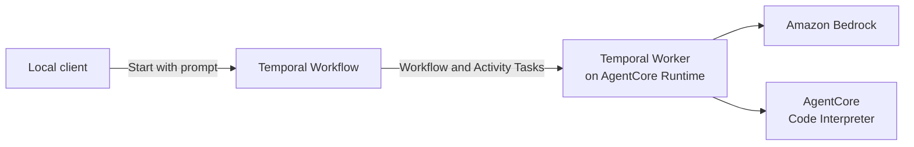

import { ReleaseNoteHeader } from '@site/src/components';

<ReleaseNoteHeader type="prerelease">
  Amazon Bedrock AgentCore Runtime support is in Pre-release, and its APIs may change in backwards-incompatible ways.
</ReleaseNoteHeader>

This guide deploys a Strands agent as a Temporal Serverless Worker on Amazon Bedrock AgentCore Runtime. The agent uses
Amazon Bedrock for model inference and AgentCore Code Interpreter to run Python.

## What you will build

The sample accepts one prompt and runs one Workflow Execution. The Workflow asks the model to answer the prompt. The
model can call Code Interpreter through a Temporal Activity before returning its answer.

Your local client starts the Workflow through Temporal. When the Task Queue needs a Worker, Temporal starts an
AgentCore Runtime session. The Worker processes the Workflow and Activity Tasks, then drains after 60 seconds without
an Activity starting or finishing.

## Architecture

The Workflow contains the Strands agent loop. The Temporal Strands integration runs model calls as Activities. The
Code Interpreter tool is also an Activity, so model and tool calls have their own retries, timeouts, and recorded
results.

AgentCore Runtime hosts the Temporal Worker. It does not receive the user's prompt. Temporal invokes the Runtime
endpoint only to add Worker capacity, and the application sends the prompt through the Temporal Client.



This sample completes after one answer. To support a conversation, keep the Workflow open and accept later prompts
through an Update or Signal. Store bounded conversation state, or references to externally stored content, in the
Workflow. Use the Workflow Id as the conversation identifier. Do not depend on one AgentCore Runtime session handling
every turn.

## Prerequisites

- A Temporal Cloud account with an AWS-hosted Namespace and access to the AgentCore Serverless Workers Pre-release.
- A Temporal Cloud API key that can connect to the Namespace.
- [Temporal CLI v1.8.3](https://github.com/temporalio/cli/releases/tag/v1.8.3) or later.
- Python 3.10 or later and [`uv`](https://docs.astral.sh/uv/).
- Node.js 20 or later and the
  [AgentCore CLI](https://docs.aws.amazon.com/bedrock-agentcore/latest/devguide/agentcore-get-started-cli.html).
- The [AWS CLI](https://docs.aws.amazon.com/cli/latest/userguide/getting-started-install.html) configured for your AWS
  account.
- The [AWS CDK](https://docs.aws.amazon.com/cdk/v2/guide/getting-started.html) installed and bootstrapped in an
  [AgentCore-supported Region](https://docs.aws.amazon.com/bedrock-agentcore/latest/devguide/agentcore-regions.html).
- AWS permissions to deploy AgentCore resources, CloudFormation stacks, and IAM roles. See
  [IAM permissions for AgentCore Runtime](https://docs.aws.amazon.com/bedrock-agentcore/latest/devguide/runtime-permissions.html).
- Access to the Amazon Bedrock model that Strands selects in the target Region.

## 1. Get the sample

Clone the branch from the
[Strands Agent on Bedrock AgentCore sample PR](https://github.com/temporalio/samples-python/pull/360), then install its
Python dependencies:

```bash
git clone --branch schoeff/strands-agent --single-branch \
  https://github.com/temporalio/samples-python.git
cd samples-python/bedrock_agentcore/strands_agent
uv sync
```

The cloned directory contains the Workflow, Activity, Runtime handler, AgentCore configuration, deployment scripts,
and IAM template used throughout this guide.

## 2. Examine the agent Workflow

The sample creates a `TemporalAgent` with a system prompt and the `execute_code` tool:

[View `workflows.py` in the sample](https://github.com/temporalio/samples-python/blob/schoeff/strands-agent/bedrock_agentcore/strands_agent/workflows.py).

```py
@workflow.defn
class StrandsAgentWorkflow:
    def __init__(self) -> None:
        self.agent = TemporalAgent(
            start_to_close_timeout=timedelta(seconds=60),
            system_prompt=SYSTEM_PROMPT,
            tools=[
                activity_as_tool(
                    execute_code,
                    start_to_close_timeout=timedelta(minutes=2),
                )
            ],
        )

    @workflow.run
    async def run(self, prompt: str) -> str:
        result = await self.agent.invoke_async(prompt)
        return str(result)
```

`TemporalAgent` adapts the Strands agent loop to run in Workflow code. The Temporal Strands plugin schedules each model
call as an Activity. `activity_as_tool` makes `execute_code` another Activity when the model selects that tool.

The `execute_code` Activity creates a Code Interpreter session using the Workflow Id as its session name:

[View `activities.py` in the sample](https://github.com/temporalio/samples-python/blob/schoeff/strands-agent/bedrock_agentcore/strands_agent/activities.py).

```py
@activity.defn
def execute_code(
    code: str, language: LanguageType = LanguageType.PYTHON
) -> dict[str, Any]:
    interpreter = AgentCoreCodeInterpreter(
        region=os.environ.get("AWS_REGION", "us-west-2"),
        session_name=activity.info().workflow_id,
    )
    return interpreter.execute_code(
        ExecuteCodeAction(type="executeCode", code=code, language=language)
    )
```

Using the Workflow Id gives each Workflow Execution its own Code Interpreter sandbox.

## 3. Configure and deploy the Runtime

Install the AgentCore CLI:

```bash
npm install -g @aws/agentcore
```

Open `agentcore/aws-targets.json`. Replace the account number and Region with the AWS account and Region where you
will deploy the Runtime:

```json
[
  {
    "name": "default",
    "description": "AWS account and Region for the Runtime",
    "account": "<AWS_ACCOUNT_ID>",
    "region": "<AWS_REGION>"
  }
]
```

Open `agentcore/agentcore.json` and replace the placeholder values for `TEMPORAL_ADDRESS`, `TEMPORAL_NAMESPACE`, and
`TEMPORAL_API_KEY`. Set `AWS_REGION` to the same Region used in `aws-targets.json`. Keep these sample values unchanged:

| Setting | Value |
|---|---|
| `TEMPORAL_TASK_QUEUE` | `agentcore-strands-task-queue` |
| `TEMPORAL_DEPLOYMENT_NAME` | `agentcore-strands-agent-python` |
| `TEMPORAL_BUILD_ID` | `1.0.0` |
| Runtime endpoint name | `temporal` |

Putting the API key in `agentcore.json` keeps the tutorial short. Do not commit the populated file. For a production
deployment, store the key in AWS Secrets Manager and load it when the Runtime starts.

Export the same connection values for the Temporal CLI and the sample client:

```bash
export TEMPORAL_ADDRESS="<namespace>.<account>.tmprl.cloud:7233"
export TEMPORAL_NAMESPACE="<namespace>.<account>"
printf "Temporal Cloud API key: "
read -rs TEMPORAL_API_KEY
printf "\n"
export TEMPORAL_API_KEY
export AWS_REGION="<AWS_REGION>"
```

Deploy the Runtime and its named endpoint:

```bash
./bin/create-runtime.sh
```

The script creates the AgentCore CDK project on its first run, validates the configuration, packages the sample, and
deploys it. Retrieve the Runtime and endpoint ARNs:

```bash
export AGENT_RUNTIME_ARN="$(
  aws bedrock-agentcore-control list-agent-runtimes \
    --region "$AWS_REGION" \
    --query "agentRuntimes[?agentRuntimeName=='TemporalStrandsAgent_temporal_strands_worker'].agentRuntimeArn | [0]" \
    --output text
)"
export AGENT_RUNTIME_ID="${AGENT_RUNTIME_ARN##*/}"
export RUNTIME_ENDPOINT_ARN="$(
  aws bedrock-agentcore-control list-agent-runtime-endpoints \
    --agent-runtime-id "$AGENT_RUNTIME_ID" \
    --region "$AWS_REGION" \
    --query "runtimeEndpoints[?name=='temporal'].agentRuntimeEndpointArn | [0]" \
    --output text
)"
echo "$AGENT_RUNTIME_ARN"
echo "$RUNTIME_ENDPOINT_ARN"
```

Both commands must print an ARN before you continue.

## 4. Grant Temporal access to the Runtime

Choose an External ID, then use the sample's CloudFormation script to create the IAM role that Temporal Cloud assumes:

```bash
export EXTERNAL_ID="$(openssl rand -hex 16)"
export INVOCATION_STACK="ac-strands-invoke"

./bin/mk-invoke-role.sh \
  "$INVOCATION_STACK" \
  "$EXTERNAL_ID" \
  "${AGENT_RUNTIME_ARN}*"
```

Wait for the stack and retrieve the role ARN:

```bash
aws cloudformation wait stack-create-complete \
  --stack-name "$INVOCATION_STACK" \
  --region "$AWS_REGION"

export INVOCATION_ROLE_ARN="$(
  aws cloudformation describe-stacks \
    --stack-name "$INVOCATION_STACK" \
    --query 'Stacks[0].Outputs[?OutputKey==`RoleARN`].OutputValue' \
    --output text \
    --region "$AWS_REGION"
)"
echo "$INVOCATION_ROLE_ARN"
```

This invocation role lets Temporal get the named endpoint and invoke the Runtime. It is separate from the Runtime
execution role that AgentCore created to run the Worker and access Code Interpreter.

## 5. Create the Serverless Worker deployment

Create a Worker Deployment and a version that points to the AgentCore endpoint:

```bash
temporal worker deployment create \
  --name agentcore-strands-agent-python

temporal worker deployment create-version \
  --deployment-name agentcore-strands-agent-python \
  --build-id 1.0.0 \
  --aws-agentcore-endpoint-arn "$RUNTIME_ENDPOINT_ARN" \
  --aws-agentcore-assume-role-arn "$INVOCATION_ROLE_ARN" \
  --aws-agentcore-assume-role-external-id "$EXTERNAL_ID"

temporal worker deployment set-current-version \
  --deployment-name agentcore-strands-agent-python \
  --build-id 1.0.0 \
  --yes
```

Creating the version causes Temporal to invoke the Runtime and wait for the Worker to register. The deployment name
and Build ID match the values in `agentcore.json`. Setting the version as current lets it receive new Tasks on the
`agentcore-strands-task-queue` Task Queue.

## 6. Run the agent

Run the sample client with its default prompt:

```bash
uv run python starter.py
```

Or provide a prompt:

```bash
uv run python starter.py \
  "Calculate the first 10 Fibonacci numbers and verify the result with Python."
```

`starter.py` starts `StrandsAgentWorkflow` and waits for its result. Temporal starts AgentCore Worker capacity, the
Workflow calls the model and Code Interpreter Activities, and the client prints the answer. The Workflow then
completes. After 60 seconds without an Activity starting or finishing, the Worker drains.

Inspect the completed Workflow Execution:

```bash
temporal workflow show \
  --workflow-id agentcore-strands-workflow-id-1
```

The Event History contains the model and `execute_code` Activities. Follow the Worker from AgentCore:

```bash
agentcore logs --runtime temporal_strands_worker
```

This one-turn example demonstrates durable model and tool execution on replaceable compute. A conversational version
would keep the Workflow open after the first answer and accept additional prompts through Workflow Updates. Each
conversation would use its own Workflow Id while Serverless Workers could run its Tasks on any compatible Runtime
session.
