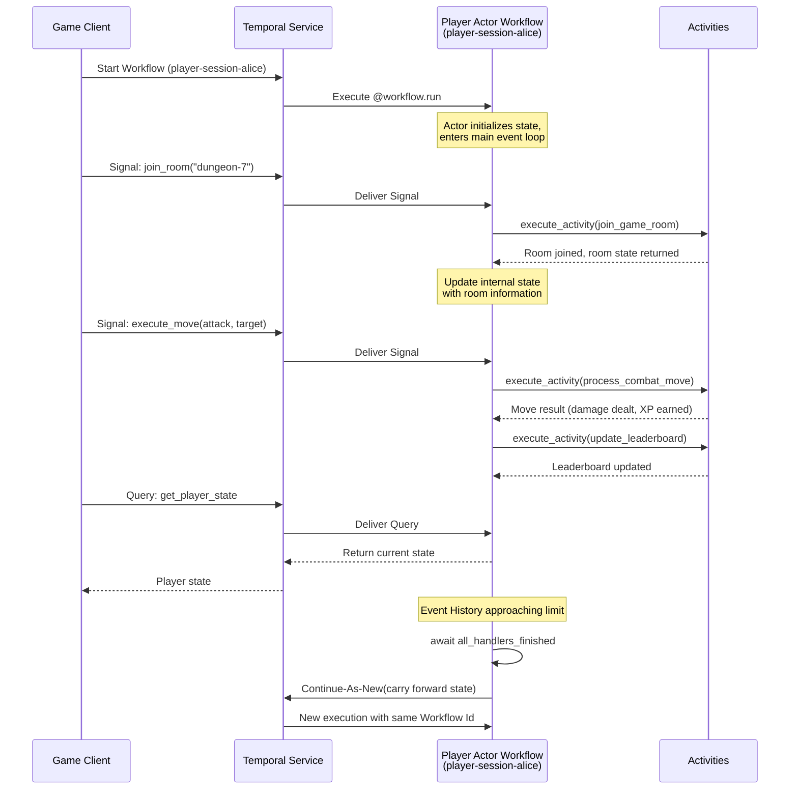

Multiplayer game backends run into the same wall at scale: player state lives in memory, pinned to a server, and when that server goes down the session goes with it. Reconnection logic is painful, distributed state is expensive, and cross-player coordination is worse. This guide shows how to model each player as their own durable, independently-running process — one that survives crashes, executes game actions, and stays addressable for as long as the session lasts.

## Problem statement

When a game server goes down, every player on it loses their session. Inventory, position, active buffs, current room — gone. Reconnection has to reconstruct state from whatever made it to the database before the crash, and something always gets missed. Scaling makes this worse: keeping per-player state consistent across a cluster requires distributed caches, locking, and sync logic that grows in complexity with every new game feature. Multi-step operations between players — trading items, triggering combat, changing rooms — need coordination logic that's hard to get right and even harder to debug when it goes wrong.

## Solution

Each player gets their own Workflow — a durable, uniquely-addressable process identified by their player ID. It holds inventory, health, position, and room state in memory. It doesn't just store state: it acts. Joining a room, executing a combat move, updating the leaderboard — each of these happens through an Activity the Workflow drives directly. When the server goes down, the Workflow resumes on another Worker from exactly the point it left off, with no state lost and no reconnection logic required. Sessions that run for weeks don't accumulate unbounded history — Continue-As-New handles that automatically.

## Outcomes

After working through this guide, you'll have a session system where:

- **Server crashes don't end player sessions**: state is durable and resumes on any available Worker without custom recovery logic
- **Game actions are reliable**: room joins, combat moves, and leaderboard updates execute through Activities with automatic retries — partial failures don't corrupt session state
- **Sessions run as long as needed**: Continue-As-New manages history growth so a session that lasts weeks costs no more to run than one that lasts minutes
- **Every player is independently addressable**: any service can send a command, query state, or trigger an update using the player's Workflow Id
- **Active sessions are queryable by operators**: Search Attributes let you find who's in which room, how long a session has been running, or which players are idle

## Background and best practices

### What is an Actor Workflow?

The Actor Workflow pattern extends the Workflow Entity pattern. An Workflow Entity is a long-running Workflow that represents a *thing*: it holds state, responds to messages, and exposes that state through Queries. An Actor Workflow is an Entity Workflow that *does things*. The distinction is behavioral:

- **An entity is a thing. An actor is a thing that does things.**
- An Workflow Entity is analogous to a distributed data cache: it stores and retrieves state.
- An Actor Workflow is analogous to a distributed object with operations: it stores state *and* executes side effects on behalf of the entity it represents.

An Entity Workflow that takes action is an Actor Workflow. Concrete examples of actors include a Workflow that scales up a database when load increases, starts a car engine when a driver authenticates, submits an order when a customer confirms checkout, or manages a player session in a multiplayer game by joining rooms and executing combat moves.

AI agents are often modeled as Actor Workflows. They receive instructions (Temporal Signals or Updates), maintain conversational state, and take action by calling external services (Activities) such as language model APIs, tool integrations, and data retrieval systems.

### The actor model and Temporal

The actor model, originally formalized by Carl Hewitt in 1973, defines computation in terms of *actors*: autonomous units that communicate exclusively through asynchronous messages. Each actor:

1. Has a private, encapsulated state that other actors can not directly access.
2. Processes messages one at a time from an inbox (mailbox).
3. Can send messages to other actors.
4. Can create new actors.
5. Can change its own internal state in response to a message.

Temporal Workflows map naturally to this model:

| Actor model concept | Temporal equivalent |
|---|---|
| Actor identity | Workflow Id |
| Actor mailbox | Workflow Event History (Signals or Updates) |
| Processing a message | Signal handler, Update handler |
| Sending a message to another actor | Signaling an external Workflow |
| Creating a new actor | Starting a new Workflow Execution |
| Actor supervision | Retry Policies, parent-child relationships |
| Actor state persistence | Durable Execution (automatic via Event History) |

Traditional actor frameworks such as Akka, and Orleans require you to configure persistence, message delivery guarantees, and supervision hierarchies. Temporal provides these capabilities as platform primitives. Every Workflow Execution is durably persisted. Every Signal is reliably delivered. Every Activity execution is automatically retried according to its Retry Policy. You do not need to implement a persistence plugin, configure a journal, or write custom supervision strategies.

### Why actors matter for player sessions

A player session maps almost perfectly onto the actor model. Each player has private state that nothing else should write to directly — inventory, health, position, active buffs. They receive messages from clients, servers, and other players. They take real-world actions in response. And their lifecycle is unpredictable: a session might last twenty minutes or three months, with idle stretches in between.

Modeling each player as an Actor Workflow gives you a single authoritative representation of that session. There is no cache to invalidate, no database row to lock, no sticky session to maintain. The Workflow *is* the session, and it's always reachable by player ID.

### Event History and Continue-As-New

Every Workflow Execution in Temporal produces an append-only Event History. This history has a limit of 50,000 Events or 50 MB. For actor Workflows that run indefinitely, Event History growth must be managed proactively.

Continue-As-New atomically completes the current Workflow Execution and starts a new one with the same Workflow Id, carrying forward any state you provide as arguments. From the perspective of external callers, the Workflow Id remains the same. Signals sent during the transition are not lost; the Temporal Service buffers them for the new execution.

Before executing Continue-As-New, you must ensure that all in-progress Signal and Update handlers have finished processing. The `workflow.all_handlers_finished` predicate provides this guarantee.

### Signal volume limits

Two hard limits govern Signal volume per Workflow Execution:

- **10,000 total Signals** per Execution. Continue-As-New resets this counter, so an entity that transitions regularly is not constrained by it in practice.
- **2,000 pending Signals** (unprocessed Signals buffered by the server) at any one time. If this limit is reached, new Signals are rejected.

Beyond these limits, the practical throughput ceiling is Worker-side: each Signal triggers a Workflow Task, and a Workflow processes one Workflow Task at a time. For typical short tasks, this yields a few Workflow Tasks per second per Workflow Execution.

If your use case requires higher Signal ingestion rates — for example, streaming real-time game telemetry — consider one of these approaches:

- **Batch events into a single Signal payload.** Instead of one Signal per game event, batch several events into a list and send them as a single Signal. The handler appends the entire batch to the queue in one shot.
- **Use an aggregation layer.** Route high-frequency event streams through a service (such as a message broker or aggregator) that batches events before forwarding them as Signals. This decouples the producer's throughput from the Workflow's processing rate.

### Activity Heartbeating

Long-running Activities, such as maintaining a WebSocket connection to a game room or processing a large batch of leaderboard updates, should emit heartbeats. A heartbeat serves two purposes:

1. It tells the Temporal Service that the Activity is still making progress. If heartbeats stop arriving within the configured Heartbeat Timeout, the Temporal Service considers the Activity failed and schedules a retry.
2. It carries a custom payload that captures the Activity's progress. When the Activity is retried after a failure, the new attempt can read the last heartbeat payload and resume from where it left off.

Configure a short Heartbeat Timeout (for example, 30 seconds) and emit heartbeats frequently (for example, every 5 to 10 seconds). The SDK throttles heartbeat calls to avoid overwhelming the Temporal Service, so you can call `activity.heartbeat()` as often as needed without performance concern.

### Workflow determinism

In Temporal, your Activities can include non-deterministic code, but the Workflow itself must remain deterministic. This is because Temporal restores Workflow state through *replay*. When a Worker restarts, it re-executes the Workflow code from the beginning, matching Commands against Events stored in the history. If the code produces different Commands than what the history contains, the Worker raises a `NondeterminismError`.

In practice, this means:

- Use `workflow.now()` instead of `datetime.now()`.
- Use `workflow.uuid4()` instead of `uuid.uuid4()`.
- Use `workflow.random()` instead of the `random` module.
- Do not perform I/O, network calls, or file system access inside Workflow code. Delegate all side effects to Activities.
- Use `workflow.logger` instead of `print()` for replay-safe logging.

The Python SDK's Workflow sandbox provides automatic protection against many of these violations, but understanding the underlying mechanism helps you write correct code.

### Activity idempotency

Activities may be retried by the Temporal Service due to timeouts, Worker crashes, or transient failures. Every Activity that interacts with an external system must be designed so that executing it twice produces the same result as executing it once. Common strategies include:

- Passing a unique identifier (the Workflow Id, an Activity-specific identifier, or a business identifier) as an idempotency key to external APIs.
- Checking the current state of the external system before making changes.
- Using conditional writes or upserts instead of blind inserts.

## Target audience

This guide references the following roles:

- **Game backend developers** who design and implement player session management, matchmaking, and real-time game logic. They will write the Workflow, Activity, and data model code.
- **Platform engineers** who deploy and operate Temporal Workers, and manage Temporal infrastructure.
- **Technical architects** who evaluate distributed system patterns for multiplayer game backends. They will use this guide to understand how the actor model maps to Temporal and when to apply it.


## Prerequisites

### Required software and infrastructure

- **Python 3.11 or later**
- **Temporal Python SDK (`temporalio`)** version 1.9.0 or later
- **Pydantic** version 2.0 or later for data validation
- **Temporal CLI** for running a local development server (`temporal server start-dev`)

### Required concepts

- Familiarity with Python `async`/`await` and the `asyncio` event loop
- Familiarity with Temporal Workflows, Activities, and Workers
- Familiarity with Temporal Signals, Queries, and Updates
- Basic understanding of the actor model (message-passing concurrency)
- Familiarity with `dataclasses` or Pydantic models for structured data

---

## Architecture diagram

The following sequence diagram illustrates the lifecycle of a player Actor Workflow, including interactions with game systems and Events.

### Narrative

1. The game client starts a player Actor Workflow using the player's unique identifier as the Workflow Id.
2. The Workflow initializes player state and enters a main event loop, waiting for messages.
3. When the client sends a `join_room` Signal, the Workflow executes an Activity that communicates with the game room service. This is the key distinction from an Entity Workflow: the actor *does something* by executing an Activity with a real-world side effect.
4. Combat moves trigger Activities that process game logic and update leaderboards.
5. Queries provide read-only access to the player's current state for dashboards and client polling.
6. When the Event History approaches the size limit, the Workflow waits for all handlers to finish and then executes Continue-As-New, carrying forward the player's state to a fresh execution.





## Implementation plan

This section walks you through building a complete player session Actor Workflow system. The implementation is organized into the following phases:

1. Define the data models
2. Define the Activities
3. Define the Player Actor Workflow
4. Configure and start the Worker
5. Start and interact with player sessions from a client

### Phase 1: Define the data models

Create a file named `models.py` to hold all data structures used by the Workflows and Activities. Using `dataclasses` keeps payloads lightweight and avoids additional dependencies, though Pydantic models work equally well if you need validation.

```python
# models.py
from __future__ import annotations

import enum
from dataclasses import dataclass, field


class PlayerStatus(str, enum.Enum):
    """Represents the current lifecycle state of a player session."""

    ONLINE = "online"
    IN_ROOM = "in_room"
    IN_COMBAT = "in_combat"
    IDLE = "idle"
    OFFLINE = "offline"


class MoveType(str, enum.Enum):
    """Types of combat moves a player can execute."""

    ATTACK = "attack"
    DEFEND = "defend"
    HEAL = "heal"
    SPECIAL = "special"


@dataclass
class InventoryItem:
    """A single item in a player's inventory."""

    item_id: str
    name: str
    quantity: int = 1


@dataclass
class CombatMoveRequest:
    """A request from a player to execute a combat move."""

    move_type: MoveType
    target_player_id: str | None = None
    event_id: str = ""  # Idempotency key; callers should always provide one


@dataclass
class CombatMoveResult:
    """The outcome of a combat move."""

    damage_dealt: int = 0
    damage_received: int = 0
    xp_earned: int = 0
    move_description: str = ""


@dataclass
class LeaderboardEntry:
    """A player's leaderboard record."""

    player_id: str
    score: int
    rank: int = 0


@dataclass
class RoomInfo:
    """Information about a game room the player has joined."""

    room_id: str
    room_name: str
    player_count: int = 0
    max_players: int = 20


@dataclass
class PlayerState:
    """The complete state of a player session.

    This dataclass is the state that the Actor Workflow carries through
    Continue-As-New cycles. It contains everything needed to reconstruct
    the player's session context.
    """

    player_id: str
    display_name: str
    status: PlayerStatus = PlayerStatus.ONLINE
    current_room: RoomInfo | None = None
    inventory: list[InventoryItem] = field(default_factory=list)
    health: int = 100
    max_health: int = 100
    xp: int = 0
    level: int = 1
    score: int = 0
    session_actions_count: int = 0
    total_actions_count: int = 0
    pending_notifications: list[str] = field(default_factory=list)
```

The `PlayerState` dataclass is the single source of truth for a player's session. It is passed as the argument to the Workflow's `@workflow.run` method and carried forward through each Continue-As-New cycle. The `session_actions_count` field tracks the number of actions in the *current* execution (reset on Continue-As-New), while `total_actions_count` tracks the lifetime total.

The separation of `session_actions_count` from `total_actions_count` gives you two useful signals: the session count helps you decide when to trigger Continue-As-New (since each action generates Events in the history), and the total count provides a lifetime metric for the player.

### Phase 2: Define the Activities

Create a file named `activities.py`. Activities contain all non-deterministic code: network calls, database writes, game server interactions, and notifications. Each Activity is designed to be idempotent so that retries do not produce duplicate effects.

```python
# activities.py
from __future__ import annotations

import uuid
from dataclasses import replace

from temporalio import activity

from models import (
    CombatMoveRequest,
    CombatMoveResult,
    InventoryItem,
    LeaderboardEntry,
    MoveType,
    RoomInfo,
)


@activity.defn
def join_game_room(player_id: str, room_id: str) -> RoomInfo:
    """Join a game room and return room information.

    In a production system, this Activity would call the game room
    microservice API to register the player in the room. The player_id
    serves as an idempotency key: joining the same room twice is a
    no-op that returns the current room state.
    """
    activity.logger.info(
        f"Player {player_id} joining room {room_id}"
    )
    # Production: call game room service API
    # room_service.join(player_id=player_id, room_id=room_id)
    return RoomInfo(
        room_id=room_id,
        room_name=f"Room {room_id}",
        player_count=5,
        max_players=20,
    )


@activity.defn
def leave_game_room(player_id: str, room_id: str) -> None:
    """Remove a player from a game room.

    Idempotent: leaving a room you are not in is a no-op.
    """
    activity.logger.info(
        f"Player {player_id} leaving room {room_id}"
    )
    # Production: call game room service API
    # room_service.leave(player_id=player_id, room_id=room_id)


@activity.defn
def process_combat_move(
    player_id: str, move: CombatMoveRequest
) -> CombatMoveResult:
    """Process a combat move and return the result.

    This Activity calls the game logic service to resolve the combat
    action. The combination of player_id and a server-assigned move
    identifier ensures idempotency.
    """
    activity.logger.info(
        f"Player {player_id} executing {move.move_type.value}"
        f" targeting {move.target_player_id}"
    )
    # Production: call game logic service
    # result = combat_service.resolve_move(player_id, move)
    damage = 25 if move.move_type == MoveType.ATTACK else 0
    healing = 15 if move.move_type == MoveType.HEAL else 0
    xp = 10

    return CombatMoveResult(
        damage_dealt=damage,
        damage_received=0,
        xp_earned=xp,
        move_description=(
            f"{move.move_type.value} executed"
            f"{' against ' + move.target_player_id if move.target_player_id else ''}"
        ),
    )


@activity.defn
def update_leaderboard(entry: LeaderboardEntry) -> LeaderboardEntry:
    """Update the leaderboard with the player's current score.

    Uses the player_id as an upsert key so that repeated calls with the
    same score do not create duplicate entries.
    """
    activity.logger.info(
        f"Updating leaderboard for {entry.player_id} "
        f"with score {entry.score}"
    )
    # Production: upsert into leaderboard database
    # db.leaderboard.upsert(player_id=entry.player_id, score=entry.score)
    return replace(entry, rank=42)


@activity.defn
def send_player_notification(
    target_player_id: str, message: str
) -> None:
    """Send a push notification to a player.

    Notifications are delivered through an external push service.
    The message includes a client-generated identifier for deduplication.
    """
    activity.logger.info(
        f"Sending notification to {target_player_id}: {message}"
    )
    # Production: call push notification service
    # push_service.send(player_id=target_player_id, message=message)


@activity.defn
def record_session_metrics(
    player_id: str,
    total_actions: int,
    session_duration_minutes: int,
) -> None:
    """Record session metrics to the analytics system.

    Called during Continue-As-New to capture session telemetry.
    Uses an append-only metrics store, so duplicate writes are harmless.
    """
    activity.logger.info(
        f"Recording session metrics for {player_id}: "
        f"{total_actions} actions, {session_duration_minutes} min"
    )
    # Production: write to metrics/analytics pipeline
    # analytics.record_session(player_id, total_actions, duration)
```

Each Activity follows a consistent pattern:

1. **Logging with `activity.logger`** provides automatic correlation with the Workflow Id and Activity attempt number.
2. **Idempotency annotations** in the docstrings explain how the Activity handles retries. In production code, each Activity passes an idempotency key to the external service it calls.
3. **Stub implementations** return realistic data structures. In a production system, each stub would be replaced by a call to the corresponding game backend service.

Activities are defined as synchronous functions. The Python SDK runs synchronous Activities in a `ThreadPoolExecutor`, which is safer and easier to debug than async Activities. Async Activities are only necessary when the Activity must use `async`-native libraries throughout its implementation.

### Phase 3: Define the Player Actor Workflow

Create a file named `player_workflow.py`. This is the core of the system: a long-running Actor Workflow that represents a single player's game session.

```python
# player_workflow.py
from __future__ import annotations

import asyncio
from datetime import timedelta

from temporalio import workflow
from temporalio.common import RetryPolicy, SearchAttributes, SearchAttributeKey

with workflow.unsafe.imports_passed_through():
    from activities import (
        join_game_room,
        leave_game_room,
        process_combat_move,
        record_session_metrics,
        send_player_notification,
        update_leaderboard,
    )
    from models import (
        CombatMoveRequest,
        CombatMoveResult,
        InventoryItem,
        LeaderboardEntry,
        PlayerState,
        PlayerStatus,
    )


# Search Attribute keys for operational visibility
PLAYER_STATUS_KEY = SearchAttributeKey.for_keyword("PlayerStatus")
CURRENT_ROOM_KEY = SearchAttributeKey.for_keyword("CurrentRoom")
PLAYER_LEVEL_KEY = SearchAttributeKey.for_int("PlayerLevel")

# Threshold for triggering Continue-As-New.
# Each Signal/Update handler execution and each Activity execution
# generates Events in the history. A conservative threshold of
# 10,000 events provides ample headroom below the 50,000 limit.
CONTINUE_AS_NEW_THRESHOLD = 10_000

# Default Retry Policy for Activities in this Workflow.
DEFAULT_RETRY_POLICY = RetryPolicy(
    initial_interval=timedelta(seconds=1),
    backoff_coefficient=2.0,
    maximum_interval=timedelta(seconds=30),
    maximum_attempts=5,
)


@workflow.defn
class PlayerSessionWorkflow:
    """Actor Workflow representing a single player's game session.

    This Workflow is the player's durable, autonomous agent in the game
    backend. It maintains the player's state and actively performs
    operations by executing Activities. External systems interact with
    it through Signals (fire-and-forget commands), Updates (synchronous
    request-response), and Queries (read-only state inspection).

    Unlike an Entity Workflow that passively holds state, this Actor
    Workflow takes action: it joins game rooms, executes combat moves,
    updates leaderboards, and sends notifications.
    These side effects are all executed through Activities.

    Lifecycle:
    1. The Workflow starts when a player logs in.
    2. It enters a main loop that waits for Signals and Updates.
    3. It carries forward state through Continue-As-New cycles.
    4. It completes when the player explicitly logs out.
    """

    def __init__(self) -> None:
        # Pending action queues. Signal handlers append to these queues,
        # and the main loop processes them. This serializes action
        # processing and avoids concurrent Activity executions that
        # could conflict with each other.
        self._pending_room_joins: list[str] = []
        self._pending_moves: list[CombatMoveRequest] = []
        self._pending_notifications: list[str] = []
        self._shutdown_requested: bool = False
        self._state: PlayerState | None = None
        # In-memory set for Signal deduplication within this execution.
        # Temporal delivers Signals at least once, so the same Signal may
        # arrive more than once. This set catches duplicates that arrive
        # within the same Execution. It is not persisted across
        # Continue-As-New transitions, which is acceptable: the window
        # for a delayed duplicate to span a CAN boundary is very small.
        self._seen_move_ids: set[str] = set()

    # ──────────────────────────────────────────────
    # Signals: fire-and-forget commands from clients
    # ──────────────────────────────────────────────

    @workflow.signal
    async def join_room(self, room_id: str) -> None:
        """Request the player to join a game room.

        The Signal handler appends the room identifier to a queue. The
        main loop picks it up and executes the join_game_room Activity.
        This pattern ensures that room joins are processed serially,
        preventing race conditions where a player could be in two rooms.

        If the room is already queued or is the player's
        current room, the Signal is silently dropped. If the caller
        needs confirmation that the join succeeded, use an Update instead.
        """
        if room_id in self._pending_room_joins:
            return
        if (
            self._state is not None
            and self._state.current_room is not None
            and self._state.current_room.room_id == room_id
        ):
            return
        self._pending_room_joins.append(room_id)

    @workflow.signal
    async def execute_move(self, move: CombatMoveRequest) -> None:
        """Request the player to execute a combat move.

        Moves are queued and processed in order by the main loop.
        Callers must supply a unique event_id for deduplication. Without
        one, duplicate Signals cannot be detected and may result in
        double-processing. If at-most-once execution or a result is
        required, use an Update instead of a Signal.
        """
        if move.event_id:
            if move.event_id in self._seen_move_ids:
                return
            self._seen_move_ids.add(move.event_id)
        self._pending_moves.append(move)

    @workflow.signal
    async def receive_notification(self, message: str) -> None:
        """Receive a notification from another player or the game system.

        Notifications are stored in the player's state and can be
        retrieved through the get_player_state Query.
        """
        if self._state is not None:
            self._state.pending_notifications.append(message)

    @workflow.signal
    async def logout(self) -> None:
        """Request the player to log out and end the session."""
        self._shutdown_requested = True

    # ──────────────────────────────────────────────
    # Queries: read-only state inspection
    # ──────────────────────────────────────────────

    @workflow.query
    def get_player_state(self) -> PlayerState | None:
        """Return the complete player state.

        Queries are read-only and must not modify Workflow state.
        They execute synchronously on the Worker and return immediately.
        Game clients can poll this Query to display inventory, health,
        score, and pending notifications.
        """
        return self._state

    @workflow.query
    def get_status(self) -> str:
        """Return the player's current status as a string."""
        if self._state is None:
            return PlayerStatus.OFFLINE.value
        return self._state.status.value

    @workflow.query
    def get_inventory(self) -> list[InventoryItem]:
        """Return the player's current inventory."""
        if self._state is None:
            return []
        return self._state.inventory

    # ──────────────────────────────────────────────
    # Main Workflow logic
    # ──────────────────────────────────────────────

    @workflow.run
    async def run(self, state: PlayerState) -> str:
        """Main entry point for the Player Actor Workflow.

        This method initializes state and enters a loop that processes
        queued actions and checks for Continue-As-New conditions. The
        loop runs indefinitely until the player logs out or the
        session is terminated.

        Args:
            state: The player's state. On the first execution, this is
                the initial state. On Continue-As-New, this is the state
                carried forward from the previous execution.
        """
        self._state = state
        self._state.status = PlayerStatus.ONLINE

        # Update Search Attributes so operators can find this player
        self._upsert_search_attributes()

        workflow.logger.info(
            f"Player session started for {state.player_id} "
            f"(total actions: {state.total_actions_count})"
        )

        # Main event loop: process queued actions until shutdown
        while not self._shutdown_requested:
            # Wait for any pending action or a shutdown request.
            # The timeout ensures we periodically check the Event
            # History length even during idle periods.
            try:
                await workflow.wait_condition(
                    lambda: (
                        bool(self._pending_room_joins)
                        or bool(self._pending_moves)
                        or self._shutdown_requested
                    ),
                    timeout=timedelta(minutes=5),
                )
            except asyncio.TimeoutError:
                # No actions for 5 minutes. Check Continue-As-New
                # threshold and loop again.
                pass

            # Process all pending room joins
            await self._process_room_joins()

            # Process all pending combat moves
            await self._process_combat_moves()

            # Check whether Event History is approaching the limit
            if self._should_continue_as_new():
                await self._perform_continue_as_new()
                # continue_as_new raises an exception that exits the method
                return ""  # unreachable, but satisfies the type checker

        # Shutdown path: player logged out
        await self._handle_logout()

        return f"Player {state.player_id} session ended"

    # ──────────────────────────────────────────────
    # Private helper methods
    # ──────────────────────────────────────────────

    async def _process_room_joins(self) -> None:
        """Process all pending room join requests."""
        while self._pending_room_joins:
            room_id = self._pending_room_joins.pop(0)

            # Leave the current room first if the player is already in one
            if self._state.current_room is not None:
                await workflow.execute_activity(
                    leave_game_room,
                    args=[
                        self._state.player_id,
                        self._state.current_room.room_id,
                    ],
                    start_to_close_timeout=timedelta(seconds=30),
                    retry_policy=DEFAULT_RETRY_POLICY,
                )

            # Join the new room. This Activity calls the game room
            # service, which is a real-world side effect. This is
            # what makes this an Actor Workflow, not an Entity Workflow.
            room_info = await workflow.execute_activity(
                join_game_room,
                args=[self._state.player_id, room_id],
                start_to_close_timeout=timedelta(seconds=30),
                retry_policy=DEFAULT_RETRY_POLICY,
            )

            self._state.current_room = room_info
            self._state.status = PlayerStatus.IN_ROOM
            self._increment_action_count()
            self._upsert_search_attributes()

            workflow.logger.info(
                f"Player {self._state.player_id} joined room "
                f"{room_info.room_name}"
            )

    async def _process_combat_moves(self) -> None:
        """Process all pending combat moves in order."""
        while self._pending_moves:
            move = self._pending_moves.pop(0)
            self._state.status = PlayerStatus.IN_COMBAT

            # Execute the combat move. This Activity calls the game
            # logic service to resolve damage, XP, and other effects.
            result: CombatMoveResult = await workflow.execute_activity(
                process_combat_move,
                args=[self._state.player_id, move],
                start_to_close_timeout=timedelta(seconds=30),
                retry_policy=DEFAULT_RETRY_POLICY,
            )

            # Apply the results to the player's state
            self._state.xp += result.xp_earned
            self._state.health = max(
                0,
                min(
                    self._state.max_health,
                    self._state.health - result.damage_received,
                ),
            )
            self._state.score += result.damage_dealt + result.xp_earned

            # Check for level up (every 100 XP)
            new_level = (self._state.xp // 100) + 1
            if new_level > self._state.level:
                self._state.level = new_level
                workflow.logger.info(
                    f"Player {self._state.player_id} reached "
                    f"level {new_level}"
                )

            # Update the leaderboard. This is another real-world side
            # effect: the leaderboard is an external system that other
            # players and the game client query.
            await workflow.execute_activity(
                update_leaderboard,
                LeaderboardEntry(
                    player_id=self._state.player_id,
                    score=self._state.score,
                ),
                start_to_close_timeout=timedelta(seconds=30),
                retry_policy=DEFAULT_RETRY_POLICY,
            )

            # Notify the target player of the incoming attack.
            # This demonstrates cross-actor communication: one Actor
            # Workflow triggers an Activity that sends a message to
            # another player's session via an external push service.
            if move.target_player_id:
                await workflow.execute_activity(
                    send_player_notification,
                    args=[
                        move.target_player_id,
                        f"{self._state.display_name} attacked you "
                        f"for {result.damage_dealt} damage "
                        f"({result.move_description})",
                    ],
                    start_to_close_timeout=timedelta(seconds=10),
                    retry_policy=DEFAULT_RETRY_POLICY,
                )

            self._increment_action_count()
            self._state.status = (
                PlayerStatus.IN_ROOM
                if self._state.current_room
                else PlayerStatus.ONLINE
            )

    def _should_continue_as_new(self) -> bool:
        """Check whether the Event History is approaching the limit."""
        current_length = workflow.info().get_current_history_length()
        return current_length > CONTINUE_AS_NEW_THRESHOLD

    async def _perform_continue_as_new(self) -> None:
        """Execute Continue-As-New with the current player state.

        Before continuing, this method:
        1. Waits for all in-progress Signal and Update handlers to finish.
        2. Records session metrics to the analytics system.
        3. Resets the session-level action counter.
        """
        workflow.logger.info(
            f"Continue-As-New for player {self._state.player_id} "
            f"at {workflow.info().get_current_history_length()} events"
        )

        # Wait for all handlers to complete before continuing.
        # This prevents data loss from in-flight Signal or Update handlers.
        await workflow.wait_condition(workflow.all_handlers_finished)

        # Record session metrics before resetting the counter
        await workflow.execute_activity(
            record_session_metrics,
            args=[
                self._state.player_id,
                self._state.total_actions_count,
                0,  # duration computed from workflow start time in production
            ],
            start_to_close_timeout=timedelta(seconds=30),
            retry_policy=DEFAULT_RETRY_POLICY,
        )

        # Reset session-level counter; keep total lifetime counter
        self._state.session_actions_count = 0

        # Continue-As-New carries the full player state to the new execution
        workflow.continue_as_new(args=[self._state])

    async def _handle_logout(self) -> None:
        """Clean up resources when the player logs out."""
        assert self._state is not None

        # Wait for all handlers to finish processing
        await workflow.wait_condition(workflow.all_handlers_finished)

        # Leave the current room
        if self._state.current_room is not None:
            await workflow.execute_activity(
                leave_game_room,
                args=[
                    self._state.player_id,
                    self._state.current_room.room_id,
                ],
                start_to_close_timeout=timedelta(seconds=30),
                retry_policy=DEFAULT_RETRY_POLICY,
            )
            self._state.current_room = None

        self._state.status = PlayerStatus.OFFLINE
        self._upsert_search_attributes()

        workflow.logger.info(
            f"Player {self._state.player_id} logged out "
            f"after {self._state.total_actions_count} total actions"
        )

    def _increment_action_count(self) -> None:
        """Increment both session and total action counters."""
        self._state.session_actions_count += 1
        self._state.total_actions_count += 1

    def _upsert_search_attributes(self) -> None:
        """Update Search Attributes for operational visibility.

        Search Attributes allow operators to query running Workflows.
        For example: find all players in a specific room, find all
        players above a certain level, or find all players with a
        particular status.
        """
        pairs = [
            (PLAYER_STATUS_KEY, self._state.status.value),
            (PLAYER_LEVEL_KEY, self._state.level),
        ]
        if self._state.current_room:
            pairs.append(
                (CURRENT_ROOM_KEY, self._state.current_room.room_id)
            )
        workflow.upsert_search_attributes(pairs)
```

The `PlayerSessionWorkflow` is the central piece of this system. Several design decisions are worth examining in detail:

**Message queue pattern for Signals.** Signal handlers do not execute Activities directly. Instead, they append to internal queues (`_pending_room_joins`, `_pending_moves`), and the main loop drains these queues. This serializes side effects and prevents concurrent Activity executions that could conflict with each other. For example, if two `join_room` Signals arrive simultaneously, processing them through a queue guarantees that the player leaves the first room before joining the second.

**Signal deduplication.** Temporal delivers Signals at least once: the same Signal may arrive more than once under certain failure conditions. Without deduplication, a duplicate `execute_move` Signal could apply a combat move twice, corrupting XP and health state. The `join_room` handler drops a Signal if the target room is already queued or is the current room. The `execute_move` handler uses the `event_id` field on `CombatMoveRequest` as an idempotency key, tracking seen identifiers in `_seen_move_ids`. Callers must generate and provide a unique `event_id` for every move Signal. If a Signal has no `event_id`, duplicates cannot be detected and the move is appended unconditionally — this is the fallback behavior and should be avoided in production. For operations where the caller needs confirmation or strict at-most-once semantics, use a Workflow Update instead of a Signal: Updates support validators that run before the operation is accepted, and the caller blocks until the handler returns a result.

**Continue-As-New with handler draining.** Before executing `workflow.continue_as_new()`, the Workflow calls `await workflow.wait_condition(workflow.all_handlers_finished)`. This ensures that any Signal or Update handler that is currently executing finishes before the current execution ends. Without this step, in-flight handlers could be interrupted, causing data loss.

**Search Attribute updates.** The Workflow upserts Search Attributes whenever the player's status, room, or level changes. This enables operational queries such as:

```
PlayerStatus = "in_room" AND CurrentRoom = "dungeon-7"
```

```
PlayerLevel >= 10 AND PlayerStatus = "online"
```

These queries are invaluable for live operations: finding all players in a room that needs to be shut down for maintenance, identifying high-level players for a special event, or monitoring the distribution of player statuses across the system.

### Phase 4: Configure and start the Worker

Create a file named `worker.py`. The Worker registers the `PlayerSessionWorkflow` and all Activities on a single Task Queue.

```python
# worker.py
from __future__ import annotations

import asyncio
import concurrent.futures
import logging

from temporalio.client import Client
from temporalio.worker import Worker

from activities import (
    join_game_room,
    leave_game_room,
    process_combat_move,
    record_session_metrics,
    send_player_notification,
    update_leaderboard,
)
from player_workflow import PlayerSessionWorkflow

# Configure logging for the Worker process
logging.basicConfig(
    level=logging.INFO,
    format="%(asctime)s [%(levelname)s] %(name)s: %(message)s",
)


async def main() -> None:
    """Start a Worker that handles player session Workflows."""
    client = await Client.connect("localhost:7233", namespace="default")

    # Use a ThreadPoolExecutor for synchronous Activities.
    # Size the pool based on expected concurrent Activity executions.
    # Each concurrent Activity occupies one thread.
    with concurrent.futures.ThreadPoolExecutor(
        max_workers=100
    ) as activity_executor:
        worker = Worker(
            client,
            task_queue="player-session-queue",
            workflows=[PlayerSessionWorkflow],
            activities=[
                join_game_room,
                leave_game_room,
                process_combat_move,
                update_leaderboard,
                send_player_notification,
                record_session_metrics,
            ],
            activity_executor=activity_executor,
            # Limit concurrent Workflow Tasks. Each Workflow Task is
            # lightweight (in-memory replay), but limiting concurrency
            # prevents memory pressure under high load.
            max_concurrent_workflow_tasks=200,
            # Limit concurrent Activity executions. Activities perform
            # I/O and consume threads from the executor pool.
            max_concurrent_activities=100,
        )

        logging.info(
            "Worker started on task queue 'player-session-queue'"
        )
        await worker.run()


if __name__ == "__main__":
    asyncio.run(main())
```

The Worker configuration makes several deliberate choices:

- **ThreadPoolExecutor sizing:** The `max_workers=100` setting supports up to 100 concurrent Activity executions. Size this based on the expected ratio of concurrent players to Activity execution time. If Activities are fast (under 100 milliseconds), fewer threads are needed. If Activities involve slower external service calls, increase the pool size.
- **Concurrency limits:** `max_concurrent_workflow_tasks=200` and `max_concurrent_activities=100` prevent the Worker from being overwhelmed. These values should be tuned based on the Worker's available memory and CPU.

### Phase 5: Start and interact with player sessions from a client

Create a file named `starter.py`. This module demonstrates how a game backend API would start player sessions and send commands to them.

```python
# starter.py
from __future__ import annotations

import asyncio

from temporalio.client import Client
from temporalio.common import SearchAttributes, SearchAttributeKey

from models import (
    CombatMoveRequest,
    InventoryItem,
    MoveType,
    PlayerState,
)
from player_workflow import PlayerSessionWorkflow

# Search Attribute keys (must match the Workflow definitions)
PLAYER_STATUS_KEY = SearchAttributeKey.for_keyword("PlayerStatus")
PLAYER_LEVEL_KEY = SearchAttributeKey.for_int("PlayerLevel")


async def start_player_session(
    client: Client, player_id: str, display_name: str
) -> None:
    """Start a new player session Actor Workflow.

    The Workflow Id is derived from the player_id, ensuring that each
    player has exactly one active session. If a session with this
    Workflow Id already exists, this call will raise an error. Use
    the Workflow Id Reuse Policy to control this behavior.
    """
    initial_state = PlayerState(
        player_id=player_id,
        display_name=display_name,
        inventory=[
            InventoryItem(
                item_id="sword-001",
                name="Iron Sword",
                quantity=1,
            ),
            InventoryItem(
                item_id="potion-001",
                name="Health Potion",
                quantity=5,
            ),
        ],
    )

    handle = await client.start_workflow(
        PlayerSessionWorkflow.run,
        initial_state,
        id=f"player-session-{player_id}",
        task_queue="player-session-queue",
        search_attributes=SearchAttributes.from_pairs([
            (PLAYER_STATUS_KEY, "online"),
            (PLAYER_LEVEL_KEY, 1),
        ]),
    )
    print(f"Started session for {display_name} ({player_id})")
    print(f"  Workflow Id: {handle.id}")


async def join_room(
    client: Client, player_id: str, room_id: str
) -> None:
    """Send a join_room Signal to a player's Actor Workflow."""
    handle = client.get_workflow_handle(
        f"player-session-{player_id}"
    )
    await handle.signal(PlayerSessionWorkflow.join_room, room_id)
    print(f"Player {player_id} sent join_room Signal for {room_id}")


async def attack(
    client: Client,
    player_id: str,
    target_player_id: str,
) -> None:
    """Send a combat move Signal to a player's Actor Workflow."""
    handle = client.get_workflow_handle(
        f"player-session-{player_id}"
    )
    move = CombatMoveRequest(
        move_type=MoveType.ATTACK,
        target_player_id=target_player_id,
    )
    await handle.signal(PlayerSessionWorkflow.execute_move, move)
    print(
        f"Player {player_id} sent attack Signal "
        f"targeting {target_player_id}"
    )


async def check_player_state(
    client: Client, player_id: str
) -> None:
    """Query a player's current state."""
    handle = client.get_workflow_handle(
        f"player-session-{player_id}"
    )
    state = await handle.query(
        PlayerSessionWorkflow.get_player_state
    )
    if state is not None:
        print(f"Player: {state.display_name}")
        print(f"  Status: {state.status.value}")
        print(f"  Health: {state.health}/{state.max_health}")
        print(f"  Level: {state.level}")
        print(f"  Score: {state.score}")
        print(f"  XP: {state.xp}")
        print(
            f"  Room: "
            f"{state.current_room.room_name if state.current_room else 'None'}"
        )
        print(f"  Inventory: {len(state.inventory)} item(s)")
        print(f"  Total actions: {state.total_actions_count}")


async def logout_player(
    client: Client, player_id: str
) -> None:
    """Send a logout Signal to gracefully end a player session."""
    handle = client.get_workflow_handle(
        f"player-session-{player_id}"
    )
    await handle.signal(PlayerSessionWorkflow.logout)
    print(f"Player {player_id} sent logout Signal")


async def main() -> None:
    """Demonstrate a complete player session lifecycle."""
    client = await Client.connect("localhost:7233", namespace="default")

    # Start two player sessions
    await start_player_session(client, "alice", "Alice the Brave")
    await start_player_session(client, "bob", "Bob the Bold")

    # Give the Workers a moment to pick up the Workflow Tasks
    await asyncio.sleep(2)

    # Alice joins a game room
    await join_room(client, "alice", "dungeon-7")
    await asyncio.sleep(1)

    # Bob joins the same room
    await join_room(client, "bob", "dungeon-7")
    await asyncio.sleep(1)

    # Alice attacks Bob
    await attack(client, "alice", "bob")
    await asyncio.sleep(1)

    # Check Alice's state
    await check_player_state(client, "alice")

    # Logout both players
    await logout_player(client, "alice")
    await logout_player(client, "bob")


if __name__ == "__main__":
    asyncio.run(main())
```

The client code demonstrates the two interaction patterns available to external callers:

- **Signals** for fire-and-forget commands: `join_room`, `execute_move`, `logout`. The caller does not wait for the Workflow to process the Signal.
- **Queries** for read-only state inspection: `get_player_state`. The caller reads the Workflow's current state without affecting its execution.

### (Optional) Phase 6: Configure Search Attributes

Before starting the Worker, register the custom Search Attributes with the Temporal Service. When using the Temporal CLI development server, run the following commands:

```bash
temporal operator search-attribute create --name PlayerStatus --type Keyword
temporal operator search-attribute create --name CurrentRoom --type Keyword
temporal operator search-attribute create --name PlayerLevel --type Int
```

Once registered, you can query running player sessions. For example, to find all players currently in room `dungeon-7`:

```bash
temporal workflow list --query 'PlayerStatus = "in_room" AND CurrentRoom = "dungeon-7"'
```

To find all players at level 10 or higher:

```bash
temporal workflow list --query 'PlayerLevel >= 10'
```

### (Optional) Phase 7: Add heartbeating to long-running Activities

If your game includes Activities that run for extended periods, such as maintaining a persistent connection to a game room server or processing a large batch of analytics events, add heartbeating to track progress and enable resumption after failures.

```python
# activities.py (additional long-running Activity example)

@activity.defn
def process_batch_leaderboard_update(
    entries: list[LeaderboardEntry],
) -> int:
    """Process a large batch of leaderboard updates with heartbeating.

    This Activity processes entries one at a time and heartbeats after
    each entry with the index of the last processed entry. If the Worker
    fails mid-batch, the next attempt reads the heartbeat payload and
    resumes from where processing stopped.

    Configure this Activity with a heartbeat_timeout of 30 seconds.
    The SDK throttles heartbeat calls, so calling activity.heartbeat()
    on every iteration is safe and does not overload the Temporal Service.
    """
    heartbeat_details = activity.info().heartbeat_details
    start_index = heartbeat_details[0] if heartbeat_details else 0

    processed_count = start_index
    for i in range(start_index, len(entries)):
        entry = entries[i]
        # Production: upsert into leaderboard database
        activity.logger.info(
            f"Processing leaderboard entry {i + 1}/{len(entries)} "
            f"for player {entry.player_id}"
        )
        processed_count += 1

        # Heartbeat with progress. The heartbeat payload (the current
        # index) is available to the next attempt if this attempt fails.
        activity.heartbeat(processed_count)

    return processed_count
```

When calling this Activity from a Workflow, configure the `heartbeat_timeout` parameter:

```python
# In the Workflow
processed = await workflow.execute_activity(
    process_batch_leaderboard_update,
    entries,
    start_to_close_timeout=timedelta(minutes=30),
    heartbeat_timeout=timedelta(seconds=30),
    retry_policy=DEFAULT_RETRY_POLICY,
)
```

The `heartbeat_timeout` of 30 seconds means that if the Activity does not emit a heartbeat for 30 seconds, the Temporal Service considers it stalled and schedules a retry. The new attempt reads the last heartbeat payload (the index of the last processed entry) and resumes from that point.

---

## Outcomes

You've built a session system where player state is durable, game actions are reliable, and server failures are non-events. The player Workflow doesn't just hold state — it drives action. That distinction matters: when a player joins a room or executes a combat move, the Workflow owns the operation end-to-end, retrying if needed and preserving consistency if something fails partway through.

The approach isn't limited to games. Any long-lived entity that has to take action on its own behalf — an IoT device scaling infrastructure in response to sensor data, an e-commerce order submitting payment and triggering fulfillment, an AI agent calling tools and external APIs — fits the same model. The player session implementation here gives you the complete pattern.

---

## Related resources

- [Temporal Python SDK documentation](https://docs.temporal.io/develop/python)
- [Message Passing — Signals, Queries, Updates](https://docs.temporal.io/develop/python/message-passing)
- [Continue-As-New](https://docs.temporal.io/develop/python/continue-as-new)
- [Child Workflows](https://docs.temporal.io/develop/python/child-workflows)
- [Failure Detection — Timeouts, Activity Heartbeating, and Retry Policies](https://docs.temporal.io/develop/python/failure-detection)
- [Search Attributes](https://docs.temporal.io/visibility/search-attributes)
- [Temporal Python SDK API Reference](https://python.temporal.io)
- [Temporal Python SDK samples](https://github.com/temporalio/samples-python)
- Companion article: [Entity Workflow Pattern](/guides/entity-pattern-loyalty-points)