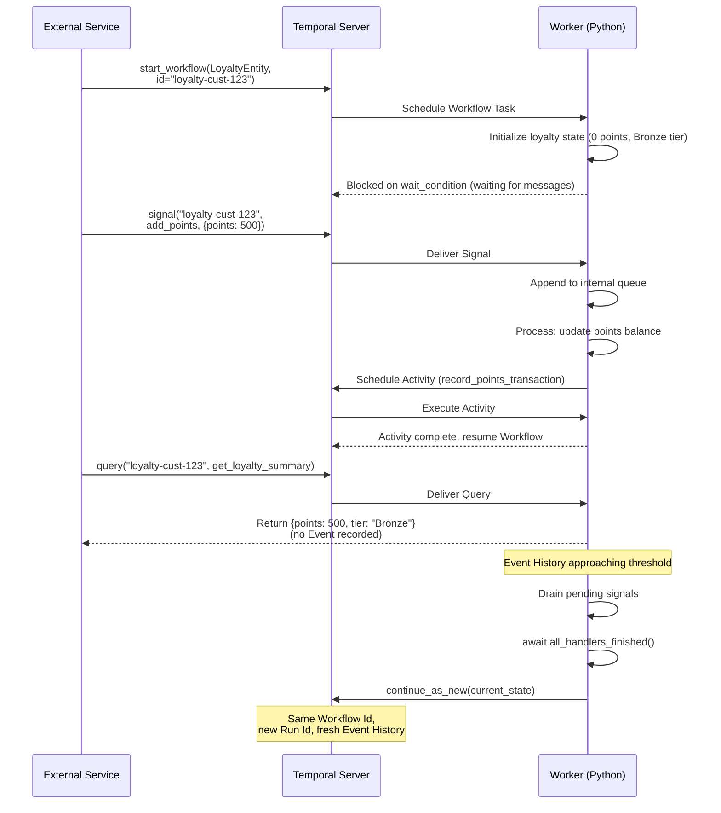
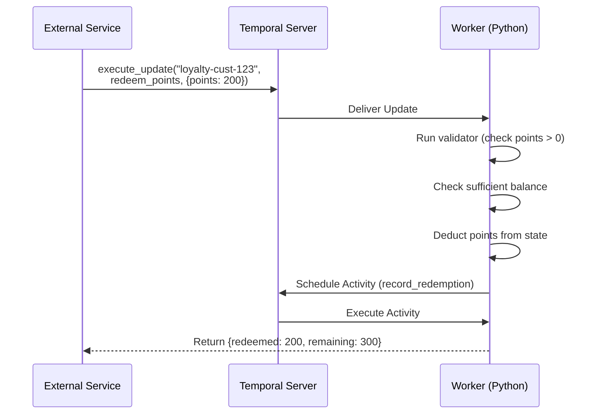

**by Cecil Phillip**

Loyalty programs look simple until you're running them at scale: points have to accrue correctly across every purchase, tiers have to recalculate at the right moment, redemptions have to be consistent, and all of it has to hold up across years of customer interactions. This guide shows how to give each customer their own dedicated, durable account — one that holds state, enforces business rules, responds to purchases and redemptions in real time, and never needs a cron job to stay current.

## Problem statement

Every customer in a loyalty program is their own entity. Their points accumulate across purchases, their tier changes when they hit thresholds, and their redemptions need to be validated and applied without double-spending. Doing this with a shared database means locking, retry logic across services, and cron jobs that periodically recalculate who qualifies for what. When a points accrual succeeds in one service but the tier upgrade notification fails in another, you have an inconsistency that's difficult to detect and expensive to fix. The longer the customer relationship, the more chances there are for these gaps to accumulate.

## Solution

Each customer gets their own Workflow — a persistent, running process identified by their customer ID. It holds the account's points balance, tier status, and activity history in memory. When a purchase happens, a Signal adds the points. When a customer redeems at checkout, an Update validates and applies the redemption synchronously. When a mobile app needs to display the current balance, a Query reads the state without touching the database. Tier upgrades happen as part of normal business logic, not from a nightly job. The Workflow runs for as long as the customer relationship does — years if needed — and resets its internal history automatically to stay within platform limits.

## Outcomes

After working through this guide, you'll have a loyalty system where:

- **Each customer account is independent and durable**: state is held per-customer, survives infrastructure failures, and picks up exactly where it left off
- **Tier upgrades happen in real time**: business rules run in the Workflow itself, triggered by point accruals — no scheduler, no batch job
- **Redemptions are consistent**: synchronous Updates validate and apply changes atomically, with the response going back to the caller
- **In-memory Balance reads**: Queries read in-memory state without generating Events or hitting a database
- **The Workflow runs for the life of the customer**: Continue-As-New keeps history size in check so nothing needs to be migrated or restarted
- **Failures are isolated**: a notification failing doesn't roll back a point accrual; each concern fails independently

## Background and best practices

### What is an Entity Workflow?

Although "Workflow" is a Temporal SDK primitive, when we talk about an "entity workflow," we're describing an architectural pattern. An entity workflow represents something that persists over time — a customer, a device, an order, a bank account. Contrast this with a "process workflow," which has a definite end. The key distinction is that an entity is a thing, whereas a process workflow does a thing. An entity workflow has an indefinite lifetime and reacts to events as they arrive. In the loyalty context, the customer account is the entity: it exists as long as the customer relationship does, and it responds to purchases, redemptions, and status queries throughout that lifetime.

Entity Workflows share three defining characteristics:

- They run for an **indefinite duration**. You do not know at start time when or if they will complete.
- They **react to external messages** at any point in their lifecycle via Signals, Updates, and Queries.
- They **maintain mutable state** that evolves over time in response to those messages.

In the loyalty points use case, each customer has their own Entity Workflow. The Workflow holds the points balance and tier status. External services send Signals to add points after a purchase, send Updates to redeem points at checkout, and send Queries to display the current balance in a mobile app. The Workflow runs for as long as the customer account exists.

### How Entity Workflows differ from actors

The Entity Workflow pattern shares characteristics with the Actor Model: both receive messages, maintain state, and can create new instances. However, there is an important distinction. An entity **represents state** and responds to interactions. It is closer to a data cache than a process orchestrator. It holds and serves state, evaluates business rules against that state, and delegates side effects to Activities. An actor, by contrast, **takes actions**. It may write to databases, call external APIs, or send emails as part of its core behavior.

In this pattern, the loyalty Entity Workflow does not directly write to a database or send an email. When it needs a side effect, such as sending a tier upgrade notification, it delegates that work to an Activity. The Workflow itself remains a pure state container with business rules.

### Why Temporal is well suited for this pattern

Temporal provides several capabilities that make Entity Workflows practical:

- **Durable Timers**: A Workflow can sleep for hours, days, or months without consuming compute resources. The Timer is persisted by the Temporal Server; the Worker is freed to handle other tasks.
- **Message passing**: Signals, Queries, and Updates provide three distinct interaction patterns — fire-and-forget, read-only, and request-response — covering the full range of entity interactions.
- **Event History**: Every state transition is recorded in an append-only log, giving a complete audit trail for compliance and debugging.
- **Continue-As-New**: When the Event History approaches size limits, the Workflow resets itself with a fresh history while preserving current state, allowing Entity Workflows to run for years.
- **Deterministic replay**: If a Worker crashes, the Workflow resumes from its last known state by replaying the Event History — no state is lost and no external coordination is needed.

### Operational considerations

Before implementing this pattern, keep the following constraints in mind:

**Event History limits.** Temporal enforces a hard limit of 51,200 Events and 50 MB per Workflow Execution, with warnings starting around 10,000 Events. Each Signal generates approximately 4 Events; each Activity execution approximately 11. A loyalty entity processing 100 point accruals per day (each triggering one Activity) generates roughly 1,500 Events per day — plan your Continue-As-New threshold accordingly.

**Payload size limits.** Individual payloads for Workflow and Activity inputs and outputs are limited to 2 MB. If the serialized entity state approaches this limit, store large data externally and reference it by identifier.

**Workflow Determinism.** Activities can include non-deterministic code, but the Workflow itself must remain deterministic. Use `workflow.now()` instead of `datetime.now()`, `workflow.random()` instead of `random`, and `workflow.uuid4()` instead of `uuid.uuid4()`. All I/O must be performed in Activities.

**Signal delivery guarantees.** Temporal delivers Signals at least once. Include a deduplication key in Signal payloads and make your Signal processing logic idempotent.

## Target audience

The following roles are involved in this pattern:

- **Temporal Workflow and Activity developers**: Responsible for implementing the loyalty Entity Workflow, defining Activities, and writing client code to interact with the entity
- **Platform operators**: Responsible for deploying and managing Temporal Workers, configuring Task Queues, and monitoring Event History growth
- **Domain architects**: Responsible for deciding which loyalty business rules belong in the Workflow versus in Activities, and defining the message contracts for Signals, Updates, and Queries

This guide requires Python, a Temporal Worker, and either a local development server or Temporal Cloud.

## Prerequisites

### Required software and infrastructure

- Python 3.9 or later
- Temporal Python SDK (`temporalio`) version 1.7.0 or later (required for `@workflow.init`, `workflow.all_handlers_finished`, and Workflow Updates)
- A running Temporal Server, either via the [Temporal CLI](https://docs.temporal.io/cli) for local development or [Temporal Cloud](https://temporal.io/cloud) for production
- `pip` or `uv` for Python dependency management

### Resources and access privileges

- Temporal Cloud account with Namespace Admin role, or local development server access via `temporal server start-dev`
- Write access to your Worker deployment environment

### Required concepts

You should be familiar with the following before proceeding:

- [Temporal Workflows](https://docs.temporal.io/workflows): The durable, stateful functions that Temporal orchestrates
- [Temporal Activities](https://docs.temporal.io/activities): The functions that perform side effects such as API calls and database writes
- [Temporal Workers](https://docs.temporal.io/workers): The processes that host and execute Workflow and Activity code
- [Temporal Task Queues](https://docs.temporal.io/task-queues): The named queues that route work from the Temporal Server to Workers

## Architecture diagrams

The following diagrams illustrate how external services interact with a loyalty Entity Workflow through Signals, Updates, and Queries.

### Signal and Continue-As-New flow

This diagram shows how a client adds points to a customer's loyalty account via a Signal, and how the Workflow performs Continue-As-New when the Event History grows large.

**Narrative:**

1. An external service starts a loyalty Entity Workflow with a stable Workflow Id tied to the customer identifier, such as `loyalty-cust-123`.
2. The Temporal Server persists the start request and schedules a Workflow Task on the `loyalty-points-queue` Task Queue.
3. A Python Worker picks up the Task, initializes the loyalty state, and enters a wait loop.
4. Throughout the customer's lifetime, external services send Signals to add points, Updates to redeem points, and Queries to read the current balance and tier.
5. When the Event History approaches the suggested threshold, the Workflow serializes its current state and calls `continue_as_new`, starting a fresh Execution with the same Workflow Id.
6. When the customer account is closed, a shutdown Signal causes the Workflow to drain its queue, await all handlers, and complete.



### Update flow for point redemption

This diagram shows a synchronous Update interaction where a client redeems points and receives confirmation of the new balance.



## Implementation plan

This section walks you through building a complete customer loyalty Entity Workflow in Python. You will define the data model, implement the Workflow with Signal, Query, and Update handlers, write Activities for side effects, configure Continue-As-New, set up the Worker, and write client code to interact with the entity.

### Phase 1: Define the loyalty state and data models

Entity Workflows carry their current state as their primary input, which enables Continue-As-New to resume seamlessly. Use Python `dataclass` objects — they serialize cleanly with Temporal's default JSON converter and allow new fields with defaults without breaking existing Executions.

Create a file named `models.py` with the following content:

```python
# models.py
from dataclasses import dataclass, field
from enum import Enum


class LoyaltyTier(str, Enum):
    """Loyalty tiers based on lifetime points earned."""
    BRONZE = "Bronze"
    SILVER = "Silver"
    GOLD = "Gold"
    PLATINUM = "Platinum"


@dataclass
class PointsEvent:
    """A single points transaction to be processed by the entity."""
    event_id: str          # Unique identifier for idempotent processing
    points: int            # Positive for accrual, negative for redemption
    reason: str            # Human-readable description (e.g., "purchase", "signup_bonus")
    source: str = ""       # Originating service or channel


@dataclass
class LoyaltyState:
    """The complete state of a customer's loyalty account.

    This is the data that survives Continue-As-New transitions.
    Keep it small and serializable — well under the 2 MB payload limit.
    """
    customer_id: str
    points_balance: int = 0
    lifetime_points: int = 0
    tier: str = LoyaltyTier.BRONZE.value
    is_active: bool = True
    processed_event_ids: list[str] = field(default_factory=list)

    # Unprocessed events carried across Continue-As-New transitions
    pending_events: list[dict] = field(default_factory=list)


@dataclass
class LoyaltySummary:
    """Read-only view of the loyalty account returned by Queries."""
    customer_id: str
    points_balance: int
    lifetime_points: int
    tier: str
    is_active: bool


@dataclass
class RedemptionRequest:
    """Input for the redeem_points Update."""
    event_id: str       # Idempotency key for the redemption
    points: int         # Number of points to redeem (must be positive)
    reward: str         # What the points are being redeemed for


@dataclass
class RedemptionResult:
    """Output from the redeem_points Update."""
    redeemed: int
    remaining_balance: int
    reward: str
```

`LoyaltyState` holds only what's needed to reconstruct the entity after a Continue-As-New transition. `processed_event_ids` enables idempotent Signal processing — in production, limit this to a recent window (e.g. last 1,000 IDs) and rely on an external store for long-term deduplication. `pending_events` carries any Signals that arrived but weren't processed before the transition.

### Phase 2: Implement the Activities

Activities hold all non-deterministic code: database writes, API calls, and notifications. The Workflow stays a pure state container.

Create a file named `activities.py`:

```python
# activities.py
import logging

from temporalio import activity

logger = logging.getLogger(__name__)


@activity.defn
async def record_points_transaction(transaction: dict) -> bool:
    """Record a points transaction in the loyalty database.

    Must be idempotent: use event_id as the key to prevent duplicate records
    on retry. Example: INSERT ... ON CONFLICT (event_id) DO NOTHING.
    """
    activity.logger.info(
        "Recording points transaction for customer %s: %s points (%s)",
        transaction["customer_id"],
        transaction["points"],
        transaction["reason"],
    )
    # await db.execute("INSERT INTO points_transactions ... ON CONFLICT (event_id) DO NOTHING", ...)
    return True


@activity.defn
async def send_tier_change_notification(notification: dict) -> bool:
    """Send a notification when a customer's loyalty tier changes.

    Non-critical: if this Activity fails after all retries, the Workflow
    logs the failure and continues rather than terminating the account.
    """
    activity.logger.info(
        "Sending tier change notification to customer %s: %s -> %s",
        notification["customer_id"],
        notification["old_tier"],
        notification["new_tier"],
    )
    # await email_service.send(template="tier_change", to=..., context={...})
    return True


@activity.defn
async def record_redemption(redemption: dict) -> bool:
    """Record a points redemption in the loyalty database.

    Must be idempotent: use event_id as the key to prevent duplicate records
    on retry. Example: INSERT ... ON CONFLICT (event_id) DO NOTHING.
    """
    activity.logger.info(
        "Recording redemption for customer %s: %s points for %s",
        redemption["customer_id"],
        redemption["points"],
        redemption["reward"],
    )
    # await db.execute("INSERT INTO redemptions ... ON CONFLICT (event_id) DO NOTHING", ...)
    return True
```

Each Activity uses `@activity.defn` and `activity.logger` for context-aware logging. All three are idempotent by design: calling them twice with the same `event_id` produces the same result, which is essential because Temporal may retry Activities on failure.

### Phase 3: Implement the Entity Workflow

The Entity Workflow is the core of the pattern: it initializes state, waits for messages, processes them sequentially, and performs Continue-As-New when history grows large.

Create a file named `workflows.py`:

```python
# workflows.py
import asyncio
from collections import deque
from dataclasses import asdict
from datetime import timedelta

from temporalio import workflow
from temporalio.common import RetryPolicy
from temporalio.exceptions import ApplicationError

with workflow.unsafe.imports_passed_through():
    from activities import (
        record_points_transaction,
        record_redemption,
        send_tier_change_notification,
    )
    from models import (
        LoyaltyState,
        LoyaltySummary,
        LoyaltyTier,
        PointsEvent,
        RedemptionRequest,
        RedemptionResult,
    )


# Retry policy for database writes: retry transient failures with backoff
DB_RETRY_POLICY = RetryPolicy(
    initial_interval=timedelta(seconds=1),
    backoff_coefficient=2.0,
    maximum_interval=timedelta(seconds=30),
    maximum_attempts=10,
)

# Retry policy for notifications: more aggressive retry since these are non-critical
NOTIFICATION_RETRY_POLICY = RetryPolicy(
    initial_interval=timedelta(seconds=2),
    backoff_coefficient=2.0,
    maximum_interval=timedelta(minutes=1),
    maximum_attempts=5,
)


@workflow.defn
class LoyaltyEntityWorkflow:
    """Manages a single customer's loyalty account as a long-lived Entity Workflow.

    Each customer has their own instance identified by a stable Workflow Id
    (e.g. "loyalty-cust-123"). All side effects are delegated to Activities.
    """

    @workflow.init
    def __init__(self, state: LoyaltyState | None = None) -> None:
        """Initialize Workflow state.

        The @workflow.init decorator ensures this runs before any Signal
        or Update handler, preventing race conditions with Signal-with-Start.

        Args:
            state: Existing state from Continue-As-New, or None for a new account.
        """
        if state is not None:
            self._state = state
        else:
            # First start only (not Continue-As-New); customer_id set in run().
            self._state = LoyaltyState(customer_id="")

        # Signal queue: handlers append, main loop pops one at a time.
        self._pending_signals: deque[dict] = deque(self._state.pending_events)
        self._state.pending_events = []  # Clear after restoring

        self._shutdown_requested: bool = False

    @workflow.run
    async def run(self, state: LoyaltyState | None = None) -> LoyaltyState:
        """Main entity loop: wait for messages, process them, and Continue-As-New when needed."""
        if state is None:
            # First start: derive customer_id from the Workflow Id convention.
            self._state.customer_id = workflow.info().workflow_id.replace("loyalty-", "", 1)

        workflow.logger.info(
            "Loyalty entity started for customer %s (tier: %s, balance: %d)",
            self._state.customer_id,
            self._state.tier,
            self._state.points_balance,
        )

        while not self._shutdown_requested:
            # Block until a Signal arrives, shutdown is requested,
            # CAN is suggested, or 24 hours pass.
            await workflow.wait_condition(
                lambda: (
                    bool(self._pending_signals)
                    or self._shutdown_requested
                    or workflow.info().is_continue_as_new_suggested()
                ),
                timeout=timedelta(hours=24),
            )

            # Process all queued Signals sequentially
            while self._pending_signals:
                event_data = self._pending_signals.popleft()
                await self._process_points_event(event_data)

                # Check if we should Continue-As-New after each event
                if workflow.info().is_continue_as_new_suggested():
                    break

            # Exit if shutdown was requested
            if self._shutdown_requested:
                break

            # Trigger Continue-As-New when Temporal suggests it
            if workflow.info().is_continue_as_new_suggested():
                await self._do_continue_as_new()

        # Wait for all in-flight handlers before completing.
        await workflow.wait_condition(workflow.all_handlers_finished)

        workflow.logger.info(
            "Loyalty entity shutting down for customer %s (final balance: %d)",
            self._state.customer_id,
            self._state.points_balance,
        )
        return self._state

    @workflow.signal
    def add_points(self, event: dict) -> None:
        """Enqueue a points accrual event for processing in the main loop.

        Signal handlers must be synchronous — they only append to the queue.
        All processing happens in the main loop to ensure sequential execution.

        Args:
            event: dict with keys event_id, points, reason, and optionally source.
        """
        self._pending_signals.append(event)

    @workflow.signal
    def shutdown(self) -> None:
        """Signal the entity to drain pending events and terminate gracefully."""
        self._shutdown_requested = True

    # ------------------------------------------------------------------
    # Query handlers
    # ------------------------------------------------------------------

    @workflow.query
    def get_loyalty_summary(self) -> LoyaltySummary:
        """Return a read-only summary (no Events generated, safe at high frequency)."""
        return LoyaltySummary(
            customer_id=self._state.customer_id,
            points_balance=self._state.points_balance,
            lifetime_points=self._state.lifetime_points,
            tier=self._state.tier,
            is_active=self._state.is_active,
        )

    @workflow.query
    def get_points_balance(self) -> int:
        """Return the current points balance."""
        return self._state.points_balance

    @workflow.query
    def get_tier(self) -> str:
        """Return the current loyalty tier."""
        return self._state.tier

    @workflow.update
    async def redeem_points(self, request: RedemptionRequest) -> RedemptionResult:
        """Redeem loyalty points for a reward.

        Blocks until the Update completes and the caller receives the result,
        making it ideal for checkout flows that need confirmed point deduction.

        Raises:
            ApplicationError: If the account is inactive or has insufficient points.
        """
        if not self._state.is_active:
            raise ApplicationError(
                "Cannot redeem points: account is inactive",
                type="InactiveAccount",
                non_retryable=True,
            )

        if request.points > self._state.points_balance:
            raise ApplicationError(
                f"Insufficient points: requested {request.points}, "
                f"available {self._state.points_balance}",
                type="InsufficientPoints",
                non_retryable=True,
            )

        # Idempotency: return without re-processing if already applied.
        if request.event_id in self._state.processed_event_ids:
            return RedemptionResult(
                redeemed=request.points,
                remaining_balance=self._state.points_balance,
                reward=request.reward,
            )

        self._state.points_balance -= request.points

        # Record the redemption via an Activity (idempotent on event_id).
        await workflow.execute_activity(
            record_redemption,
            {
                "customer_id": self._state.customer_id,
                "event_id": request.event_id,
                "points": request.points,
                "reward": request.reward,
            },
            start_to_close_timeout=timedelta(seconds=30),
            retry_policy=DB_RETRY_POLICY,
        )

        # Track this event as processed.
        self._state.processed_event_ids.append(request.event_id)
        self._trim_processed_ids()

        workflow.logger.info(
            "Customer %s redeemed %d points for %s (remaining: %d)",
            self._state.customer_id,
            request.points,
            request.reward,
            self._state.points_balance,
        )

        return RedemptionResult(
            redeemed=request.points,
            remaining_balance=self._state.points_balance,
            reward=request.reward,
        )

    @redeem_points.validator
    def validate_redemption(self, request: RedemptionRequest) -> None:
        """Run before the Update is accepted into Event History. Rejection here writes no Event."""
        if request.points <= 0:
            raise ApplicationError(
                "Redemption amount must be a positive number",
                type="ValidationError",
            )

    async def _process_points_event(self, event_data: dict) -> None:
        """Process a single points event: check for duplicates, record the
        transaction via an Activity, update in-memory state, and evaluate tier.
        """
        event_id = event_data.get("event_id", "")
        points = event_data.get("points", 0)
        reason = event_data.get("reason", "unknown")

        if event_id and event_id in self._state.processed_event_ids:
            workflow.logger.info(
                "Skipping duplicate event %s for customer %s",
                event_id,
                self._state.customer_id,
            )
            return

        # Record the transaction BEFORE updating in-memory state to avoid
        # double-counting if the Activity retries.
        await workflow.execute_activity(
            record_points_transaction,
            {
                "customer_id": self._state.customer_id,
                "event_id": event_id,
                "points": points,
                "reason": reason,
            },
            start_to_close_timeout=timedelta(seconds=30),
            retry_policy=DB_RETRY_POLICY,
        )

        # Update state after Activity confirms success.
        self._state.points_balance += points
        if points > 0:
            self._state.lifetime_points += points

        if event_id:
            self._state.processed_event_ids.append(event_id)
            self._trim_processed_ids()

        workflow.logger.info(
            "Processed event %s for customer %s: %+d points (balance: %d)",
            event_id,
            self._state.customer_id,
            points,
            self._state.points_balance,
        )

        await self._evaluate_tier()

    async def _evaluate_tier(self) -> None:
        """Recalculate tier; send notification if it changed (non-critical)."""
        new_tier = self._calculate_tier(self._state.lifetime_points)

        if new_tier != self._state.tier:
            old_tier = self._state.tier
            self._state.tier = new_tier

            workflow.logger.info(
                "Customer %s tier changed: %s -> %s",
                self._state.customer_id,
                old_tier,
                new_tier,
            )

            # Notification is non-critical — log and continue on failure.
            try:
                await workflow.execute_activity(
                    send_tier_change_notification,
                    {
                        "customer_id": self._state.customer_id,
                        "old_tier": old_tier,
                        "new_tier": new_tier,
                    },
                    start_to_close_timeout=timedelta(seconds=30),
                    retry_policy=NOTIFICATION_RETRY_POLICY,
                )
            except Exception:
                workflow.logger.warning(
                    "Failed to send tier change notification for customer %s; "
                    "continuing entity lifecycle",
                    self._state.customer_id,
                )

    def _calculate_tier(self, lifetime_points: int) -> str:
        """Determine tier from lifetime points — pure logic, no side effects."""
        if lifetime_points >= 10_000:
            return LoyaltyTier.PLATINUM.value
        if lifetime_points >= 5_000:
            return LoyaltyTier.GOLD.value
        if lifetime_points >= 1_000:
            return LoyaltyTier.SILVER.value
        return LoyaltyTier.BRONZE.value

    def _trim_processed_ids(self) -> None:
        """Keep only the most recent 1,000 processed event IDs to prevent unbounded growth."""
        max_ids = 1_000
        if len(self._state.processed_event_ids) > max_ids:
            self._state.processed_event_ids = self._state.processed_event_ids[
                -max_ids:
            ]

    async def _do_continue_as_new(self) -> None:
        """Perform Continue-As-New: drain excess pending signals, serialize
        remaining unprocessed signals into state, wait for all handlers to
        finish, then call continue_as_new with the current state.
        """
        # Drain excess pending signals before serializing into the CAN input.
        # Keeps the LoyaltyState payload well under the 2 MB limit.
        MAX_PENDING_CARRY = 500
        while len(self._pending_signals) > MAX_PENDING_CARRY:
            event_data = self._pending_signals.popleft()
            await self._process_points_event(event_data)

        # Carry remaining unprocessed Signals to the next Execution.
        self._state.pending_events = list(self._pending_signals)

        # Wait for async handlers to finish before transitioning.
        await workflow.wait_condition(workflow.all_handlers_finished)

        workflow.logger.info(
            "Continuing as new for customer %s (balance: %d, pending: %d)",
            self._state.customer_id,
            self._state.points_balance,
            len(self._state.pending_events),
        )

        workflow.continue_as_new(self._state)
```

Two design decisions in this Workflow deserve extra attention:

**Activity call inside an Update handler.** The `redeem_points` Update calls `record_redemption` directly via `await` rather than enqueuing it for the main loop. The Python and TypeScript SDKs support `async` Update handlers, making this safe. The trade-off keeps redemption logic self-contained and returns the confirmed result to the caller in a single round trip. It is safe here because `record_redemption` is idempotent — a replay detects the duplicate `event_id` and returns without creating a second record. If you are using the Java SDK, Update handlers cannot be `async`; enqueue the work for the main loop instead.

**Continue-As-New payload size.** Unprocessed Signals are serialized into the CAN input, which must stay under the 2 MB payload limit. The `MAX_PENDING_CARRY` guard drains the queue to a safe size before serializing. Lower the limit if your Signal payloads are large. If the guard fires frequently, Signals are arriving faster than Workers can process them — scale your Worker pool.

### Phase 4: Configure and run the Worker

The Worker hosts your Workflow and Activity code, polls a Task Queue, and executes work.

Create a file named `worker.py`:

```python
# worker.py
import asyncio
import concurrent.futures
import logging

from temporalio.client import Client
from temporalio.worker import Worker

from activities import (
    record_points_transaction,
    record_redemption,
    send_tier_change_notification,
)
from workflows import LoyaltyEntityWorkflow

logging.basicConfig(level=logging.INFO)
logger = logging.getLogger(__name__)

TASK_QUEUE = "loyalty-points-queue"
TEMPORAL_ADDRESS = "localhost:7233"
TEMPORAL_NAMESPACE = "default"


async def main() -> None:
    """Start a Worker that hosts the LoyaltyEntityWorkflow and its Activities."""
    client = await Client.connect(
        TEMPORAL_ADDRESS,
        namespace=TEMPORAL_NAMESPACE,
    )

    logger.info("Starting loyalty Worker on task queue: %s", TASK_QUEUE)

    with concurrent.futures.ThreadPoolExecutor(max_workers=50) as activity_executor:
        worker = Worker(
            client,
            task_queue=TASK_QUEUE,
            workflows=[LoyaltyEntityWorkflow],
            activities=[
                record_points_transaction,
                record_redemption,
                send_tier_change_notification,
            ],
            activity_executor=activity_executor,
            max_concurrent_workflow_tasks=200,
            max_concurrent_activities=100,
        )
        await worker.run()


if __name__ == "__main__":
    asyncio.run(main())
```

The Worker registers the `LoyaltyEntityWorkflow` class and all three Activity functions on the `loyalty-points-queue` Task Queue. Setting `max_concurrent_workflow_tasks` higher than the default makes sense here because Entity Workflows spend most of their time blocked on `wait_condition`, so one Worker can host many concurrent instances.

To start the Worker, run:

```
python worker.py
```

The Worker connects to the Temporal Server and begins polling. It will continue running until you stop the process.

### Phase 5: Write client code to interact with the entity

The client code starts Entity Workflows, sends Signals, executes Updates, and runs Queries. In production this typically lives in an API server or background service.

Create a file named `starter.py`:

```python
# starter.py
import asyncio

from temporalio.client import Client, WorkflowUpdateFailedError

from models import RedemptionRequest
from workflows import LoyaltyEntityWorkflow

TASK_QUEUE = "loyalty-points-queue"
TEMPORAL_ADDRESS = "localhost:7233"
TEMPORAL_NAMESPACE = "default"


async def main() -> None:
    client = await Client.connect(
        TEMPORAL_ADDRESS,
        namespace=TEMPORAL_NAMESPACE,
    )

    customer_id = "cust-42"
    workflow_id = f"loyalty-{customer_id}"

    # Start the entity — Workflow Id is stable per customer.
    # If it's already running, start_workflow raises WorkflowAlreadyStartedError.
    handle = await client.start_workflow(
        LoyaltyEntityWorkflow.run,
        id=workflow_id,
        task_queue=TASK_QUEUE,
        # No initial state — the Workflow derives customer_id from the Workflow Id.
    )
    print(f"Started loyalty entity: {workflow_id}")

    # Signals are fire-and-forget: the call returns once the Server accepts them.
    await handle.signal(
        LoyaltyEntityWorkflow.add_points,
        {
            "event_id": "evt-001",
            "points": 500,
            "reason": "initial_purchase",
            "source": "ecommerce",
        },
    )
    print("Sent Signal: +500 points (initial_purchase)")

    await handle.signal(
        LoyaltyEntityWorkflow.add_points,
        {
            "event_id": "evt-002",
            "points": 750,
            "reason": "referral_bonus",
            "source": "referral_service",
        },
    )
    print("Sent Signal: +750 points (referral_bonus)")

    # Allow time for the Worker to process the Signals
    await asyncio.sleep(2)

    # Queries are synchronous and read-only — no Events generated.
    summary = await handle.query(LoyaltyEntityWorkflow.get_loyalty_summary)
    print(
        f"Query result: {summary.points_balance} points, "
        f"tier={summary.tier}, lifetime={summary.lifetime_points}"
    )

    # Updates block until the Workflow processes them and returns a result —
    # ideal for checkout where the caller needs confirmation.
    try:
        result = await handle.execute_update(
            LoyaltyEntityWorkflow.redeem_points,
            RedemptionRequest(
                event_id="redeem-001",
                points=200,
                reward="free_shipping",
            ),
        )
        print(
            f"Redemption successful: {result.redeemed} points for "
            f"{result.reward}, remaining: {result.remaining_balance}"
        )
    except WorkflowUpdateFailedError as e:
        print(f"Redemption failed: {e}")

    # Query again to confirm the updated balance.
    balance = await handle.query(LoyaltyEntityWorkflow.get_points_balance)
    tier = await handle.query(LoyaltyEntityWorkflow.get_tier)
    print(f"After redemption: balance={balance}, tier={tier}")

    print("\nSending batch of points events...")
    for i in range(10):
        await handle.signal(
            LoyaltyEntityWorkflow.add_points,
            {
                "event_id": f"batch-{i:04d}",
                "points": 100,
                "reason": f"batch_purchase_{i}",
            },
        )
    print("Sent 10 batch events (+1000 points total)")

    await asyncio.sleep(3)

    summary = await handle.query(LoyaltyEntityWorkflow.get_loyalty_summary)
    print(
        f"Final state: {summary.points_balance} points, "
        f"tier={summary.tier}, lifetime={summary.lifetime_points}"
    )

    # Uncomment to shut down the entity gracefully.
    # await handle.signal(LoyaltyEntityWorkflow.shutdown)
    # print("Sent shutdown Signal")


if __name__ == "__main__":
    asyncio.run(main())
```

This client code demonstrates the three interaction patterns:

- **Signals** (`add_points`): Fire-and-forget; returns immediately after the Server accepts the Signal.
- **Queries** (`get_loyalty_summary`, `get_points_balance`, `get_tier`): Read-only, no Events generated — safe at high frequency.
- **Updates** (`redeem_points`): Synchronous request-response; the caller blocks until the Workflow returns a confirmed result.

### Phase 6: Handle Continue-As-New for indefinite execution

Continue-As-New allows an Entity Workflow to run for years without unbounded history. When `workflow.info().is_continue_as_new_suggested()` returns `True`, the history is approaching the suggested threshold (~4,096 Events).

The `LoyaltyEntityWorkflow` checks this flag in two places:

1. **In the main wait condition.** The Workflow wakes up even if no Signals are pending, handling the case where history has grown during idle periods.
2. **After processing each event.** Avoids processing an entire batch before detecting an oversized history.

The `_do_continue_as_new` method handles the transition in three steps:

1. **Unprocessed Signals are preserved.** Any Signals still in the queue are serialized into `pending_events` on the state. The next Execution restores them in its constructor.
2. **All handlers complete.** `workflow.all_handlers_finished` ensures any in-flight Update handlers finish before the transition — cancelling them mid-execution would lose data.
3. **The transition occurs.** `workflow.continue_as_new(self._state)` ends the current Execution and starts a new one with the same Workflow Id, a new Run Id, and a fresh Event History.

After the transition, clients continue interacting with the same Workflow Id. Temporal automatically routes Signals, Queries, and Updates to the latest Run. Do not specify a Run Id when obtaining a Workflow handle, or your interactions will target a stale Execution.

### Phase 7: Ensure Workflow determinism

Temporal replays Event History to resume a Workflow after a crash. The code must produce the same sequence of Commands on every replay.

The Python SDK sandbox blocks most non-deterministic operations, but you must still follow these rules:

| Do not use | Use instead | Reason |
|---|---|---|
| `datetime.now()` | `workflow.now()` | Returns the same value during replay |
| `random.random()` | `workflow.random().random()` | Seeded deterministically by the SDK |
| `uuid.uuid4()` | `workflow.uuid4()` | Produces the same value during replay |
| `time.sleep()` | `asyncio.sleep()` or `workflow.sleep()` | Converts to a Durable Timer |
| `print()` | `workflow.logger.info()` | Replay-safe; only logs on initial execution |
| Direct I/O (HTTP, file reads) | Activities | All I/O must happen in Activities |

**Testing for determinism.** Use the `Replayer` to verify code changes against a saved Event History:

```python
# test_determinism.py
import asyncio

from temporalio.client import WorkflowHistory
from temporalio.worker import Replayer

from workflows import LoyaltyEntityWorkflow


async def test_replay_compatibility() -> None:
    """Replay a saved Event History against the current code.

    Export history first:
        temporal workflow show --workflow-id loyalty-cust-42 --output json > history.json
    """
    replayer = Replayer(workflows=[LoyaltyEntityWorkflow])

    with open("history.json") as f:
        history = WorkflowHistory.from_json("loyalty-cust-42", f.read())

    # This raises NondeterminismError if the code is incompatible
    await replayer.replay_workflow(history)
    print("Replay succeeded: code is compatible with saved history")


if __name__ == "__main__":
    asyncio.run(test_replay_compatibility())
```

Run this test as part of your continuous integration pipeline before deploying Workflow code changes. If the replay fails with a `NondeterminismError`, the code change is not backward-compatible. Use Worker Versioning (see Phase 8) to deploy the change safely.

### (Optional) Phase 8: Manage Workflow evolution with Worker Versioning

Entity Workflows are the hardest case for code evolution: a loyalty account can span years and dozens of deployments. Any change that alters the sequence of Commands the Workflow generates causes a `NondeterminismError` during replay for in-progress Executions.

[Worker Versioning](https://docs.temporal.io/production-deployment/worker-deployments/worker-versioning) is the recommended solution: run multiple builds simultaneously, route each Execution to the build it started on, and drain old builds without any code-level branching.

> Worker Versioning requires Python SDK v1.11.0 or later, Temporal Server v1.29.1 or later, and Temporal CLI v1.4.1 or later.

#### Why PINNED is the right choice for Entity Workflows

`PINNED` is the canonical versioning behavior for Entity Workflows: each execution runs entirely on the Worker Deployment Version where it started. At a Continue-As-New boundary the Workflow can optionally upgrade to the latest build.

| Behavior | Guarantee | When to use |
|----------|-----------|-------------|
| `PINNED` | Each execution completes on the version where it started | Long-lived entities; no patching needed within a run |
| `AUTO_UPGRADE` | Moves to the latest version automatically | Short Workflows that complete before the next deploy |

#### Step 1: Annotate the Workflow

Add `versioning_behavior=VersioningBehavior.PINNED` to `@workflow.defn` in `workflows.py`:

```python
from temporalio.common import VersioningBehavior

@workflow.defn(versioning_behavior=VersioningBehavior.PINNED)
class LoyaltyEntityWorkflow:
    ...
```

#### Step 2: Configure the Worker

Update `worker.py` to declare the deployment name and build ID:

```python
import os
from temporalio.worker import Worker, WorkerDeploymentOptions

# BUILD_ID should be injected by CI/CD (e.g. a Git SHA). All Workers from the same build must match.
BUILD_ID = os.environ["BUILD_ID"]
DEPLOYMENT_NAME = os.getenv("TEMPORAL_DEPLOYMENT", "loyalty-points")

async def main() -> None:
    client = await Client.connect(TEMPORAL_ADDRESS, namespace=TEMPORAL_NAMESPACE)

    with concurrent.futures.ThreadPoolExecutor(max_workers=50) as activity_executor:
        worker = Worker(
            client,
            task_queue=TASK_QUEUE,
            workflows=[LoyaltyEntityWorkflow],
            activities=[
                record_points_transaction,
                record_redemption,
                send_tier_change_notification,
            ],
            activity_executor=activity_executor,
            worker_deployment_options=WorkerDeploymentOptions(
                deployment_name=DEPLOYMENT_NAME,
                build_id=BUILD_ID,
                use_worker_versioning=True,
            ),
            max_concurrent_workflow_tasks=200,
            max_concurrent_activities=100,
        )
        await worker.run()
```

#### Step 3: Roll out changes with the CLI

**Initial deployment** — start the first versioned build and make it Current:

```bash
BUILD_ID=1.0.0 python worker.py &

temporal worker deployment set-current-version \
  --deployment-name "loyalty-points" \
  --build-id "1.0.0"
```

**Deploying a change** — run the new build alongside the old one, ramp gradually, then promote:

```bash
# Start Workers on the new build
BUILD_ID=1.1.0 python worker.py &

# Canary: send 10% of new Workflows to the new build
temporal worker deployment set-ramping-version \
  --deployment-name "loyalty-points" \
  --build-id "1.1.0" \
  --percentage 10

# Promote to Current once satisfied
temporal worker deployment set-current-version \
  --deployment-name "loyalty-points" \
  --build-id "1.1.0"
```

Old `1.0.0` Workers keep running, draining their pinned Executions automatically.

Check drain status before stopping old Workers:

```bash
temporal worker deployment describe-version \
  --deployment-name "loyalty-points" \
  --build-id "1.0.0"
# DrainageStatus: drained  ← safe to shut down
```

#### Upgrading at the Continue-As-New boundary

Because `LoyaltyEntityWorkflow` already calls `workflow.continue_as_new()` to manage Event History, you can upgrade long-running Executions to a new build at that boundary — without patching.

In `_do_continue_as_new`, check `get_target_worker_deployment_version_changed()` before transitioning:

```python
from temporalio.workflow import ContinueAsNewVersioningBehavior

async def _do_continue_as_new(self) -> None:
    MAX_PENDING_CARRY = 500
    while len(self._pending_signals) > MAX_PENDING_CARRY:
        event_data = self._pending_signals.popleft()
        await self._process_points_event(event_data)

    self._state.pending_events = list(self._pending_signals)
    await workflow.wait_condition(workflow.all_handlers_finished)

    can_options = {}
    if workflow.info().get_target_worker_deployment_version_changed():
        # Newer build available — upgrade on this CaN boundary.
        can_options["versioning_behavior"] = ContinueAsNewVersioningBehaviorAutoUpgrade

    workflow.continue_as_new(self._state, **can_options)
```

When `get_target_worker_deployment_version_changed()` is `False`, the CaN run stays on the same pinned build. This flag is refreshed after each Workflow Task, so upgrades are picked up on the next natural CaN boundary.

## Outcomes

You've built a loyalty account system where each customer is an independent, self-managing process. Points accrue consistently, tier upgrades happen in real time, redemptions can't be double-spent, and the account keeps running through deployments, restarts, and schema changes. The approach isn't specific to loyalty programs — any domain object with a long lifecycle and ongoing interactions can be modeled the same way: user profiles, IoT devices, subscription accounts, open orders. The loyalty implementation here gives you the full blueprint.

## Related resources

- [Temporal Python SDK documentation](https://docs.temporal.io/develop/python)
- [Temporal Python SDK API Reference](https://python.temporal.io)
- [Message Passing — Signals, Queries, Updates](https://docs.temporal.io/develop/python/message-passing)
- [Continue-As-New](https://docs.temporal.io/develop/python/continue-as-new)
- [Worker Versioning](https://docs.temporal.io/production-deployment/worker-deployments/worker-versioning)
- [Failure Detection — Timeouts, Activity Heartbeating, and Retry Policies](https://docs.temporal.io/develop/python/failure-detection)
- [Temporal Python SDK samples](https://github.com/temporalio/samples-python)

<!-- - [Companion article: Actor Workflow Pattern](ActorWorkflow_PlayerSessions.md) — covers the related Actor Workflow pattern for autonomous agents that take action -->