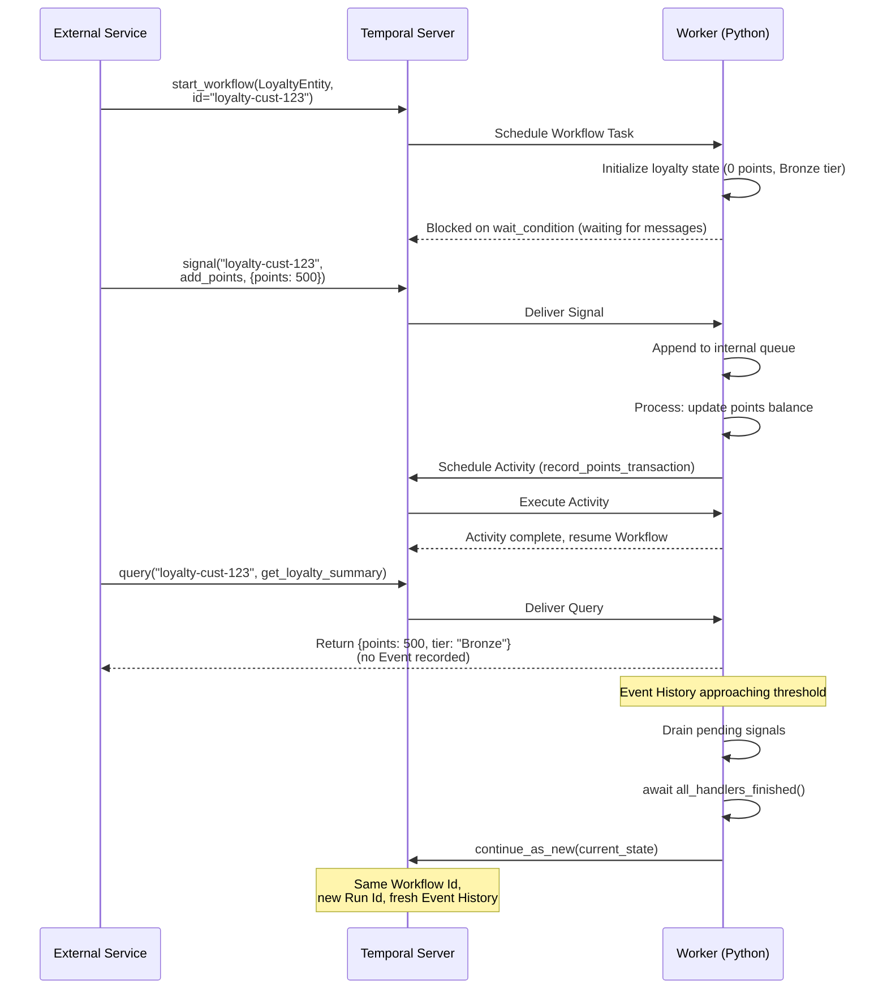
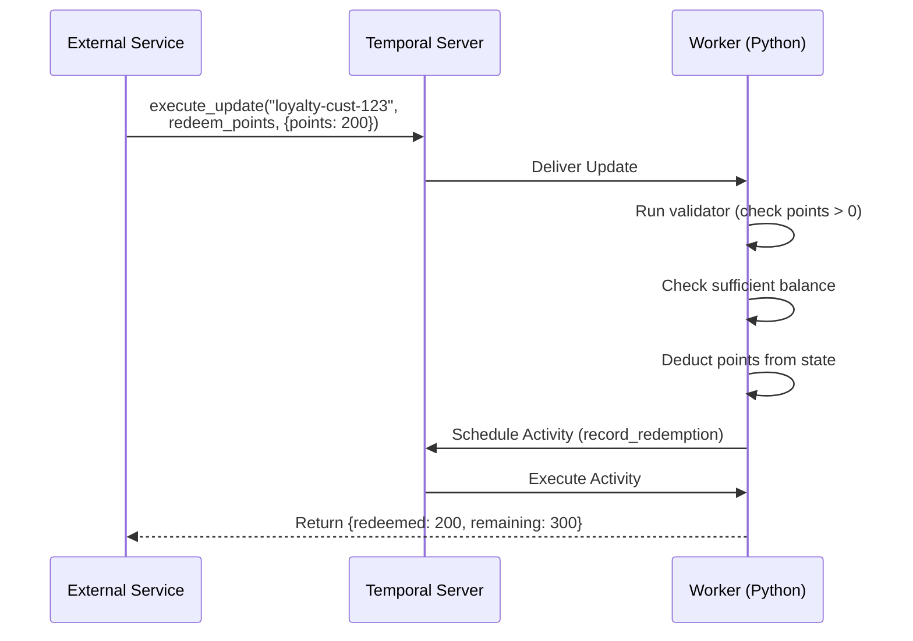

**by Cecil Phillip**

Customer loyalty programs can be great for your business, but they’re notoriously difficult to scale. Points have to accrue correctly across every purchase, tiers have to recalculate at the right moment, redemptions have to be consistent, and all of it has to hold up across years of customer interactions. Doing this with a shared database means locking, retry logic across services, and cron jobs that periodically recalculate who qualifies for what. 

A scalable solution is to give each customer their own dedicated, durable account — one that holds state, enforces business rules, responds to purchases and redemptions in real time, and never needs a cron job to stay current. In Temporal terms, each customer has a Workflow: a persistent, running process identified by their customer ID. It holds the account's points balance, tier status, and activity history in memory. When a purchase happens, a Signal adds the points. When a customer redeems at checkout, an Update validates and applies the redemption synchronously. When a mobile app needs to display the current balance, a Query reads the state without touching the database. Tier upgrades happen as part of normal business logic, not from a nightly job. The Workflow runs for as long as the customer relationship does — years if needed — and resets its internal history automatically to stay within platform limits.

With this guide, you'll build a loyalty system where:

* **Each customer account is independent and durable:** state is held per-customer, survives infrastructure failures, and picks up exactly where it left off
* **Tier upgrades happen in real time:** business rules run in the Workflow itself, triggered by point accruals — no scheduler, no batch job
* **Redemptions are consistent:** synchronous Updates validate and apply changes atomically, with the response going back to the caller
* **In-memory Balance reads:** Queries read in-memory state without generating Events or hitting a database
* **The Workflow runs for the life of the customer:** Continue-As-New keeps history size in check so nothing needs to be migrated or restarted
* **Failures are isolated:** a notification failing doesn't roll back a point accrual; each concern fails independently


## Background and best practices

Although "Workflow" is a Temporal SDK primitive, when we talk about an "entity workflow," we're describing an architectural pattern. An entity workflow represents something that persists over time — a customer, a device, an order, a bank account. Contrast this with a "process workflow," which has a definite end. The key distinction is that an entity is a thing, whereas a process workflow does a thing. For more information about the Entity Workflow pattern, see [Entity Workflow Pattern](/design-patterns/entity-workflow).

In the loyalty points use case, each customer has their own Entity Workflow. The Workflow holds the points balance and tier status. External services send Signals to add points after a purchase, send Updates to redeem points at checkout, and send Queries to display the current balance in a mobile app. The Workflow runs for as long as the customer account exists.

## Prerequisites

This guide requires Python, a Temporal Worker, and either a local development server or Temporal Cloud.

### Required software and infrastructure

- Python 3.9 or later
- Temporal Python SDK (`temporalio`) version 1.7.0 or later (required for `@workflow.init`, `workflow.all_handlers_finished`, and Workflow Updates)
- A running Temporal Server, either via the [Temporal CLI](https://docs.temporal.io/cli) for local development or [Temporal Cloud](https://temporal.io/cloud) for production
- `pip` or `uv` for Python dependency management

### Resources and access privileges

- Temporal Cloud account with Namespace Admin role, or local development server access via `temporal server start-dev`
- Write access to your Worker deployment environment

### Required concepts

You should be familiar with the following before proceeding:

- [Temporal Workflows](https://docs.temporal.io/workflows): The durable, stateful functions that Temporal orchestrates
- [Temporal Activities](https://docs.temporal.io/activities): The functions that perform side effects such as API calls and database writes
- [Temporal Workers](https://docs.temporal.io/workers): The processes that host and execute Workflow and Activity code
- [Temporal Task Queues](https://docs.temporal.io/task-queues): The named queues that route work from the Temporal Server to Workers

### Operational considerations

Before implementing this pattern, keep the following constraints in mind:

**Event History limits.** Temporal enforces a hard limit of 51,200 Events and 50 MB per Workflow Execution, with warnings starting around 10,000 Events. Each Signal generates approximately 4 Events; each Activity execution approximately 11. A loyalty entity processing 100 point accruals per day (each triggering one Activity) generates roughly 1,500 Events per day — plan your Continue-As-New threshold accordingly.

**Payload size limits.** Individual payloads for Workflow and Activity inputs and outputs are limited to 2 MB. If the serialized entity state approaches this limit, store large data externally and reference it by identifier.

**Workflow Determinism.** Activities can include non-deterministic code, but the Workflow itself must remain deterministic. Use `workflow.now()` instead of `datetime.now()`, `workflow.random()` instead of `random`, and `workflow.uuid4()` instead of `uuid.uuid4()`. All I/O must be performed in Activities.

**Signal delivery guarantees.** Temporal delivers Signals at least once. Include a deduplication key in Signal payloads and make your Signal processing logic idempotent.

## Architecture diagrams

The following diagrams illustrate how external services interact with a loyalty Entity Workflow through Signals, Updates, and Queries.

### Signal and Continue-As-New flow

This diagram shows how a client adds points to a customer's loyalty account via a Signal, and how the Workflow performs Continue-As-New when the Event History grows large.

**Narrative:**

1. An external service starts a loyalty Entity Workflow with a stable Workflow Id tied to the customer identifier, such as `loyalty-cust-123`.
2. The Temporal Server persists the start request and schedules a Workflow Task on the `loyalty-points-queue` Task Queue.
3. A Python Worker picks up the Task, initializes the loyalty state, and enters a wait loop.
4. Throughout the customer's lifetime, external services send Signals to add points, Updates to redeem points, and Queries to read the current balance and tier.
5. When the Event History approaches the suggested threshold, the Workflow serializes its current state and calls `continue_as_new`, starting a fresh Execution with the same Workflow Id.
6. When the customer account is closed, a shutdown Signal causes the Workflow to drain its queue, await all handlers, and complete.


```mermaid
sequenceDiagram
    participant Client as External Service
    participant TS as Temporal Server
    participant W as Worker (Python)

    Client->>TS: start_workflow(LoyaltyEntity,<br/>id="loyalty-cust-123")
    TS->>W: Schedule Workflow Task
    W->>W: Initialize loyalty state (0 points, Bronze tier)
    W-->>TS: Blocked on wait_condition (waiting for messages)

    Client->>TS: signal("loyalty-cust-123",<br/>add_points, {points: 500})
    TS->>W: Deliver Signal
    W->>W: Append to internal queue
    W->>W: Process: update points balance
    W->>TS: Schedule Activity (record_points_transaction)
    TS->>W: Execute Activity
    W-->>TS: Activity complete, resume Workflow

    Client->>TS: query("loyalty-cust-123", get_loyalty_summary)
    TS->>W: Deliver Query
    W-->>Client: Return {points: 500, tier: "Bronze"}<br/>(no Event recorded)

    Note over W: Event History approaching threshold
    W->>W: Drain pending signals
    W->>W: await all_handlers_finished()
    W->>TS: continue_as_new(current_state)
    Note over TS: Same Workflow Id,<br/>new Run Id, fresh Event History
```

### Update flow for point redemption

This diagram shows a synchronous Update interaction where a client redeems points and receives confirmation of the new balance.


```mermaid
sequenceDiagram
    participant Client as External Service
    participant TS as Temporal Server
    participant W as Worker (Python)

    Client->>TS: execute_update("loyalty-cust-123",<br/>redeem_points, {points: 200})
    TS->>W: Deliver Update
    W->>W: Run validator (check points > 0)
    W->>W: Check sufficient balance
    W->>W: Deduct points from state
    W->>TS: Schedule Activity (record_redemption)
    TS->>W: Execute Activity
    W-->>Client: Return {redeemed: 200, remaining: 300}
```

## Step 1: Define the loyalty state and data models

Entity Workflows carry their current state as their primary input, which enables Continue-As-New to resume seamlessly. Use Python `dataclass` objects — they serialize cleanly with Temporal's default JSON converter and allow new fields with defaults without breaking existing Executions.

Create a file named `models.py`. Start by importing `dataclass`, `field`, and `Enum`. 

```python
# models.py
from dataclasses import dataclass, field
from enum import Enum
```

Entity Workflows carry their current state as their primary input, so Continue-As-New can resume with that state intact. You’ll use Python `dataclass` objects because they serialize cleanly with Temporal's default JSON converter and allow new fields with defaults without breaking existing Executions. 

Create a class LoyaltyTier with four levels:

```python
class LoyaltyTier(str, Enum):
    BRONZE = "Bronze"
    SILVER = "Silver"
    GOLD = "Gold"
    PLATINUM = "Platinum"
```

Nothing fancy here; you’re defining the levels of the tiers.

Next you’ll need a class that defines an event, called `PointsEvent`. You want to keep all the available information you’ll need about the event in a single object for easier serialization.

```python
@dataclass
class PointsEvent:
    event_id: str          # Unique identifier for idempotent processing
    points: int            # Positive for accrual, negative for redemption
    reason: str            # Human-readable description (e.g., "purchase", "signup_bonus")
    source: str = ""       # Originating service or channel
```

This class has four members:

* `event_id` A string that provides a unique identifier for idempotent processing
* `points` An int that holds the number of points associated with this event. This value will be positive if the user accrues points, negative if the user redeems points.
* `reason` A string that holds a human-readable description of the event, such as “purchase” or “signup_bonus.”
* `source` A string that records the originating service or channel for the event. This is set to an empty string by default.

The next dataclass holds the state of the customer’s loyalty account. Create a class `LoyaltyState` like this: 

```python
@dataclass
class LoyaltyState:
    customer_id: str
    points_balance: int = 0
    lifetime_points: int = 0
    tier: str = LoyaltyTier.BRONZE.value
    is_active: bool = True
    processed_event_ids: list[str] = field(default_factory=list)

    pending_events: list[dict] = field(default_factory=list)
```

`LoyaltyState` holds only what's needed to reconstruct the entity after a Continue-As-New transition. Some of that information is basic identification data for the user:

* `customer_id`
* `points_balance`
* `lifetime_points`
* `tier` (from the LoyaltyTier enum you defined earlier)
* `is_active`

The most important thing here is the list of processed and pending events. The processed events are a list of event IDs that indicate events that have already been applied to this account. Pending events, however, are Signals that arrived, but weren’t processed before the transition. You’ll need to keep these events around for processing in the event of a failure or a Continue-As-New, so there won’t be any loss of data. You want this data to be small and serializable, so it will stay under the 2 MB payload limit. Limit this to a recent window (for example, the last 1,000 IDs) and rely on an external store for long-term deduplication. 

Create a `LoyaltySummary` class. This is a read-only view of the account status, for use by Queries. It only reports the values of the fields.

```python
@dataclass
class LoyaltySummary:
    customer_id: str
    points_balance: int
    lifetime_points: int
    tier: str
    is_active: bool
```

Next, you’ll need two classes to use when the user wants to redeem points from their account. The best way to handle redemptions in this pattern is with an Update. You’ll create a `redeem_points` Update later, but here you’ll create the `RedemptionRequest`, which provides the input for the `redeem_points` Update.

```python
@dataclass
class RedemptionRequest:
    event_id: str       # Idempotency key for the redemption
    points: int         # Number of points to redeem (must be positive)
    reward: str         # What the points are being redeemed for
```

The class has three fields to use in the Update:

* `event_id` the idempotency key for the redemption
* `points` the number of points to be redeemed, which must be a positive integer
* `reward` a string indicating what the points are being redeemed for

Create the corresponding class for the output of the Update:

```python
@dataclass
class RedemptionResult:
    redeemed: int
    remaining_balance: int
    reward: str
```

This class also has three fields:
* `redeemed` the number of points redeemed, a positive integer
* `remaining_balance` the number of points remaining in the user’s account
* `reward` the same value as the input reward string

You've now set up everything you need for the data model, which will preserve the state through Continue-As-New events. The next thing is to create the Activities to interact with the data.

### Step 2: Implement the Activities

Activities hold all non-deterministic code: database writes, API calls, and notifications. The Workflow stays a pure state container. Each Activity uses `@activity.defn` and `activity.logger` for context-aware logging.

Create a file named `activities.py` and import `logging` and `activity`:

```python
# activities.py
import logging

from temporalio import activity

logger = logging.getLogger(__name__)
```

You’re going to define three Activities in this file, for recording a points transaction, recording a redemption, and notifying the user when they’ve changed tiers. Start with the points transaction:

```python
@activity.defn
async def record_points_transaction(transaction: dict) -> bool:
    activity.logger.info(
        "Recording points transaction for customer %s: %s points (%s)",
        transaction["customer_id"],
        transaction["points"],
        transaction["reason"],
    )
    # await db.execute("INSERT INTO points_transactions ... ON CONFLICT (event_id) DO NOTHING", ...)
    return True
```

`record_points_transaction` records a points transaction in the loyalty database. The activity takes a `dict` as a single input, as recommended, containing the fields to be recorded. The activity must be idempotent, so to prevent duplicate records in the database, you use the `event_id` as a key. Calling the Activity twice with the same `event_id` produces the same result, which is essential because Temporal may retry Activities on failure.

The Activity to sent a tier change notification is next:

```python
@activity.defn
async def send_tier_change_notification(notification: dict) -> bool:
    activity.logger.info(
        "Sending tier change notification to customer %s: %s -> %s",
        notification["customer_id"],
        notification["old_tier"],
        notification["new_tier"],
    )
    # await email_service.send(template="tier_change", to=..., context={...})
    return True
```

This Activity sends a notification (using `activity.logger`) when a customer’s loyalty tier changes. This is a non-critical Activity, meaning that if this Activity fails after all retries, the Workflow logs the failure and continues, rather than terminating. 

Finally, the Activity to record a redemption is similar to recording a points transaction:

```python
@activity.defn
async def record_redemption(redemption: dict) -> bool:
    activity.logger.info(
        "Recording redemption for customer %s: %s points for %s",
        redemption["customer_id"],
        redemption["points"],
        redemption["reward"],
    )
    # await db.execute("INSERT INTO redemptions ... ON CONFLICT (event_id) DO NOTHING", ...)
    return True
```

The `record_redemption activity` follows the same pattern as `record_points_transaction`. A redemption removes points from the user’s balance rather than adding them, but that makes no difference to the Activity; you’re recording the transaction.

With the Activities in place, you'll next connect them with the Workflow.

### Step 3: Implement the Entity Workflow

The Entity Workflow is the core of the pattern: it initializes state, waits for messages, processes them sequentially, and performs Continue-As-New when history grows large.

Create a file named `workflows.py`. To start with, you'll import some basics: `deque` and `asdict` to help manage the payload as a dictionary, to support using a `dict` as a single import, and `timedelta` for tracking time for retries:

```python
# workflows.py
import asyncio
from collections import deque
from dataclasses import asdict
from datetime import timedelta
```

Next, some Temporal-specific imports: `workflow`, `RetryPolicy`, and `ApplicationError`. These are standards for most Workflow definitions:

```python
from temporalio import workflow
from temporalio.common import RetryPolicy
from temporalio.exceptions import ApplicationError
```

Now you'll need to import the Activities and data classes you created in Steps 1 and 2. You need to indicate to the Workflow that these items are safe to use during the Replay process, so you wrap them in `workflow.unsafe.imports_passed_through()`:

```python
with workflow.unsafe.imports_passed_through():
    from activities import (
        record_points_transaction,
        record_redemption,
        send_tier_change_notification,
    )
    from models import (
        LoyaltyState,
        LoyaltySummary,
        LoyaltyTier,
        PointsEvent,
        RedemptionRequest,
        RedemptionResult,
    )
```

With the imports in place, you'll define two [Retry Policies](/encyclopedia/retry_policies). Temporal Workflows retry by default, and often you don't need a specific Retry Policy. But you can specify the policy if you want, and you'll do that here so you can create different behaviors for database writes and notifications. Start with the policy for database writes:

```python
DB_RETRY_POLICY = RetryPolicy(
    initial_interval=timedelta(seconds=1),
    backoff_coefficient=2.0,
    maximum_interval=timedelta(seconds=30),
    maximum_attempts=10,
)
```

This Retry Policy sets the initial retry at one second. The backoff coefficient is the factor by which the interval is increased each time. In this case, that means it doubles every interval. The interval never grows longer than 30 seconds, and the Workfow stops retrying after 10 attempts. This is a reasonable policy for database writes, because a connection failure may resolve quickly, but if the database is down for a while, you don't want to keep retrying. 

Next, define the Retry Policy for notifications: 

```python
NOTIFICATION_RETRY_POLICY = RetryPolicy(
    initial_interval=timedelta(seconds=2),
    backoff_coefficient=2.0,
    maximum_interval=timedelta(minutes=1),
    maximum_attempts=5,
)
```

Notifications aren't as critical as database retries, so the intervals are set higher, and the Workflow gives up after fewer attempts.

With the setup complete, it's time to define the workflow. As an entity workflow, each instance manages a single customer's loyalty account. Each customer has their own instance identified by a stable Workflow ID (such as "loyalty-cust-123"). All non-deterministic side effects are handled in Activities.

Start with `@workflow.init`, which initializes the Workflow state. 

```python
@workflow.defn
class LoyaltyEntityWorkflow:

    @workflow.init
    def __init__(self, state: LoyaltyState | None = None) -> None:
        if state is not None:
            self._state = state
        else:
            self._state = LoyaltyState(customer_id="")

        self._pending_signals: deque[dict] = deque(self._state.pending_events)
        self._state.pending_events = []

        self._shutdown_requested: bool = False
```

The @workflow.init decorator ensures this runs before any Signal or Update handler, preventing race conditions with Signal-with-Start. If this is the first time the Workflow has run, the state is initialized with an empty string, and the value of `customer_id` is set in `workflow.run`. If not, the Workflow is initiated as a Continue-As-New, and the customer ID is persisted. 

After the initial state, the Signal queue is handled. Any queued events from before the Continue-As-New are appended to the pending signals dictionary, and then the pending events dictionary is cleared.

With the initialization handled, it's time to add the main loop of the Entity Workflow:

```python
    @workflow.run
    async def run(self, state: LoyaltyState | None = None) -> LoyaltyState:
        if state is None:
            self._state.customer_id = workflow.info().workflow_id.replace("loyalty-", "", 1)

        workflow.logger.info(
            "Loyalty entity started for customer %s (tier: %s, balance: %d)",
            self._state.customer_id,
            self._state.tier,
            self._state.points_balance,
        )

        while not self._shutdown_requested:
            await workflow.wait_condition(
                lambda: (
                    bool(self._pending_signals)
                    or self._shutdown_requested
                    or workflow.info().is_continue_as_new_suggested()
                ),
                timeout=timedelta(hours=24),
            )

            while self._pending_signals:
                event_data = self._pending_signals.popleft()
                await self._process_points_event(event_data)

                if workflow.info().is_continue_as_new_suggested():
                    break

            if self._shutdown_requested:
                break

            if workflow.info().is_continue_as_new_suggested():
                await self._do_continue_as_new()

        await workflow.wait_condition(workflow.all_handlers_finished)

        workflow.logger.info(
            "Loyalty entity shutting down for customer %s (final balance: %d)",
            self._state.customer_id,
            self._state.points_balance,
        )
        return self._state
```

The first thing that happens is if there's no state (meaning this is the first time the entity has been run, not after a Continue-As-New), then a customer ID is created and logged as an event.

Next is the core loop. This loop continues until a shutdown is requested. Within each loop, it blocks until one of the following conditions is met:

* A shutdown is requested
* A Signal arrives
* Continue-As-New is suggested
* 24 hours have passed since the last Continue-As-New

The shutdown request breaks out of the loop. The Workflow waits until all handlers have completed, then logs the Workflow as ending and ends.

When a Signal arrives, it appears in the `_pending_signals` queue, and the event data is processed. 

After each Signal, there's a check to see if a Continue-As-New is recommended. Temporal tracks the Workflow's progress against 
[Event History Limits](/workflow-execution/event#event-history) and recommends when a Continue-As-New will prevent degraded performance. If that check returns true, the Workflow performs a Continue-As-New.

Now that you have the code for the primary loop, you'll need additional code to process the Signals that the Workflow can receive. There are only two: either a points event has happened, or a shutdown has been requested.

```python
    @workflow.signal
    def add_points(self, event: dict) -> None:
        self._pending_signals.append(event)

    @workflow.signal
    def shutdown(self) -> None:
        self._shutdown_requested = True
```

The first Signal adds a point event to the queue for processing in the main loop. Signal handlers must be synchronous, so they only append to the queue. All processing happens in the main loop to ensure sequential execution.

The second Signal, for a requested shutdown, sets `_shutdown_requested` to true, after which the loop will terminate.

After the Signals, add the Query handlers. The Queries in this case return the current state. No Events are generated, making these queries safe to use often.

```python

    @workflow.query
    def get_loyalty_summary(self) -> LoyaltySummary:
        return LoyaltySummary(
            customer_id=self._state.customer_id,
            points_balance=self._state.points_balance,
            lifetime_points=self._state.lifetime_points,
            tier=self._state.tier,
            is_active=self._state.is_active,
        )

    @workflow.query
    def get_points_balance(self) -> int:
        return self._state.points_balance

    @workflow.query
    def get_tier(self) -> str:
        return self._state.tier
```

The first query returns a summary of the entity's full state. The other two return just the points balance and the loyalty tier, respectively.

After the Queries, add the Update code. There's only one Update, but it's an important one. This is where redeeming loyalty points is handled.

```python
    @workflow.update
    async def redeem_points(self, request: RedemptionRequest) -> RedemptionResult:
        if not self._state.is_active:
            raise ApplicationError(
                "Cannot redeem points: account is inactive",
                type="InactiveAccount",
                non_retryable=True,
            )

        if request.points > self._state.points_balance:
            raise ApplicationError(
                f"Insufficient points: requested {request.points}, "
                f"available {self._state.points_balance}",
                type="InsufficientPoints",
                non_retryable=True,
            )

        if request.event_id in self._state.processed_event_ids:
            return RedemptionResult(
                redeemed=request.points,
                remaining_balance=self._state.points_balance,
                reward=request.reward,
            )

        self._state.points_balance -= request.points

        await workflow.execute_activity(
            record_redemption,
            {
                "customer_id": self._state.customer_id,
                "event_id": request.event_id,
                "points": request.points,
                "reward": request.reward,
            },
            start_to_close_timeout=timedelta(seconds=30),
            retry_policy=DB_RETRY_POLICY,
        )

        self._state.processed_event_ids.append(request.event_id)
        self._trim_processed_ids()

        workflow.logger.info(
            "Customer %s redeemed %d points for %s (remaining: %d)",
            self._state.customer_id,
            request.points,
            request.reward,
            self._state.points_balance,
        )

        return RedemptionResult(
            redeemed=request.points,
            remaining_balance=self._state.points_balance,
            reward=request.reward,
        )
```

If the account is inactive or has insufficient points for the redemption, the Update raises an application error. 

The next block is the idempotency check: If the `event_id` has already been processed, the Update returns the event without re-processing it. 

After that is the subtraction that deducts the redeemed points. The Update then records the event, adds the event ID to the list of processed events, logs the event as processed, and returns the result.

The `redeem_points` Update calls the `record_redemption` Acitivity directly via `await` rather than enqueuing it for the main loop. The Python and TypeScript SDKs support `async` Update handlers, making this safe. The trade-off keeps redemption logic self-contained and returns the confirmed result to the caller in a single round trip. It is safe here because `record_redemption` is idempotent — a replay detects the duplicate `event_id` and returns without creating a second record. If you are using the Java SDK, Update handlers cannot be `async`; enqueue the work for the main loop instead.

Next, add an [Update Validator](/handling-messages#update-validators) to handle errors:

```python
    @redeem_points.validator
    def validate_redemption(self, request: RedemptionRequest) -> None:
        if request.points <= 0:
            raise ApplicationError(
                "Redemption amount must be a positive number",
                type="ValidationError",
            )
```

The Validator runs before the Update is accepted into Event History. Rejection here (because the redemption amount is negative) writes no Event.

Now add the function to process the events:

```python
    async def _process_points_event(self, event_data: dict) -> None:
        event_id = event_data.get("event_id", "")
        points = event_data.get("points", 0)
        reason = event_data.get("reason", "unknown")

        if event_id and event_id in self._state.processed_event_ids:
            workflow.logger.info(
                "Skipping duplicate event %s for customer %s",
                event_id,
                self._state.customer_id,
            )
            return

        await workflow.execute_activity(
            record_points_transaction,
            {
                "customer_id": self._state.customer_id,
                "event_id": event_id,
                "points": points,
                "reason": reason,
            },
            start_to_close_timeout=timedelta(seconds=30),
            retry_policy=DB_RETRY_POLICY,
        )

        self._state.points_balance += points
        if points > 0:
            self._state.lifetime_points += points

        if event_id:
            self._state.processed_event_ids.append(event_id)
            self._trim_processed_ids()

        workflow.logger.info(
            "Processed event %s for customer %s: %+d points (balance: %d)",
            event_id,
            self._state.customer_id,
            points,
            self._state.points_balance,
        )

        await self._evaluate_tier()
```

This function processes a single points event. First it checks for duplicate event IDs and skips the transaction if one is found. Next it records the transaction via an Activity. Recording the transaction before updating the state means that it won't be double-counted if the Activity retries. Once the Activity has confirms, it updates in-memory state, appends the list of processed events, and logs the event. Finally, it evaluates whether the user is at a new tier.

Add the functions to evaluate the tier next:

```python
    async def _evaluate_tier(self) -> None:
        new_tier = self._calculate_tier(self._state.lifetime_points)

        if new_tier != self._state.tier:
            old_tier = self._state.tier
            self._state.tier = new_tier

            workflow.logger.info(
                "Customer %s tier changed: %s -> %s",
                self._state.customer_id,
                old_tier,
                new_tier,
            )

            try:
                await workflow.execute_activity(
                    send_tier_change_notification,
                    {
                        "customer_id": self._state.customer_id,
                        "old_tier": old_tier,
                        "new_tier": new_tier,
                    },
                    start_to_close_timeout=timedelta(seconds=30),
                    retry_policy=NOTIFICATION_RETRY_POLICY,
                )
            except Exception:
                workflow.logger.warning(
                    "Failed to send tier change notification for customer %s; "
                    "continuing entity lifecycle",
                    self._state.customer_id,
                )

    def _calculate_tier(self, lifetime_points: int) -> str:
        """Determine tier from lifetime points — pure logic, no side effects."""
        if lifetime_points >= 10_000:
            return LoyaltyTier.PLATINUM.value
        if lifetime_points >= 5_000:
            return LoyaltyTier.GOLD.value
        if lifetime_points >= 1_000:
            return LoyaltyTier.SILVER.value
        return LoyaltyTier.BRONZE.value
```

The `_evaluate_tier` function uses `_calculate_tier` to determine whether the user's tier has changed. If it has, it uses the `send_tier_change_notification` Activity to send the notification. The Activity remains idempotent no matter how many times it repeats -- the same input produces the same output. In addition, this Activity is non-essential, so it's wrapped in a `try` block. If the notification fails repeatedly, the Workflow logs the error and continues, rather than failing.

The `_calculate_tier` function is a pure logic function: it takes the number of points, and returns a tier value. There are no side effects associated with the function. Again, that means the function is idempotent. The point thresholds for each tier are hard-coded here; depending on your needs, you may want to set those values elsewhere. As long as the function only calculates the tier based on set values, it remains idempotent.

Add one more helper function to limit the number of event IDs stored:

```python
    def _trim_processed_ids(self) -> None:
        max_ids = 1_000
        if len(self._state.processed_event_ids) > max_ids:
            self._state.processed_event_ids = self._state.processed_event_ids[
                -max_ids:
            ]
```

This function trims the list of processed IDs to the most recent 1,000 IDs. You don't want the list to grow unbounded, because it's passed during Continue-As-New, as you'll see next.

The last function specifies what happens on a Continue-As-New. Remember that a Continue-As-New occurs at least once every 24 hours, and you want the entities (which represent user accounts) to persist indefinitely. You want to deal with any pending Signals, either by processing them or serializing them to the current state. You want to wait for all handlers to finish, and then call `continue_as_new`:

```python
    async def _do_continue_as_new(self) -> None:
        # Drain excess pending signals before serializing into the CAN input.
        MAX_PENDING_CARRY = 500
        while len(self._pending_signals) > MAX_PENDING_CARRY:
            event_data = self._pending_signals.popleft()
            await self._process_points_event(event_data)

        # Carry remaining unprocessed Signals to the next Execution.
        self._state.pending_events = list(self._pending_signals)

        # Wait for async handlers to finish before transitioning.
        await workflow.wait_condition(workflow.all_handlers_finished)

        workflow.logger.info(
            "Continuing as new for customer %s (balance: %d, pending: %d)",
            self._state.customer_id,
            self._state.points_balance,
            len(self._state.pending_events),
        )

        workflow.continue_as_new(self._state)
```

Because Continue-As-New has a 2MB limit on payload, you're choosing here to carry no more than 500 pending Signals. If the number of pending Signals is greater than that limit, the excess Signals are processed before Continue-As-New. The remaining pending Signals are serialized to state. If this guard fires frequently, Signals are arriving faster than Workers can process them, and you should scale your Worker pool.

Waiting for outstanding async handlers is done by awaiting the `all_handlers_finished` condition.

Finally, after logging the action, the function calls `continue_as_new` on the Workflow. 

With the Workflow code complete, you'll need to configure some Workers to run it.

### Step 4: Configure and run the Worker

The Worker hosts your Workflow and Activity code, polls a Task Queue, and executes work.

Create a file named `worker.py` and add some basic imports:

```python
# worker.py
import asyncio
import concurrent.futures
import logging

from temporalio.client import Client
from temporalio.worker import Worker

from activities import (
    record_points_transaction,
    record_redemption,
    send_tier_change_notification,
)
from workflows import LoyaltyEntityWorkflow

logging.basicConfig(level=logging.INFO)
logger = logging.getLogger(__name__)

TASK_QUEUE = "loyalty-points-queue"
TEMPORAL_ADDRESS = "localhost:7233"
TEMPORAL_NAMESPACE = "default"
```

You're importing with the Activities and the Workflow you created in previous steps. Then you define some convenience variables. We're using the default values for `TEMPORAL_ADDRESS` and `TEMPORAL_NAMESPACE`, but you should modify these as necessary for your environment.

Now you need to define the worker:

```python
async def main() -> None:
    client = await Client.connect(
        TEMPORAL_ADDRESS,
        namespace=TEMPORAL_NAMESPACE,
    )

    logger.info("Starting loyalty Worker on task queue: %s", TASK_QUEUE)

    with concurrent.futures.ThreadPoolExecutor(max_workers=50) as activity_executor:
        worker = Worker(
            client,
            task_queue=TASK_QUEUE,
            workflows=[LoyaltyEntityWorkflow],
            activities=[
                record_points_transaction,
                record_redemption,
                send_tier_change_notification,
            ],
            activity_executor=activity_executor,
            max_concurrent_workflow_tasks=200,
            max_concurrent_activities=100,
        )
        await worker.run()


if __name__ == "__main__":
    asyncio.run(main())
```

The Worker registers the `LoyaltyEntityWorkflow` class and all three Activity functions on the `loyalty-points-queue` Task Queue. Setting `max_concurrent_workflow_tasks` higher than the default makes sense here because Entity Workflows spend most of their time blocked on `wait_condition`, so one Worker can host many concurrent instances.

To start the Worker, run:

```
python worker.py
```

The Worker connects to the Temporal Server and begins polling. 

You now have a running Workflow, and a Worker to run it. The Worker will continue running until you stop the process, but it won't do much that's useful until you add some client code.

### Step 5: Write client code to interact with the entity

The client code starts Entity Workflows, sends Signals, executes Updates, and runs Queries. In production this typically lives in an API server or background service, but in this guide we're running it locally.

Create a file named `starter.py`:

```python
# starter.py
import asyncio

from temporalio.client import Client, WorkflowUpdateFailedError

from models import RedemptionRequest
from workflows import LoyaltyEntityWorkflow

TASK_QUEUE = "loyalty-points-queue"
TEMPORAL_ADDRESS = "localhost:7233"
TEMPORAL_NAMESPACE = "default"


async def main() -> None:
    client = await Client.connect(
        TEMPORAL_ADDRESS,
        namespace=TEMPORAL_NAMESPACE,
    )
```

As before, you're starting by importing the data model and the Workflow. Then you start `main()` and set up the client connection. 

Add the code to start the entity:

```python
    customer_id = "cust-42"
    workflow_id = f"loyalty-{customer_id}"

    handle = await client.start_workflow(
        LoyaltyEntityWorkflow.run,
        id=workflow_id,
        task_queue=TASK_QUEUE,
    )
    print(f"Started loyalty entity: {workflow_id}")
```

We're hard-coding a customer ID for example purposes and setting up the convention for the Workflow ID. 

The `handle` calls `start_workflow`. There's no initial state needed here, because the Workflow derives the customer ID from the Workflow ID. If the Workflow is already running, `start_workflow` raises a `WorkflowAlreadyStartedError`.

Add some code to test Signals:

```python
    await handle.signal(
        LoyaltyEntityWorkflow.add_points,
        {
            "event_id": "evt-001",
            "points": 500,
            "reason": "initial_purchase",
            "source": "ecommerce",
        },
    )
    print("Sent Signal: +500 points (initial_purchase)")

    await handle.signal(
        LoyaltyEntityWorkflow.add_points,
        {
            "event_id": "evt-002",
            "points": 750,
            "reason": "referral_bonus",
            "source": "referral_service",
        },
    )
    print("Sent Signal: +750 points (referral_bonus)")

    # Allow time for the Worker to process the Signals
    await asyncio.sleep(2)
```

Signals are fire-and-forget. They return immediately after the Server accepts the Signal.

Now add some client code to simulate a Query:

```python
    summary = await handle.query(LoyaltyEntityWorkflow.get_loyalty_summary)
    print(
        f"Query result: {summary.points_balance} points, "
        f"tier={summary.tier}, lifetime={summary.lifetime_points}"
    )
```

Queries are read-only, and generate no events, so they're safe at high frequency.

Now add an Update, with a Query after to verify the results:

```python
    try:
        result = await handle.execute_update(
            LoyaltyEntityWorkflow.redeem_points,
            RedemptionRequest(
                event_id="redeem-001",
                points=200,
                reward="free_shipping",
            ),
        )
        print(
            f"Redemption successful: {result.redeemed} points for "
            f"{result.reward}, remaining: {result.remaining_balance}"
        )
    except WorkflowUpdateFailedError as e:
        print(f"Redemption failed: {e}")

    # Query again to confirm the updated balance.
    balance = await handle.query(LoyaltyEntityWorkflow.get_points_balance)
    tier = await handle.query(LoyaltyEntityWorkflow.get_tier)
    print(f"After redemption: balance={balance}, tier={tier}")

```

Updates block until the Workflow processes them and returns a result. This makes them ideal for checkout processes, where the caller needs confirmation.

Finally, simulate a batch of points events.

```python
    print("\nSending batch of points events...")
    for i in range(10):
        await handle.signal(
            LoyaltyEntityWorkflow.add_points,
            {
                "event_id": f"batch-{i:04d}",
                "points": 100,
                "reason": f"batch_purchase_{i}",
            },
        )
    print("Sent 10 batch events (+1000 points total)")

    await asyncio.sleep(3)

    summary = await handle.query(LoyaltyEntityWorkflow.get_loyalty_summary)
    print(
        f"Final state: {summary.points_balance} points, "
        f"tier={summary.tier}, lifetime={summary.lifetime_points}"
    )

    # Uncomment to shut down the entity gracefully.
    # await handle.signal(LoyaltyEntityWorkflow.shutdown)
    # print("Sent shutdown Signal")


if __name__ == "__main__":
    asyncio.run(main())
```

This code uses a loop to send a bunch of Signals at once, which is followed by a pause so the Workflow can processes them. Then there's another Query to check the final balance. 

You've got all the pieces working now, and the client code will show the correct results from the tests.

The Continue-As-New feature means that you can run this same Workflow as long as you want, even as the client code changes. There's a little more you should know about how that works.

### Step 6: Handle Continue-As-New for indefinite execution

Continue-As-New allows an Entity Workflow to run for years without unbounded history. When `workflow.info().is_continue_as_new_suggested()` returns `True`, the history is approaching the suggested threshold (~4,096 Events).

The `LoyaltyEntityWorkflow` checks this flag in two places:

1. **In the main wait condition.** The Workflow wakes up even if no Signals are pending, handling the case where history has grown during idle periods.
2. **After processing each event.** Avoids processing an entire batch before detecting an oversized history.

The `_do_continue_as_new` method handles the transition in three steps:

1. **Unprocessed Signals are preserved.** Any Signals still in the queue are serialized into `pending_events` on the state. The next Execution restores them in its constructor.
2. **All handlers complete.** `workflow.all_handlers_finished` ensures any in-flight Update handlers finish before the transition — cancelling them mid-execution would lose data.
3. **The transition occurs.** `workflow.continue_as_new(self._state)` ends the current Execution and starts a new one with the same Workflow Id, a new Run Id, and a fresh Event History.

After the transition, clients continue interacting with the same Workflow Id. Temporal automatically routes Signals, Queries, and Updates to the latest Run. Do not specify a Run Id when obtaining a Workflow handle, or your interactions will target a stale Execution.

### Step 7: Ensure Workflow determinism

Temporal replays Event History to resume a Workflow after a crash. The code must produce the same sequence of Commands on every replay.

The Python SDK sandbox blocks most non-deterministic operations, but in a few cases, you should use Temporal's Workflow-safe operations instead of standard ones:

| Do not use | Use instead | Reason |
|---|---|---|
| `datetime.now()` | `workflow.now()` | Returns the same value during replay |
| `random.random()` | `workflow.random().random()` | Seeded deterministically by the SDK |
| `uuid.uuid4()` | `workflow.uuid4()` | Produces the same value during replay |
| `time.sleep()` | `asyncio.sleep()` or `workflow.sleep()` | Converts to a Durable Timer |
| `print()` | `workflow.logger.info()` | Replay-safe; only logs on initial execution |
| Direct I/O (HTTP, file reads) | Activities | All I/O must happen in Activities |

If you update your code, and you're not sure whether it's safe for determinism, Use the `Replayer` to verify code changes against a saved Event History:

```python
# test_determinism.py
import asyncio

from temporalio.client import WorkflowHistory
from temporalio.worker import Replayer

from workflows import LoyaltyEntityWorkflow


async def test_replay_compatibility() -> None:
    """Replay a saved Event History against the current code.

    Export history first:
        temporal workflow show --workflow-id loyalty-cust-42 --output json > history.json
    """
    replayer = Replayer(workflows=[LoyaltyEntityWorkflow])

    with open("history.json") as f:
        history = WorkflowHistory.from_json("loyalty-cust-42", f.read())

    # This raises NondeterminismError if the code is incompatible
    await replayer.replay_workflow(history)
    print("Replay succeeded: code is compatible with saved history")


if __name__ == "__main__":
    asyncio.run(test_replay_compatibility())
```

Run this test as part of your continuous integration pipeline before deploying Workflow code changes. If the replay fails with a `NondeterminismError`, the code change is not backward-compatible. Use Worker Versioning (see Step 8) to deploy the change safely.

### (Optional) Step 8: Manage Workflow evolution with Worker Versioning

Entity Workflows are the hardest case for code evolution: a loyalty account can span years and dozens of deployments. Any change that alters the sequence of Commands the Workflow generates causes a `NondeterminismError` during replay for in-progress Executions.

[Worker Versioning](https://docs.temporal.io/production-deployment/worker-deployments/worker-versioning) is the recommended solution: run multiple builds simultaneously, route each Execution to the build it started on, and drain old builds without any code-level branching.

> Worker Versioning requires Python SDK v1.11.0 or later, Temporal Server v1.29.1 or later, and Temporal CLI v1.4.1 or later.

#### Why PINNED is the right choice for Entity Workflows

`PINNED` is the canonical versioning behavior for Entity Workflows: each execution runs entirely on the Worker Deployment Version where it started. At a Continue-As-New boundary the Workflow can optionally upgrade to the latest build.

| Behavior | Guarantee | When to use |
|----------|-----------|-------------|
| `PINNED` | Each execution completes on the version where it started | Long-lived entities; no patching needed within a run |
| `AUTO_UPGRADE` | Moves to the latest version automatically | Short Workflows that complete before the next deploy |

#### Step 1: Annotate the Workflow

Add `versioning_behavior=VersioningBehavior.PINNED` to `@workflow.defn` in `workflows.py`:

```python
from temporalio.common import VersioningBehavior

@workflow.defn(versioning_behavior=VersioningBehavior.PINNED)
class LoyaltyEntityWorkflow:
    ...
```

#### Step 2: Configure the Worker

Update `worker.py` to declare the deployment name and build ID:

```python
import os
from temporalio.common import WorkerDeploymentVersion
from temporalio.worker import Worker, WorkerDeploymentConfig

# BUILD_ID should be injected by CI/CD (e.g. a Git SHA). All Workers from the same build must match.
BUILD_ID = os.environ["BUILD_ID"]
DEPLOYMENT_NAME = os.getenv("TEMPORAL_DEPLOYMENT", "loyalty-points")

async def main() -> None:
    client = await Client.connect(TEMPORAL_ADDRESS, namespace=TEMPORAL_NAMESPACE)

    with concurrent.futures.ThreadPoolExecutor(max_workers=50) as activity_executor:
        worker = Worker(
            client,
            task_queue=TASK_QUEUE,
            workflows=[LoyaltyEntityWorkflow],
            activities=[
                record_points_transaction,
                record_redemption,
                send_tier_change_notification,
            ],
            activity_executor=activity_executor,
            deployment_config=WorkerDeploymentConfig(
                version=WorkerDeploymentVersion(
                    deployment_name=DEPLOYMENT_NAME,
                    build_id=BUILD_ID,
                ),
                use_worker_versioning=True,
            ),
            max_concurrent_workflow_tasks=200,
            max_concurrent_activities=100,
        )
        await worker.run()
```

#### Step 3: Roll out changes with the CLI

**Initial deployment** — start the first versioned build and make it Current:

```bash
BUILD_ID=1.0.0 python worker.py &

temporal worker deployment set-current-version \
  --deployment-name "loyalty-points" \
  --build-id "1.0.0"
```

**Deploying a change** — run the new build alongside the old one, ramp gradually, then promote:

```bash
# Start Workers on the new build
BUILD_ID=1.1.0 python worker.py &

# Canary: send 10% of new Workflows to the new build
temporal worker deployment set-ramping-version \
  --deployment-name "loyalty-points" \
  --build-id "1.1.0" \
  --percentage 10

# Promote to Current once satisfied
temporal worker deployment set-current-version \
  --deployment-name "loyalty-points" \
  --build-id "1.1.0"
```

Old `1.0.0` Workers keep running, draining their pinned Executions automatically.

Check drain status before stopping old Workers:

```bash
temporal worker deployment describe-version \
  --deployment-name "loyalty-points" \
  --build-id "1.0.0"
# DrainageStatus: drained  ← safe to shut down
```

#### Upgrading at the Continue-As-New boundary

Because `LoyaltyEntityWorkflow` already calls `workflow.continue_as_new()` to manage Event History, you can upgrade long-running Executions to a new build at that boundary — without patching.

In `_do_continue_as_new`, check `is_target_worker_deployment_version_changed()` before transitioning:

```python
from temporalio.workflow import ContinueAsNewVersioningBehavior

async def _do_continue_as_new(self) -> None:
    MAX_PENDING_CARRY = 500
    while len(self._pending_signals) > MAX_PENDING_CARRY:
        event_data = self._pending_signals.popleft()
        await self._process_points_event(event_data)

    self._state.pending_events = list(self._pending_signals)
    await workflow.wait_condition(workflow.all_handlers_finished)

    initial_versioning_behavior = None
    if workflow.info().is_target_worker_deployment_version_changed():
        # Newer build available — upgrade on this CaN boundary.
        initial_versioning_behavior = ContinueAsNewVersioningBehavior.AUTO_UPGRADE

    workflow.continue_as_new(
        self._state, initial_versioning_behavior=initial_versioning_behavior
    )
```

When `is_target_worker_deployment_version_changed()` is `False`, the CaN run stays on the same pinned build. This flag is refreshed after each Workflow Task, so upgrades are picked up on the next natural CaN boundary.

## Outcomes

You've built a loyalty account system where each customer is an independent, self-managing process. Points accrue consistently, tier upgrades happen in real time, redemptions can't be double-spent, and the account keeps running through deployments, restarts, and schema changes. The approach isn't specific to loyalty programs — any domain object with a long lifecycle and ongoing interactions can be modeled the same way: user profiles, IoT devices, subscription accounts, open orders. The loyalty implementation here gives you the full blueprint.

## Related resources

- [Temporal Python SDK documentation](https://docs.temporal.io/develop/python)
- [Temporal Python SDK API Reference](https://python.temporal.io)
- [Message Passing — Signals, Queries, Updates](https://docs.temporal.io/develop/python/message-passing)
- [Continue-As-New](https://docs.temporal.io/develop/python/continue-as-new)
- [Worker Versioning](https://docs.temporal.io/production-deployment/worker-deployments/worker-versioning)
- [Failure Detection — Timeouts, Activity Heartbeating, and Retry Policies](https://docs.temporal.io/develop/python/failure-detection)
- [Temporal Python SDK samples](https://github.com/temporalio/samples-python)

<!-- - [Companion article: Actor Workflow Pattern](ActorWorkflow_PlayerSessions.md) — covers the related Actor Workflow pattern for autonomous agents that take action -->
