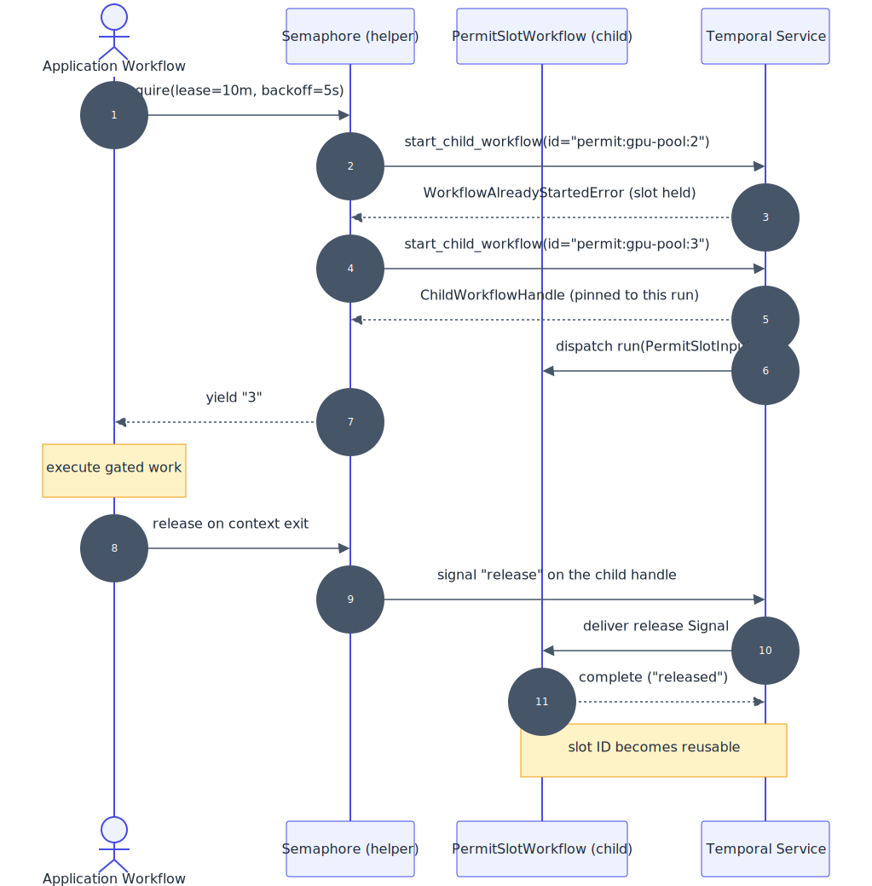

**by Keith Tenzer**

This guide details a reusable, durable distributed lock for Temporal Workflows. The design doesn't rely on an external database, a central limiter, or any shared state outside Temporal itself.

This pattern is best for small, fixed pools of scarce resources where each permit is held for minutes, not milliseconds: GPU devices, lab hardware, tenant migrations, or similar operational resources. The latency maybe too high to qualify as a general-purpose high-throughput mutex or rate limiter.
Common approaches such as a database, cache-layer, or a central rate-limiter services introduce extra infrastructure and new failure modes. Holders of locks die without releasing leak orphan locks. Lock state drifts out of sync with the Workflows that hold them. Capacity changes require restarting limiter services.

This pattern represents each held permit or lock as its own short-lived child Workflow.
The child Workflow's ID encapsulates the resource and slot, for example `permit:gpu-pool:gpu-2`.
Temporal does not allow two running Workflows with the same ID, so acquiring a permit is an atomic operation using Temporal's own state.
The Workflow releases on a Signal pinned to the run.  If no release Signal is received, the permit Workflow's lease timeout handles orphan recovery.

By following this implementation plan, you will gain:

- **Atomic Acquire**: Take a permit by starting a child Workflow whose ID is the lock. The operation succeeds or fails atomically against Temporal state.
- **Lease-Based Recovery**: A per-permit lease Timer makes the slot reusable if the holder crashes before releasing. For external resources that can be corrupted by overlap, pass a fencing token to reject stale holders.
- **Horizontal Scale**: Permit traffic spreads across the slots in a scarce resource pool, which is useful for long-held resource coordination.

## Background and best practices

This section explains why Temporal Workflow IDs make a good distributed lock primitive and how the design recovers from the failure modes that hurt typical lock services.

**Distributed locking is a classical problem**
Solutions such as a database, cache-layer, and central rate-limiting services share a structural weakness: the lock state lives outside the runtime that holds it. The locking system and the work it gates can fall out of sync. A holder crash leaves an external lock entry in place until a separate cleanup job runs. A limiter outage blocks every gated Workflow, or lets every request through unchecked. Scaling the limiter is a separate operational concern from scaling the workload it gates.

Inside Temporal, by default, every running Workflow execution already has a globally unique, atomically enforced identifier. You cannot start two running Workflows with the same Workflow ID at the same time. That guarantee is the primitive a distributed mutex requires (guarantee only exists if not changing WorkflowId Conflict Policy from its default of FAIL). Treating each permit as its own child Workflow places the lock and the work it gates on the same platform: Temporal's history, durability, and Worker fleet.

**The Workflow ID is the lock**
Encapsulating the resource and slot into the Workflow ID (`permit:{resource}:{slot}`) makes the act of starting the child Workflow the acquire operation. The start either succeeds and the caller holds the permit, or it fails with `WorkflowAlreadyStartedError` and the caller tries the next slot.

If the parent Workflow closes for any reason without sending the release Signal (operator termination, execution timeout, unhandled exception), the default `ParentClosePolicy.TERMINATE` cancels the permit child immediately and the slot frees right away. The permit Workflow also runs a `wait_condition` with a lease timeout for cases where the holder is alive but went silent, and `start_child_workflow` sets `execution_timeout=lease` as a server-side backstop for permits that no Worker ever picks up. Together these mechanisms handle orphan recovery internally, eliminating the need for a separate cleanup process.

The `Semaphore` pins the release Signal to the specific run started at acquire time by holding the `ChildWorkflowHandle` from `start_child_workflow` and signalling on that handle. Without this pin, a late release Signal from a holder whose lease already expired could revoke a subsequent acquirer's permit. The `Semaphore` shuffles its slot list using `workflow.random()` so Workflows always probe in a random order. The shuffle is deterministic across replay, as Workflow determinism requires, and uniform across callers. This spreads contention across the pool rather than concentrating on slot 0, for example.

Three operational characteristics matter before adopting the pattern:

- Acquire is not first-in-first-out (FIFO). When a slot frees, whomever claims it first, wins.
- Capacity changes apply only to acquires after the change. Already-held permits run to release or lease expiry on their original capacity.
- For production, host `PermitSlotWorkflow` on a dedicated Task Queue so application Worker backpressure does not slow permit acquire and release.
- Lease expiry is recovery, not proof that the old holder stopped using the external resource. For resources that can be corrupted by overlap, pass the permit run ID as a fencing token to the Activity or downstream system and reject stale holders there. 

## Target audience

This guide references the following roles:

- **Application developers**: Build the Workflows that acquire permits. Import the `Semaphore` helper and wrap critical sections in `async with sem.acquire(): ...`.
- **Platform operators**: Run the Worker that hosts `PermitSlotWorkflow`, tune lease and backoff defaults, and decide the Task Queue topology.

The process outlined in this document requires Python code changes and Worker configuration.
This pattern requires no additional infrastructure.

## Prerequisites

To complete the implementation plan, you will need:

- **Required software and tools**:
    - Python 3.12 or later ([download](https://www.python.org/downloads/))
    - Temporal Python SDK 1.7 or later ([github](https://github.com/temporalio/sdk-python))
    - `uv` 0.9.18 for Python dependency management ([install](https://docs.astral.sh/uv/))
    - Temporal CLI 1.6.2 for the local development server ([install](https://docs.temporal.io/cli))
    - Access to a Temporal Cluster 1.3.2 (local development server or Temporal Cloud).
- **Resources and access privileges**:
    - A Temporal Namespace where you can register Workers and start Workflows.
    - For Temporal Cloud: an API key with the Namespace Admin role for the target Namespace.
- **Required concepts**:
    - Familiarity with Temporal Workflows and Activities ([docs](https://docs.temporal.io/workflows)).
    - Child Workflows and parent close policies ([docs](https://docs.temporal.io/encyclopedia/child-workflows)).
    - Signals and Queries ([docs](https://docs.temporal.io/encyclopedia/workflow-message-passing)).
    - Workflow determinism ([docs](https://docs.temporal.io/workflows#workflow-determinism)).

## Architecture diagram

The following diagram shows the acquire and release flow when two Workflows compete for slots in a 2-slot pool. The first attempt to get a slot collides with an already held slot; the second succeeds.


1. The application Workflow calls `Semaphore.acquire`. The `Semaphore` shuffles slot names using `workflow.random()` and attempts to acquire a slot.
2. The first attempt to acquire a slot starts a child Workflow with ID `permit:gpu-pool:2`. Temporal already has a running Workflow at that ID and rejects the start with `WorkflowAlreadyStartedError`.
3. The `Semaphore` falls through to the next slot and starts `permit:gpu-pool:3`. Temporal accepts the start and returns a `ChildWorkflowHandle` to the `Semaphore`.
4. Temporal dispatches the new execution to a Worker, and `PermitSlotWorkflow` enters its `wait_condition` with the lease timeout running.
5. The `Semaphore` yields the slot name (`"3"`) to the caller.
6. The application Workflow runs the gated work using the yielded slot identity.
7. On context-manager exit, the `Semaphore` sends a `release` Signal on the recorded `ChildWorkflowHandle`, which targets the specific run it started.
8. The permit Workflow's `wait_condition` returns, the Workflow completes with `released`, and the Workflow ID is reusable.

## Implementation plan

This section outlines the sequential phases to build the distributed lock library and integrate it into a Worker. 

### Define shared configuration

The library needs a small config module with lease and backoff defaults, a function that encodes the resource and slot into a Workflow ID, and a function that picks auth mode from environment variables.

Create a file named `distributed_lock/config.py`:

```python
# config.py

from __future__ import annotations

import os
from datetime import timedelta

from temporalio.client import Client
from temporalio.envconfig import ClientConfig

TEMPORAL_TASK_QUEUE: str = os.environ.get("TEMPORAL_TASK_QUEUE", "distributed-lock-tq")

DEFAULT_LEASE: timedelta = timedelta(minutes=10)
DEFAULT_BACKOFF: timedelta = timedelta(seconds=5)
DEFAULT_MAX_BACKOFF: timedelta = timedelta(minutes=1)
DEFAULT_BACKOFF: timedelta = timedelta(seconds=5)

PERMIT_WORKFLOW_ID_PREFIX: str = "permit"

def permit_workflow_id(resource: str, slot: str) -> str:
    return f"{PERMIT_WORKFLOW_ID_PREFIX}:{resource}:{slot}"

async def connect_temporal_client() -> Client:
    return await Client.connect(**ClientConfig.load_client_connect_config())
```

The `permit_workflow_id` function produces IDs like `permit:gpu-pool:2`. That string is the lock: Temporal will reject any second attempt to start a Workflow with the same ID while the first is running.
The default lease and backoff values are conservative starting points. Adjust these values based on the resource you're gating.
The `connect_temporal_client` function delegates to `temporalio.envconfig`, which reads connection settings from a TOML profile at `~/.config/temporalio/temporal.toml` (or the path in `TEMPORAL_CONFIG_FILE`) and applies environment variable overrides such as `TEMPORAL_ADDRESS`, `TEMPORAL_NAMESPACE`, `TEMPORAL_API_KEY`, and the `TEMPORAL_TLS_*` family. This is the same configuration source the Temporal CLI uses, so a developer's existing CLI profile drives both the CLI and this Worker. API-key authentication enables Transport Layer Security (TLS) automatically; for self-hosted TLS without an API key, set the relevant `TEMPORAL_TLS_*` variables; for `temporal server start-dev`, leave the variables unset and the connection falls back to plain Transmission Control Protocol (TCP).

### Define the permit primitive

The permit primitive is a child Workflow whose ID is the lock. It accepts a resource name, slot name, and lease duration, then blocks on a `release` Signal with a timeout equal to the lease. On Signal it completes; on timeout it auto-completes for orphan recovery.

Create a file named `distributed_lock/workflow.py`:

```python
# workflow.py

from __future__ import annotations

from dataclasses import dataclass
from datetime import timedelta

from temporalio import workflow

@dataclass
class PermitSlotInput:
    resource: str
    slot: str
    lease_seconds: float

@workflow.defn(name="PermitSlotWorkflow")
class PermitSlotWorkflow:
    def __init__(self) -> None:
        self._released: bool = False

    @workflow.signal(name="release")
    def release(self) -> None:
        self._released = True

    @workflow.run
    async def run(self, input: PermitSlotInput) -> str:
        workflow.logger.info(
            "permit acquired",
            extra={"resource": input.resource, "slot": input.slot},
        )
        try:
            await workflow.wait_condition(
                lambda: self._released,
                timeout=timedelta(seconds=input.lease_seconds),
            )
            return "released"
        except TimeoutError:
            workflow.logger.warning(
                "permit lease expired - auto-releasing slot",
                extra={"resource": input.resource, "slot": input.slot},
            )
            return "lease_expired"
```

The `@workflow.signal(name="release")` decorator exposes the Signal the caller sends on context exit. The `workflow.wait_condition(predicate, timeout=lease)` is the durable wait: Temporal persists the wait, so a Worker restart does not lose the held permit. The Workflow does not set its own ID. The caller sets it via `start_child_workflow(id=...)`. The return value (`"released"` or `"lease_expired"`) lets operators distinguish clean releases from orphan recoveries directly in the Temporal UI.

### Build the caller-side Semaphore helper

The `Semaphore` is a thin async context manager around `workflow.start_child_workflow`. It is not a Workflow itself. Construct it with a fixed `capacity`; the `Semaphore` auto-generates slot names `"0"` through `"N-1"` and yields the name of the slot it acquired. Activities that need to map the slot to an external resource (CUDA device, database shard, etc.) translate the string with `int(slot)`.

Create a file named `distributed_lock/semaphore.py`:

```python
# semaphore.py

from __future__ import annotations

from contextlib import asynccontextmanager
from datetime import timedelta
from typing import AsyncIterator

from temporalio import workflow
from temporalio.exceptions import FailureError, WorkflowAlreadyStartedError
from temporalio.workflow import ChildWorkflowHandle

from distributed_lock.config import DEFAULT_BACKOFF, DEFAULT_LEASE, permit_workflow_id
from distributed_lock.workflow import PermitSlotInput, PermitSlotWorkflow

class Semaphore:
    def __init__(
        self,
        resource: str,
        *,
        capacity: int,
        task_queue: str | None = None,
    ) -> None:
        if capacity < 1:
            raise ValueError("capacity must be >= 1")
        self._resource = resource
        self._slots: list[str] = [str(i) for i in range(capacity)]
        self._task_queue = task_queue

    @asynccontextmanager
    async def acquire(
        self,
        *,
        lease: timedelta = DEFAULT_LEASE,
        backoff: timedelta = DEFAULT_BACKOFF,
    ) -> AsyncIterator[str]:
        slot, handle = await self._acquire_one(lease=lease, backoff=backoff)
        try:
            yield slot
        finally:
            await self._release(slot, handle)

    async def _acquire_one(
        self, *, lease: timedelta, backoff: timedelta
    ) -> tuple[str, ChildWorkflowHandle]:
        rng = workflow.random()
        lease_seconds = lease.total_seconds()
        while True:
            order = list(self._slots)
            rng.shuffle(order)
            for slot in order:
                wf_id = permit_workflow_id(self._resource, slot)
                try:
                    handle = await workflow.start_child_workflow(
                        PermitSlotWorkflow.run,
                        PermitSlotInput(
                            resource=self._resource,
                            slot=slot,
                            lease_seconds=lease_seconds,
                        ),
                        id=wf_id,
                        task_queue=self._task_queue,
                        execution_timeout=lease,
                    )
                    return slot, handle
                except WorkflowAlreadyStartedError:
                    continue
            await workflow.sleep(backoff)

    async def _release(self, slot: str, handle: ChildWorkflowHandle) -> None:
        try:
            await handle.signal("release")
        except FailureError as e:
            workflow.logger.info(
                "release signal target already finished (lease likely expired)",
                extra={
                    "resource": self._resource,
                    "slot": slot,
                    "error": str(e),
                },
            )
```

The constructor takes a fixed `capacity` and rejects values below 1. The `Semaphore` auto-generates slot names `"0"` through `"N-1"` and reshuffles them on every attempt using `workflow.random()` so long-running contention spreads evenly across slots. The `Semaphore` keeps the `ChildWorkflowHandle` returned by `start_child_workflow` and signals release on that handle, so the Signal cannot land on a subsequent acquirer's execution.
The `FailureError` caught in `_release` covers the lease-already-expired case: the slot is already free and the release is a no-op, logged at info level for observability.
Three orphan-recovery mechanisms work together to bound slot occupancy. The default `ParentClosePolicy.TERMINATE` is the fastest, when the parent Workflow closes for any reason without releasing, Temporal terminates the permit child immediately and the slot frees right away. The in-workflow timer `wait_condition(timeout=lease)` covers the case where the parent is still alive but the holder is silent, the permit Workflow exits cleanly as `"lease_expired"`, distinguishable in the Temporal UI. That Timer only starts ticking once a Worker runs the permit's first Task, however, so the workflow timeout `execution_timeout=lease` is a server-enforced backstop that ticks from Workflow creation regardless of whether a Worker ever picks it up. Together these guarantee the slot is never leaked, even if the permit Workflow never runs.

### Register the permit Workflow on a Worker

The Worker that runs application Workflows must also register `PermitSlotWorkflow`.
A single-queue topology like the one below is fine for development. For production deployments, use the dedicated Task Queue described in the Background and People and process sections.

Create a file named `worker/main.py`:

```python
# main.py

from __future__ import annotations

import asyncio

from temporalio.worker import Worker

from distributed_lock.config import TEMPORAL_TASK_QUEUE, connect_temporal_client
from distributed_lock.workflow import PermitSlotWorkflow

async def _run_worker() -> None:
    client = await connect_temporal_client()
    worker = Worker(
        client,
        task_queue=TEMPORAL_TASK_QUEUE,
        workflows=[PermitSlotWorkflow],
        activities=[],
    )
    await worker.run()

if __name__ == "__main__":
    asyncio.run(_run_worker())
```

`PermitSlotWorkflow` is in the `workflows=[...]` list and the `activities=[]` list is empty.
The permit lifecycle is pure Workflow code, so this library needs no Activities. `worker.run()` blocks until the awaited Task is cancelled, which is sufficient for `temporal server start-dev` and CI: Ctrl-C raises `KeyboardInterrupt` and the Worker drains in-flight work as the cancellation propagates. For containerized production deployments, add a `SIGTERM` handler that cancels the run Task so pod restarts and rolling deploys also drain gracefully. The `connect_temporal_client` function picks up environment variables to choose between Temporal Cloud API key auth, self-hosted TLS, and plain TCP for `temporal server start-dev`, so the same Worker source runs against any environment.

### Example application Workflows

The two examples below show how application Workflows apply the pattern in different use cases. The API is the same in both: construct a `Semaphore` with a `capacity`, wrap the gated section in `async with sem.acquire(...)`, and use the yielded slot string however the workload requires. Source files live at `examples/gate_workflow.py` and `examples/gpu_workflow.py` in the reference implementation.

#### Generic Workflow throttling

Cap the number of concurrent holders without caring about slot identity. The yielded slot is a string `"0"` through `"N-1"`; the Activity passes it through as a label.

```python
# gate_workflow.py

from __future__ import annotations

from datetime import timedelta

from temporalio import workflow

from distributed_lock.semaphore import Semaphore

@workflow.defn(name="ThrottledGateWorkflow")
class ThrottledGateWorkflow:
    @workflow.run
    async def run(self, job_id: str) -> str:
        sem = Semaphore("app-gate", capacity=4)
        async with sem.acquire(lease=timedelta(minutes=10)) as slot:
            return await workflow.execute_activity(
                "do_gated_work",
                args=[job_id, slot],
                start_to_close_timeout=timedelta(minutes=5),
                heartbeat_timeout=timedelta(seconds=30),
            )
```

#### Resource locks (GPU, database shard, tenant)

Hand the yielded slot to an Activity that maps it to a specific resource. The slot is a string `"0"` through `"N-1"`; convert it with `int(slot)` if the resource is indexed numerically (CUDA device, shard ID).

```python
# gpu_workflow.py

from __future__ import annotations

from datetime import timedelta

from temporalio import workflow

from distributed_lock.semaphore import Semaphore

@workflow.defn(name="GpuTrainingWorkflow")
class GpuTrainingWorkflow:
    @workflow.run
    async def run(self, model_id: str) -> str:
        sem = Semaphore("gpu-pool", capacity=4)
        async with sem.acquire(lease=timedelta(minutes=45)) as slot:
            return await workflow.execute_activity(
                "run_training",
                args=[model_id, slot],
                start_to_close_timeout=timedelta(minutes=30),
                heartbeat_timeout=timedelta(minutes=3),
            )
```

#### Heartbeat the long-running Activity

Both Activities run inside the gated critical section, so a Worker crash mid-Activity must be detected promptly to free the slot. Set `heartbeat_timeout` on the Activity invocation and call `activity.heartbeat(...)` periodically inside the Activity body. Temporal fails the Activity attempt as soon as a Heartbeat is missed for longer than the timeout, the holder Workflow then exits its `async with` block, the `Semaphore` sends `release` to the slot Workflow, and the slot returns to the pool. The lease Timer remains as a coarse last-resort recovery for cases where Heartbeats cannot run.

```python
# activities.py

from __future__ import annotations

import asyncio

from temporalio import activity

@activity.defn(name="do_gated_work")
async def do_gated_work(job_id: str, slot: str) -> str:
    total_seconds = 60
    interval = 5
    elapsed = 0
    while elapsed < total_seconds:
        # `asyncio.sleep` simulates the real gated work
        # (API call, batch processing, etc.). Replace with the actual workload.
        await asyncio.sleep(interval)
        elapsed += interval
        activity.heartbeat(
            {"job_id": job_id, "slot": slot, "elapsed_seconds": elapsed}
        )
    return f"{job_id} done on slot {slot}"

@activity.defn(name="run_training")
async def run_training(model_id: str, slot: str) -> str:
    gpu_index = int(slot)  # map "0".."3" to a CUDA device index
    epochs = 10
    for epoch in range(1, epochs + 1):
        # `asyncio.sleep` simulates one training epoch on cuda:{gpu_index}.
        # Replace with the actual training step.
        await asyncio.sleep(60)
        activity.heartbeat(
            {"model_id": model_id, "gpu_index": gpu_index, "epoch": epoch}
        )
    return f"trained {model_id} on cuda:{gpu_index}"
```

Set the Heartbeat interval shorter than `heartbeat_timeout` (a 2x to 3x ratio is a common starting point) so a single delayed Heartbeat does not fail a healthy Activity. Pass progress data into `activity.heartbeat(...)` so retries can resume from the last reported point and operators can observe progress in the Temporal UI.

## Outcomes

By following this guide, you have built a durable distributed lock for Temporal Workflows backed by Temporal's own Workflow ID uniqueness guarantee.

You now have the capability to:

- Cap concurrent access to any shared resource or critical section without a database, cache-layer, or a central limiter service.
- Recover orphan permits automatically when holders crash, using per-permit lease Timers.
- Scale lock acquisition horizontally. Permit traffic distributes across short-lived child Workflows rather than concentrating on one limiter.

## Related resources

- [Temporal Python SDK Documentation](https://docs.temporal.io/develop/python). SDK reference for Workflows, Signals, child Workflows, and Worker setup.
- [Child Workflow Executions](https://docs.temporal.io/encyclopedia/child-workflows). How parent and child Workflows interact, including parent close policies.
- [Workflow Message Passing](https://docs.temporal.io/encyclopedia/workflow-message-passing). Reference for Signals and Queries.
- [Reference implementation source repository](https://github.com/temporal-sa/temporal-workflow-throttler). The upstream repository bundles `PermitSlotWorkflow`, the `Semaphore` helper, demo Workers, a FastAPI service, and a React UI. The package directory is named `throttler/` in the source.