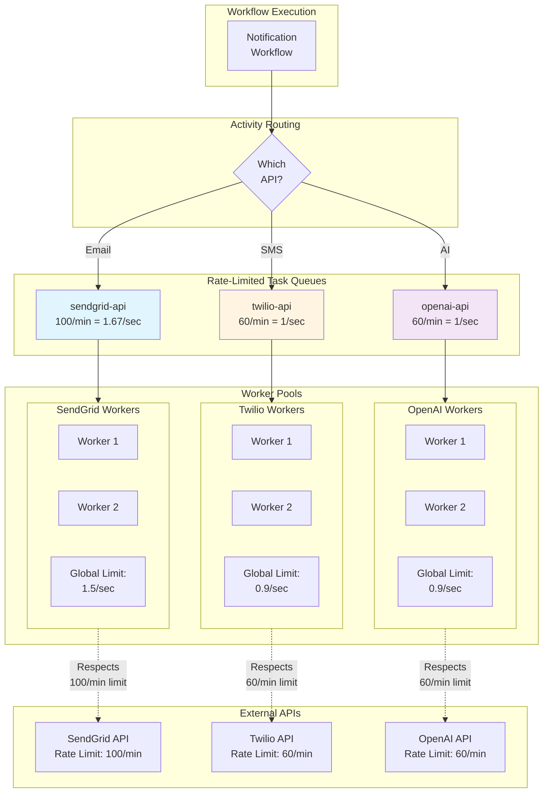

**by Cecil Phillip**

### Problem statement

Modern applications integrate with numerous external APIs (SendGrid, Stripe, OpenAI, Twilio) that enforce rate limits to protect their infrastructure. These limits vary by provider service and plan, for example:

- **SendGrid:** 100 emails/minute on free tier, 1000/minute on paid
- **Stripe:** 100 requests/second globally
- **OpenAI:** 60 requests/minute, 90,000 tokens/minute
- **Twilio:** 1 request/second per phone number

Without proactive rate limiting when calling downstream services, users may experience the following issues:
- **HTTP 429 errors:** Activities overwhelm APIs causing "Too Many Requests" errors
- **Account suspension:** Repeated violations can lead to temporary or permanent bans from the downstream service
- **Failed Workflows:** Without proper retry handling, Workflows may not be able to continue to make progress
- **Wasted execution:** Activities that will fail due to rate limits consume Worker resources
- **Cascading failures:** One Workflow's excessive API calls could affect others

### Solution

Use separate Task Queues with rate limiting configuration to protect downstream APIs. Create one Task Queue per rate-limited API and configure:

- `max_task_queue_activities_per_second`: Global rate limit across all Workers on the queue
- `max_activities_per_second`: Per-Worker rate limit (optional, for additional control)
- `max_concurrent_activities`: Limit concurrent executions when API has concurrency limits

This ensures Activities calling external APIs never exceed their rate limits, preventing 429 errors and account issues.

### Outcomes

- **Rate limit compliance:** Activities respect API rate limits, eliminating 429 errors and preventing account suspension
- **Improved reliability:** Workflows complete successfully without failures caused by rate limits
- **Resource efficiency:** Workers don't waste resources on doomed-to-fail Activities
- **Better API relationships:** Consistent rate limit compliance maintains good standing with API providers
- **Independent scaling:** Add more Workers without exceeding API rate limits (global queue limit applies)

## Background and best practices

### Task Queue fundamentals

Task Queues in Temporal are dynamically created when first referenced. Rate limiting is configured at the Worker level and enforced by the Temporal Server.

**Recommended practice:** Create one Task Queue per rate-limited API to isolate rate limits.

### Rate limiting configuration options

The Python SDK provides three rate limiting controls:

1. **max_task_queue_activities_per_second** (global): Limits Activity dispatch across ALL Workers on this queue. Enforced by Temporal Server. Best for API rate limits. Last value wins.

2. **max_activities_per_second** (per-worker): Limits Activities per Worker. Can be combined with global limit for finer control.

3. **max_concurrent_activities** (concurrency): Limits concurrent executions. Use when API has concurrent connection limits (e.g., database pool size).

4. **disable_eager_activity_execution** (Client configuration): Set to `True` when starting Workflows to prevent Activities from being eagerly assigned to the Workflow Worker, ensuring they go through the rate-limited Task Queue instead.

**Important:** Without `disable_eager_activity_execution=True`, Activities may bypass your rate-limited Task Queues entirely. Eager execution runs Activities on the same Worker as the Workflow, which circumvents the rate limiting controls configured on the Activity-specific Task Queues. Always disable eager execution when using rate-limited Task Queues for API calls.

### Handling HTTP 429 responses

Even with rate limiting, occasional 429 errors may occur due to:
- Other systems using the same API key
- API provider reducing limits temporarily
- Burst traffic patterns

**Recommended practice:** Raise an exception with a specific next retry delay from the API's `Retry-After` header, and fallback to exponential backoff when the header is not available:

1. When catching 429 errors, check for the `Retry-After` response header
2. If present, raise an `ApplicationError` with `next_retry_delay` set to the header value
3. If not present, raise the exception normally to use the Activity's Retry Policy

```python
retry_policy=workflow.RetryPolicy(
    initial_interval=timedelta(seconds=1),
    maximum_interval=timedelta(minutes=10),
    backoff_coefficient=2.0,
    maximum_attempts=5,
)
```

**Understanding the retry cadence:**

With this configuration, the retry intervals follow this pattern:
- Attempt 1: 1 second
- Attempt 2: 2 seconds (1s × 2.0)
- Attempt 3: 4 seconds (2s × 2.0)
- Attempt 4: 8 seconds (4s × 2.0)
- Attempt 5: 16 seconds (8s × 2.0)

Total time before failure: ~31 seconds across 5 attempts.

**Key differences from default Retry Policy:**
- **maximum_attempts**: Set to `5` instead of the default `unlimited`. This prevents infinite retries for persistent rate limiting issues and ensures timely failure detection.
- **maximum_interval**: Set to `10 minutes` instead of the default `100x initial_interval`. This caps retry delays at a reasonable duration.

For rate-limited APIs, capping `maximum_attempts` ensures that Activities don't retry indefinitely if an API is experiencing extended downtime or if your rate limits have been permanently reduced.

This approach respects the API's rate limit guidance while providing a sensible fallback strategy.

### Operational considerations

- **Monitor API usage:** Track actual API calls vs rate limits to adjust configured rate limits in your Temporal Task Queues
- **API limit changes:** API providers may change rate limits; monitor and update Worker configuration
- **Burst allowance:** Some APIs allow short bursts above stated limits; test to determine safe Temporal limits
- **Multiple environments:** Use separate API keys and Task Queues for dev/staging/prod

#### Task Queue backlog and draining strategies

During throttling events, Task Queues can grow significantly. Operators need to switch to **draining mitigation mode** when backlogs occur.

**Critical considerations:**
- **Determine acceptable SLA/SLO for draining:** How long is acceptable for the queue to drain? Hours? Days?
- **Cascading failures:** Simply increasing downstream API or Temporal Cloud rate limits may move the bottleneck elsewhere, potentially overwhelming the next component in line

**Mitigation strategies (in order of consideration):**

1. **Request downstream API rate limit increases** - Work with API providers to increase your rate limits
2. **Request Temporal Cloud rate limit increases** - If using Temporal Cloud, request higher limits
3. **Scale Worker pools** - Add more Workers or adjust Worker configuration
4. **Increase internal resources** - Scale your infrastructure
5. **Identify the next bottleneck** - Determine what will become throttled next to prevent cascading failures

#### CLI commands for operators

**Adjust Task Queue rate limits dynamically:**

```bash
# Set rate limit for a specific task queue
temporal task-queue config set --queue-rps-limit 99 --task-queue sendgrid-api
```

This allows operators to adjust rate limits without redeploying workers.

**Reset stuck activities:**

When activities are stuck at their maximum retry intervals:

```bash
# Reset activities to retry immediately
temporal activity reset --workflow-id <workflow-id> --activity-id <activity-id>
```

This is useful when downstream APIs recover from outages and you want to immediately retry activities that are waiting at long backoff intervals (e.g., 10 minutes).

## Target audience

- **Temporal Workflow & Activity developers:** Implementing API integrations with rate limiting
- **Platform operators:** Configuring and monitoring rate-limited Workers
- **API integration engineers:** Ensuring compliance with third-party API limits
- **SRE teams:** Preventing API-related outages

This implementation requires Worker configuration, Activity error handling, and monitoring of API usage against limits.

## Prerequisites

### Required software, infrastructure, and tools

- Temporal Server v1.17+ (for `max_task_queue_activities_per_second` support)
- Python 3.8 or later
- Temporal Python SDK v1.0.0 or later (`pip install temporalio`)
- API keys and documentation for external services

### Resources and access privileges

- Temporal Namespace with permissions to start Workflows and register Workers
- API keys with known rate limits for external services
- Access to API provider dashboards to monitor usage

### Required concepts

- Temporal Workflows, Activities, and Task Queues
- HTTP client libraries (httpx, requests)
- API authentication (API keys, OAuth)
- Exponential backoff and retry strategies

## Architecture diagram(s)

### Rate-Limited Task Queues architecture



## Implementation plan

### Step 1: Identify API rate limits

Document rate limits for all external APIs your application uses.

**Example rate limit inventory:**

| API | Rate Limit | Concurrency Limit | Plan/Tier | Notes |
|-----|-----------|-------------------|-----------|-------|
| SendGrid | 100 req/min | None | Free | Burst: 300/min for 1 min |
| Stripe | 100 req/sec | None | Standard | Per API key globally |
| OpenAI | 60 req/min | None | Tier 1 | Also: 90K tokens/min |
| Twilio | 60 req/min | None | Free | Per phone number |
| Database | None | 100 connections | N/A | Connection pool limit |

**Actions:**
1. Review API documentation for each integrated service
2. Check your current plan/tier limits
3. Determine if limits are per API key, per account, or per resource
4. Set Temporal rate limits to 90% of API limits (leave safety buffer)

### Step 2: Define Task Queue constants

**File: `task_queues.py`**

```python
"""Task Queue constants for rate-limited APIs."""

# Rate-limited API task queues
SENDGRID_API_QUEUE = "sendgrid-api"
STRIPE_API_QUEUE = "stripe-api"
OPENAI_API_QUEUE = "openai-api"
TWILIO_API_QUEUE = "twilio-api"
```

### Step 3: Configure Workers with rate limiting

**File: `worker_sendgrid.py`**

```python
"""Worker for rate-limited SendGrid email activities."""
import asyncio
import logging
from temporalio.client import Client
from temporalio.worker import Worker

from task_queues import SENDGRID_API_QUEUE
from activities import send_email, send_batch_email

logging.basicConfig(level=logging.INFO)


async def main():
    client = await Client.connect("localhost:7233")

    worker = Worker(
        client,
        task_queue=SENDGRID_API_QUEUE,
        activities=[send_email, send_batch_email],

        # SendGrid free tier: 100 emails/minute = 1.67/sec
        # Set to 1.5/sec for safety buffer
        # This limit applies GLOBALLY across all workers on this queue
        max_task_queue_activities_per_second=1.5,

        disable_eager_activity_execution=True,

        # Optional: Also limit per-worker to prevent single worker bursts
        max_activities_per_second=0.5,

        # Limit concurrent connections (SendGrid allows many concurrent)
        max_concurrent_activities=20,
    )

    logging.info(
        f"Starting SendGrid worker on {SENDGRID_API_QUEUE} "
        f"(max 1.5/sec globally)"
    )
    await worker.run()


if __name__ == "__main__":
    asyncio.run(main())
```

**File: `worker_openai.py`**

```python
"""Worker for rate-limited OpenAI API activities."""
import asyncio
import logging
from temporalio.client import Client
from temporalio.worker import Worker

from task_queues import OPENAI_API_QUEUE
from activities import generate_text, generate_embeddings

logging.basicConfig(level=logging.INFO)


async def main():
    client = await Client.connect("localhost:7233")

    worker = Worker(
        client,
        task_queue=OPENAI_API_QUEUE,
        activities=[generate_text, generate_embeddings],

        # OpenAI Tier 1: 60 requests/minute = 1/sec
        # Set to 0.9/sec for safety
        max_task_queue_activities_per_second=0.9,

        # Limit concurrent requests
        max_concurrent_activities=5,
    )

    logging.info(
        f"Starting OpenAI worker on {OPENAI_API_QUEUE} "
        f"(max 0.9/sec globally)"
    )
    await worker.run()


if __name__ == "__main__":
    asyncio.run(main())
```

**File: `worker_stripe.py`**

```python
"""Worker for rate-limited Stripe API activities."""
import asyncio
import logging
from temporalio.client import Client
from temporalio.worker import Worker

from task_queues import STRIPE_API_QUEUE
from activities import create_payment, refund_payment

logging.basicConfig(level=logging.INFO)


async def main():
    client = await Client.connect("localhost:7233")

    worker = Worker(
        client,
        task_queue=STRIPE_API_QUEUE,
        activities=[create_payment, refund_payment],

        # Stripe: 100 requests/second globally
        # Set to 90/sec for safety
        max_task_queue_activities_per_second=90,

        # High concurrency allowed
        max_concurrent_activities=50,
    )

    logging.info(
        f"Starting Stripe worker on {STRIPE_API_QUEUE} "
        f"(max 90/sec globally)"
    )
    await worker.run()


if __name__ == "__main__":
    asyncio.run(main())
```

**Deployment guidance:**
- Deploy 2-5 Workers per API-specific Task Queue
- Rate limit is enforced globally by Temporal Service across all Workers
- More Workers = better fault tolerance, but rate limit still applies
- Monitor Worker CPU/memory; rate-limited Workers typically have low utilization

### Step 4: Implement Activities with proper error handling

**File: `activities.py`**

```python
"""Activities that call rate-limited external APIs."""
import httpx
from temporalio import activity
from temporalio.exceptions import ApplicationError
from datetime import timedelta

# API keys (use environment variables in production)
SENDGRID_API_KEY = "your-sendgrid-key"
STRIPE_API_KEY = "your-stripe-key"
OPENAI_API_KEY = "your-openai-key"


@activity.defn
async def send_email(email_data: dict) -> dict:
    """
    Send email via SendGrid.

    Rate limited by worker configuration to 1.5/sec globally.
    """
    activity.logger.info(f"Sending email to {email_data['to']}")

    async with httpx.AsyncClient() as client:
        try:
            response = await client.post(
                "https://api.sendgrid.com/v3/mail/send",
                headers={
                    "Authorization": f"Bearer {SENDGRID_API_KEY}",
                    "Content-Type": "application/json",
                },
                json={
                    "personalizations": [{"to": [{"email": email_data["to"]}]}],
                    "from": {"email": "noreply@example.com"},
                    "subject": email_data["subject"],
                    "content": [{"type": "text/html", "value": email_data["body"]}],
                },
                timeout=30.0,
            )

            response.raise_for_status()
            activity.logger.info(f"Email sent to {email_data['to']}")

            return {"status": "sent", "email": email_data["to"]}

        except httpx.HTTPStatusError as e:
            if e.response.status_code == 429:
                # Check for Retry-After header (in seconds)
                retry_after = e.response.headers.get("Retry-After")

                if retry_after:
                    # Use specific retry delay from API
                    retry_delay = timedelta(seconds=int(retry_after))
                    activity.logger.warning(
                        f"Rate limit hit for {email_data['to']}, "
                        f"retry after {retry_after}s"
                    )
                    raise ApplicationError(
                        "Rate limit exceeded",
                        non_retryable=False,
                        next_retry_delay=retry_delay,
                    )
                else:
                    # Fallback to exponential backoff via retry policy
                    activity.logger.warning(
                        f"Rate limit hit for {email_data['to']}, "
                        f"using exponential backoff"
                    )
                    raise

            # Other HTTP errors
            activity.logger.error(f"HTTP error {e.response.status_code}: {e}")
            raise

        except Exception as e:
            activity.logger.error(f"Failed to send email: {e}")
            raise


@activity.defn
async def generate_text(prompt: str) -> dict:
    """
    Generate text using OpenAI API.

    Rate limited to 0.9/sec globally.
    """
    activity.logger.info(f"Generating text for prompt: {prompt[:50]}...")

    async with httpx.AsyncClient() as client:
        try:
            response = await client.post(
                "https://api.openai.com/v1/chat/completions",
                headers={
                    "Authorization": f"Bearer {OPENAI_API_KEY}",
                    "Content-Type": "application/json",
                },
                json={
                    "model": "gpt-3.5-turbo",
                    "messages": [{"role": "user", "content": prompt}],
                },
                timeout=60.0,
            )

            response.raise_for_status()
            result = response.json()

            activity.logger.info("Text generated successfully")
            return {
                "text": result["choices"][0]["message"]["content"],
                "usage": result["usage"],
            }

        except httpx.HTTPStatusError as e:
            if e.response.status_code == 429:
                # Check for Retry-After header
                retry_after = e.response.headers.get("Retry-After")
                error_data = e.response.json()

                if retry_after:
                    # Use specific retry delay from API
                    retry_delay = timedelta(seconds=int(retry_after))
                    activity.logger.warning(
                        f"OpenAI rate limit, retry after {retry_after}s: "
                        f"{error_data.get('error', {}).get('message')}"
                    )
                    raise ApplicationError(
                        "OpenAI rate limit exceeded",
                        non_retryable=False,
                        next_retry_delay=retry_delay,
                    )
                else:
                    # Fallback to exponential backoff
                    activity.logger.warning(
                        f"OpenAI rate limit, using exponential backoff: "
                        f"{error_data.get('error', {}).get('message')}"
                    )
                    raise

            activity.logger.error(f"OpenAI error {e.response.status_code}: {e}")
            raise


@activity.defn
async def create_payment(payment_data: dict) -> dict:
    """
    Create payment using Stripe API.

    Rate limited to 90/sec globally.
    """
    activity.logger.info(
        f"Creating payment for ${payment_data['amount']/100:.2f}"
    )

    async with httpx.AsyncClient() as client:
        try:
            response = await client.post(
                "https://api.stripe.com/v1/payment_intents",
                headers={
                    "Authorization": f"Bearer {STRIPE_API_KEY}",
                },
                data={
                    "amount": payment_data["amount"],
                    "currency": payment_data["currency"],
                    "payment_method": payment_data["payment_method"],
                    "confirm": "true",
                },
                timeout=30.0,
            )

            response.raise_for_status()
            result = response.json()

            activity.logger.info(f"Payment created: {result['id']}")
            return {
                "payment_id": result["id"],
                "status": result["status"],
            }

        except httpx.HTTPStatusError as e:
            if e.response.status_code == 429:
                # Check for Retry-After header
                retry_after = e.response.headers.get("Retry-After")

                if retry_after:
                    # Use specific retry delay from API
                    retry_delay = timedelta(seconds=int(retry_after))
                    activity.logger.warning(
                        f"Stripe rate limit hit, retry after {retry_after}s"
                    )
                    raise ApplicationError(
                        "Stripe rate limit exceeded",
                        non_retryable=False,
                        next_retry_delay=retry_delay,
                    )
                else:
                    # Fallback to exponential backoff
                    activity.logger.warning(
                        "Stripe rate limit hit, using exponential backoff"
                    )
                    raise

            activity.logger.error(f"Stripe error {e.response.status_code}")
            raise
```

### Step 5: Route Activities to rate-limited queues in Workflows

**File: `notification_workflow.py`**

```python
"""Workflow that routes to rate-limited API queues."""
from datetime import timedelta
from dataclasses import dataclass
from temporalio import workflow

with workflow.unsafe.imports_passed_through():
    from task_queues import SENDGRID_API_QUEUE, OPENAI_API_QUEUE, STRIPE_API_QUEUE


@dataclass
class NotificationRequest:
    user_email: str
    notification_type: str
    data: dict


@workflow.defn
class NotificationWorkflow:
    """
    Send notifications via multiple rate-limited APIs.

    Routes to appropriate queues based on notification type.
    """

    @workflow.run
    async def run(self, request: NotificationRequest) -> dict:
        workflow.logger.info(
            f"Processing {request.notification_type} notification "
            f"for {request.user_email}"
        )

        results = {}

        # Send email (rate-limited to 1.5/sec)
        if "email" in request.notification_type:
            email_result = await workflow.execute_activity(
                "send_email",
                {
                    "to": request.user_email,
                    "subject": f"{request.notification_type} Notification",
                    "body": str(request.data),
                },
                task_queue=SENDGRID_API_QUEUE,
                start_to_close_timeout=timedelta(minutes=2),
                retry_policy=workflow.RetryPolicy(
                    initial_interval=timedelta(seconds=1),
                    maximum_interval=timedelta(minutes=10),
                    backoff_coefficient=2.0,
                    maximum_attempts=5,
                ),
            )
            results["email"] = email_result

        # Generate AI content (rate-limited to 0.9/sec)
        if "ai" in request.notification_type:
            ai_result = await workflow.execute_activity(
                "generate_text",
                f"Generate notification: {request.data}",
                task_queue=OPENAI_API_QUEUE,
                start_to_close_timeout=timedelta(minutes=5),
                retry_policy=workflow.RetryPolicy(
                    initial_interval=timedelta(seconds=1),
                    maximum_interval=timedelta(minutes=10),
                    backoff_coefficient=2.0,
                    maximum_attempts=5,
                ),
            )
            results["ai"] = ai_result

        workflow.logger.info(f"Notification sent to {request.user_email}")
        return results
```

**Starter example:**

```python
# start_workflow.py
"""Start notification workflow."""
import asyncio
from temporalio.client import Client
from notification_workflow import NotificationWorkflow, NotificationRequest


async def main():
    client = await Client.connect("localhost:7233")

    # Send 100 notifications - rate limiting prevents API overload
    for i in range(100):
        request = NotificationRequest(
            user_email=f"user{i}@example.com",
            notification_type="email",
            data={"message": f"Notification {i}"},
        )

        handle = await client.start_workflow(
            NotificationWorkflow.run,
            request,
            id=f"notification-{i}",
            task_queue="workflows",
            # Disable eager execution to ensure activities go through rate-limited queues
            disable_eager_activity_execution=True,
        )

        print(f"Started workflow {i}: {handle.id}")

    print("All workflows started. Rate limiting ensures API compliance.")


if __name__ == "__main__":
    asyncio.run(main())
```

## Conclusion

By implementing rate-limited separate Task Queues for external APIs, you have achieved:

1. **Rate limit compliance:** Activities respect API rate limits (e.g., SendGrid 1.5/sec, OpenAI 0.9/sec), eliminating 429 errors and preventing account suspension

2. **Improved reliability:** Workflows complete successfully without rate limit failures. Global rate limiting ensures that adding more Workers doesn't violate API limits.

3. **Better API relationships:** Consistent rate limit compliance maintains good standing with API providers, avoiding temporary bans or throttling

4. **Independent scaling:** Add more Workers to increase throughput for other operations without exceeding API rate limits (global queue limit still applies)

Your application now safely integrates with rate-limited external APIs, ensuring compliance and reliability.

## Related resources

### Official documentation
- [Temporal Documentation - Task Routing](https://docs.temporal.io/task-routing)
- [Temporal Best Practices - Separate Task Queues](https://docs.temporal.io/best-practices/worker#separate-task-queues-logically)
- [Python SDK Worker Configuration](https://python.temporal.io/temporalio.worker.Worker.html)

### Related patterns
- [Separate Task Queues - Worker Affinity](worker-execution-affinity) - For activities on same Worker

### Community resources
- [Forum: When to Use Multiple Task Queues](https://community.temporal.io/t/in-what-situation-should-we-use-multiple-separated-task-queues/1254)
- [Slack: Rate Limiting Activities](https://temporal.io/slack) - Search for "rate limiting" discussions

### API documentation
- [SendGrid Rate Limits](https://docs.sendgrid.com/api-reference/rate-limits)
- [Stripe Rate Limits](https://stripe.com/docs/rate-limits)
- [OpenAI Rate Limits](https://platform.openai.com/docs/guides/rate-limits)