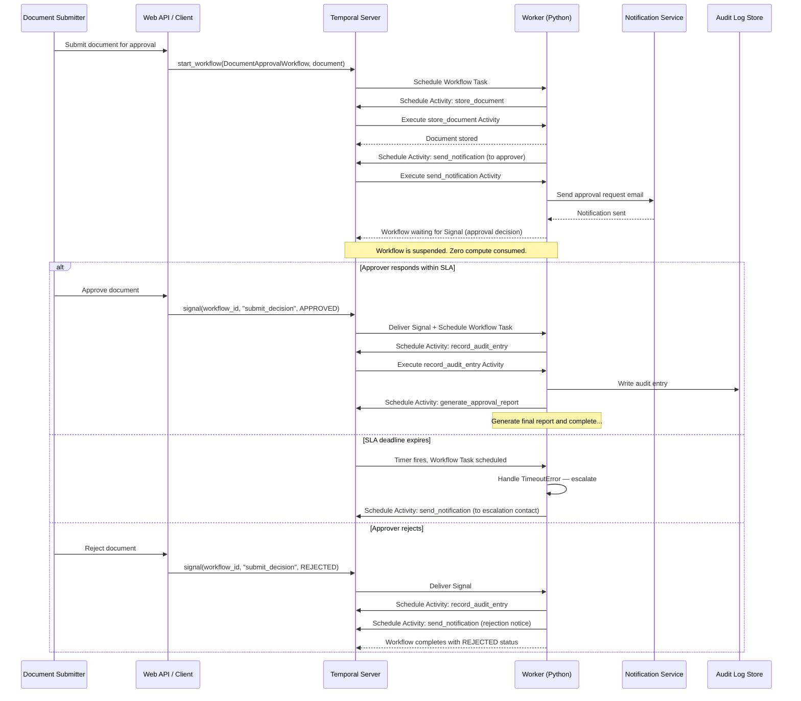

**by Cecil Phillip**

Document approval processes fail in predictable ways: requests go unanswered, deadlines pass silently, context gets lost across restarts, and audit trails end up incomplete. The usual fixes — polling loops, cron jobs, reminder emails kicked off by a scheduler — create coordination debt that compounds over time. This guide shows how to build an approval system where none of that is possible: decisions are waited on durably, SLAs are enforced automatically, escalations happen without a scheduler, and every action is recorded whether or not your infrastructure stays up.

### Problem statement

An approval request may not get a response until the following week — or ever. Between submission and decision, a lot can go wrong: the request gets buried in an inbox, the original approver is out, the system restarts and loses state, or nobody notices the deadline passed. Patching this with a database, a cron job, a notification service, and custom reconciliation logic means maintaining four systems to do one thing.

### Solution

The approval process runs as a single Workflow that holds its own state and waits — without consuming compute — for as long as it takes. Deadlines are tracked by durable timers that fire whether or not Workers restart. Reminders go out on schedule. If no one responds in time, escalation happens automatically. Resubmissions loop back cleanly. A complete audit record is written at every step. The infrastructure can fail and recover; the approval process continues from exactly where it left off.

### Outcomes

After working through this guide, you'll have a running approval system where:

- **Requests don't disappear when infrastructure does**: Temporal's Event History replays the Workflow to its exact pre-failure state, so no approval decisions or audit entries are ever lost.
- **Deadlines enforce themselves**: Durable timers track every SLA and fire precisely when a deadline expires — no external scheduler, no polling loop, no cron job.
- **Escalations happen automatically when reviewers go quiet**: If an approver doesn't respond within the SLA window, the Workflow escalates to a backup approver without any external trigger.
- **Resubmissions work without restarting the process from scratch**: Change requests loop back cleanly, preserving full context and the existing audit trail.
- **Every action is in the audit record**: Decisions, reminders, escalations, and status changes are all recorded — whether from a Signal, an Activity, or a timer firing.

---

## Background and best practices

### Why human-in-the-loop matters

Some decisions can't be automated — a contract requiring legal sign-off, a patient record needing clinical approval, an AI-generated document awaiting human review. A system that drops a request, misses a deadline, or produces an incomplete audit trail creates real business and legal exposure.

### How Temporal enables the "wait" state

When a Workflow calls `workflow.wait_condition()`, **the Worker returns the current task to the Temporal Server and becomes idle** — consuming no compute. The Workflow's state is persisted and suspended on the Server. When a Signal arrives or a timeout fires, the Server schedules a new Workflow Task, the Worker replays the Event History to reconstruct the Workflow's state, and execution resumes from the `wait_condition` call. This mechanism works identically whether the wait is five seconds or five months — durable timers are persisted to the Server's database and survive Worker restarts, deployments, and infrastructure migrations.

### Event History management

Temporal's Event History has a hard limit of 51,200 events or 50 MB ([Workflow Execution limits](https://docs.temporal.io/workflow-execution/limits)). The Server emits warnings at ~10,240 events or 10 MB; hitting either hard limit terminates the Workflow. For this approval pattern:

| Workflow operation | Approximate events generated |
|--------------------|------------------------------|
| Workflow start (baseline) | 3 events |
| Single Activity execution | ~8 events |
| Timer (`asyncio.sleep` / `workflow.sleep`) | ~4 events |
| Signal received | ~4 events |
| Query received | 0 events (not recorded) |
| Continue-As-New | 1 event on the old run; fresh history on the new run |

A single approval with reminders and escalation generates roughly 40–80 events — well within limits. If your process supports resubmission loops or runs for months, use `workflow.info().is_continue_as_new_suggested()` to detect when the Server recommends a Continue-As-New, and act on it at a safe boundary.

### Workflow determinism

Workflow code must be deterministic because Temporal uses *history replay* to reconstruct state after Worker restarts. If the code generates different commands on replay, the SDK raises a `NondeterminismError`.

Key rules:

- Use `workflow.now()` instead of `datetime.now()` for timestamps
- Use `workflow.uuid4()` instead of `uuid.uuid4()` for generating unique identifiers
- Use `workflow.random()` instead of Python's `random` module
- Never perform I/O (network calls, file reads, database queries) directly in Workflow code — delegate to Activities
- Use `workflow.logger` instead of `print()` for replay-safe logging

### Activity idempotency

Activities may be retried if a Worker crashes mid-execution. Each Activity must be designed so that executing it twice with the same inputs produces the same outcome:

- **Idempotency keys**: Include the Workflow Id and a step identifier in every external API call.
- **Check-before-act**: Query the external system's state before performing a mutation.
- **Upsert semantics**: Use database upsert operations for audit log entries keyed on Workflow Id and approval stage.

### Long running Activities and Heartbeating

For Activities that may take minutes (PDF report generation, rate-limited API calls):

- Set `start_to_close_timeout` to the maximum time for a single attempt.
- Set `heartbeat_timeout` to the maximum acceptable interval between progress reports. If the Worker crashes, the Server retries on another Worker within this window.
- Call `activity.heartbeat()` periodically with a progress payload. On retry, read `activity.info().heartbeat_details` to resume from where it left off.

---

## Prerequisites

### Required software and infrastructure

- Python **3.11** or later
- Temporal Python SDK (`temporalio`) **1.7.0** or later
- A running Temporal Server — either the [Temporal CLI](https://docs.temporal.io/cli) development server (`temporal server start-dev`) or [Temporal Cloud](https://temporal.io/cloud)
- `uv` or `pip` for Python dependency management

### Resources and access privileges

- (Optional) SMTP server or third-party notification API credentials for the notification Activity

### Required concepts

Readers should be familiar with the following concepts:

- [Signals](https://docs.temporal.io/signals) — the mechanism for sending data to a running Workflow
- [Queries](https://docs.temporal.io/queries) — the mechanism for reading Workflow state without affecting execution
- [Workers](https://docs.temporal.io/workers) — the processes that execute Workflow and Activity code
- [Task Queues](https://docs.temporal.io/task-queues) — the named queues that route work to Workers
- Python `asyncio` — coroutines, `await`, and the event loop
- Python dataclasses or [Pydantic](https://docs.pydantic.dev/) for structured data

---

## Architecture diagram

The following sequence diagram illustrates the complete lifecycle of a document approval Workflow, from submission through approval to final disposition.



---

## Implementation plan

The following phases walk through the complete implementation. Each phase builds on the previous one.

### Phase 1: Define the data models

Start by defining the data structures that represent documents, approval decisions, and the state that flows through the Workflow. Using Python dataclasses keeps the models serializable by Temporal's default JSON data converter without additional configuration.

Create a file named `models.py`:

```python
"""Data models for the document approval system."""

from __future__ import annotations

import enum
from dataclasses import dataclass, field
from datetime import datetime


class ApprovalStatus(str, enum.Enum):
    """Possible statuses for an approval decision."""

    PENDING = "PENDING"
    APPROVED = "APPROVED"
    REJECTED = "REJECTED"
    ESCALATED = "ESCALATED"
    TIMED_OUT = "TIMED_OUT"
    CHANGES_REQUESTED = "CHANGES_REQUESTED"


class DocumentStatus(str, enum.Enum):
    """Overall status of the document approval process."""

    SUBMITTED = "SUBMITTED"
    IN_REVIEW = "IN_REVIEW"
    APPROVED = "APPROVED"
    REJECTED = "REJECTED"
    WITHDRAWN = "WITHDRAWN"


@dataclass
class ApproverConfig:
    """Configuration for the approver."""

    approver_email: str
    approver_name: str
    sla_seconds: int  # Maximum time to wait for the approver's decision
    escalation_email: str | None = None  # Backup approver if SLA expires
    reminder_interval_seconds: int = 86400  # Send reminders every 24 hours
    max_reminders: int = 3  # Maximum number of reminders to send
    resubmission_timeout_seconds: int = 604800  # Time to allow resubmission after changes requested (default 7 days)


@dataclass
class ApprovalDecision:
    """A decision submitted by an approver."""

    approver_email: str
    status: ApprovalStatus
    comment: str = ""
    decided_at: str = ""  # ISO 8601 timestamp, set by the Workflow


@dataclass
class AuditEntry:
    """A single entry in the approval audit trail."""

    timestamp: str  # ISO 8601
    workflow_id: str
    action: str
    actor: str
    details: str = ""
    approval_level: int = 0


@dataclass
class DocumentSubmission:
    """Input to the document approval Workflow."""

    document_id: str
    title: str
    submitter_email: str
    submitter_name: str
    content_url: str  # Reference to the stored document (Claim Check pattern)
    approver: ApproverConfig = field(default_factory=lambda: ApproverConfig(
        approver_email="",
        approver_name="",
        sla_seconds=86400,
    ))
    metadata: dict[str, str] = field(default_factory=dict)


@dataclass
class ApprovalState:
    """Mutable state carried through the approval process and passed to Continue-As-New."""

    document: DocumentSubmission
    status: DocumentStatus = DocumentStatus.SUBMITTED
    decision: ApprovalDecision | None = None
    audit_trail: list[AuditEntry] = field(default_factory=list)
    resubmission_count: int = 0
    max_resubmissions: int = 3
    document_stored: bool = False
```

The `ApprovalState` dataclass carries everything the Workflow needs to resume after a Continue-As-New.

### Phase 2: Define the Activities

Create a file named `activities.py`:

```python
"""Activities for the document approval system.

Each Activity performs a side-effecting operation and is designed to be idempotent.
"""

from __future__ import annotations

from dataclasses import dataclass
from datetime import timedelta

from temporalio import activity
from temporalio.exceptions import ApplicationError

from models import AuditEntry, DocumentSubmission


@dataclass
class NotificationRequest:
    """Input for the send_notification Activity."""

    recipient_email: str
    recipient_name: str
    subject: str
    body: str
    idempotency_key: str  # Prevents duplicate sends on retry


@dataclass
class StoreDocumentRequest:
    """Input for the store_document Activity."""

    document_id: str
    title: str
    content_url: str
    submitter_email: str


@activity.defn
def send_notification(request: NotificationRequest) -> bool:
    """Send a notification; raises ApplicationError for invalid input (non-retryable)."""
    # Validate input — non-retryable business logic error
    if not request.recipient_email or "@" not in request.recipient_email:
        raise ApplicationError(
            f"Invalid recipient email: {request.recipient_email}"
        )

    if not request.subject or not request.subject.strip():
        raise ApplicationError("Notification subject cannot be empty")

    activity.logger.info(
        "Sending notification",
        extra={
            "recipient": request.recipient_email,
            "subject": request.subject,
            "idempotency_key": request.idempotency_key,
        },
    )

    # --- Add your notification provider ----

    activity.logger.info(
        "Notification sent successfully",
        extra={"recipient": request.recipient_email},
    )
    return True


@activity.defn
def record_audit_entry(entry: AuditEntry) -> bool:
    """Write an audit entry; uses upsert semantics to prevent duplicates on retry."""
    activity.logger.info(
        "Recording audit entry",
        extra={
            "workflow_id": entry.workflow_id,
            "action": entry.action,
            "actor": entry.actor,
            "level": entry.approval_level,
        },
    )

    # --- Add your audit log store ---

    return True


@activity.defn
def store_document(request: StoreDocumentRequest) -> str:
    """Persist document metadata; idempotent — storing the same document_id twice overwrites with identical data."""
    activity.logger.info(
        "Storing document",
        extra={
            "document_id": request.document_id,
            "title": request.title,
        },
    )

    # --- Add your document store ---

    return f"doc-store://{request.document_id}"


@activity.defn
def generate_approval_report(
    document_id: str,
    decisions: list[dict],
) -> str:
    """Generate an approval summary report; uses heartbeating to support long runs."""
    activity.logger.info(
        "Generating approval report",
        extra={"document_id": document_id, "decision_count": len(decisions)},
    )

    total_steps = len(decisions)
    for i, decision in enumerate(decisions):
        # Simulate report generation work for each decision
        activity.logger.info(
            f"Processing decision {i + 1}/{total_steps}",
            extra={"approver": decision.get("approver_email", "unknown")},
        )

        # Heartbeat with progress so the server can detect Worker crashes.
        activity.heartbeat(i + 1)

    report_url = f"reports://{document_id}/approval-summary"
    activity.logger.info(
        "Approval report generated",
        extra={"document_id": document_id, "report_url": report_url},
    )
    return report_url
```

### Phase 3: Define the approval Workflow

Create a file named `workflows.py`:

```python
"""Document approval Workflow with SLA enforcement, escalation, resubmission handling, and audit logging."""

from __future__ import annotations

import asyncio
from dataclasses import asdict
from datetime import timedelta

from temporalio import workflow
from temporalio.common import RetryPolicy

with workflow.unsafe.imports_passed_through():
    from activities import (
        NotificationRequest,
        StoreDocumentRequest,
        generate_approval_report,
        record_audit_entry,
        send_notification,
        store_document,
    )
    from models import (
        ApprovalDecision,
        ApprovalState,
        ApprovalStatus,
        ApproverConfig,
        AuditEntry,
        DocumentStatus,
        DocumentSubmission,
    )


# Retry policy for notification Activities.
NOTIFICATION_RETRY_POLICY = RetryPolicy(
    initial_interval=timedelta(seconds=5),
    backoff_coefficient=2.0,
    maximum_interval=timedelta(minutes=2),
    maximum_attempts=5,
)

# Retry policy for audit logging.
AUDIT_RETRY_POLICY = RetryPolicy(
    initial_interval=timedelta(seconds=2),
    backoff_coefficient=2.0,
    maximum_interval=timedelta(minutes=5),
    maximum_attempts=10,
)

# Retry policy for document storage.
STORAGE_RETRY_POLICY = RetryPolicy(
    initial_interval=timedelta(seconds=1),
    backoff_coefficient=2.0,
    maximum_interval=timedelta(minutes=1),
    maximum_attempts=5,
)

# Retry policy for long-running report generation.
REPORT_RETRY_POLICY = RetryPolicy(
    initial_interval=timedelta(seconds=10),
    backoff_coefficient=2.0,
    maximum_interval=timedelta(minutes=5),
    maximum_attempts=3,
)


@workflow.defn
class DocumentApprovalWorkflow:

    @workflow.init
    def __init__(
        self, input_data: DocumentSubmission | ApprovalState
    ) -> None:
        if isinstance(input_data, ApprovalState):
            self._state = input_data
        else:
            self._state = ApprovalState(document=input_data)

        self._pending_decision: ApprovalDecision | None = None
        self._processed_update_ids: set[str] = set()

    @workflow.signal
    async def submit_decision(self, decision: ApprovalDecision) -> None:
        workflow.logger.info(
            "Decision received via Signal",
            extra={
                "approver": decision.approver_email,
                "status": decision.status,
            },
        )
        self._pending_decision = decision

    @workflow.signal
    async def withdraw(self) -> None:
        workflow.logger.info("Document withdrawal requested")
        self._state.status = DocumentStatus.WITHDRAWN

    @workflow.query
    def get_status(self) -> dict:
        return {
            "document_id": self._state.document.document_id,
            "title": self._state.document.title,
            "status": self._state.status.value,
            "decision": asdict(self._state.decision) if self._state.decision else None,
            "resubmission_count": self._state.resubmission_count,
        }

    @workflow.query
    def get_audit_trail(self) -> list[dict]:
        """Return the in-memory audit trail for this Workflow."""
        return [asdict(e) for e in self._state.audit_trail]

    @workflow.update
    async def resubmit_document(self, update_id: str, new_content_url: str) -> dict:
        # Prevent duplicate processing of the same update
        if update_id in self._processed_update_ids:
            return {
                "accepted": True,
                "reason": "Resubmission already processed",
                "duplicate": True,
            }

        if self._state.status != DocumentStatus.REJECTED:
            return {
                "accepted": False,
                "reason": (
                    f"Document is in {self._state.status.value} state. "
                    "Resubmission is only allowed after rejection."
                ),
            }

        if self._state.resubmission_count >= self._state.max_resubmissions:
            return {
                "accepted": False,
                "reason": (
                    f"Maximum resubmissions ({self._state.max_resubmissions}) "
                    "reached."
                ),
            }

        self._state.document.content_url = new_content_url
        self._state.resubmission_count += 1
        self._state.status = DocumentStatus.SUBMITTED
        self._pending_decision = None
        self._processed_update_ids.add(update_id)

        workflow.logger.info(
            "Document resubmitted",
            extra={
                "resubmission_count": self._state.resubmission_count,
                "new_content_url": new_content_url,
            },
        )

        return {
            "accepted": True,
            "resubmission_count": self._state.resubmission_count,
        }

    @resubmit_document.validator
    def validate_resubmit(self, update_id: str, new_content_url: str) -> None:
        """Validate the resubmission URL before accepting the Update."""
        if not update_id or not update_id.strip():
            raise ValueError("update_id must not be empty")
        if not new_content_url or not new_content_url.strip():
            raise ValueError("new_content_url must not be empty")

    @workflow.run
    async def run(
        self, input_data: DocumentSubmission | ApprovalState
    ) -> dict:
        workflow_id = workflow.info().workflow_id

        await self._record_audit(
            workflow_id=workflow_id,
            action="WORKFLOW_STARTED",
            actor=self._state.document.submitter_email,
            details=(
                f"Document '{self._state.document.title}' submitted "
                f"for approval (resubmission #{self._state.resubmission_count})"
            ),
        )

        if not self._state.document_stored:
            await self._store_document(workflow_id)
            self._state.document_stored = True

        if workflow.info().is_continue_as_new_suggested():
            workflow.logger.info("Continue-As-New suggested, resetting Event History")
            await workflow.wait_condition(workflow.all_handlers_finished)
            workflow.continue_as_new(args=[self._state])

        self._state.status = DocumentStatus.IN_REVIEW
        approver_config = self._state.document.approver

        workflow.logger.info(
            "Approval process started",
            extra={
                "approver": approver_config.approver_email,
                "sla_seconds": approver_config.sla_seconds,
            },
        )

        await self._send_approval_request(workflow_id, approver_config)

        result: dict = {}
        while True:
            decision = await self._wait_for_decision(workflow_id, approver_config)

            if self._state.status == DocumentStatus.WITHDRAWN:
                await self._record_audit(
                    workflow_id=workflow_id,
                    action="DOCUMENT_WITHDRAWN",
                    actor=self._state.document.submitter_email,
                    details="Document withdrawn by submitter",
                )
                result = self._build_result("Document withdrawn by submitter")
                break

            result = await self._handle_decision(workflow_id, approver_config, decision)

            if self._state.status != DocumentStatus.SUBMITTED:
                break

            if workflow.info().is_continue_as_new_suggested():
                workflow.logger.info(
                    "Continue-As-New suggested before resubmission cycle"
                )
                await workflow.wait_condition(workflow.all_handlers_finished)
                workflow.continue_as_new(args=[self._state])

            self._state.status = DocumentStatus.IN_REVIEW
            await self._send_approval_request(workflow_id, approver_config)

        # Wait for all in-flight Signal and Update handlers to complete
        # before returning
        await workflow.wait_condition(workflow.all_handlers_finished)

        return result

    async def _wait_for_decision(
        self, workflow_id: str, approver_config: ApproverConfig
    ) -> ApprovalDecision:
        sla_timeout = timedelta(seconds=approver_config.sla_seconds)
        reminder_interval = timedelta(
            seconds=approver_config.reminder_interval_seconds
        )

        self._pending_decision = None

        reminder_task = asyncio.create_task(
            self._send_reminders(workflow_id, approver_config, reminder_interval)
        )

        try:
            await workflow.wait_condition(
                lambda: (
                    self._pending_decision is not None
                    or self._state.status == DocumentStatus.WITHDRAWN
                ),
                timeout=sla_timeout,
            )

            reminder_task.cancel()
            try:
                await reminder_task
            except asyncio.CancelledError:
                pass

            if self._state.status == DocumentStatus.WITHDRAWN:
                return ApprovalDecision(
                    approver_email=self._state.document.submitter_email,
                    status=ApprovalStatus.REJECTED,
                    comment="Document withdrawn",
                    decided_at=workflow.now().isoformat(),
                )

            decision = self._pending_decision
            assert decision is not None
            self._pending_decision = None
            return decision

        except asyncio.TimeoutError:
            reminder_task.cancel()
            try:
                await reminder_task
            except asyncio.CancelledError:
                pass

            return await self._handle_escalation(workflow_id, approver_config)

    async def _send_reminders(
        self, workflow_id: str, approver_config: ApproverConfig, interval: timedelta
    ) -> None:
        reminder_count = 0
        while True:
            await asyncio.sleep(interval.total_seconds())
            reminder_count += 1

            if reminder_count > approver_config.max_reminders:
                workflow.logger.info(
                    "Max reminders reached, stopping reminder loop"
                )
                break

            workflow.logger.info(
                "Sending reminder",
                extra={
                    "reminder_count": reminder_count,
                    "approver": approver_config.approver_email,
                },
            )

            await workflow.execute_activity(
                send_notification,
                NotificationRequest(
                    recipient_email=approver_config.approver_email,
                    recipient_name=approver_config.approver_name,
                    subject=(
                        f"Reminder: Approval needed for "
                        f"'{self._state.document.title}'"
                    ),
                    body=f"Reminder #{reminder_count}: please review '{self._state.document.title}'.",
                    idempotency_key=(
                        f"{workflow_id}-reminder-R{reminder_count}"
                    ),
                ),
                start_to_close_timeout=timedelta(seconds=30),
                retry_policy=NOTIFICATION_RETRY_POLICY,
            )

            await self._record_audit(
                workflow_id=workflow_id,
                action="REMINDER_SENT",
                actor="system",
                details=(
                    f"Reminder #{reminder_count} sent to "
                    f"{approver_config.approver_email}"
                ),
            )

    async def _handle_escalation(
        self, workflow_id: str, approver_config: ApproverConfig
    ) -> ApprovalDecision:
        await self._record_audit(
            workflow_id=workflow_id,
            action="SLA_EXPIRED",
            actor="system",
            details=(
                f"SLA expired for {approver_config.approver_email} "
                f"after {approver_config.sla_seconds} seconds"
            ),
        )

        if approver_config.escalation_email:
            workflow.logger.info(
                "Escalating to backup approver",
                extra={
                    "original_approver": approver_config.approver_email,
                    "escalation_contact": approver_config.escalation_email,
                },
            )

            await workflow.execute_activity(
                send_notification,
                NotificationRequest(
                    recipient_email=approver_config.escalation_email,
                    recipient_name="Escalation Contact",
                    subject=(
                        f"ESCALATION: Approval needed for "
                        f"'{self._state.document.title}'"
                    ),
                    body=f"Original approver ({approver_config.approver_email}) did not respond within the SLA. Please review and approve or reject.",
                    idempotency_key=f"{workflow_id}-escalation",
                ),
                start_to_close_timeout=timedelta(seconds=30),
                retry_policy=NOTIFICATION_RETRY_POLICY,
            )

            await self._record_audit(
                workflow_id=workflow_id,
                action="ESCALATION_SENT",
                actor="system",
                details=f"Escalated to {approver_config.escalation_email}",
            )

            self._pending_decision = None
            try:
                await workflow.wait_condition(
                    lambda: (
                        self._pending_decision is not None
                        or self._state.status == DocumentStatus.WITHDRAWN
                    ),
                    timeout=timedelta(seconds=approver_config.sla_seconds),
                )

                if self._state.status == DocumentStatus.WITHDRAWN:
                    return ApprovalDecision(
                        approver_email=self._state.document.submitter_email,
                        status=ApprovalStatus.REJECTED,
                        comment="Document withdrawn during escalation",
                        decided_at=workflow.now().isoformat(),
                    )

                decision = self._pending_decision
                assert decision is not None
                self._pending_decision = None
                return decision

            except asyncio.TimeoutError:
                await self._record_audit(
                    workflow_id=workflow_id,
                    action="ESCALATION_TIMEOUT",
                    actor="system",
                    details=(
                        f"Escalation contact {approver_config.escalation_email} "
                        f"also timed out"
                    ),
                )

                return ApprovalDecision(
                    approver_email="system",
                    status=ApprovalStatus.TIMED_OUT,
                    comment=(
                        "Auto-rejected: both the original approver and "
                        "escalation contact failed to respond within the SLA"
                    ),
                    decided_at=workflow.now().isoformat(),
                )
        else:
            workflow.logger.info("No escalation contact configured, auto-rejecting")

            await self._record_audit(
                workflow_id=workflow_id,
                action="AUTO_REJECTED",
                actor="system",
                details=(
                    f"No escalation contact configured for {approver_config.approver_email}"
                ),
            )

            return ApprovalDecision(
                approver_email="system",
                status=ApprovalStatus.TIMED_OUT,
                comment=(
                    f"Auto-rejected: approver {approver_config.approver_email} "
                    f"did not respond within {approver_config.sla_seconds} seconds"
                ),
                decided_at=workflow.now().isoformat(),
            )

    async def _handle_decision(
        self,
        workflow_id: str,
        approver_config: ApproverConfig,
        decision: ApprovalDecision,
    ) -> dict:
        # Stamp the decision with processing time using the deterministic Workflow clock
        decision.decided_at = workflow.now().isoformat()
        self._state.decision = decision

        await self._record_audit(
            workflow_id=workflow_id,
            action=f"DECISION_{decision.status.value}",
            actor=decision.approver_email,
            details=decision.comment,
        )

        if decision.status == ApprovalStatus.APPROVED:
            workflow.logger.info(
                "Document approved",
                extra={"approver": decision.approver_email},
            )

            report_url = await self._finalize_approval(workflow_id)

            await workflow.execute_activity(
                send_notification,
                NotificationRequest(
                    recipient_email=self._state.document.submitter_email,
                    recipient_name=self._state.document.submitter_name,
                    subject=(
                        f"Document approved: '{self._state.document.title}'"
                    ),
                    body=f"Your document has been approved by {decision.approver_email}. Approval report: {report_url}",
                    idempotency_key=f"{workflow_id}-final-approval",
                ),
                start_to_close_timeout=timedelta(seconds=30),
                retry_policy=NOTIFICATION_RETRY_POLICY,
            )

            return self._build_result(
                message="Document approved",
                report_url=report_url,
            )

        elif decision.status == ApprovalStatus.CHANGES_REQUESTED:
            workflow.logger.info(
                "Changes requested",
                extra={"approver": decision.approver_email},
            )

            self._state.status = DocumentStatus.REJECTED

            await workflow.execute_activity(
                send_notification,
                NotificationRequest(
                    recipient_email=self._state.document.submitter_email,
                    recipient_name=self._state.document.submitter_name,
                    subject=(
                        f"Changes requested: "
                        f"'{self._state.document.title}'"
                    ),
                    body=f"Approver {decision.approver_email} has requested changes: {decision.comment}. You may resubmit.",
                    idempotency_key=(
                        f"{workflow_id}-changes-requested-"
                        f"S{self._state.resubmission_count}"
                    ),
                ),
                start_to_close_timeout=timedelta(seconds=30),
                retry_policy=NOTIFICATION_RETRY_POLICY,
            )

            resubmission_timeout = timedelta(
                seconds=approver_config.resubmission_timeout_seconds
            )
            try:
                await workflow.wait_condition(
                    lambda: (
                        self._state.status == DocumentStatus.SUBMITTED
                        or self._state.status == DocumentStatus.WITHDRAWN
                    ),
                    timeout=resubmission_timeout,
                )

                if self._state.status == DocumentStatus.WITHDRAWN:
                    await self._record_audit(
                        workflow_id=workflow_id,
                        action="DOCUMENT_WITHDRAWN",
                        actor=self._state.document.submitter_email,
                        details="Document withdrawn after changes requested",
                    )
                    return self._build_result(
                        message="Document withdrawn by submitter"
                    )

                workflow.logger.info(
                    "Resubmission accepted",
                    extra={"resubmission_count": self._state.resubmission_count},
                )

                if self._state.resubmission_count >= self._state.max_resubmissions:
                    self._state.status = DocumentStatus.REJECTED
                    await self._record_audit(
                        workflow_id=workflow_id,
                        action="MAX_RESUBMISSIONS_EXCEEDED",
                        actor="system",
                        details=f"Maximum resubmissions ({self._state.max_resubmissions}) exceeded",
                    )
                    return self._build_result(
                        message="Maximum resubmission attempts exceeded"
                    )

                return self._build_result(message="Resubmission accepted")

            except asyncio.TimeoutError:
                workflow.logger.info(
                    "Resubmission window expired"
                )
                self._state.status = DocumentStatus.REJECTED
                await self._record_audit(
                    workflow_id=workflow_id,
                    action="RESUBMISSION_TIMEOUT",
                    actor="system",
                    details=(
                        "Resubmission window expired after 7 days"
                    ),
                )
                return self._build_result(
                    message="Resubmission deadline expired, document rejected"
                )

        else:
            workflow.logger.info(
                "Document rejected",
                extra={"status": decision.status.value},
            )

            self._state.status = DocumentStatus.REJECTED

            await workflow.execute_activity(
                send_notification,
                NotificationRequest(
                    recipient_email=self._state.document.submitter_email,
                    recipient_name=self._state.document.submitter_name,
                    subject=(
                        f"Document rejected: "
                        f"'{self._state.document.title}'"
                    ),
                    body=f"Your document was {decision.status.value.lower()}. Reason: {decision.comment}",
                    idempotency_key=(
                        f"{workflow_id}-rejected-"
                        f"S{self._state.resubmission_count}"
                    ),
                ),
                start_to_close_timeout=timedelta(seconds=30),
                retry_policy=NOTIFICATION_RETRY_POLICY,
            )
            return self._build_result(
                message="Document rejected by approver"
            )

    async def _finalize_approval(self, workflow_id: str) -> str:
        """Generate the approval report and return the report URL."""
        self._state.status = DocumentStatus.APPROVED

        await self._record_audit(
            workflow_id=workflow_id,
            action="DOCUMENT_APPROVED",
            actor="system",
            details="Document approved by approver",
        )

        decision_data = asdict(self._state.decision)
        report_url = await workflow.execute_activity(
            generate_approval_report,
            self._state.document.document_id,
            [decision_data],
            start_to_close_timeout=timedelta(minutes=5),
            heartbeat_timeout=timedelta(minutes=2),
            retry_policy=REPORT_RETRY_POLICY,
        )

        return report_url

    async def _store_document(self, workflow_id: str) -> None:
        """Store the document and record the audit entry."""
        storage_ref = await workflow.execute_activity(
            store_document,
            StoreDocumentRequest(
                document_id=self._state.document.document_id,
                title=self._state.document.title,
                content_url=self._state.document.content_url,
                submitter_email=self._state.document.submitter_email,
            ),
            start_to_close_timeout=timedelta(seconds=60),
            retry_policy=STORAGE_RETRY_POLICY,
        )

        workflow.logger.info(
            "Document stored",
            extra={"storage_ref": storage_ref},
        )

        await self._record_audit(
            workflow_id=workflow_id,
            action="DOCUMENT_STORED",
            actor=self._state.document.submitter_email,
            details=f"Document stored at {storage_ref}",
        )

    async def _send_approval_request(
        self, workflow_id: str, approver_config: ApproverConfig
    ) -> None:
        """Send the initial approval request to the approver."""
        await workflow.execute_activity(
            send_notification,
            NotificationRequest(
                recipient_email=approver_config.approver_email,
                recipient_name=approver_config.approver_name,
                subject=(
                    f"Approval requested: "
                    f"'{self._state.document.title}'"
                ),
                body=f"'{self._state.document.title}' by {self._state.document.submitter_name} requires your approval (SLA: {approver_config.sla_seconds}s).",
                idempotency_key=(
                    f"{workflow_id}-approval-request-"
                    f"S{self._state.resubmission_count}"
                ),
            ),
            start_to_close_timeout=timedelta(seconds=30),
            retry_policy=NOTIFICATION_RETRY_POLICY,
        )

        await self._record_audit(
            workflow_id=workflow_id,
            action="APPROVAL_REQUESTED",
            actor="system",
            details=(
                f"Approval request sent to "
                f"{approver_config.approver_email}"
            ),
        )

    async def _record_audit(
        self,
        workflow_id: str,
        action: str,
        actor: str,
        details: str = "",
        approval_level: int = 0,
    ) -> None:
        """Record an audit entry both in-memory and via an Activity."""
        entry = AuditEntry(
            timestamp=workflow.now().isoformat(),
            workflow_id=workflow_id,
            action=action,
            actor=actor,
            details=details,
            approval_level=approval_level,
        )

        self._state.audit_trail.append(entry)

        await workflow.execute_activity(
            record_audit_entry,
            entry,
            start_to_close_timeout=timedelta(seconds=30),
            retry_policy=AUDIT_RETRY_POLICY,
        )

    def _build_result(
        self, message: str, report_url: str = ""
    ) -> dict:
        """Build the final result returned by the Workflow."""
        return {
            "document_id": self._state.document.document_id,
            "status": self._state.status.value,
            "message": message,
            "decision": (
                asdict(self._state.decision)
                if self._state.decision
                else None
            ),
            "resubmission_count": self._state.resubmission_count,
            "report_url": report_url,
        }
```

### Phase 4: Configure and run the Worker

The Worker is the process that executes Workflow and Activity code. Create a file named `worker.py`:

```python
"""Worker process for the document approval system."""

from __future__ import annotations

import asyncio
import concurrent.futures
import logging
import os

from temporalio.client import Client
from temporalio.worker import Worker

from activities import (
    generate_approval_report,
    record_audit_entry,
    send_notification,
    store_document,
)
from workflows import DocumentApprovalWorkflow

TASK_QUEUE = os.getenv("TEMPORAL_TASK_QUEUE", "document-approval")
NAMESPACE = os.getenv("TEMPORAL_NAMESPACE", "document-approval")


async def main() -> None:
    logging.basicConfig(
        level=logging.INFO,
        format="%(asctime)s - %(name)s - %(levelname)s - %(message)s",
    )

    logging.info(f"Connecting to Temporal Server with namespace: {NAMESPACE}")
    client = await Client.connect("localhost:7233", namespace=NAMESPACE)

    with concurrent.futures.ThreadPoolExecutor(
        max_workers=50
    ) as activity_executor:
        worker = Worker(
            client,
            task_queue=TASK_QUEUE,
            workflows=[DocumentApprovalWorkflow],
            activities=[
                send_notification,
                record_audit_entry,
                store_document,
                generate_approval_report,
            ],
            activity_executor=activity_executor,
            max_concurrent_workflow_tasks=100,
            max_concurrent_activities=50,
        )

        logging.info("Starting Worker on Task Queue: %s", TASK_QUEUE)
        await worker.run()


if __name__ == "__main__":
    asyncio.run(main())
```

To run the Worker, start the Temporal development server in one terminal and the Worker in another:

```
temporal server start-dev
```

```
python worker.py
```

### Phase 5: Start a Workflow and send Signals

Create a file named `starter.py` that demonstrates how to start the approval Workflow and interact with it:

```python
"""Client code to start a document approval Workflow and interact with it."""

from __future__ import annotations

import asyncio
import os

from temporalio.api.common.v1 import SearchAttributes
from temporalio.client import Client

from models import (
    ApprovalDecision,
    ApprovalStatus,
    ApproverConfig,
    DocumentSubmission,
)
from workflows import DocumentApprovalWorkflow

TASK_QUEUE = os.getenv("TEMPORAL_TASK_QUEUE", "document-approval")
NAMESPACE = os.getenv("TEMPORAL_NAMESPACE", "document-approval")


async def main() -> None:
    """Start an approval Workflow and demonstrate Signal and Query interactions."""
    client = await Client.connect("localhost:7233", namespace=NAMESPACE)

    document = DocumentSubmission(
        document_id="doc-2026-001",
        title="Q1 Budget Proposal",
        submitter_email="alice@example.com",
        submitter_name="Alice Chen",
        content_url="https://docs.example.com/q1-budget-v1",
        approver=ApproverConfig(
            approver_email="bob@example.com",
            approver_name="Bob Martinez",
            sla_seconds=172800,  # 48 hours
            escalation_email="carol@example.com",
            reminder_interval_seconds=86400,  # Remind every 24 hours
            max_reminders=3,  # Send max 3 reminders
        ),
    )

    workflow_id = f"approval-{document.document_id}"

    search_attributes = SearchAttributes.from_pairs([
        ("DocumentId", document.document_id),
        ("SubmitterEmail", document.submitter_email),
        ("ApprovalStatus", "SUBMITTED"),
    ])

    handle = await client.start_workflow(
        DocumentApprovalWorkflow.run,
        document,
        id=workflow_id,
        task_queue=TASK_QUEUE,
        search_attributes=search_attributes,
    )

    print(f"Workflow started: {workflow_id}")
    print(f"Run Id: {handle.result_run_id}")

    status = await handle.query(DocumentApprovalWorkflow.get_status)
    print(f"Current status: {status}")

    await handle.signal(
        DocumentApprovalWorkflow.submit_decision,
        ApprovalDecision(
            approver_email="bob@example.com",
            status=ApprovalStatus.APPROVED,
            comment="Budget looks good. Approved.",
        ),
    )
    print("Approval Signal sent")

    result = await handle.result()
    print(f"Workflow result: {result}")

    search_attributes = SearchAttributes.from_pairs([
        ("ApprovalStatus", result["status"].upper()),
    ])
    await client.update_workflow_search_attributes(workflow_id, search_attributes)

    # Query the audit trail
    audit_trail = await handle.query(
        DocumentApprovalWorkflow.get_audit_trail
    )
    print(f"Audit trail ({len(audit_trail)} entries):")
    for entry in audit_trail:
        print(f"  [{entry['timestamp']}] {entry['action']}: {entry['details']}")


if __name__ == "__main__":
    asyncio.run(main())
```

### Phase 6: Configure timeouts and retry policies

Choosing appropriate timeouts and retry policies is critical for the reliability of the system. The following table summarizes the timeout and retry configuration used in this pattern:

| Activity | `start_to_close_timeout` | `heartbeat_timeout` | Retry policy | Rationale |
|----------|--------------------------|---------------------|--------------|-----------|
| `send_notification` | 30 seconds | Not set | 5 attempts, 5s initial, 2x backoff, 2m max | Notifications are important but not blocking. Five retries with exponential backoff handle transient network failures. |
| `record_audit_entry` | 30 seconds | Not set | 10 attempts, 2s initial, 2x backoff, 5m max | Audit entries are critical for compliance. More aggressive retry to ensure entries are persisted. |
| `store_document` | 60 seconds | Not set | 5 attempts, 1s initial, 2x backoff, 1m max | Document storage should complete quickly. Longer `start_to_close_timeout` accommodates large documents. |
| `generate_approval_report` | 5 minutes | 30 seconds | 3 attempts, 10s initial, 2x backoff, 5m max | Report generation may take time. Heartbeating detects Worker failures quickly. Fewer retries because the operation is expensive. |

Do not set `schedule_to_close_timeout` unless you need to bound the total time across all retry attempts.

## Outcomes

You've built a document approval system that holds up under real conditions — slow reviewers, missed deadlines, infrastructure restarts, and repeated resubmissions. The techniques here aren't specific to documents. Any process that has to wait for a human — loan applications, employee onboarding, content moderation, procurement sign-off, insurance claims — can be built the same way. The Workflow waits, the timers fire, the audit trail fills in, and the process completes regardless of what happens underneath it.

---

## Related resources

- [Temporal Python SDK documentation](https://docs.temporal.io/develop/python)
- [Message Passing — Signals, Queries, Updates](https://docs.temporal.io/develop/python/message-passing)
- [Continue-As-New](https://docs.temporal.io/develop/python/continue-as-new)
- [Failure Detection — Timeouts, Activity Heartbeating, and Retry Policies](https://docs.temporal.io/develop/python/failure-detection)
- [Child Workflows](https://docs.temporal.io/develop/python/child-workflows)
- [Worker Versioning](https://docs.temporal.io/production-deployment/worker-deployments/worker-versioning)
- [Temporal Python SDK API Reference](https://python.temporal.io)
- [Temporal Python SDK GitHub repository](https://github.com/temporalio/sdk-python)
- [Temporal Python SDK samples](https://github.com/temporalio/samples-python)
- [Entity Workflow Pattern](entity-pattern-loyalty-points) — covers the related Entity Workflow pattern for modeling long-lived domain objects