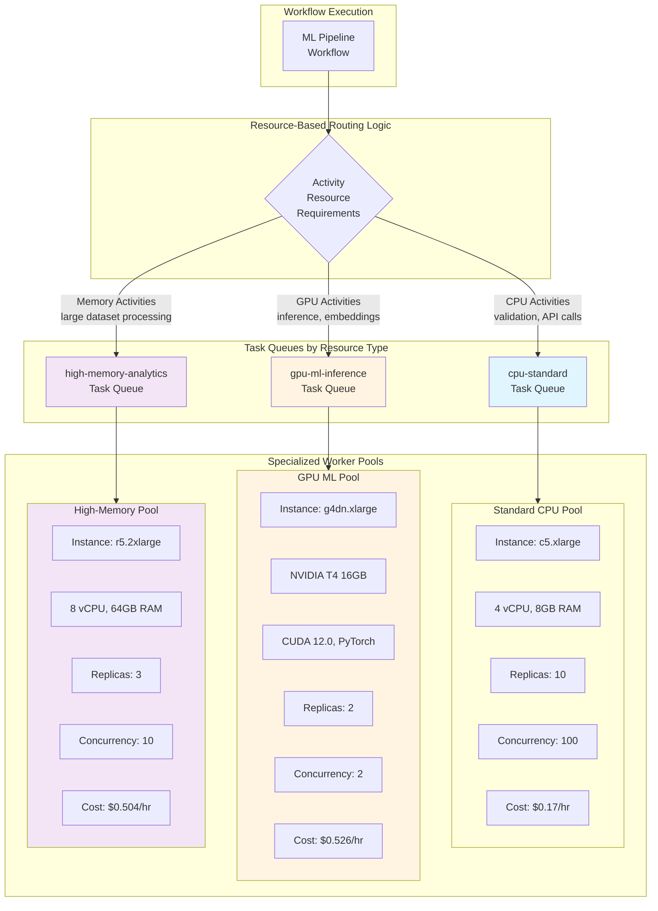

Modern applications have workloads with diverse resource requirements. ML/AI workloads require expensive GPU-equipped Workers with specific CUDA libraries, video processing needs specialized encoding hardware, and data analytics may require high-memory instances. Running all Activities on the same Worker type is cost-prohibitive and inefficient.

## Problem statement

Without separate Task Queues for different resource types, these scenarios create problems:
- **Resource waste:** GPU Workers sit idle waiting for ML work, or expensive GPUs run standard CPU tasks that don't need them
- **Cost inefficiency:** Running all Workers on GPU instances when only 10% of workloads need GPUs increases costs by 20-30x
- **Environment conflicts:** ML libraries (TensorFlow, PyTorch) have complex dependencies that conflict with other Activity requirements
- **Scaling complexity:** Cannot independently scale GPU Workers based on ML demand vs CPU Workers based on standard workload demand

## Solution

Use separate Task Queues to route Activities based on their resource requirements. Create dedicated Worker pools for:
- **GPU-intensive ML workloads** (NVIDIA GPUs, CUDA libraries, limited concurrency due to GPU memory)
- **Standard CPU workloads** (high concurrency on cost-effective instances)
- **High-memory analytics** (memory-optimized instances for large dataset processing)
- **Specialized hardware** (video encoding hardware, TPUs, ARM processors)

## Outcomes

- **Cost optimization:** GPU instances (\$3/hr) only handle ML inference while standard Activities run on cost-effective CPU instances (\$0.10/hr), reducing infrastructure costs by 60-80%
- **Resource efficiency:** GPU Workers run at 2-4 concurrent activities (GPU memory constraints) while CPU Workers run at 100+ concurrent activities, maximizing hardware utilization
- **Independent scaling:** Scale GPU Workers based on ML workload demand, high-memory Workers based on analytics load, and CPU Workers based on standard workload, without coordination
- **Environment isolation:** ML Workers have TensorFlow/PyTorch dependencies isolated from standard Workers, preventing library conflicts and simplifying deployments

## Background and best practices

### Task Queue fundamentals
Task Queues in Temporal are dynamically created when first referenced. If your Workflow references task queue `gpu-processing` but your Worker polls `gpu-procesing` (typo), two separate queues are created and the Worker never receives Tasks.

**Best practice:** Always define Task Queue names as constants in a shared module that both Workflows and Workers import.

### Resource-based routing approaches

Route Activities to appropriate Worker pools based on their resource requirements:
- **GPU-intensive Activities:** Route to GPU-equipped Workers with ML libraries (TensorFlow, PyTorch, CUDA)
- **CPU-intensive Activities:** Route to high-CPU instances for compute-heavy tasks
- **Memory-intensive Activities:** Route to memory-optimized instances for large dataset processing
- **Standard Activities:** Route to cost-effective general-purpose instances

### Worker configuration for specialized hardware

Key considerations for resource-specific Workers:
- **GPU concurrency:** Limit GPU Workers to 2-4 concurrent activities due to GPU memory constraints
- **CPU concurrency:** Standard Workers can handle 100+ concurrent activities
- **Memory allocation:** High-memory Workers need careful concurrency tuning to avoid OOM errors
- **Hardware dependencies:** GPU Workers require NVIDIA drivers, CUDA toolkit, and specific ML library versions
- **Container images:** Use specialized images with pre-installed dependencies (nvidia/cuda, tensorflow/tensorflow:latest-gpu)

### Operational considerations

- **Resource utilization:** Monitor GPU memory, compute utilization, and CPU/memory usage per Worker pool
- **Queue latency:** Track `schedule_to_start_latency` per Task Queue to detect under-provisioning of specialized hardware
- **Cost tracking:** Tag resources by hardware type (GPU, CPU, high-memory) for cost analysis and optimization
- **Hardware health:** Monitor GPU temperature, driver errors, and CUDA out-of-memory errors
- **Dependency management:** Use container images with pinned library versions to ensure reproducible environments

## Target audience

- **Temporal Workflow & Activity developers:** Implementing resource-aware routing logic
- **Platform operators:** Configuring Worker deployments for specialized hardware
- **ML/AI Engineers:** Deploying GPU-based inference and training Workers
- **DevOps/SRE teams:** Managing heterogeneous Worker pools and infrastructure
- **FinOps teams:** Optimizing cloud infrastructure costs through efficient resource allocation

This implementation requires code changes, Worker configuration, and deployment of specialized infrastructure (GPU instances, high-memory instances, specialized hardware).

## Prerequisites

### Required software, infrastructure, and tools

- Temporal Service (Self-hosted or Temporal Cloud)
- Python 3.8 or later
- Temporal Python SDK v1.0.0 or later (`pip install temporalio`)
- GPU infrastructure (AWS EC2 with NVIDIA GPUs, GCP with GPUs) for ML workloads
- Process manager or container orchestration for multi-worker deployments

### Resources & Access Privileges

- Temporal namespace with permissions to start Workflows and register Workers
- Infrastructure provisioning access for GPU instances and multiple Worker pools
- Ability to configure autoscaling policies

### Required Concepts

- Temporal Workflows, Activities, and Task Queues
- Python async/await patterns
- GPU computing basics (for ML scenarios)
- Basic deployment and process management

## Architecture diagram(s)

### Resource-Based Routing Architecture



## Implementation plan

### Step 1: Define Task Queue constants

Create a shared Python module with Task Queue name constants based on resource requirements.

**File: `task_queues.py`**

```python
"""Task Queue constants for resource-based routing."""

# Resource-specific task queues
STANDARD_CPU_QUEUE = "cpu-standard"
GPU_ML_QUEUE = "gpu-ml-inference"
HIGH_MEMORY_QUEUE = "high-memory-analytics"
VIDEO_ENCODING_QUEUE = "video-encoding-hardware"
```

### Step 2: Configure Workers for standard CPU processing

Deploy Workers on cost-effective CPU instances for standard Activities that don't require specialized hardware.

**File: `worker_cpu.py`**

```python
"""Worker for standard CPU-based Activities."""
import asyncio
import logging
from temporalio.client import Client
from temporalio.worker import Worker

from task_queues import STANDARD_CPU_QUEUE
from workflows import MLPipelineWorkflow
from activities import validate_data, preprocess_data, store_results

logging.basicConfig(level=logging.INFO)


async def main():
    client = await Client.connect("localhost:7233")

    worker = Worker(
        client,
        task_queue=STANDARD_CPU_QUEUE,
        workflows=[MLPipelineWorkflow],
        activities=[validate_data, preprocess_data, store_results],
        max_concurrent_activities=100,  # High concurrency on CPU
    )

    logging.info(f"Starting CPU worker on {STANDARD_CPU_QUEUE}")
    await worker.run()


if __name__ == "__main__":
    asyncio.run(main())
```

**Deployment guidance:**
- Deploy 10 instances of `worker_cpu.py` on standard compute instances (c5.xlarge: 4 vCPU, 8GB RAM)
- Use autoscaling based on queue depth and CPU utilization
- Consider using spot instances for cost savings if workload tolerates interruptions

### Step 3: Configure Workers for GPU processing

Deploy Workers on GPU-equipped instances for ML/AI workloads. GPU Workers should have limited concurrency due to GPU memory constraints.

**File: `worker_gpu.py`**

```python
"""Worker for GPU-intensive ML Activities."""
import asyncio
import logging
from temporalio.client import Client
from temporalio.worker import Worker

from task_queues import GPU_ML_QUEUE
from activities import generate_embeddings, run_inference, train_model

logging.basicConfig(level=logging.INFO)


async def main():
    client = await Client.connect("localhost:7233")

    worker = Worker(
        client,
        task_queue=GPU_ML_QUEUE,
        activities=[generate_embeddings, run_inference, train_model],
        # Limited concurrency - GPU memory constraint
        # T4 16GB can typically handle 2-4 concurrent inference tasks
        max_concurrent_activities=2,
    )

    logging.info(f"Starting GPU worker on {GPU_ML_QUEUE}")
    await worker.run()


if __name__ == "__main__":
    asyncio.run(main())
```

**Deployment guidance:**
- Deploy 2-3 instances of `worker_gpu.py` on GPU instances (g4dn.xlarge with NVIDIA T4, or p3.2xlarge with V100)
- GPU Workers require:
  - NVIDIA drivers (version 525.60 or later)
  - CUDA toolkit (12.0 or later)
  - ML frameworks (PyTorch, TensorFlow) with GPU support
- Use container images: `nvidia/cuda:12.0-cudnn8-runtime-ubuntu22.04` or `pytorch/pytorch:2.0.0-cuda11.7-cudnn8-runtime`
- Monitor GPU memory usage - adjust `max_concurrent_activities` if OOM errors occur
- Consider using GPU-optimized instance types based on model requirements (T4 for inference, V100/A100 for training)

### Step 4: Configure Workers for high-memory analytics

Deploy Workers on memory-optimized instances for Activities processing large datasets.

**File: `worker_high_memory.py`**

```python
"""Worker for high-memory data processing Activities."""
import asyncio
import logging
from temporalio.client import Client
from temporalio.worker import Worker

from task_queues import HIGH_MEMORY_QUEUE
from activities import process_large_dataset, aggregate_analytics, build_large_index

logging.basicConfig(level=logging.INFO)


async def main():
    client = await Client.connect("localhost:7233")

    worker = Worker(
        client,
        task_queue=HIGH_MEMORY_QUEUE,
        activities=[process_large_dataset, aggregate_analytics, build_large_index],
        # Limited concurrency due to high memory usage per activity
        # r5.2xlarge (64GB RAM) can handle ~10 concurrent activities using 5-6GB each
        max_concurrent_activities=10,
    )

    logging.info(f"Starting high-memory worker on {HIGH_MEMORY_QUEUE}")
    await worker.run()


if __name__ == "__main__":
    asyncio.run(main())
```

**Deployment guidance:**
- Deploy 3-5 instances of `worker_high_memory.py` on memory-optimized instances (r5.2xlarge: 8 vCPU, 64GB RAM)
- Adjust `max_concurrent_activities` based on per-activity memory usage to prevent OOM errors
- Monitor memory utilization and swap usage
- Consider using instances with local NVMe storage for faster I/O on large datasets

### Step 5: Implement resource-aware routing in Workflows

**File: `ml_pipeline_workflow.py`**

```python
"""Workflow with resource-aware routing."""
from datetime import timedelta
from dataclasses import dataclass
from temporalio import workflow

with workflow.unsafe.imports_passed_through():
    from task_queues import STANDARD_CPU_QUEUE, GPU_ML_QUEUE, HIGH_MEMORY_QUEUE


@dataclass
class MLPipelineRequest:
    pipeline_id: str
    dataset_url: str
    model_type: str
    customer_id: str


@workflow.defn
class MLPipelineWorkflow:
    """
    ML pipeline workflow with resource-aware routing.

    Routes Activities to appropriate Worker pools based on resource requirements:
    - CPU queue: Data validation, preprocessing, result storage
    - GPU queue: Model training, inference, embeddings generation
    - High-memory queue: Large dataset processing, analytics aggregation
    """

    @workflow.run
    async def run(self, request: MLPipelineRequest) -> dict:
        workflow.logger.info(f"Starting ML pipeline {request.pipeline_id}")

        # Step 1: Validate data (CPU queue - lightweight validation)
        validation_result = await workflow.execute_activity(
            "validate_data",
            {"dataset_url": request.dataset_url},
            task_queue=STANDARD_CPU_QUEUE,
            start_to_close_timeout=timedelta(minutes=2),
        )

        if not validation_result["valid"]:
            return {"status": "validation_failed", "error": validation_result["error"]}

        # Step 2: Process large dataset (High-memory queue - loads full dataset into memory)
        processed_data = await workflow.execute_activity(
            "process_large_dataset",
            {"dataset_url": request.dataset_url, "pipeline_id": request.pipeline_id},
            task_queue=HIGH_MEMORY_QUEUE,
            start_to_close_timeout=timedelta(hours=1),
        )

        # Step 3: Train model (GPU queue - requires GPU for training)
        model_result = await workflow.execute_activity(
            "train_model",
            {
                "model_type": request.model_type,
                "data_path": processed_data["output_path"],
                "pipeline_id": request.pipeline_id,
            },
            task_queue=GPU_ML_QUEUE,
            start_to_close_timeout=timedelta(hours=4),
        )

        # Step 4: Generate embeddings (GPU queue - GPU-accelerated inference)
        embeddings = await workflow.execute_activity(
            "generate_embeddings",
            {
                "model_path": model_result["model_path"],
                "customer_id": request.customer_id,
            },
            task_queue=GPU_ML_QUEUE,
            start_to_close_timeout=timedelta(minutes=30),
        )

        # Step 5: Store results (CPU queue - simple I/O operation)
        await workflow.execute_activity(
            "store_results",
            {
                "pipeline_id": request.pipeline_id,
                "embeddings": embeddings,
                "model_metrics": model_result["metrics"],
            },
            task_queue=STANDARD_CPU_QUEUE,
            start_to_close_timeout=timedelta(minutes=5),
        )

        return {
            "status": "completed",
            "pipeline_id": request.pipeline_id,
            "model_path": model_result["model_path"],
            "embeddings_count": len(embeddings["vectors"]),
        }
```

**File: `activities.py`**

```python
"""Activity implementations for different resource requirements."""
from temporalio import activity
import asyncio


# ===== CPU-based activities (STANDARD_CPU_QUEUE) =====

@activity.defn
async def validate_data(data: dict) -> dict:
    """
    Validate input data (runs on standard CPU workers).

    Lightweight validation that doesn't require specialized hardware.
    """
    activity.logger.info(f"Validating dataset at {data['dataset_url']}")

    # Validation logic
    is_valid = True  # Simplified validation

    return {
        "valid": is_valid,
        "dataset_url": data["dataset_url"],
        "error": None if is_valid else "Invalid dataset format",
    }


@activity.defn
async def preprocess_data(data: dict) -> dict:
    """Basic data preprocessing (runs on CPU workers)."""
    activity.logger.info("Preprocessing data")

    # Lightweight preprocessing
    return {"preprocessed": True, "records": 1000}


@activity.defn
async def store_results(data: dict) -> dict:
    """Store pipeline results (runs on CPU workers)."""
    activity.logger.info(f"Storing results for pipeline {data['pipeline_id']}")

    # Store to database or object storage
    return {"stored": True, "pipeline_id": data["pipeline_id"]}


# ===== GPU-based activities (GPU_ML_QUEUE) =====

@activity.defn
async def train_model(data: dict) -> dict:
    """
    Train ML model (runs on GPU workers).

    Requires GPU for acceptable training performance.
    """
    activity.logger.info(f"Training {data['model_type']} model on GPU")

    import torch

    device = torch.device("cuda" if torch.cuda.is_available() else "cpu")
    activity.logger.info(f"Using device: {device}")

    # Simulate training
    # In production: load data, initialize model, train
    await asyncio.sleep(5)  # Simulate training time

    model_path = f"/models/{data['pipeline_id']}/model.pth"

    activity.logger.info(f"Training complete, model saved to {model_path}")

    return {
        "model_path": model_path,
        "metrics": {"accuracy": 0.95, "loss": 0.05},
        "device": str(device),
    }


@activity.defn
async def generate_embeddings(data: dict) -> dict:
    """
    Generate embeddings using ML model (runs on GPU workers).

    Requires GPU hardware for acceptable performance.
    """
    activity.logger.info("Generating embeddings on GPU")

    import torch
    from sentence_transformers import SentenceTransformer

    # Load model (cached after first load)
    model = SentenceTransformer("all-MiniLM-L6-v2")
    device = torch.device("cuda" if torch.cuda.is_available() else "cpu")
    model = model.to(device)

    # Generate embeddings (simplified for example)
    texts = [f"Sample text {i}" for i in range(100)]
    embeddings = model.encode(texts, convert_to_tensor=True)

    activity.logger.info(f"Generated {len(embeddings)} embeddings on {device}")

    return {
        "vectors": embeddings.cpu().tolist(),
        "customer_id": data["customer_id"],
        "dimension": embeddings.shape[1],
    }


@activity.defn
async def run_inference(data: dict) -> dict:
    """Run ML inference (runs on GPU workers)."""
    activity.logger.info("Running inference on GPU")

    import torch
    device = torch.device("cuda" if torch.cuda.is_available() else "cpu")

    # Model inference logic
    activity.logger.info(f"Inference completed on {device}")

    return {"predictions": [], "confidence": 0.95, "device": str(device)}


# ===== High-memory activities (HIGH_MEMORY_QUEUE) =====

@activity.defn
async def process_large_dataset(data: dict) -> dict:
    """
    Process large dataset (runs on high-memory workers).

    Loads entire dataset into memory for processing.
    Requires 32-64GB RAM for typical datasets.
    """
    activity.logger.info(f"Processing large dataset from {data['dataset_url']}")

    # In production: load dataset (pandas, dask, spark)
    # Process in-memory transformations
    await asyncio.sleep(10)  # Simulate processing time

    output_path = f"/data/processed/{data['pipeline_id']}/dataset.parquet"

    activity.logger.info(f"Dataset processed, saved to {output_path}")

    return {
        "output_path": output_path,
        "records_processed": 10_000_000,
        "memory_used_gb": 45,
    }


@activity.defn
async def aggregate_analytics(data: dict) -> dict:
    """
    Aggregate analytics from large datasets (runs on high-memory workers).

    Performs in-memory aggregations on large datasets.
    """
    activity.logger.info("Running analytics aggregation")

    # In-memory aggregation logic
    await asyncio.sleep(5)

    return {
        "aggregations": {"total": 1000000, "average": 42.5},
        "memory_used_gb": 38,
    }


@activity.defn
async def build_large_index(data: dict) -> dict:
    """
    Build search index from large dataset (runs on high-memory workers).

    Requires significant memory to build index structures.
    """
    activity.logger.info("Building large search index")

    # Build index in memory
    await asyncio.sleep(8)

    return {
        "index_path": "/indexes/search_index.bin",
        "index_size_gb": 25,
        "documents_indexed": 50_000_000,
    }
```


**Starter example:**

```python
# start_ml_pipeline.py
"""Start ML pipeline workflow with resource-aware routing."""
import asyncio
from temporalio.client import Client
from ml_pipeline_workflow import MLPipelineWorkflow, MLPipelineRequest


async def main():
    client = await Client.connect("localhost:7233")

    pipeline_request = MLPipelineRequest(
        pipeline_id="ml-pipeline-2024-001",
        dataset_url="s3://datasets/customer-behavior-10m.parquet",
        model_type="transformer",
        customer_id="customer-456",
    )

    handle = await client.start_workflow(
        MLPipelineWorkflow.run,
        pipeline_request,
        id=f"ml-pipeline-{pipeline_request.pipeline_id}",
        task_queue="workflows",
    )

    print(f"Started ML pipeline workflow: {handle.id}")

    # Wait for result (or use handle.describe() to check status)
    result = await handle.result()
    print(f"Pipeline completed: {result}")


if __name__ == "__main__":
    asyncio.run(main())
```

## Conclusion

By implementing separate Task Queues for resource-based routing, you have achieved:

1. **Cost optimization:** GPU instances (g4dn.xlarge at $0.526/hr) only handle ML training and inference, while standard CPU Activities run on cost-effective instances (c5.xlarge at $0.17/hr), and high-memory analytics run on memory-optimized instances (r5.2xlarge at $0.504/hr). This targeted resource allocation reduces infrastructure costs by 60-80% compared to running everything on GPU instances.

2. **Resource efficiency:** GPU Workers run at 2-4 concurrent activities (constrained by GPU memory), CPU Workers run at 100+ concurrent activities, and high-memory Workers run at 10 concurrent activities (constrained by RAM). Each Worker pool is optimized for its specific resource constraints.

3. **Independent scaling:** Scale GPU Workers based on ML workload demand, high-memory Workers based on analytics load, and CPU Workers based on standard workload volume, without coordination between pools. Each pool can scale independently based on its queue depth and resource utilization.

4. **Environment isolation:** ML Workers with TensorFlow/PyTorch/CUDA dependencies are isolated from standard Workers, preventing library conflicts and simplifying deployment. Each Worker type can use specialized container images with only the dependencies it needs.

Your application now intelligently routes work based on resource requirements, ensuring efficient hardware utilization and cost-effective infrastructure allocation.

## Related Resources

### Official Documentation
- [Temporal Documentation - Task Routing](https://docs.temporal.io/task-routing)
- [Temporal Best Practices - Separate Task Queues](https://docs.temporal.io/best-practices/worker#separate-task-queues-logically)
- [Python SDK Worker Configuration](https://python.temporal.io/temporalio.worker.Worker.html)

### Related Patterns
- [Separate Task Queues - Worker Affinity](worker-execution-affinity) - For Activities that must run on the same Worker instance
- [Separate Task Queues - Rate Limiting](rate-limit-downstream-apis) - For protecting downstream APIs with rate limits

### Code Samples
- [GPU-Accelerated Image Processing (Python)](https://github.com/temporalio/samples-python) - Example of GPU worker configuration
- [Worker Versioning with Task Queues](https://github.com/temporalio/samples-python/tree/main/worker_versioning) - Managing different Worker versions

### Community Resources
- [Blog: AI, ML, and Data Engineering Workflows with Temporal](https://temporal.io/blog/ai-ml-and-data-engineering-workflows-with-temporal)
- [Forum: Task Queue Best Practices](https://community.temporal.io/t/in-what-situation-should-we-use-multiple-separated-task-queues/1254)
- [Temporal ML/AI Use Cases](https://temporal.io/use-cases/machine-learning)