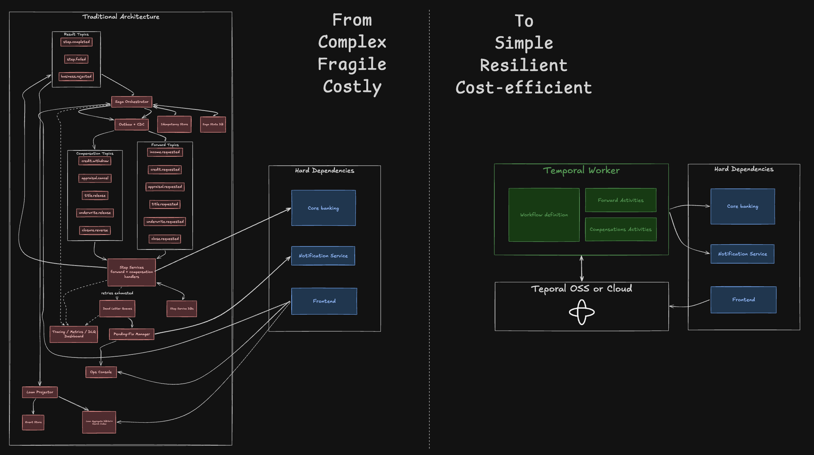
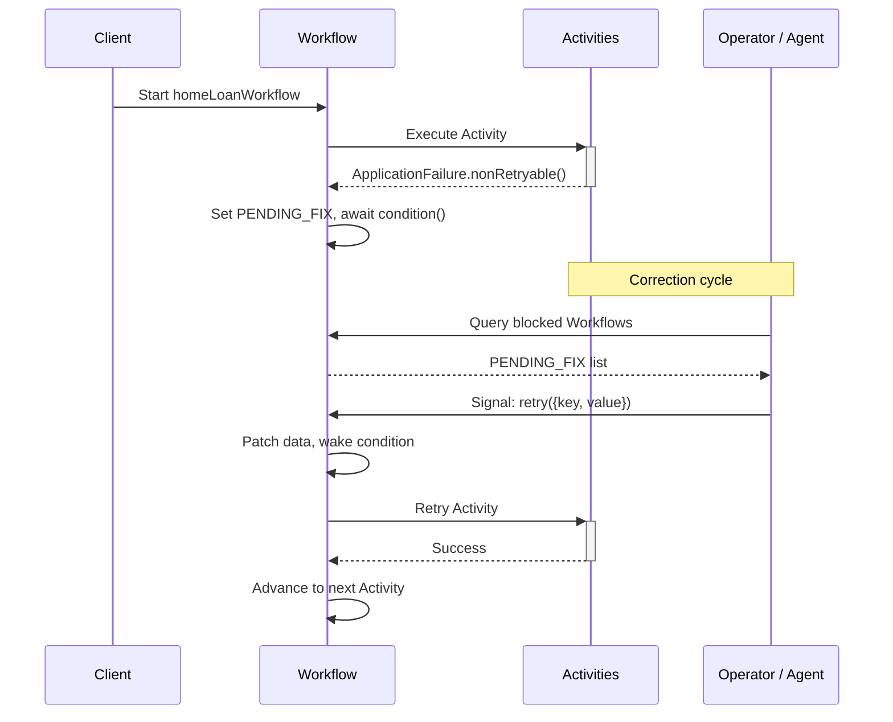

This pattern shows how to build a multi-step business process that pauses when it hits a permanent failure — a malformed identifier, an exceeded policy limit, a failed compliance check — allows a human or automated agent to correct the underlying issue, and resumes from where it stopped without restarting from the beginning.
Queryable metadata routes each blocked process to the right resolution resource, and operators get full visibility into the state of every individual execution and across the entire pipeline.


## Problem statement

Business processes such as loan origination, insurance claims, and onboarding involve sequential steps where certain failures — invalid input, regulatory violations, business policy breaches — cannot be resolved by automated retries.
An invalid Social Security number will never pass a credit check regardless of how often you retry it.
A title search against a missing property identifier will return the same error no matter how many times you repeat it.
These failures require someone to inspect the error, correct the data, and instruct the process to continue.

Without a durable orchestration layer, teams typically implement this by writing failed records to a dead-letter queue, building a separate reconciliation service, and stitching together polling loops to resume processing.
This approach is fragile: the process state lives across multiple systems, corrections are ad-hoc, and operators have no single view of which applications need attention and why.
When something goes wrong, the common workaround is to fix the data and restart the entire process from the beginning, losing all progress from steps that already completed.

## Solution

You will use a Temporal Workflow to orchestrate a six-step home loan processing pipeline.
When a step encounters a problem that retries alone cannot solve — a missing document, a policy limit breach, or a regulatory hold — it throws a non-retryable `ApplicationFailure` and the Workflow pauses, preserving all progress.
Custom Search Attributes advertise the blocked state so that operators or AI agents can find and prioritize the right cases.
An operator sends a Signal containing corrected data, which patches the application in-place and wakes the Workflow to retry the failed step.
The process picks up where it left off: completed steps do not re-execute, and the full correction history is preserved.

## Architectural benefit

While you can use traditional architectures to implement a similar solution, they often involve significantly more complexity and demand higher implementation and operational costs. A Temporal-based solution is typically much leaner and more robust.



## What you will achieve

By completing this pattern, you will:

- Pause a business process on a non-retryable failure and resume after correction without restarting from the beginning.
- Unwind side-effecting steps through a LIFO **saga** compensation stack when forward progress is not possible — for example, a compliance block or an explicit cancellation from the applicant.
- Recover from compensation failures using the same pause-and-fix loop so a stuck rollback does not leave the process in a partially unwound state.
- Route blocked processes to the right human or automated agent using queryable Search Attributes.
- Inspect the current state of any individual process or filter across all processes through a single API.
- Maintain a complete audit trail of every data correction and every compensation applied during the lifecycle of each process.

## Background and best practices

Temporal Workflows persist their execution state, including local variables, call stacks, and pending Timers, to the Temporal Cluster.
When a Workflow suspends on `condition()`, the Worker completes the Workflow Task and the execution can be evicted from the Worker's in-memory cache to make room for other Workflows, freeing the associated resources.
The Workflow resumes where it left off when the condition becomes true, regardless of how much wall-clock time passes.
This means thousands of loan applications can sit in a `PENDING_FIX` state simultaneously without consuming Worker capacity.

The primary architectural challenge is distinguishing between transient failures that automated retries can resolve and permanent failures that require human intervention.
Temporal addresses this with [`ApplicationFailure.nonRetryable()`](https://docs.temporal.io/references/failures#application-failure), which instructs the SDK to skip the Retry Policy and propagate the error to the Workflow code without delay.
The Workflow then has full control over how to handle the failure: it can log the error, update Search Attributes for visibility, and suspend until a [Signal](https://docs.temporal.io/develop/typescript/message-passing#signals) arrives.

Custom [Search Attributes](https://docs.temporal.io/visibility#search-attribute) provide the mechanism for routing blocked Workflows to the correct resolution resource.
By upserting attributes like `LoanStatus` and `FailedActivity` at each State Transition, you create a queryable index across all active Workflows.
An operations dashboard can filter for `LoanStatus = 'PENDING_FIX' AND FailedActivity = 'runCreditCheck'` to show which applications need a credit-related data correction.
This same query interface supports automated agents that poll for specific failure categories and apply corrections programmatically.

Temporal [Queries](https://docs.temporal.io/develop/typescript/message-passing#queries) provide synchronous read access to the current state of any running Workflow.
Unlike Search Attributes, which expose denormalized metadata for cross-Workflow queries, Queries return the full internal state of a single execution.
Together, Search Attributes and Queries give you both the aggregate view across your entire pipeline and the detailed view into any individual Workflow.

## Target audience

Engineers familiar with Temporal foundations who need to handle long-running, complex business processes.

## Prerequisites

To execute the steps in this pattern, you must have:

- **Required software, infrastructure, and tools:** Temporal TypeScript SDK v1.13.0 or later, Node.js v18 or later, Temporal CLI v1.6.1 or later.
- **Resources and access privileges:** A running Temporal Cluster (local dev server or Temporal Cloud) with permissions to create custom Search Attributes and start Workflows.
- **Required concepts:** Familiarity with Temporal Workflows, Activities, Signals, Queries, Search Attributes, and Workers.

Install the Temporal CLI and start a local dev server:

```bash
# macOS
brew install temporal

# Or download directly from https://docs.temporal.io/cli#install

# Start the local development server
temporal server start-dev
```

This starts a Temporal Server on `localhost:7233` with the Web UI at `http://localhost:8233`.

**Note:** This guide uses the TypeScript SDK but the pattern apply to any Temporal SDK.

## Architecture diagram

The following diagram illustrates the flow of a loan application through the six-step pipeline, including the pause-and-resume cycle when an Activity encounters a permanent failure.



1. A client starts `homeLoanWorkflow` with the loan application data.
2. The Workflow executes Activities sequentially. On a non-retryable failure, the Activity throws `ApplicationFailure.nonRetryable()`.
3. The Workflow catches the error, sets Search Attributes to `PENDING_FIX`, and suspends via `await condition(() => retryRequested)`.
4. An operator or agent queries for blocked Workflows, sends a corrective Signal with the field name and new value.
5. The Signal handler patches the data, records the fix, and wakes the Workflow.
6. The Workflow retries the failed Activity. On success it advances; on failure the cycle repeats from step 3.

## Implementation plan

Prior to executing this plan, ensure you have your Temporal Cluster running and the custom Search Attributes created.

### Create custom Search Attributes

Before writing any code, register the custom Search Attributes that your Workflow will use to advertise its state.
These attributes enable the visibility queries that route blocked Workflows to the appropriate resolution resource.

```bash
temporal operator search-attribute create --name LoanStatus --type Keyword
temporal operator search-attribute create --name FailedActivity --type Keyword
```

`LoanStatus` tracks the current pipeline stage: `STARTED`, `INCOME_VERIFIED`, `CREDIT_CHECKED`, `APPRAISAL_ORDERED`, `TITLE_SEARCHED`, `UNDERWRITTEN`, `CLOSED`, or `PENDING_FIX`.
`FailedActivity` records the name of the Activity that caused the failure.
Together, these two attributes allow you to write queries like `LoanStatus = 'PENDING_FIX' AND FailedActivity = 'runCreditCheck'` to find every application blocked on a credit check.

### Define data models

Create the interfaces that define the data flowing through Workflows and Activities.
It is a best practice to use a single serializable input to Workflows and Activities.

```typescript
// src/models.ts

// Input data for the loan processing pipeline
export interface LoanApplication {
  applicationId: string;
  applicantName: string;
  ssn: string;
  employerName: string;
  annualIncome: number;
  propertyAddress: string;
  propertyId: string;
  loanAmount: number;
  downPayment: number;
}

// Tracks the current pipeline stage; PENDING_FIX means the Workflow is waiting for a correction
export type LoanStatus =
  | 'STARTED'
  | 'INCOME_VERIFIED'
  | 'CREDIT_CHECKED'
  | 'APPRAISAL_ORDERED'
  | 'TITLE_SEARCHED'
  | 'UNDERWRITTEN'
  | 'CLOSED'
  | 'PENDING_FIX'
  | 'FAILED';

// Records a single data correction applied during execution
export interface FixEntry {
  activity: string;   // which Activity was blocked
  field: string;      // which field was corrected
  oldValue: string;
  newValue: string;
  error: string;      // the failure message that triggered the fix
  id?: string;        // client-supplied idempotency key for duplicate Signal detection
}

// Complete queryable state of a pipeline execution
export interface LoanState {
  status: LoanStatus;
  failedActivity: string;
  failureMessage: string;
  completedActivities: string[];  // Activities that have already succeeded
  fixHistory: FixEntry[];         // audit trail of all corrections
  application: LoanApplication;   // current data including patches
}

// Signal payload: the field to correct and its new value
export interface RetryUpdate {
  key?: keyof LoanApplication | '';
  value?: string;
  id?: string;  // optional idempotency key — Signals are at-least-once
}
```

### Define the Activities

Create functions that validate loan application data at each pipeline stage.
Temporal Activities automatically recover from transient failures — network timeouts, temporary service unavailability, rate limits — through their built-in [Retry Policy](https://docs.temporal.io/encyclopedia/retry-policies) and [timeout management](https://docs.temporal.io/develop/typescript/failure-detection#activity-timeouts).
When an Activity encounters a permanent failure that retries cannot fix — invalid input data, a policy violation, or a missing record — it throws `ApplicationFailure.nonRetryable()` to bypass the Retry Policy and propagate the error directly to the Workflow.

```typescript
// src/activities.ts

import { ApplicationFailure } from '@temporalio/activity';

// Step 1: Validate the applicant's employment and income
export async function verifyIncome(
  applicantName: string,
  employerName: string,
  annualIncome: number
): Promise<string> {
  // Unrecognized employer — cannot verify
  if (employerName === 'UNKNOWN_EMPLOYER') {
    throw ApplicationFailure.nonRetryable(
      `Employer "${employerName}" not found in verification database for ${applicantName}`
    );
  }
  if (annualIncome <= 0) {
    throw ApplicationFailure.nonRetryable(
      `Invalid annual income: $${annualIncome} for ${applicantName}`
    );
  }
  return `Income verified: ${applicantName} earns $${annualIncome}/yr at ${employerName}`;
}

// Step 2: Pull credit report using the applicant's SSN
export async function runCreditCheck(
  applicantName: string,
  ssn: string
): Promise<string> {
  // Malformed SSN — no retry will fix this
  if (ssn === '000-00-0000' || ssn.length < 11) {
    throw ApplicationFailure.nonRetryable(
      `Invalid SSN "${ssn}" for ${applicantName} — cannot pull credit report`
    );
  }
  return `Credit check passed for ${applicantName}: score 750`;
}

// Step 3: Order a property appraisal
export async function orderAppraisal(
  propertyAddress: string,
  loanAmount: number
): Promise<string> {
  // Invalid property address
  if (propertyAddress === '' || propertyAddress === 'INVALID_ADDRESS') {
    throw ApplicationFailure.nonRetryable(
      `Cannot order appraisal — invalid property address: "${propertyAddress}"`
    );
  }
  return `Appraisal completed for ${propertyAddress}: valued at $${loanAmount * 1.1}`;
}

// Step 4: Verify the property title is clear
export async function performTitleSearch(
  propertyId: string,
  propertyAddress: string
): Promise<string> {
  // Missing or invalid property ID
  if (propertyId === '' || propertyId === 'MISSING') {
    throw ApplicationFailure.nonRetryable(
      `Title search failed — missing or invalid property ID: "${propertyId}" for ${propertyAddress}`
    );
  }
  return `Title is clear for property ${propertyId} at ${propertyAddress}`;
}

// Step 5: Check debt-to-income ratio against lending policy
export async function underwrite(
  applicantName: string,
  annualIncome: number,
  loanAmount: number,
  downPayment: number
): Promise<string> {
  const dti = ((loanAmount - downPayment) / annualIncome) * 100;
  // DTI above 400% exceeds policy limit — needs a larger down payment or lower loan amount
  if (dti > 400) {
    throw ApplicationFailure.nonRetryable(
      `Underwriting denied for ${applicantName} — debt-to-income ratio ${dti.toFixed(0)}% exceeds 400% limit`
    );
  }
  return `Underwriting approved for ${applicantName}: DTI ${dti.toFixed(0)}%`;
}

// Step 6: Finalize and fund the loan
export async function closeLoan(
  applicationId: string,
  applicantName: string,
  loanAmount: number
): Promise<string> {
  return `Loan ${applicationId} closed for ${applicantName}: $${loanAmount} funded`;
}
```

Each Activity validates its inputs against business rules and throws `ApplicationFailure.nonRetryable()` when the data is fundamentally invalid.
The `nonRetryable` designation is critical: it instructs the Temporal SDK to skip the Retry Policy entirely and propagate the error directly to the Workflow.
This distinguishes failures that require human judgment — corrupt input, policy breaches, compliance blocks — from transient infrastructure failures that retries can resolve.

### Implement the Workflow with the recoverableStep pattern

You will now create the Workflow that orchestrates the six-step pipeline.
The central mechanism is the `recoverableStep` helper function that wraps each Activity call in a pause-and-resume loop.

```typescript
// src/workflows.ts

import {
  proxyActivities,
  defineSignal,
  defineQuery,
  setHandler,
  condition,
  upsertSearchAttributes,
  log,
  ActivityFailure,
  isCancellation,
} from '@temporalio/workflow';
import { defineSearchAttributeKey } from '@temporalio/common';
import type * as activities from './activities';
import type { FixEntry, LoanApplication, LoanState, LoanStatus, RetryUpdate } from './models';

// Typed Search Attribute keys — used in both upsertSearchAttributes and client start options
const LoanStatusKey = defineSearchAttributeKey('LoanStatus', 'KEYWORD');
const FailedActivityKey = defineSearchAttributeKey('FailedActivity', 'KEYWORD');

const {
  verifyIncome,
  runCreditCheck,
  orderAppraisal,
  performTitleSearch,
  underwrite,
  closeLoan,
} = proxyActivities<typeof activities>({
  // In production, split into multiple proxies and tune per Activity; long-running steps
  // should also call heartbeat() with a heartbeatTimeout.
  startToCloseTimeout: '10 seconds',
  // Use the default retry policy for transient failures.
  // ApplicationFailure.nonRetryable() bypasses retries for permanent failures.
});

// Signal to deliver corrected data; Query to read current pipeline state
export const retrySignal = defineSignal<[RetryUpdate]>('retry');
export const getStateQuery = defineQuery<LoanState>('getState');

export async function homeLoanWorkflow(application: LoanApplication): Promise<LoanState> {
  // Mutable copy — patched in-place by the Signal handler when corrections arrive
  const app = { ...application };
  let status: LoanStatus = 'STARTED';
  let failedActivity = '';
  let failureMessage = '';
  let retryRequested = false;
  const completedActivities: string[] = [];
  const fixHistory: FixEntry[] = [];

  // Publish pipeline state as Search Attributes so operators can query across all Workflows
  const updateStatus = (newStatus: LoanStatus, activity = '', message = '') => {
    status = newStatus;
    failedActivity = activity;
    failureMessage = message;
    upsertSearchAttributes([
      { key: LoanStatusKey, value: newStatus },
      { key: FailedActivityKey, value: activity },
    ]);
  };

  // Query handler — returns a snapshot of the full pipeline state without side effects
  setHandler(getStateQuery, () => ({
    status,
    failedActivity,
    failureMessage,
    completedActivities: [...completedActivities],
    fixHistory: [...fixHistory],
    application: { ...app },
  }));

  // Signal handler — patches the application data and wakes the suspended Workflow.
  // Signals are at-least-once: clients can retry on transport hiccups, so dedupe
  // via the caller-supplied id stored on FixEntry.
  setHandler(retrySignal, (update: RetryUpdate) => {
    if (update.id && fixHistory.some((f) => f.id === update.id)) {
      log.warn(`Duplicate retry signal ignored: ${update.id}`);
      return;
    }
    if (update.key) {
      const key = update.key as keyof LoanApplication;
      const oldValue = String((app as any)[key]);
      if (key === 'annualIncome' || key === 'loanAmount' || key === 'downPayment') {
        (app as any)[key] = parseFloat(update.value ?? '0');
      } else {
        (app as any)[key] = update.value ?? '';
      }
      fixHistory.push({
        activity: failedActivity,
        field: key,
        oldValue,
        newValue: update.value ?? '',
        error: failureMessage,
        id: update.id,
      });
      log.info(`Fix received ${key}: ${oldValue} -> ${update.value}`);
    } else {
      log.info('Retry requested without patch');
    }
    retryRequested = true; // unblocks the condition() below
  });

  // Core pattern: wrap each Activity in a pause-and-resume loop.
  // On failure, advertise PENDING_FIX via Search Attributes and suspend
  // until a Signal delivers corrected data, then retry the same Activity.
  const recoverableStep = async <T>(
    activityName: string,
    fn: () => Promise<T>
  ): Promise<T> => {
    while (true) {
      try {
        const result = await fn();
        return result;
      } catch (e) {
        // Anything that isn't an ActivityFailure (workflow-side bug, non-determinism)
        // is treated as a workflow task failure by Temporal and retried — let it surface.
        if (!(e instanceof ActivityFailure)) throw e;
        // Cancellation arrives wrapped as ActivityFailure; propagate so the workflow unwinds.
        if (isCancellation(e)) throw e;
        // Activity errors are wrapped in ActivityFailure; the original message is in .cause
        const message = e.cause?.message || e.message || String(e);
        log.warn(`Activity ${activityName} failed: ${message}`);
        updateStatus('PENDING_FIX', activityName, message);
        retryRequested = false;
        // Suspend the Workflow — no resources consumed while waiting
        await condition(() => retryRequested);
        updateStatus('STARTED', '', '');
        log.info(`Retrying activity ${activityName} after fix`);
      }
    }
  };

  await recoverableStep('verifyIncome', () =>
    verifyIncome(app.applicantName, app.employerName, app.annualIncome)
  );
  completedActivities.push('verifyIncome');
  updateStatus('INCOME_VERIFIED');

  await recoverableStep('runCreditCheck', () =>
    runCreditCheck(app.applicantName, app.ssn)
  );
  completedActivities.push('runCreditCheck');
  updateStatus('CREDIT_CHECKED');

  await recoverableStep('orderAppraisal', () =>
    orderAppraisal(app.propertyAddress, app.loanAmount)
  );
  completedActivities.push('orderAppraisal');
  updateStatus('APPRAISAL_ORDERED');

  await recoverableStep('performTitleSearch', () =>
    performTitleSearch(app.propertyId, app.propertyAddress)
  );
  completedActivities.push('performTitleSearch');
  updateStatus('TITLE_SEARCHED');

  await recoverableStep('underwrite', () =>
    underwrite(app.applicantName, app.annualIncome, app.loanAmount, app.downPayment)
  );
  completedActivities.push('underwrite');
  updateStatus('UNDERWRITTEN');

  await recoverableStep('closeLoan', () =>
    closeLoan(app.applicationId, app.applicantName, app.loanAmount)
  );
  completedActivities.push('closeLoan');
  updateStatus('CLOSED');

  return {
    status,
    failedActivity,
    failureMessage,
    completedActivities: [...completedActivities],
    fixHistory: [...fixHistory],
    application: { ...app },
  };
}
```

The `homeLoanWorkflow` orchestrates the entire loan processing pipeline.
The `recoverableStep` helper function wraps each Activity call in a `while (true)` loop.
When an Activity throws, the helper updates the `LoanStatus` Search Attribute to `PENDING_FIX` and the `FailedActivity` Search Attribute to the name of the failed Activity.
It then calls `await condition(() => retryRequested)`, which suspends the Workflow until a Signal delivers corrected data.

The catch block narrows the error before suspending. It first re-throws anything that is not an `ActivityFailure` — a Workflow-side bug or a non-determinism error should fail the Workflow Task and let Temporal retry it, not be silently parked in `PENDING_FIX`. It then re-throws on `isCancellation(e)`, since cancellation arrives wrapped as an `ActivityFailure` and must propagate so the framework can unwind the Workflow cleanly.

The Signal handler receives a `RetryUpdate` containing the field name and corrected value.
It patches the `app` object in-place, records the correction in `fixHistory`, and sets `retryRequested = true` to wake the suspended `condition()`.
The loop then retries the Activity with the patched data.
If the Activity succeeds, the loop exits and the pipeline advances.
If it fails again, the cycle repeats.

Temporal delivers Signals with at-least-once semantics: a client retry, a flaky network, or an over-eager UI can submit the same correction twice and the Workflow will see both copies.
Without protection, the second delivery would overwrite the field again — usually a no-op, but harmful when the operator has since sent a different value, and always noisy in `fixHistory`.
The handler defends against this by checking the caller-supplied `id` against the audit trail and dropping anything it has already applied.
The client (the dashboard, CLI script, or upstream agent) is responsible for generating a stable `id` per logical correction — typically a UUID minted when the operator clicks **Patch and Retry**, reused across any retries of that same submission.
[Workflow Updates](https://docs.temporal.io/encyclopedia/workflow-message-passing#updates) would give you this deduplication for free via the SDK's built-in `updateId` handling, along with a synchronous result to the caller; this pattern sticks with Signals because the dashboard is fire-and-forget and the audit trail already provides the dedup index.

The Query handler returns the complete `LoanState` at any point during execution.
This includes the current status, the list of completed Activities, the full fix history, and the current application data.
External systems can poll this Query to display real-time pipeline progress.

By calling `upsertSearchAttributes` at every State Transition, the Workflow maintains a denormalized index that the Temporal Visibility API can query across all active Workflows.
This enables an operations dashboard to display aggregate statistics and filter by any combination of status and failed Activity.

### Add saga compensation for side-effecting steps

Not every failure can be resolved by correcting input data.
An OFAC match, a withdrawn offer, or a regulatory hold demands that the pipeline roll back rather than pause for a fix.
This is where the [saga pattern](https://temporal-design-patterns.fly.dev/saga-pattern.html) comes in: each forward Activity that produces an external side effect — a credit bureau inquiry, an appraiser booking, a title company fee, a reserved lending slot, a funded loan — registers a compensating Activity **before** it executes.
If the forward pipeline aborts, the Workflow unwinds the registered compensations in reverse order.

The pattern has three key discipline points that the implementation must honor:

1. **Register before execution.** Compensations are registered before the forward call to handle partial failures. Consider `orderAppraisal`: the Worker POSTs a booking to the appraisal vendor, the vendor records the booking and reserves the fee, then the response is lost to a network blip on the way back. The Activity throws because it never received a response — yet the booking exists on the vendor side. If the Workflow only registered the compensation after a successful forward call, that booking would be orphaned by a saga rollback. Pre-registering guarantees `cancelAppraisal` runs during rollback either way; idempotency makes it a safe no-op when the side effect never actually landed.
2. **LIFO unwinding.** The last step to touch external state is the first to undo. In TypeScript this is expressed by pushing onto the front of the array with `unshift()` and iterating forward, or by iterating a `push()`-built array in reverse.
3. **Recoverable compensation.** Compensations can fail — vendor APIs go down, external systems reject requests. Running each compensation through the same recoverable wrapper as forward steps means a stuck rollback pauses with `ROLLBACK_PENDING_FIX` and can be patched or retried by an operator.

Extend the Workflow to register compensations alongside forward Activities:

```typescript
interface Compensation {
  forwardActivity: string;
  compensationActivity: string;
  run: () => Promise<string>;
}
const compensations: Compensation[] = [];

const runForward = async <T>(
  activityName: string,
  forward: () => Promise<T>,
  compensation?: { name: string; fn: () => Promise<string> }
): Promise<T> => {
  if (cancelRequested) {
    throw new Error(`Cancelled before ${activityName}: ${cancelReason}`);
  }
  // Register BEFORE execution — handles partial side effects if the Activity aborts mid-flight
  if (compensation) {
    compensations.unshift({
      forwardActivity: activityName,
      compensationActivity: compensation.name,
      run: compensation.fn,
    });
  }
  return recoverableStep(activityName, forward, 'forward');
};
```

Two paths now trigger a rollback:

**Explicit cancellation.** A `cancelApplication` Signal sets `cancelRequested = true` and wakes any paused `condition()`. The `recoverableStep` loop checks this flag on wake-up and throws out of the pause to the outer `try/catch`.

**RollbackRequired failure type.** An Activity can throw `ApplicationFailure.nonRetryable(message, 'RollbackRequired')` to signal that no data correction will help — the application must be withdrawn. The Workflow catches this specific failure type and routes it to the compensation phase instead of the pause loop:

```typescript
export async function underwrite(
  applicantName: string, ssn: string, ...
): Promise<string> {
  if (ssn.startsWith('999')) {
    throw ApplicationFailure.nonRetryable(
      `Compliance block: OFAC/sanctions match — application must be withdrawn`,
      'RollbackRequired'
    );
  }
  // ... normal DTI check
}
```

The compensation loop runs in LIFO order through the same recoverable wrapper:

```typescript
try {
  // ... forward pipeline: verifyIncome, runCreditCheck, orderAppraisal, ...
} catch (err: any) {
  const trigger = cancelReason || err.message || String(err);
  updateStatus('COMPENSATING', '', trigger);

  for (const comp of compensations) {
    // Safe even without this check thanks to idempotency, but skipping keeps the audit clean
    if (!completedActivities.includes(comp.forwardActivity)) continue;

    const result = await recoverableStep(comp.forwardActivity, comp.run, 'compensation');
    compensationHistory.push({
      forwardActivity: comp.forwardActivity,
      compensationActivity: comp.compensationActivity,
      result,
    });
    compensatedActivities.push(comp.forwardActivity);
    updateStatus('COMPENSATING');
  }

  updateStatus('ROLLED_BACK', '', trigger);
}
```

Not every step needs a compensation.
`verifyIncome` is a read-only lookup against the employer verification database — there is no external state to undo.
`runCreditCheck` records a hard inquiry that lowers the applicant's score, so its compensation submits a withdrawal request.
`orderAppraisal` books an appraiser and charges a fee — the compensation cancels the booking and issues a partial refund.
`performTitleSearch` pays the title company and places a placeholder hold — the compensation releases the hold.
`underwrite` reserves lending capacity against portfolio limits — the compensation returns the capacity to the pool.
`closeLoan` is the most consequential: funds are disbursed and a lien is recorded at the county — the compensation initiates a clawback and files the lien release.

Each compensation Activity is intentionally written to be idempotent.
`withdrawCreditInquiry` simply resubmits the withdrawal request; the bureau accepts duplicates.
`cancelAppraisal` checks for an existing booking before cancelling.
`releaseTitleHold` is safe to call multiple times on an already-released hold.
This means the "register before execution" discipline cannot corrupt state even if the forward Activity never produced the side effect.

After the compensations finish, a `notifyApplicantCancelled` Activity runs to inform the applicant that the application was withdrawn and to surface the trigger reason.
This step runs through the same recoverable wrapper as compensations: if the email provider is down, the Workflow pauses with `ROLLBACK_PENDING_FIX` so an operator can retry once the provider recovers rather than leaving the applicant uninformed.

### Implement the web service

Connect the Workflow to your application's API layer.
You will write the code that receives incoming requests, starts Workflows, queries state, and sends corrective Signals.

```typescript
// src/web-service.ts

import express from 'express';
import { Connection, Client } from '@temporalio/client';
import { defineSearchAttributeKey } from '@temporalio/common';
import { homeLoanWorkflow, retrySignal, getStateQuery } from './workflows';
import type { LoanApplication, RetryUpdate, LoanState } from './models';

const LoanStatusKey = defineSearchAttributeKey('LoanStatus', 'KEYWORD');
const FailedActivityKey = defineSearchAttributeKey('FailedActivity', 'KEYWORD');

async function run() {
  const connection = await Connection.connect({ address: 'localhost:7233' });
  const client = new Client({ connection });

  const app = express();
  app.use(express.json());

  app.get('/api/workflows', async (_req, res) => {
    try {
      const workflows: any[] = [];
      const iterator = client.workflow.list({
        query: `TaskQueue = 'recoverable-activity' AND ExecutionStatus != 'Terminated'`,
      });
      for await (const wf of iterator) {
        const entry: any = {
          workflowId: wf.workflowId,
          wfStatus: wf.status.name,
          // Read Search Attributes from the Visibility store (eventually consistent)
          loanStatus: wf.searchAttributes?.LoanStatus?.[0] ?? '',
          failedActivity: wf.searchAttributes?.FailedActivity?.[0] ?? '',
        };
        if (wf.status.name === 'RUNNING') {
          const handle = client.workflow.getHandle(wf.workflowId);
          // Query returns the strongly consistent internal state from the Workflow
          entry.state = await handle.query(getStateQuery);
        }
        workflows.push(entry);
      }
      res.json({ workflows });
    } catch (error) {
      res.status(500).json({ error: (error as Error).message });
    }
  });

  app.get('/api/workflows/search', async (req, res) => {
    try {
      const { failedActivity, status } = req.query;
      const clauses = [`TaskQueue = 'recoverable-activity'`];
      if (failedActivity) {
        clauses.push(`FailedActivity = '${failedActivity}'`);
      }
      if (status) {
        clauses.push(`LoanStatus = '${status}'`);
      }
      const workflows: any[] = [];
      const iterator = client.workflow.list({ query: clauses.join(' AND ') });
      for await (const wf of iterator) {
        workflows.push({
          workflowId: wf.workflowId,
          loanStatus: wf.searchAttributes?.LoanStatus?.[0] ?? '',
          failedActivity: wf.searchAttributes?.FailedActivity?.[0] ?? '',
        });
      }
      res.json({ workflows });
    } catch (error) {
      res.status(500).json({ error: (error as Error).message });
    }
  });

  app.post('/api/workflows', async (req, res) => {
    try {
      const application = req.body as LoanApplication;
      const handle = await client.workflow.start(homeLoanWorkflow, {
        taskQueue: 'recoverable-activity',
        workflowId: application.applicationId,
        args: [application],
        // Set initial Search Attributes so the Workflow is queryable from the start
        typedSearchAttributes: [
          { key: LoanStatusKey, value: 'STARTED' },
          { key: FailedActivityKey, value: '' },
        ],
      });
      res.json({ success: true, workflowId: handle.workflowId });
    } catch (error) {
      res.status(500).json({ error: (error as Error).message });
    }
  });

  app.post('/api/workflows/:workflowId/fix', async (req, res) => {
    try {
      const { key, value } = req.body as RetryUpdate;
      // getHandle creates a reference to a running Workflow — no server call yet
      const handle = client.workflow.getHandle(req.params.workflowId);
      // signal() delivers the correction asynchronously; the Workflow wakes and retries
      await handle.signal(retrySignal, { key, value });
      res.json({ success: true, message: `Fix sent: ${key} = ${value}` });
    } catch (error) {
      res.status(500).json({ error: (error as Error).message });
    }
  });

  app.listen(3000, () => {
    console.log('Recoverable Activity UI running on http://localhost:3000');
  });
}

run().catch((err) => {
  console.error(err);
  process.exit(1);
});
```

The search endpoint demonstrates how custom Search Attributes enable routing to human operators or automated agents for specific failure categories.

### Create the Temporal Worker

Now that you have built the Activities and Workflow, here is the complete Worker setup required to register and run the system.

```typescript
// src/worker.ts

import { NativeConnection, Worker } from '@temporalio/worker';
import * as activities from './activities';

async function run() {
  const connection = await NativeConnection.connect({ address: 'localhost:7233' });

  const worker = await Worker.create({
    connection,
    namespace: 'default',
    taskQueue: 'recoverable-activity',
    workflowsPath: require.resolve('./workflows'),
    activities,
  });

  console.log('Worker started, ctrl+c to exit');
  await worker.run();
}

run().catch((err) => {
  console.error(err);
  process.exit(1);
});
```

The `taskQueue` value must match the Task Queue used when starting Workflows from the client.

Run the following commands sequentially, each in their own terminal:

```bash
temporal server start-dev
```

```bash
npm start
```

### Launch the demo dashboard

The project includes a single-page operations dashboard at [`public/index.html`](https://github.com/temporal-sa/validated-pattern-blob/main/public/index.html) that exercises the web service endpoints you built above. Start it alongside the Worker:

```bash
npm run web
```

Open `http://localhost:3000` in your browser. The dashboard provides:

- **Stats bar** — live counts of Total, Pending Fix, Running, and Completed Workflows.
- **Filters** — narrow by failed Activity or loan status, powered by the Search Attribute Query endpoint.
- **Pipeline visualization** — per-Workflow step indicators showing which Activities have completed, which failed, and which are pending.
- **Detail panel** — click any Workflow to inspect its full state (via the Query API), view the error message, and send a corrective Signal through a form that pre-suggests which field to fix.
- **Fix history** — an audit trail of every correction applied during the lifecycle of the Workflow.

The dashboard polls the web service every 3 seconds and refreshes the detail panel in real time after you send a fix, so you can watch the pipeline advance step by step.

### Test the Workflow execution

To verify the pipeline and the pause-and-resume cycle, you must submit loan applications with known data errors and business rule violations.
You will write a client script that starts Workflows covering single-issue and multi-issue failure scenarios.

```typescript
// src/client.ts

import { Connection, Client } from '@temporalio/client';
import { defineSearchAttributeKey } from '@temporalio/common';
import { homeLoanWorkflow } from './workflows';
import type { LoanApplication } from './models';

const LoanStatusKey = defineSearchAttributeKey('LoanStatus', 'KEYWORD');
const FailedActivityKey = defineSearchAttributeKey('FailedActivity', 'KEYWORD');

const scenarios: { name: string; application: LoanApplication }[] = [
  {
    name: 'Clean — all activities pass',
    application: {
      applicationId: 'LOAN-001',
      applicantName: 'Alice Johnson',
      ssn: '123-45-6789',
      employerName: 'Acme Corp',
      annualIncome: 120000,
      propertyAddress: '123 Oak St, Springfield',
      propertyId: 'PROP-001',
      loanAmount: 350000,
      downPayment: 70000,
    },
  },
  {
    name: 'Bad SSN — credit check fails',
    application: {
      applicationId: 'LOAN-002',
      applicantName: 'Bob Smith',
      ssn: '000-00-0000',
      employerName: 'TechCo',
      annualIncome: 95000,
      propertyAddress: '456 Elm Ave, Shelbyville',
      propertyId: 'PROP-002',
      loanAmount: 280000,
      downPayment: 56000,
    },
  },
  {
    name: 'Invalid address — appraisal fails',
    application: {
      applicationId: 'LOAN-003',
      applicantName: 'Carol Davis',
      ssn: '987-65-4321',
      employerName: 'HealthPlus',
      annualIncome: 105000,
      propertyAddress: 'INVALID_ADDRESS',
      propertyId: 'PROP-003',
      loanAmount: 320000,
      downPayment: 64000,
    },
  },
  {
    name: 'Multi-issue — bad employer + bad SSN + invalid address + high DTI',
    application: {
      applicationId: 'LOAN-009',
      applicantName: 'Irene Tanaka',
      ssn: '000-00-0000',
      employerName: 'UNKNOWN_EMPLOYER',
      annualIncome: 40000,
      propertyAddress: 'INVALID_ADDRESS',
      propertyId: 'PROP-009',
      loanAmount: 600000,
      downPayment: 5000,
    },
  },
];

async function run() {
  const connection = await Connection.connect({ address: 'localhost:7233' });
  const client = new Client({ connection });

  for (const scenario of scenarios) {
    const handle = await client.workflow.start(homeLoanWorkflow, {
      taskQueue: 'recoverable-activity',
      workflowId: scenario.application.applicationId,
      args: [scenario.application],
      typedSearchAttributes: [
        { key: LoanStatusKey, value: 'STARTED' },
        { key: FailedActivityKey, value: '' },
      ],
    });
    console.log(`Started: ${handle.workflowId} — ${scenario.name}`);
  }
}

run().catch((err) => {
  console.error(err);
  process.exit(1);
});
```

Execute the client from your command line:

```bash
npm run workflow
```

The script will complete and print the confirmation for each Workflow:

```
Started: LOAN-001 — Clean — all activities pass
Started: LOAN-002 — Bad SSN — credit check fails
Started: LOAN-003 — Invalid address — appraisal fails
Started: LOAN-009 — Multi-issue — bad employer + bad SSN + invalid address + high DTI
```

After this output appears, `LOAN-001` completes without pausing because all data is valid.
`LOAN-002` pauses at `runCreditCheck` because of the invalid Social Security number (SSN).
`LOAN-003` pauses at `orderAppraisal` because of the invalid address.
`LOAN-009` pauses at `verifyIncome` because of the unknown employer, and will require four separate corrections across four Activities to complete.

### Send a corrective Signal

To resume a paused Workflow, send a Signal containing the field name and corrected value.
You can do this through the demo UI, the web service API, or the Temporal CLI.

#### Using the demo UI

The dashboard shows all Workflows and their pipeline status. Click a blocked Workflow to inspect the failure details and send a correction.


Click a `PENDING_FIX` Workflow to open its detail panel. The UI shows the failure message and suggests a fix. Select the field to patch, enter the corrected value, and click **Patch and Retry** to send the Signal.


After the Signal is delivered, the Workflow wakes up, retries the failed Activity with the corrected data, and advances through the remaining pipeline steps. The detail panel shows the updated state including the fix history.


You can also verify the full Event History — including the Signal and subsequent Activity completions — in the Temporal Web UI.


#### Using the Temporal CLI

```bash
temporal workflow signal \
  --workflow-id LOAN-002 \
  --name retry \
  --input '{"key":"ssn","value":"222-33-4444"}'
```

#### Using the web service API

```bash
curl -X POST http://localhost:3000/api/workflows/LOAN-002/fix \
  -H 'Content-Type: application/json' \
  -d '{"key":"ssn","value":"222-33-4444"}'
```

### Query pipeline status using Search Attributes

Use the Temporal CLI or the web service to query blocked Workflows across the entire pipeline.

Find all Workflows waiting for a fix:

```bash
temporal workflow list --query "LoanStatus = 'PENDING_FIX'"
```

Find all Workflows blocked on credit checks:

```bash
temporal workflow list \
  --query "LoanStatus = 'PENDING_FIX' AND FailedActivity = 'runCreditCheck'"
```

Using the web service search endpoint:

```bash
curl "http://localhost:3000/api/workflows/search?failedActivity=runCreditCheck&status=PENDING_FIX"
```

These Queries return results in real time as Workflows update their Search Attributes.
An operations dashboard can poll these endpoints to display aggregate statistics: the number of applications awaiting correction, which Activities cause the most failures, and how long applications sit in `PENDING_FIX` status.

This query capability supports automated resolution agents.
An AI agent can periodically query for Workflows blocked on a specific Activity, fetch the error message and application data through the Query API, apply a correction, and send the Signal.
The same Search Attribute interface that routes work to human operators also routes work to automated agents.

### Query individual Workflow state

Use the Query API to inspect the full internal state of any running Workflow without affecting its execution.

```bash
temporal workflow query \
  --workflow-id LOAN-009 \
  --name getState
```

The Query returns the complete `LoanState` object:

```json
{
  "status": "PENDING_FIX",
  "failedActivity": "verifyIncome",
  "failureMessage": "Employer \"UNKNOWN_EMPLOYER\" not found in verification database for Irene Tanaka",
  "completedActivities": [],
  "fixHistory": [],
  "application": {
    "applicationId": "LOAN-009",
    "applicantName": "Irene Tanaka",
    "ssn": "000-00-0000",
    "employerName": "UNKNOWN_EMPLOYER",
    "annualIncome": 40000,
    "propertyAddress": "INVALID_ADDRESS",
    "propertyId": "PROP-009",
    "loanAmount": 600000,
    "downPayment": 5000
  }
}
```

## Outcomes

By following this guide, you have implemented a recoverable and compensatable pipeline including:

- **Durable pause on permanent failure.** Activities throw `ApplicationFailure.nonRetryable()` to signal non-retryable failures — whether invalid data, a breached lending limit, or a blocked compliance check. The Workflow catches these errors and suspends using `await condition()`, consuming no Worker resources while waiting for correction. The Workflow resumes where it left off regardless of how much time passes.
- **Signal-driven recovery.** External operators or automated agents send corrective Signals containing the field name and new value. The Signal handler patches the application data in-place, records the correction in an auditable fix history, and wakes the Workflow to retry the failed Activity.
- **Saga compensation on abort.** When a `RollbackRequired` failure or a `cancelApplication` Signal aborts the forward pipeline, the Workflow unwinds registered compensations in LIFO order. Compensations are registered before execution and written to be idempotent so partial side effects are always cleaned up. Each compensation runs through the same recoverable wrapper, so a stuck rollback pauses with `ROLLBACK_PENDING_FIX` for operator intervention rather than leaving the process half-unwound.
- **Search Attribute routing.** Custom Search Attributes `LoanStatus` and `FailedActivity` are updated at every State Transition, creating a real-time queryable index across all active Workflows. Operations teams use visibility Queries to filter blocked Workflows by failure type and route them to the appropriate resolution resource, be it human or agents.
- **Full pipeline visibility.** Queries return the complete internal state of any running Workflow, including completed Activities, compensated Activities, fix history, compensation history, and the triggering cancellation reason. Search Attributes provide the denormalized aggregate view across all Workflows. Together, these mechanisms give you both the individual and cross-pipeline views needed to operate the system at scale.

## Related resources
- [Source code](https://github.com/temporal-sa/validated-pattern-keep-business-moving)
- [Temporal TypeScript SDK Documentation](https://docs.temporal.io/develop/typescript) — Complete reference for building Workflows, Activities, and Workers with the TypeScript SDK.
- [Temporal Signals](https://docs.temporal.io/develop/typescript/message-passing#signals) — Guide to defining and sending Signals to running Workflow Executions.
- [Temporal Queries](https://docs.temporal.io/develop/typescript/message-passing#queries) — Guide to defining and handling synchronous read-only Queries on Workflows.
- [Temporal Search Attributes](https://docs.temporal.io/visibility#search-attribute) — Reference for creating and using custom Search Attributes for Workflow visibility.
- [Temporal Visibility](https://docs.temporal.io/visibility) — Overview of the Visibility subsystem and List Filter Query syntax.
- [ApplicationFailure Reference](https://docs.temporal.io/references/failures#application-failure) — API reference for `ApplicationFailure` including retryable and non-retryable error handling.