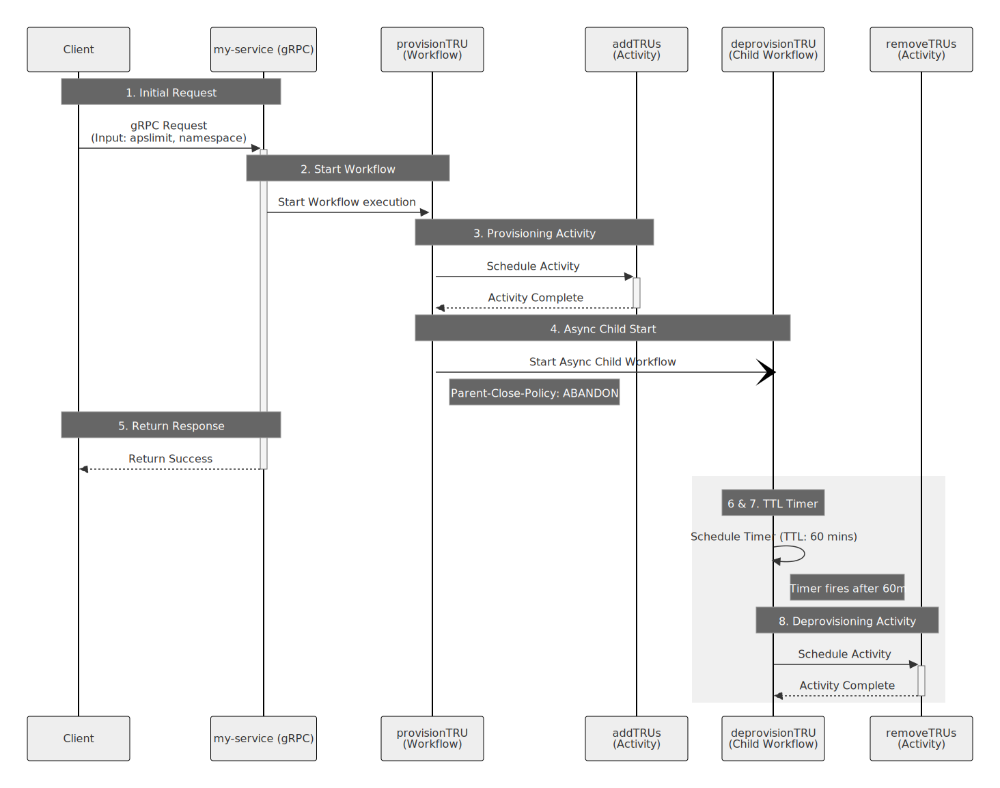

This pattern provides the steps to dynamically provision and automatically deprovision capacity on Temporal Cloud.

Applications often experience predictable or temporary spikes in throughput that require additional Temporal Cloud capacity. This pattern demonstrates how to grant time-limited increases to your capacity limits and guarantee release of those resources after a specific duration.

Permanently allocating peak capacity requirements for a namespace results in unnecessary costs. However, manually adjusting capacity quotas before and after load spikes is prone to human error, risking either workflow throttling if limits are not raised in time, or runaway costs if operators forget to reduce limits after the workload subsides.

You will use Temporal Workflows to orchestrate the provisioning process. A parent Workflow executes an Activity to raise the capacity limit, then starts an asynchronous Child Workflow configured with an abandon policy. The parent Workflow completes to unblock the client, while the Child Workflow waits for a designated duration before executing an Activity to revert the capacity to its original limit.

By completing this pattern, you will:

- Automate capacity management to reduce Temporal Cloud costs.
- Guarantee the execution of cleanup operations using durable Timers.
- Unblock client requests while long-running deprovisioning tasks continue in the background.

## Background and best practices

Temporal Cloud offers different capacity modes to accommodate varying workloads. When using provisioned capacity, you define the maximum throughput your Namespace can consume. Modifying this limit via an API call allows you to scale resources up for intensive tasks.

The primary architectural challenge is ensuring that temporary capacity increases revert reliably. Temporal solves this by persisting the state of your Workflow, including durably storing and starting Timers.

By separating the provisioning and deprovisioning steps into distinct Workflows, you adhere to the best practice of returning control to the caller as soon as the provisioning command succeeds. The `ParentClosePolicyAbandon` setting instructs the Temporal Service to allow the Child Workflow to continue running even after the parent completes. This decouples the client's synchronous request from the long-running *Time-To-Live (TTL)* wait state. When the Child Workflow enters a sleep state, it consumes no Worker memory, allowing you to scale this pattern across thousands of concurrent requests efficiently.

**Note:** Latency to the caller can be further reduced via [the Early Return pattern paired with an SDK call to update-with-start](https://docs.temporal.io/sending-messages#update-with-start).

## Target audience

This guide references the following roles:

- **Temporal Workflow and Activity developers**: Implement the Go code for the Workflows and Activities and deploy the Worker processes.
- **Platform operators**: Maintain the Temporal Namespace configuration and monitor usage against provisioned capacity limits.

## Prerequisites

To execute the steps in this pattern, you must have:

- **Required software, infrastructure, and tools:** Temporal Go SDK v1.40.0 or later, Go v1.23 or later, Temporal CLI v.1.6.1 or later.
- **Resources & Access Privileges:** Temporal Cloud Account with Admin role for the target Namespace to access the Cloud Operations API.
    - You will need to create an API key using your Temporal Cloud account to access the Cloud Operations API
- **Required Concepts:**
    - Familiarity with
        - Temporal Workflows
        - Temporal Activities
        - Temporal Child Workflows
        - Temporal Timers
        - Temporal Workers
        - Temporal Cloud Namespaces

**Note:** This pattern uses the Temporal Go SDK and it is necessary for direct replication. However, any Temporal SDK supported by Temporal Cloud is sufficient to achieve the same outcomes outlined in this document.

## People & process considerations

### Platform operators

The **Platform operators** own the Temporal Cloud Namespace and API keys. This team is responsible for the following:

1. Generate and manage Temporal Cloud API keys required for the provisioning Activities.
2. Monitor overall throughput and ensure the base provisioned capacity meets everyday operational needs.

### Application developers

The **Application developers** are the primary authors of the Temporal Workflows and Activities. This team will have the following responsibilities:

1. Implement and test the Temporal code outlined in this pattern.
2. Configure Worker scaling policies to handle the expected frequency of capacity adjustment requests.

## Architecture diagram



The following diagram illustrates the flow of the requests to provision capacity and handle automatic cleanup after a 60 minute time-to-live.

1. A client application sends a gRPC request to the `my-service` application with the requested limit and namespace.
2. The `my-service` application uses the Temporal SDK client to start the `provisionTRU` Workflow.
3. The `provisionTRU` Workflow schedules the `addTRUs` Activity and waits for it to complete.
4. The `provisionTRU` Workflow starts the `deprovisionTRU` asynchronous Child Workflow using a parent close policy of abandon.
5. The `provisionTRU` Workflow completes, and `my-service` returns a success response to the client.
6. The `deprovisionTRU` Child Workflow sets a Timer for 60 minutes.
7. The Timer fires after the TTL expires.
8. The `deprovisionTRU` Child Workflow schedules the `removeTRUs` Activity to revert the capacity limits.

## Implementation plan

In this implementation plan, you will build and verify the capacity management solution. You will begin by defining the required Activities to interact with the Temporal Cloud. Next, you will create the asynchronous Child Workflow responsible for the delayed cleanup. You will then orchestrate the process with the parent Workflow and expose it through a service handler. Finally, you will manually trigger the Workflow to simulate a client request and write tests using the Temporal Go SDK test suite to validate your orchestration logic locally.

Prior to executing this plan, ensure you have your Temporal Cloud API key and your target Namespace name documented

### Define messages for Activities and Workflows

Create the messages for passing to Temporal Workflows and Activities. It is a best practice to use a single serializable input to Workflows and Activities. You will create one for each Activity and Workflow, and helper functions for generating unique identifiers for each capacity request.

```go
// capacity/messages.go
package capacity

import "fmt"

type ProvisionTRUInput struct {
	Namespace          string
	APSLimit           int32
	MinutesToProvision int32
}

type DeprovisionTRUInput struct {
	Namespace          string
	MinutesToProvision int32
}

type AddTRUInput struct {
	Namespace string
	APSLimit  int32
}

type RemoveTRUInput struct {
	Namespace string
}

func generateProvisioningId(namespace string) string {
	return fmt.Sprintf("provision-%s", namespace)
}

func generateDeprovisioningId(namespace string) string {
	return fmt.Sprintf("deprovision-%s", namespace)
}

```

### Define the Activities

You must create functions that interact with the Temporal Cloud Operations API to adjust capacity. Temporal Activities encapsulates these functions to guarantee retries in case of intermittent failures. 

```go
// capacity/activities.go
package capacity

import (
	"bytes"
	"context"
	"encoding/json"
	"fmt"
	"go.temporal.io/sdk/temporal"
	"io"
	"net/http"
	"strconv"
)

const (
	defaultBaseURL = "https://saas-api.tmprl.cloud"
)

// Activities holds the dependencies required by the provisioning activities.
type Activities struct {
	HTTPClient *http.Client
	BaseURL    string
	APIKey     string
}

type getNamespaceResponse struct {
	Namespace struct {
		Spec            json.RawMessage `json:"spec"`
		ResourceVersion string          `json:"resourceVersion"`
	} `json:"namespace"`
}

type updateNamespaceRequest struct {
	Spec            json.RawMessage `json:"spec"`
	ResourceVersion string          `json:"resourceVersion"`
}

func (a *Activities) baseURL() string {
	if a.BaseURL != "" {
		return a.BaseURL
	}
	return defaultBaseURL
}

func (a *Activities) httpClient() *http.Client {
	if a.HTTPClient != nil {
		return a.HTTPClient
	}
	return http.DefaultClient
}

func (a *Activities) getNamespace(ctx context.Context, namespace string) (json.RawMessage, string, error) {
	url := fmt.Sprintf("%s/cloud/namespaces/%s", a.baseURL(), namespace)
	req, err := http.NewRequestWithContext(ctx, http.MethodGet, url, nil)
	if err != nil {
		return nil, "", err
	}
	req.Header.Set("Authorization", "Bearer "+a.APIKey)

	resp, err := a.httpClient().Do(req)
	if err != nil {
		return nil, "", err
	}
	defer resp.Body.Close()

	body, err := io.ReadAll(resp.Body)
	if err != nil {
		return nil, "", err
	}
	if resp.StatusCode != http.StatusOK {
		msg := fmt.Sprintf("%s", body)
		return nil, "", temporal.NewApplicationError(msg, strconv.Itoa(resp.StatusCode))
	}
	var result getNamespaceResponse
	if err := json.Unmarshal(body, &result); err != nil {
		return nil, "", err
	}
	return result.Namespace.Spec, result.Namespace.ResourceVersion, nil
}

func (a *Activities) updateNamespace(ctx context.Context, namespace string, spec json.RawMessage, resourceVersion string) error {
	url := fmt.Sprintf("%s/cloud/namespaces/%s", a.baseURL(), namespace)

	payload, err := json.Marshal(updateNamespaceRequest{
		Spec:            spec,
		ResourceVersion: resourceVersion,
	})
	if err != nil {
		return err
	}

	req, err := http.NewRequestWithContext(ctx, http.MethodPost, url, bytes.NewReader(payload))
	if err != nil {
		return err
	}
	req.Header.Set("Authorization", "Bearer "+a.APIKey)
	req.Header.Set("Content-Type", "application/json")

	resp, err := a.httpClient().Do(req)
	if err != nil {
		return err
	}
	defer resp.Body.Close()

	if resp.StatusCode != http.StatusOK {
		body, _ := io.ReadAll(resp.Body)
		msg := fmt.Sprintf("%s", body)
		return temporal.NewApplicationError(msg, strconv.Itoa(resp.StatusCode))
	}
	return nil
}

// AddTRUs increases the provisioned capacity of the target namespace to the requested APS limit.
func (a *Activities) AddTRUs(ctx context.Context, input AddTRUInput) error {
	spec, resourceVersion, err := a.getNamespace(ctx, input.Namespace)
	if err != nil {
		return fmt.Errorf("get namespace %q: %w", input.Namespace, err)
	}

	var specMap map[string]interface{}
	if err := json.Unmarshal(spec, &specMap); err != nil {
		return fmt.Errorf("unmarshal namespace spec: %w", err)
	}
	specMap["capacitySpec"] = map[string]interface{}{
		"provisioned": map[string]interface{}{
			// 1 TRU = 500 APS; convert the requested APS limit to TRUs.
			"value": float64(input.APSLimit) / 500.0,
		},
	}

	updatedSpec, err := json.Marshal(specMap)
	if err != nil {
		return fmt.Errorf("marshal updated spec: %w", err)
	}

	if err := a.updateNamespace(ctx, input.Namespace, updatedSpec, resourceVersion); err != nil {
		return err
	}
	return nil
}

// RemoveTRUs reverts the target namespace to on-demand capacity mode.
func (a *Activities) RemoveTRUs(ctx context.Context, input RemoveTRUInput) error {
	spec, resourceVersion, err := a.getNamespace(ctx, input.Namespace)
	if err != nil {
		return err
	}

	var specMap map[string]interface{}
	if err := json.Unmarshal(spec, &specMap); err != nil {
		return fmt.Errorf("unmarshal namespace spec: %w", err)
	}
	specMap["capacitySpec"] = map[string]interface{}{
		"onDemand": map[string]interface{}{},
	}

	updatedSpec, err := json.Marshal(specMap)
	if err != nil {
		return fmt.Errorf("marshal updated spec: %w", err)
	}

	if err := a.updateNamespace(ctx, input.Namespace, updatedSpec, resourceVersion); err != nil {
		return err
	}
	return nil
}
```

The `AddTRUs` and `RemoveTRUs` methods define the actions taken to alter the capacity. By grouping these as methods on a `Activities` struct, you can inject dependencies like API clients or logger instances. Both methods accept a struct, which contains the target namespace and the desired limit.

## Implement the deprovisioning Child Workflow

To ensure capacity reverts after the given duration without consuming active computing resources, you will define a Workflow that sleeps for the specified duration and then executes the Activity that deprovisions the capacity.

```go
// capacity/deprovision_workflow.go
package capacity

import (
	"go.temporal.io/sdk/temporal"
	"time"

	"go.temporal.io/sdk/workflow"
)

// DeprovisionTRUWorkflow sleeps for the TTL duration then reverts the namespace
// to on-demand capacity. It is started as an asynchronous Child Workflow by
// ProvisionTRUWorkflow and runs independently after the parent completes.
func DeprovisionTRUWorkflow(ctx workflow.Context, input DeprovisionTRUInput) error {
	err := workflow.Sleep(ctx, time.Duration(input.MinutesToProvision)*time.Minute)
	if err != nil {
		return err
	}

	ao := workflow.ActivityOptions{
		StartToCloseTimeout: 2 * time.Minute,
		RetryPolicy: &temporal.RetryPolicy{
			NonRetryableErrorTypes: []string{unauthorized, forbidden, badRequest},
		},
	}
	ctx = workflow.WithActivityOptions(ctx, ao)

	var a *Activities
	return workflow.ExecuteActivity(ctx, a.RemoveTRUs, input).Get(ctx, nil)
}
```

## Implement the provisioning Workflow

You will now create the main orchestration Workflow. This Workflow applies the capacity increase, and sets the deprovisioning process to run with an "abandon policy," so it will run regardless of what happens to the parent Workflow.

```go
// capacity/provision_workflow.go
package capacity

import (
	"go.temporal.io/sdk/temporal"
	"net/http"
	"strconv"
	"time"

	"go.temporal.io/api/enums/v1"
	"go.temporal.io/sdk/workflow"
)

var (
	unauthorized = strconv.Itoa(http.StatusUnauthorized)
	forbidden    = strconv.Itoa(http.StatusForbidden)
	badRequest   = strconv.Itoa(http.StatusBadRequest)
)

// ProvisionTRUWorkflow raises the namespace capacity limit, then starts the
// DeprovisionTRUWorkflow as an asynchronous Child Workflow with an abandon
// policy so the parent can return immediately while cleanup runs independently.
func ProvisionTRUWorkflow(ctx workflow.Context, input ProvisionTRUInput) error {
	ao := workflow.ActivityOptions{
		StartToCloseTimeout: 2 * time.Minute,
		RetryPolicy: &temporal.RetryPolicy{
			NonRetryableErrorTypes: []string{unauthorized, forbidden, badRequest},
		},
	}
	actCtx := workflow.WithActivityOptions(ctx, ao)

	var a *Activities
	err := workflow.ExecuteActivity(actCtx, a.AddTRUs, AddTRUInput{
		Namespace: input.Namespace,
		APSLimit:  input.APSLimit,
	}).Get(ctx, nil)
	if err != nil {
		return err
	}

	cwo := workflow.ChildWorkflowOptions{
		WorkflowID:        generateDeprovisioningId(input.Namespace),
		ParentClosePolicy: enums.PARENT_CLOSE_POLICY_ABANDON,
	}
	childCtx := workflow.WithChildOptions(ctx, cwo)

	childFuture := workflow.ExecuteChildWorkflow(childCtx, DeprovisionTRUWorkflow, DeprovisionTRUInput{
		Namespace:          input.Namespace,
		MinutesToProvision: input.MinutesToProvision,
	})

	var childExec workflow.Execution
	err = childFuture.GetChildWorkflowExecution().Get(ctx, &childExec)
	if err != nil {
		return err
	}

	return nil
}
```

The `ProvisionTRUWorkflow` orchestrates the entire request. First, it synchronously waits for `AddTRUs` to complete to ensure the capacity is available before returning. Second, it configures `workflow.ChildWorkflowOptions` with `enums.PARENT_CLOSE_POLICY_ABANDON`. This prevents the Temporal Service from cancelling the Child Workflow when this parent completes. Finally, the code uses `GetChildWorkflowExecution().Get()` to block execution just until the Temporal Service confirms the Child Workflow has started. Once started, the parent completes, leaving the child to run independently. 

## Implement the service handler

Connect the Workflow to your application's API layer. You will write the code that receives the incoming request and triggers the Workflow.

```go
// capacity/handler.go
package capacity

import (
	"context"
	"errors"
	"fmt"
	"go.temporal.io/sdk/client"
)

const TaskQueue = "capacity-management"

// HandleProvisionRequest starts a ProvisionTRUWorkflow execution and returns
// after the Temporal Cluster accepts the request. It does not wait
// for the Workflow to complete.
func HandleProvisionRequest(c client.Client, namespace string, apsLimit int32, minutesToProvision int32) error {
	id := generateProvisioningId(namespace)
	preExistingRun := c.GetWorkflow(context.Background(), id, "").GetRunID()
	if preExistingRun != "" {
		return errors.New("provisioning request already in-progress")
	}
	deprovisionId := fmt.Sprintf("deprovision-%s", namespace)
	preExistingDeprovisionRun := c.GetWorkflow(context.Background(), deprovisionId, "").GetRunID()
	if preExistingDeprovisionRun != "" {
		err := c.CancelWorkflow(context.Background(), deprovisionId, preExistingDeprovisionRun)
		if err != nil {
			return errors.Join(errors.New("unable to cancel deprovisioning workflow"), err)
		}
	}
	options := client.StartWorkflowOptions{
		ID:        id,
		TaskQueue: TaskQueue,
	}

	input := ProvisionTRUInput{
		Namespace:          namespace,
		APSLimit:           apsLimit,
		MinutesToProvision: minutesToProvision,
	}

	we, err := c.ExecuteWorkflow(context.Background(), options, ProvisionTRUWorkflow, input)
	if err != nil {
		return fmt.Errorf("failed to start workflow: %w", err)
	}

	fmt.Printf("Successfully started provision workflow. ID: %s, RunID: %s\n",
		we.GetID(), we.GetRunID())
	return nil
}
```

The `HandleProvisionRequest` function represents your gRPC or HTTP endpoint. It prepares the `client.StartWorkflowOptions` and calls `ExecuteWorkflow`. Because it uses `ExecuteWorkflow` rather than waiting on the result with `.Get()`, the function returns an acknowledgment to the client after the Temporal Service accepts the Workflow initiation. `MinutesToProvision` determines how long the `DeprovisionTRUWorkflow`  waits before provisioned capacity reverts.

## Create the Worker Program

Now that you have built the Activities and Workflows here is the complete set of imports and definitions required to register and run the system on a Worker.

```go
// cmd/worker.go
package main

import (
	"github.com/temporal-sa/temporary-rate-limit-increases/capacity"
	"go.temporal.io/sdk/client"
	"go.temporal.io/sdk/worker"
	"log"
	"os"
)

func main() {
	apiKey := os.Getenv("TEMPORAL_CLOUD_API_KEY")
	if apiKey == "" {
		log.Fatalln("TEMPORAL_CLOUD_API_KEY missing and required")
	}

	c, err := client.Dial(client.Options{})
	if err != nil {
		log.Fatalln("Unable to create Temporal client", err)
	}
	defer c.Close()

	w := worker.New(c, capacity.TaskQueue, worker.Options{})

	w.RegisterWorkflow(capacity.ProvisionTRUWorkflow)
	w.RegisterWorkflow(capacity.DeprovisionTRUWorkflow)

	activities := &capacity.Activities{
		APIKey: apiKey,
	}
	w.RegisterActivity(activities)

	err = w.Run(worker.InterruptCh())
	if err != nil {
		log.Fatalln("Unable to start worker", err)
	}
}
```

Run the following commands sequentially, each in their own terminal:

```bash
temporal server start-dev
```

```bash
export TEMPORAL_CLOUD_API_KEY={YOUR_TEMPORAL_CLOUD_API_KEY}
go run cmd/worker.go
```

## Test the Workflow execution

To verify the capacity provisioning process, you must simulate the client request. You will write a short script that initializes a Temporal client, defines the requested limits, and calls your service handler to trigger the parent Workflow. Replace `{TEST_NAMESPACE}` with the target namespace you identified in the prerequisites section.

```go
// cmd/trigger.go
package main

import (
	"github.com/temporal-sa/temporary-rate-limit-increases/capacity"
	"go.temporal.io/sdk/client"
	"log"
	"os"
	"strconv"
)

func main() {
	c, err := client.Dial(client.Options{})
	if err != nil {
		log.Fatalln("Unable to create Temporal client", err)
	}
	defer c.Close()

	targetNamespace := os.Getenv("TEMPORAL_CLOUD_NAMESPACE")
	if targetNamespace == "" {
		log.Fatalln("TEMPORAL_CLOUD_NAMESPACE missing and required")
	}
	minutesToProvisionRaw := os.Getenv("MINUTES_TO_PROVISION")
	if minutesToProvisionRaw == "" {
		log.Fatalln("MINUTES_TO_PROVISION missing and required")
	}
	minutesToProvision, err := strconv.Atoi(minutesToProvisionRaw)
	if err != nil {
		log.Fatalln("Unable to parse MINUTES_TO_PROVISION: " + err.Error())
	}
	var newLimit int32 = 1000

	err = capacity.HandleProvisionRequest(c, targetNamespace, newLimit, int32(minutesToProvision))
	if err != nil {
		log.Fatalln("Unable to execute provision request", err)
	}
}
```

The `main` function connects to the Temporal Service using `client.Dial`. It defines the `targetNamespace` and `newLimit` variables to represent the data payload that a gRPC request would contain. It then passes the client and these variables to the `HandleProvisionRequest` function. By executing this file while your Worker is running, the Temporal Service will start the `ProvisionTRUWorkflow**.**`

Execute the script from your command line:

```bash
export MINUTES_TO_PROVISION=5
export TEMPORAL_CLOUD_NAMESPACE={YOUR_TEMPORAL_NAMESPACE}
go run trigger.go 
```

The script will complete and print the confirmation from the handler:

```bash
Started provision workflow. ID: provision-production-workload, RunID: {RUN_ID}
```

After this output appears, the Worker continues to process the provisioning Activity and the 5-minute sleep Timer in the background. 

**Note:** a 5-minute sleep time is used for testing the Workflow end-to-end. Set `MINUTES_TO_PROVISION` to your needs in production environments. We recommend at least 60 minutes.

## Unit test the Workflow

Verify that the Workflow orchestrates the Activities and Child Workflow without interacting with the live Temporal Service. The Temporal Go SDK provides a test environment that simulates time and cluster behavior, allowing you to validate your code logic locally.

```go
// capacity/provision_workflow_test.go
package capacity

import (
	"testing"

	"github.com/stretchr/testify/mock"
	"github.com/stretchr/testify/require"
	"go.temporal.io/sdk/testsuite"
)

func Test_ProvisionTRUWorkflow(t *testing.T) {
	testSuite := &testsuite.WorkflowTestSuite{}
	env := testSuite.NewTestWorkflowEnvironment()

	env.RegisterWorkflow(DeprovisionTRUWorkflow)

	var a *Activities
	env.OnActivity(a.AddTRUs, mock.Anything, mock.Anything).Return(nil)

	input := ProvisionTRUInput{
		Namespace:          "test-namespace",
		APSLimit:           2000,
		MinutesToProvision: 5,
	}

	env.ExecuteWorkflow(ProvisionTRUWorkflow, input)

	require.True(t, env.IsWorkflowCompleted())
	require.NoError(t, env.GetWorkflowError())
	env.AssertExpectations(t)
}
```

The `Test_ProvisionTRUWorkflow` function initializes a `testsuite.WorkflowTestSuite` and creates a `TestWorkflowEnvironment`. This environment simulates the Temporal Service in memory. Because the parent Workflow starts a Child Workflow asynchronously, you must register `DeprovisionTRUWorkflow` with the test environment so it does not fail when invoked. 

You then use `env.OnActivity` to mock the `AddTRUs` Activity, instructing it to return `nil` without making real network calls. After calling `env.ExecuteWorkflow`, the test uses `require.True` and `require.NoError` to guarantee the parent Workflow completes. Finally, `env.AssertExpectations` confirms that the mocked Activity executed as defined.

Execute the test from your command line: 

```bash
go test -v provision_workflow_test.go provision_workflow.go deprovision_workflow.go activities.go
```

The terminal will output the test results:

```bash
=== RUN   Test_ProvisionTRUWorkflow
--- PASS: Test_ProvisionTRUWorkflow (0.01s)
PASS
```

Additional log lines from the test results are a non-issue.

## Unit test the deprovisioning Workflow

When testing long-running Workflows, waiting for real time to pass is inefficient. You must verify that the `DeprovisionTRUWorkflow` schedules the `RemoveTRUs` Activity after the 60-minute Timer without actually waiting an hour during your test execution.

```go
// capacity/deprovision_workflow_test.go
package capacity

import (
	"testing"

	"github.com/stretchr/testify/mock"
	"github.com/stretchr/testify/require"
	"go.temporal.io/sdk/testsuite"
)

func Test_DeprovisionTRUWorkflow(t *testing.T) {
	testSuite := &testsuite.WorkflowTestSuite{}
	env := testSuite.NewTestWorkflowEnvironment()

	var a *Activities
	env.OnActivity(a.RemoveTRUs, mock.Anything, mock.Anything).Return(nil)

	input := DeprovisionTRUInput{
		Namespace:          "test-namespace",
		MinutesToProvision: 5,
	}

	env.ExecuteWorkflow(DeprovisionTRUWorkflow, input)

	require.True(t, env.IsWorkflowCompleted())
	require.NoError(t, env.GetWorkflowError())
	env.AssertExpectations(t)
}
```

The `Test_DeprovisionTRUWorkflow` function uses the `testsuite.WorkflowTestSuite` to run the Child Workflow. When a Timer blocks a Workflow execution the Temporal test environment automatically skips time forward, such as the `workflow.Sleep` command used in your code. This mechanism causes the 60-minute sleep to complete instantly within the test framework.

You configure `env.OnActivity` to mock the `RemoveTRUs` Activity, ensuring the test does not make live API calls to Temporal Cloud. After execution, `require.True` confirms the Workflow finished, and `env.AssertExpectations` guarantees that the deprovisioning Activity executed as expected after the simulated time elapsed. 

Execute the test from your command line:

```bash
go test -v deprovision_workflow_test.go deprovision_workflow.go activities.go
```

The terminal will output the test results:

```bash
=== RUN   Test_DeprovisionTRUWorkflow
--- PASS: Test_DeprovisionTRUWorkflow (0.01s)
PASS
ok      command-line-arguments  0.015s
```

Additional log lines from the test results are a non-issue.

## Outcomes

By following this guide, you have implemented a time-bound capacity provisioning system including:

- Requesting increased limits through a retryable Temporal Activity.
- Using an asynchronous Child Workflow to decouple application responses from long-term cleanup tasks.
- Using durable Timers to guarantee that capacity limits are strictly reverted after 60 minutes, ensuring you do not overpay for unused compute.

## Related Resources

- [Temporal Capacity Modes](https://docs.temporal.io/cloud/capacity-modes)
- [Temporal Best Practices](https://docs.temporal.io/best-practices)
- [Python Capacity Mode Sample](https://github.com/lainecsmith/temporal-cloud-ops-capacity-modes)
- [Go Capacity Mode Sample](https://github.com/temporal-sa/temporary-rate-limit-increases)