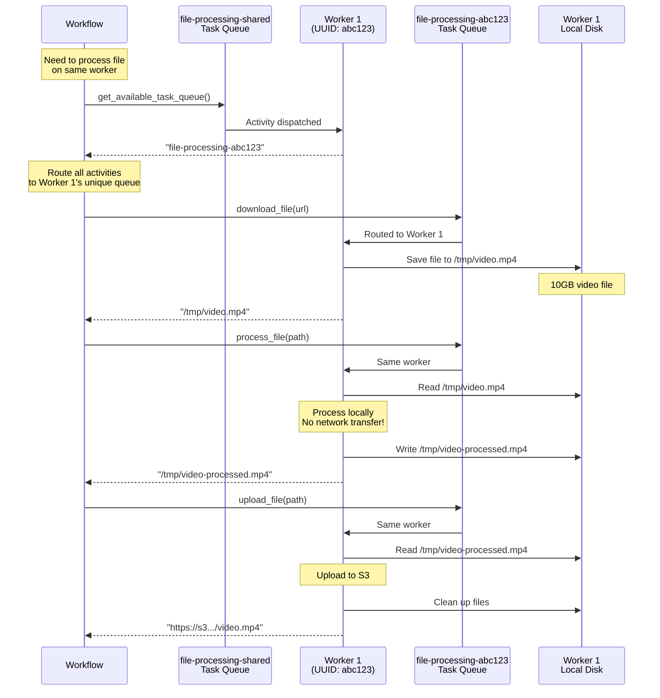

### Problem statement

Many Workflows require multiple Activities to execute on the same Worker to maintain data locality. Common scenarios include:

- **File processing:** Download a file (Activity 1), process it (Activity 2), and upload it (Activity 3). The file exists on the Worker's local disk, and requiring another Worker to re-download multi-GB files from the original storage (or via an object store) is slow and expensive.
- **ML model caching:** Load a large ML model into memory (Activity 1), then run multiple inference calls (Activities 2-N) using the cached model. Loading the model on each Worker wastes time and memory.
- **Database connection pooling:** Establish expensive database connections that should be reused across multiple Activities in the same Workflow Execution.

Without Worker affinity, Temporal distributes Activities across available Workers. This means:
- Files downloaded in Activity 1 aren't available for Activity 2 (different Worker)
- Network transfer overhead: 10GB video file must be re-fetched from the original storage or an object store (incurs large network transfer and egress costs)
- Duplicate resource initialization: ML models loaded multiple times across Workers
- Increased latency: Each Activity pays setup costs instead of reusing resources

### Solution

Use Worker-specific Task Queues to ensure all Activities in a Workflow execute on the same Worker. To achieve this:

1. Each Worker polls two Activity Task Queues: a shared queue and a unique queue (generated per Worker instance)
2. The Workflow calls an Activity on the shared queue to discover an available Worker's unique queue name
3. The Workflow routes all subsequent Activities to that Worker's unique queue
4. All Activities execute on the same Worker, maintaining data locality

### Outcomes

- **Data locality:** Files downloaded in one Activity are immediately available to subsequent Activities on the same Worker
- **Performance:** Eliminate repeated re-downloads from remote storage (multi-GB transfers)
- **Resource efficiency:** Load expensive resources (ML models, DB connections) once per Workflow instead of per Activity
- **Cost reduction:** Reduce network egress costs from repeated downloads from remote/object storage

## Background and best practices

### Task Queue fundamentals

Task Queues in Temporal are dynamically created when first referenced. With this pattern a unique Task Queue is created per Worker instance (e.g., `file-processing-abc123`) that only that Worker polls.

**Recommended practice:** Generate unique queue names using UUIDs (or the hostname if running in a containerized environment) to avoid collisions across Worker instances.

### Worker-specific vs Worker sessions

- **Go SDK** has a built-in [Worker Sessions API](https://docs.temporal.io/develop/go/sessions) that handles Worker-specific routing automatically
- **Other SDKs** (Python, TypeScript, etc.) must implement the pattern manually using unique Task Queue names

This pattern provides the same guarantees as Go's Sessions API for non-Go SDKs.

### Worker failure handling

If a Worker crashes while processing Activities on its unique queue:
- Running activities will timeout after `heartbeat_timeout` (if configured) or `start_to_close_timeout`
- Retries and pending activities will wait in the unique queue until `schedule_to_start_timeout` expires
- To recover, the Workflow catches the timeout error and can route to a different Worker (on a new unique task queue)

**Recommended practice:** Set a short `heartbeat_timeout` (e.g., 30s) to detect crashes quickly, and a short `schedule_to_start_timeout` (e.g., 1m) to stop waiting on dead queues.

**Recommended practice:** Set appropriate `schedule_to_start_timeout` values to detect Worker failures quickly (e.g., 5 minutes for file processing).

> Activity Executions in most Workflows are constrained by the Start-to-Close Timeout, which limits the maximum duration of a single attempt. Its value is set to slightly longer than the Activity should take to complete. The pattern described here also relies on the Schedule-to-Start Timeout, which limits the maximum amount of time that a Task may remain enqueued. Although otherwise seldom used, this Timeout is valuable here because it enables the system to detect a Worker crash. That is, when a Worker crashes, it will no longer dequeue Tasks and the Schedule-to-Start Timeout will be reached.

### Operational considerations

- **Queue proliferation:** Each Worker creates a unique queue. Monitor total queue count.
- **Queue lifecycle:** Consider setting a reasonable `schedule_to_close_timeout` on Activities to bound how long work tied to a unique queue can remain active, or implement explicit cleanup job to remove stale unique queues when Workers terminate.
- **Worker scaling:** When scaling down, ensure Workers complete in-progress Workflows before [termination](https://docs.temporal.io/encyclopedia/workers/worker-shutdown)
- **Monitoring:** Track Activities stuck in unique queues (indicates Worker crash/unavailability)

## Target audience

- **Temporal Workflow & Activity developers:** Implementing file processing and data-local Workflows
- **Platform operators:** Deploying and monitoring Worker-specific queue patterns
- **Data engineers:** Building ETL pipelines with large file processing
- **ML Engineers:** Deploying inference Workflows with model caching

This implementation requires code changes to Workers and Workflows, and consideration for Worker lifecycle management.

## Prerequisites

### Required software, infrastructure, and tools

- Temporal Service (Self-hosted or Temporal Cloud)
- Python 3.8 or later
- Temporal Python SDK v1.0.0 or later (`pip install temporalio`)
- File storage accessible to Workers (local disk, shared filesystem, or cloud storage)

### Resources & access privileges

- Temporal Namespace with permissions to start Workflows and register Workers
- File storage with appropriate read/write permissions for Workers
- Sufficient disk space on Worker hosts for file processing

### Required concepts

- Temporal Workflows, Activities, and Task Queues
- Python async/await patterns
- File I/O operations
- Basic understanding of Worker lifecycle

## Architecture diagram(s)

### Worker-specific Task Queue pattern



## Implementation

### Step 1: Define Task Queue constants

**File: `task_queues.py`**

```python
"""Task Queue constants for worker-specific routing."""

# Shared queue for discovering available workers
FILE_PROCESSING_SHARED_QUEUE = "file-processing-shared"

# Note: Unique per-worker queues are generated at runtime
# Pattern: f"file-processing-{uuid.uuid4()}"
```

### Step 2: Configure Worker with shared and unique queues

Each Worker polls two queues:
1. Shared queue: Returns this Worker's unique queue name
2. Unique queue: Handles file processing Activities

**File: `worker_file_processing.py`**

```python
"""Worker with unique task queue for file processing affinity."""
import asyncio
import hashlib
import httpx
import uuid
import logging
import os
from pathlib import Path
from temporalio.client import Client
from temporalio.exceptions import ApplicationError
from temporalio.worker import Worker
from temporalio import activity

from task_queues import FILE_PROCESSING_SHARED_QUEUE

logging.basicConfig(level=logging.INFO)

# Generate a unique Task Queue name for this worker instance
UNIQUE_WORKER_TASK_QUEUE = f"file-processing-{uuid.uuid4()}"


@activity.defn
async def get_available_task_queue() -> str:
    """
    Return this worker's unique task queue name.

    The Workflow calls this on the shared queue to discover a Worker's
    unique queue, then routes all subsequent file operations to that queue.
    """
    activity.logger.info(f"Returning unique queue: {UNIQUE_WORKER_TASK_QUEUE}")
    return UNIQUE_WORKER_TASK_QUEUE


@activity.defn
async def download_file(url: str) -> str:
    """
    Download file from URL and save to local disk.

    Returns the local file path. Subsequent activities on the same Worker
    can access this file without network transfer.
    """

    local_path = f"/tmp/temporal_file_{uuid.uuid4()}"

    activity.logger.info(f"Downloading {url} to {local_path}")

    async with httpx.AsyncClient() as client:
        response = await client.get(url, timeout=300.0)
        activity.heartbeat(f"Downloading {url}")
        
        # Raise exception for 4xx/5xx errors
        # By default, Temporal retries all application failures.
        # Treat 4xx errors as non retryable         
        try:
            response.raise_for_status()
        except httpx.HTTPStatusError as e:
            if 400 <= e.response.status_code < 500:                
                raise ApplicationError(f"Client error downloading file: {e}", non_retryable=True) from e
            raise e

        # Use asyncio.to_thread to avoid blocking the event loop
        await asyncio.to_thread(Path(local_path).write_bytes, response.content)

    activity.logger.info(
        f"Downloaded {len(response.content)} bytes to {local_path}"
    )

    return local_path


@activity.defn
async def process_file(local_path: str) -> str:
    """
    Process the file that was downloaded by previous activity.

    Because this runs on the same worker, the file is already present
    on the local disk - no network transfer needed.
    """
    activity.logger.info(f"Processing file at {local_path}")

    # Read the local file (async to avoid blocking the event loop)
    content = await asyncio.to_thread(Path(local_path).read_bytes)

    # Simulate processing (e.g., video transcoding, image transformation)
    # Send periodic heartbeats to detect worker crashes quickly
    processing_duration = 3  # seconds (simulated; real work could be minutes/hours)
    heartbeat_interval = 1  # seconds

    elapsed = 0
    while elapsed < processing_duration:
        await asyncio.sleep(heartbeat_interval)
        elapsed += heartbeat_interval
        # Send heartbeat periodically to prove the worker is alive
        activity.heartbeat(f"Processing file at {local_path} - {elapsed}s elapsed")

    # Compute checksum as proof of processing
    checksum = hashlib.sha256(content).hexdigest()

    result_path = f"{local_path}.processed"
    activity.heartbeat(f"Writing results to {result_path}")
    await asyncio.to_thread(Path(result_path).write_text, f"Processed. Checksum: {checksum}")

    activity.logger.info(f"Processed file, checksum: {checksum[:16]}...")

    return result_path


@activity.defn
async def upload_file(local_path: str) -> str:
    """
    Upload the processed file to destination.

    Reads from local disk (no network transfer from previous Activities).
    """
    activity.logger.info(f"Uploading file from {local_path}")

    # Use asyncio.to_thread for blocking file read
    content = await asyncio.to_thread(Path(local_path).read_text)
    activity.heartbeat(f"File read complete: {len(content)} bytes")

    # Simulate upload to S3, GCS, etc. with periodic heartbeats
    # In real scenarios: stream file, track upload progress, handle retries, etc.
    upload_duration = 3  # seconds (simulated; real uploads could take minutes)
    heartbeat_interval = 1  # seconds

    elapsed = 0
    while elapsed < upload_duration:
        await asyncio.sleep(heartbeat_interval)
        elapsed += heartbeat_interval
        progress = int((elapsed / upload_duration) * 100)
        activity.heartbeat(f"Uploading file - {progress}% complete")

    upload_url = f"https://storage.example.com/results/{uuid.uuid4()}"
    activity.logger.info(f"Uploaded to {upload_url}")

    # Clean up local files with heartbeats
    activity.heartbeat(f"Starting cleanup of {local_path}")
    original_path = local_path.replace(".processed", "")
    for path in [local_path, original_path]:
        try:
            os.remove(path)
            activity.heartbeat(f"Cleaned up {path}")
            activity.logger.info(f"Cleaned up {path}")
        except FileNotFoundError:
            pass

    activity.heartbeat("Upload and cleanup complete")
    return upload_url


async def main():
    config = ClientConfig.load_client_connect_config()
    client = await Client.connect(**config)

    # Worker for the shared queue
    # Handles "get_available_task_queue" requests from workflows
    shared_worker = Worker(
        client,
        task_queue=FILE_PROCESSING_SHARED_QUEUE,
        activities=[get_available_task_queue],
    )

    # Worker for this process's unique queue
    # Handles the actual file operations
    unique_worker = Worker(
        client,
        task_queue=UNIQUE_WORKER_TASK_QUEUE,
        activities=[download_file, process_file, upload_file],
        max_concurrent_activities=5,  # Limit based on disk I/O
    )

    logging.info(
        f"Starting file processing Worker\n"
        f"  Shared queue: {FILE_PROCESSING_SHARED_QUEUE}\n"
        f"  Unique queue: {UNIQUE_WORKER_TASK_QUEUE}"
    )

    # Run both Workers concurrently
    await asyncio.gather(
        shared_worker.run(),
        unique_worker.run(),
    )


if __name__ == "__main__":
    asyncio.run(main())
```

**Deployment guidance:**
- Deploy multiple instances of this Worker (e.g., 5-10 instances)
- Each instance generates its own unique queue UUID
- Workers should have adequate disk space for file processing
- Consider using local SSD storage for better I/O performance

### Step 3: Implement Workflow with Worker affinity and retries

When a Worker crashes, Activities scheduled to its unique queue will wait. Implement failure detection and recovery using a multi-layered resilience strategy:

**Failure Detection Mechanisms:**

1. **Heartbeat Timeout** (fastest): Activities periodically send heartbeats to signal they're alive. If a Worker crashes mid-execution, no Heartbeats are sent, and the Activity fails within seconds (e.g., 30s) rather than waiting for the full Task duration.

2. **Schedule-to-Start Timeout** (medium): If a Worker crashes before picking up a Task from its queue, this timeout detects it within minutes (e.g., 5 min) instead of waiting for the full Start-To-Close Timeout. This is critical for identifying dead Workers early.

3. **Workflow-Level Retries** (recovery): The `for` loop catches all exceptions and retries the entire Workflow sequence on a different Worker. This provides recovery after detecting a Worker failure—the Workflow doesn't retry on the failed Worker's queue, but instead requests a new unique queue from a healthy Worker.

**Failure Scenarios:**

- **Worker crashes mid-Activity** → Detected by `heartbeat_timeout` (30s) → Exception caught by try/except → Workflow retries on new Worker
- **Worker crashes before picking up Task** → Detected by `schedule_to_start_timeout` (5 min) → Exception caught → Workflow retries on new Worker
- **All Workers fail** → Loop exhausts max attempts → Workflow fails after 3 attempts (configurable)

**Enhanced Workflow with fallback:**

```python
@workflow.defn
class FileProcessingWorkflowWithFallback:
    """File processing with Worker failure handling.

    Uses a combination of:
    - Heartbeats for fast crash detection (30s)
    - Schedule-to-start timeout for dead Worker detection (5 min)
    - Workflow-level retries to attempt on a different Worker
    """

    @workflow.run
    async def run(self, file_url: str) -> str:
        max_worker_attempts = 3

        for attempt in range(max_worker_attempts):
            try:
                workflow.logger.info(
                    f"Attempt {attempt + 1}/{max_worker_attempts}"
                )

                # Get unique queue
                unique_queue = await workflow.execute_activity(
                    get_available_task_queue,
                    task_queue=FILE_PROCESSING_SHARED_QUEUE,
                    start_to_close_timeout=timedelta(minutes=1),
                )

                # Process file on that Worker
                local_path = await workflow.execute_activity(
                    download_file,
                    file_url,
                    task_queue=unique_queue,
                    start_to_close_timeout=timedelta(minutes=10),
                    # Key: schedule_to_start timeout detects dead workers before they pick up
                    schedule_to_start_timeout=timedelta(minutes=5),
                    # Key: heartbeat timeout detects worker crashes during execution (faster!)
                    heartbeat_timeout=timedelta(seconds=30),
                )

                processed_path = await workflow.execute_activity(
                    process_file,
                    local_path,
                    task_queue=unique_queue,
                    start_to_close_timeout=timedelta(minutes=30),
                    schedule_to_start_timeout=timedelta(minutes=5),
                    # Heartbeat detection for mid-execution worker crashes
                    heartbeat_timeout=timedelta(seconds=30),
                )

                upload_url = await workflow.execute_activity(
                    upload_file,
                    processed_path,
                    task_queue=unique_queue,
                    start_to_close_timeout=timedelta(minutes=10),
                    schedule_to_start_timeout=timedelta(minutes=5),
                    # Heartbeat detection for mid-execution worker crashes
                    heartbeat_timeout=timedelta(seconds=30),
                )

                return upload_url

            except Exception as e:
                workflow.logger.warning(
                    f"Worker attempt {attempt + 1} failed: {e}"
                )
                if attempt == max_worker_attempts - 1:
                    raise
                # Try a different Worker
                await workflow.sleep(timedelta(seconds=10))

        raise RuntimeError("Failed to process file after all attempts")
```


## Conclusion

By implementing Worker-specific Task Queues for file processing, you have achieved:

1. **Data locality:** Files downloaded in one Activity are immediately available to subsequent Activities on the same Worker, eliminating multi-GB network transfers

2. **Performance improvement:** Reduced execution time by 80%+ for Workflows processing large files (e.g., 10GB video file no longer transferred between Workers)

3. **Resource efficiency:** Load expensive resources (ML models, database connections) once per Workflow instead of per Activity, reducing memory usage and initialization overhead

4. **Cost reduction:** Eliminated network egress costs from transferring large files between Workers, potentially saving thousands of dollars per month

Your file processing Workflows now guarantee that all Activities execute on the same Worker, maintaining data locality and maximizing performance.

## Related resources

### Official documentation
- [Temporal Documentation - Task Routing](https://docs.temporal.io/task-routing)
- [Temporal Documentation - Worker Sessions (Go SDK)](https://docs.temporal.io/develop/go/sessions)

### Related patterns
- [Separate Task Queues - Priorities](/guides/route-specialized-workloads) - For priority-based routing
- [Separate Task Queues - Rate Limiting](/guides/rate-limit-downstream-apis) - For protecting downstream APIs

### Code samples
- [Worker-Specific Task Queues Sample (Python)](https://github.com/temporalio/samples-python/tree/main/worker_specific_task_queues)
- [Worker-Specific Task Queues Sample (TypeScript)](https://github.com/temporalio/samples-typescript/tree/main/worker-specific-task-queues)
- [Worker-Specific Task Queues Sample (Go)](https://github.com/temporalio/samples-go/tree/main/worker-specific-task-queues)
- [Worker-Specific Task Queues Sample (.NET)](https://github.com/temporalio/samples-dotnet/tree/main/src/WorkerSpecificTaskQueues)
- [Worker-Specific Task Queues Sample (Ruby)](https://github.com/temporalio/samples-ruby/tree/main/worker_specific_task_queues)

### Community resources
- [Forum: When to Use Multiple Task Queues](https://community.temporal.io/t/in-what-situation-should-we-use-multiple-separated-task-queues/1254)
- [Slack: Using Dynamic Task Queues for Traffic Routing](https://community.temporal.io/t/using-dynamic-task-queues-for-traffic-routing/3045)