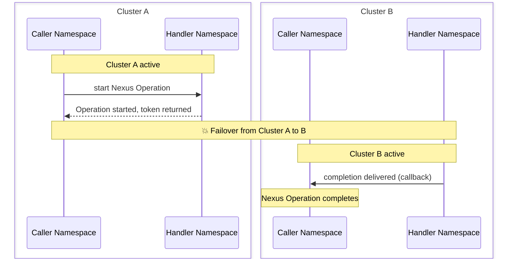

:::info NEW TO NEXUS?

This page explains how to self-host Nexus. To learn about Nexus, see the [how Nexus works page](/nexus). To evaluate whether Nexus fits your use case, see the [evaluation guide](/evaluate/nexus).

:::

## Enable Nexus

Nexus can be configured by setting static configuration and dynamic configuration entries.

:::note
Replace `$PUBLIC_URL` with a URL value that's accessible to external callers or internally within the cluster.
Currently, external Nexus calls are considered experimental so it should be safe to use the address of an internal load balancer for the Frontend Service.
:::

To enable Nexus in your deployment:

1. Enable the HTTP API in the server's static configuration.

   ```yaml
   services:
     frontend:
       rpc:
         # NOTE: keep other fields as they were
         httpPort: 7243

   clusterMetadata:
     # NOTE: keep other fields as they were
     clusterInformation:
       active:
         # NOTE: keep other fields as they were
         httpAddress: $PUBLIC_URL:7243
   ```

2. Set the required dynamic configuration
    1. **Prior to version 1.30.X**, you must set the public callback URL and the allowed callback addresses.

       **NOTE**: the callback endpoint template and allowed addresses should be set when using the experimental
       "external" endpoint targets.

       ```yaml
       component.nexusoperations.callback.endpoint.template:
         # The URL must be publicly accessible if the callback is meant to be called by external services.
         # When using Nexus for cross namespace calls, the URL's host is irrelevant as the address is resolved using
         # membership. The URL is a Go template that interpolates the `NamepaceName` and `NamespaceID` variables.
         - value: https://$PUBLIC_URL:7243/namespaces/{{.NamespaceName}}/nexus/callback
       component.callbacks.allowedAddresses:
         # Limits which callback URLs are accepted by the server.
         # Wildcard patterns (*) and insecure (HTTP) callbacks are intended for development only.
         # For production, restrict allowed hosts and set AllowInsecure to false
         # whenever HTTPS/TLS is supported. Allowing HTTP increases MITM and data exposure risk.
         - value:
             - Pattern: "*" # Update to restrict allowed callers, e.g. "*.example.com"
               AllowInsecure: true # In production, set to false and ensure traffic is HTTPS/TLS encrypted
       ```

    2. **Version 1.30.X+**: Nexus is enabled by default. Only the system callback URL is needed.
       ```yaml
       component.nexusoperations.useSystemCallbackURL:
         - value: true
       ```

## Build and use Nexus Services

See [how Nexus works](/nexus) for an architectural overview, then follow an SDK guide to build your first Nexus Service.

:::tip SDK GUIDES

- [Go](/develop/go/nexus/feature-guide) |
  [Java](/develop/java/nexus) |
  [Python](/develop/python/nexus) |
  [TypeScript](/develop/typescript/nexus) |
  [.NET](/develop/dotnet/nexus)

:::

## Global Namespaces (multi-region failover)

Nexus works across a [Global (multi-region) Namespace](/global-namespace). An
asynchronous Nexus Operation started in one Cluster completes even if the Namespace
fails over, or its Cluster is lost, before the Operation finishes.

:::note Endpoint target types

This applies to [Worker-target Endpoints](/nexus/endpoints), where the Endpoint
routes to a target Namespace and Task Queue that a Worker polls. Endpoints can also
target an external URL (`--target-url`), which is experimental and not covered here.

:::

### Configuration

1. **Set up Multi-Cluster Replication.** See
   [Multi-Cluster Replication](/self-hosted-guide/multi-cluster-replication) for
   connecting Clusters and creating replicated Namespaces.

2. **Advertise a frontend HTTP address on every Cluster.** Extend the `httpPort`
   and `clusterInformation.<cluster>.httpAddress` from [Enable Nexus](#enable-nexus)
   to **every** Cluster, each with its own address. Without it, cross-Cluster
   callbacks fail with `HTTPAddress not configured for cluster: <name>`.

3. **Register Endpoints on every Cluster.** The
   [Nexus Endpoint registry](/nexus/registry) isn't replicated across Clusters.
   Create the same Endpoints (same target Namespace and Task Queue) on each Cluster.

4. **Enable automatic forwarding** so a request that lands on a standby Cluster
   forwards to the active one.

   - Set the server's [`dcRedirectionPolicy`](/references/configuration#dcredirectionpolicy)
     in static config. It defaults to no redirection, so set it to
     `all-apis-forwarding` (or `selected-apis-forwarding`):

     ```yaml
     dcRedirectionPolicy:
       policy: "all-apis-forwarding"
     ```

   - Make sure `system.enableNamespaceNotActiveAutoForwarding` isn't turned off for
     the Namespace. This per-Namespace dynamic config defaults to `true`.

### What to expect on failover

A Nexus Operation started before a Cluster failover completes on the new active Cluster:



Callbacks are delivered to the caller Namespace's active Cluster, re-resolved on each attempt.
