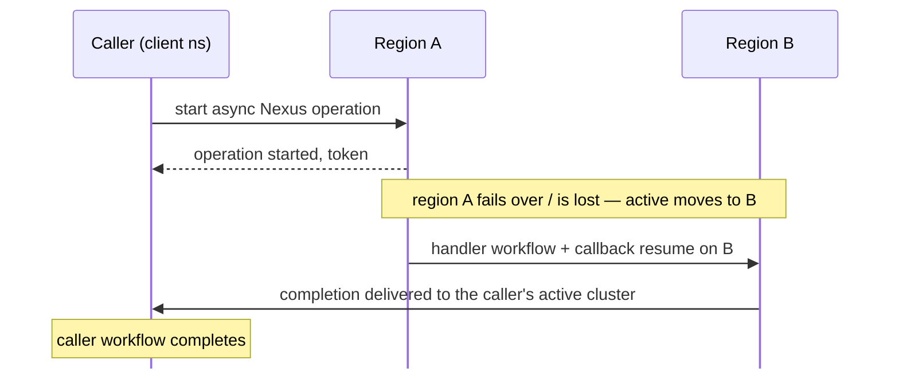

:::info NEW TO NEXUS?

This page explains how to self-host Nexus. To learn about Nexus, see the [how Nexus works page](/nexus). To evaluate whether Nexus fits your use case, see the [evaluation guide](/evaluate/nexus).

:::

## Enable Nexus

Nexus can be configured by setting static configuration and dynamic configuration entries.

:::note
Replace `$PUBLIC_URL` with a URL value that's accessible to external callers or internally within the cluster.
Currently, external Nexus calls are considered experimental so it should be safe to use the address of an internal load balancer for the Frontend Service.
:::

To enable Nexus in your deployment:

1. Enable the HTTP API in the server's static configuration.

   ```yaml
   services:
     frontend:
       rpc:
         # NOTE: keep other fields as they were
         httpPort: 7243

   clusterMetadata:
     # NOTE: keep other fields as they were
     clusterInformation:
       active:
         # NOTE: keep other fields as they were
         httpAddress: $PUBLIC_URL:7243
   ```

2. Set the required dynamic configuration
    1. **Prior to version 1.30.X**, you must set the public callback URL and the allowed callback addresses.

       **NOTE**: the callback endpoint template and allowed addresses should be set when using the experimental
       "external" endpoint targets.

       ```yaml
       component.nexusoperations.callback.endpoint.template:
         # The URL must be publicly accessible if the callback is meant to be called by external services.
         # When using Nexus for cross namespace calls, the URL's host is irrelevant as the address is resolved using
         # membership. The URL is a Go template that interpolates the `NamepaceName` and `NamespaceID` variables.
         - value: https://$PUBLIC_URL:7243/namespaces/{{.NamespaceName}}/nexus/callback
       component.callbacks.allowedAddresses:
         # Limits which callback URLs are accepted by the server.
         # Wildcard patterns (*) and insecure (HTTP) callbacks are intended for development only.
         # For production, restrict allowed hosts and set AllowInsecure to false
         # whenever HTTPS/TLS is supported. Allowing HTTP increases MITM and data exposure risk.
         - value:
             - Pattern: "*" # Update to restrict allowed callers, e.g. "*.example.com"
               AllowInsecure: true # In production, set to false and ensure traffic is HTTPS/TLS encrypted
       ```

    2. **Version 1.30.X+**: Nexus is enabled by default. Only the system callback URL is needed.
       ```yaml
       component.nexusoperations.useSystemCallbackURL:
         - value: true
       ```

## Build and use Nexus Services

See [how Nexus works](/nexus) for an architectural overview, then follow an SDK guide to build your first Nexus Service.

:::tip SDK GUIDES

- [Go](/develop/go/nexus/feature-guide) |
  [Java](/develop/java/nexus) |
  [Python](/develop/python/nexus) |
  [TypeScript](/develop/typescript/nexus) |
  [.NET](/develop/dotnet/nexus)

:::

## Global Namespaces (multi-region failover)

Nexus works across a [Global (multi-region) Namespace](/global-namespace): an
asynchronous operation started in one region completes even if the Namespace fails
over or the region is lost before it finishes. This applies to
[worker-target endpoints](/nexus/endpoints) — the endpoint routes to a target
Namespace and Task Queue a Temporal worker polls.

### Configuration

1. **Setup Multi-Cluster Replication** See
   [multi-cluster replication](/self-hosted-guide/multi-cluster-replication) for
   connecting clusters and creating replicated Namespaces.

2. **Register endpoints in every region.** The
   [Nexus Endpoint registry](/nexus/registry) is not replicated across clusters.
   Create the same endpoints (same target Namespace and task queue) on each cluster.

3. **Give every cluster a frontend HTTP address — set *and* advertised.** Each
   cluster must set a local `frontend.rpc.httpPort` **and** advertise it via
   `clusterMetadata.clusterInformation.<cluster>.httpAddress`. This is the same
   `httpAddress` shown in [Enable Nexus](#enable-nexus) — but for failover it must
   be set on **every** cluster, each with its own address, not just one. Callback
   routing resolves this address at delivery time; without it, cross-cluster
   callbacks fail with `HTTPAddress not configured for cluster: <name>`. The
   `operator cluster upsert` flow does **not** set `httpAddress` — configure it
   explicitly, and re-run `upsert` after changing it.

   ```yaml
   # cluster-a (repeat on every cluster with its own addresses)
   services:
     frontend:
       rpc:
         httpPort: 7243
   clusterMetadata:
     clusterInformation:
       cluster-a:
         rpcAddress: "cluster-a-host:7233"
         httpAddress: "cluster-a-host:7243"   # advertised to peers — required
   ```

4. **Enable auto-forwarding** (per Namespace) so a request that lands on a standby
   cluster is forwarded to the active one, with the frontend `dcRedirectionPolicy`
   allowing redirection (e.g. `all-apis-forwarding`).

   ```yaml
   system.enableNamespaceNotActiveAutoForwarding:
     - value: true
   ```

### What to expect on failover



- **Completion callbacks are delivered internally** to the caller Namespace's
  *current* active cluster, re-resolved on each attempt — no callback URL, DNS, or
  routing layer to manage.
- **Forwarding runs on the surviving cluster**, toward the active cluster; it does
  **not** depend on the failed region. Planned failover and **permanent region
  loss** both work.
- **On permanent region loss, fail over *every* Namespace off the dead region**
  (both caller and handler). A completion whose caller Namespace still points at the
  lost region retries until you do.
- **Caveat:** anything not replicated before a region dies is lost. Long-running
  async operations replicate their setup state early, so mid-flight failover
  completes.
