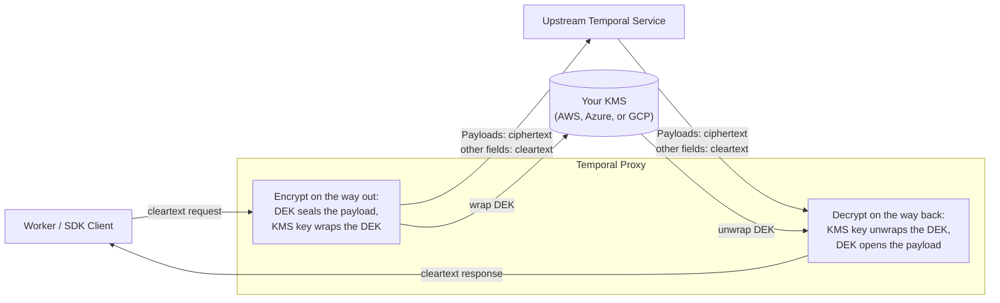

import { ReleaseNoteHeader } from '@site/src/components';

<ReleaseNoteHeader type="prerelease">
  Temporal Proxy is under active development and is not ready for production use. Behavior and configuration can change
  between releases. See the [temporal-proxy repository](https://github.com/temporalio/temporal-proxy) for current status
  and the definitive configuration schema.
</ReleaseNoteHeader>

The proxy can encrypt Workflow and Activity payloads on the hop to an upstream and decrypt them on responses, set under
the top-level `encryption` block. It is off by default. Workers and Clients keep exchanging cleartext with the gateway;
the proxy seals codec-capable Payloads before they leave and opens them on the way back. New Payloads sent through the
proxy reach the upstream Temporal Service as ciphertext. Encryption is transparent, requiring no change to Worker or
Client code.

It uses envelope encryption: a short-lived data encryption key (DEK) encrypts each payload with AES-256-GCM, and a KMS
key you own wraps the DEK. The wrapped DEK and a reference to the key that wrapped it travel with the payload, so the
proxy does not receive the KMS key material. It calls your KMS to wrap and unwrap DEKs and can cache decrypted DEKs in
memory. Supported key schemes are `awskms`, `azurekeyvault`, and `gcpkms` for cloud KMS, `extension` for a
[key management backend you run yourself](#plug-in-your-own-key-management-backend), and `testing` for local development
only.



## Configure payload encryption

```yaml
encryption:
  enabled: true # Encrypt new payloads. Optional; defaults to false.
  cacheSize: 100 # Bounds the in-memory decrypted-DEK cache. Must be non-negative.
  default: # Fallback key policy for any Namespace without an override.
    uri: awskms:///arn:aws:kms:us-east-1:123456789012:key/abcd-1234?region=us-east-1
    duration: 1h # How long a DEK is used for new encryption before it rotates.
    renewBefore: 15m # Lead time before expiry to pre-rotate. Must be less than duration.
  overrides: # Per-Namespace policies, keyed by local (pre-translation) Namespace.
    payments:
      uri: gcpkms://projects/my-project/locations/global/keyRings/codec/cryptoKeys/v1
      duration: 30m
      renewBefore: 5m
```

- `default` is a key policy required whenever `enabled: true`. It makes encryption fail-closed: any Namespace without
  its own override, including Namespaces created after startup, uses the default rather than sending plaintext. Enabling
  encryption without a `default` is a startup error.
- `overrides` maps a local Namespace to its own key policy, which takes precedence over `default`. The keys are the
  local (pre-translation) Namespace names. Reach for overrides to scope blast radius, spread load across KMS keys, or
  keep a tenant's key in its own region or provider.
- `cacheSize` bounds the in-memory cache of decrypted DEKs, which avoids a KMS call on every message. It must be
  non-negative.

## Understand fail-closed behavior

:::note Scope of fail-closed behavior

Fail-closed applies to outbound codec-capable Payloads on calls that pass through a proxy where `encryption.enabled` is
`true`. If the proxy cannot encrypt one of these Payloads, such as when the KMS is unavailable, it fails the request
before sending it upstream. It does not fall back to plaintext.

The proxy cannot enforce encryption for a Client, Worker, self-hosted Web UI, or CLI that connects directly to the
upstream Temporal Service. Restrict credentials and network paths when all application traffic must pass through the
proxy.

On responses, the proxy decrypts Payloads that carry its encryption metadata. It passes other Payloads through unchanged
so data written before proxy adoption remains readable during a migration. Closed Workflow histories normally age out
under the Namespace's retention period, but open Workflows, Archival, exports, backups, and other copies can preserve
plaintext data longer.

Fail-closed does not mean that every request field is encrypted. Search Attributes remain unencrypted so the Temporal
Service can index them. Failure messages and call stacks are not codec-capable Payloads by default. See
[Codecs and Encryption](/production-deployment/data-encryption) for encryption coverage and
[Failure Converter](/failure-converter) for failure encoding.

:::

## Define key policies

`default` and each `overrides` entry are key policies with the same shape:

| Field         | Meaning                                                                                                                                                                                                   |
| ------------- | --------------------------------------------------------------------------------------------------------------------------------------------------------------------------------------------------------- |
| `uri`         | Active key that wraps new DEKs. Required. Scheme must be `awskms`, `azurekeyvault`, `gcpkms`, `extension`, or `testing`. Each policy's `uri` must be unique across `default` and every `overrides` entry. |
| `decryptURIs` | Additional KMS keys accepted only when unwrapping existing DEKs, for key migration. Optional.                                                                                                             |
| `duration`    | How long a DEK is used for new encryption before it rotates. Must be greater than zero.                                                                                                                   |
| `renewBefore` | Lead time before expiry at which the proxy pre-rotates the DEK. Must be at least zero and less than `duration`.                                                                                           |

The proxy rotates DEKs automatically on the `duration` and `renewBefore` schedule. You remain responsible for changing,
retaining, and eventually retiring the KMS keys that wrap those DEKs. See
[Manage encryption keys](/production-deployment/temporal-proxy/manage-encryption-keys) for key migration,
multi-region access, decrypt-only operation, and safe retirement.

The `testing://` scheme holds its key material in the configuration itself and provides no real security. Use it only
for local development, and point production at `awskms`, `azurekeyvault`, `gcpkms`, or an extension server.

The proxy authenticates to each cloud provider through that provider's default credential chain, so no key material or
static cloud credentials live in the proxy configuration. On Kubernetes, bind the proxy's service account to a cloud
identity (IRSA or Pod Identity on AWS, Workload Identity on Azure and GCP); off Kubernetes, the SDKs resolve credentials
from the host. Grant that identity only the permission to encrypt and decrypt with the specific key, as shown for each
provider below.

## AWS KMS {/* #aws-kms */}

Wrap DEKs with an AWS KMS symmetric key, referenced by ARN. The `awskms://` scheme uses a triple slash (`awskms:///`) so
the ARN can sit in the URL path; add `?region=` when the key's region differs from the proxy's ambient region. See the
[AWS KMS documentation](https://docs.aws.amazon.com/kms/latest/developerguide/overview.html).

The proxy needs `kms:Encrypt` and `kms:Decrypt` on the key. Attach them as an inline policy to the IAM role the proxy
runs as:

```bash
aws iam put-role-policy \
  --role-name temporal-proxy \
  --policy-name temporal-proxy-kms \
  --policy-document '{
    "Version": "2012-10-17",
    "Statement": [
      {
        "Effect": "Allow",
        "Action": ["kms:Encrypt", "kms:Decrypt"],
        "Resource": "arn:aws:kms:us-east-1:123456789012:key/abcd-1234"
      }
    ]
  }'
```

```yaml
encryption:
  enabled: true
  default:
    uri: awskms:///arn:aws:kms:us-east-1:123456789012:key/abcd-1234?region=us-east-1
    duration: 1h
    renewBefore: 15m
```

## Azure Key Vault

Wrap DEKs with a Key Vault key. The default algorithm is RSA-OAEP-256, so the key must be an RSA key; append
`?algorithm=` to the URI to override it. The key version is optional and defaults to the latest version. See the
[Azure Key Vault documentation](https://learn.microsoft.com/en-us/azure/key-vault/general/overview).

The proxy needs the `encrypt` and `decrypt` key operations, granted by the built-in Key Vault Crypto User role (Azure
RBAC) or an access policy that allows the Encrypt and Decrypt key permissions:

```bash
az role assignment create \
  --assignee <proxy-identity> \
  --role "Key Vault Crypto User" \
  --scope <key-vault-resource-id>
```

```yaml
encryption:
  enabled: true
  default:
    uri: azurekeyvault://my-vault.vault.azure.net/keys/my-key
    duration: 1h
    renewBefore: 15m
```

## Google Cloud KMS

Wrap DEKs with a Cloud KMS key, referenced by its full resource name. See the
[Cloud KMS documentation](https://cloud.google.com/kms/docs).

The proxy needs `cloudkms.cryptoKeyVersions.useToEncrypt` and `cloudkms.cryptoKeyVersions.useToDecrypt`, granted by the
`roles/cloudkms.cryptoKeyEncrypterDecrypter` role on the key and bound to the proxy's service account:

```bash
gcloud kms keys add-iam-policy-binding my-key \
  --location global --keyring codec \
  --member serviceAccount:proxy@my-project.iam.gserviceaccount.com \
  --role roles/cloudkms.cryptoKeyEncrypterDecrypter
```

```yaml
encryption:
  enabled: true
  default:
    uri: gcpkms://projects/my-project/locations/global/keyRings/codec/cryptoKeys/my-key
    duration: 1h
    renewBefore: 15m
```

## Plug in your own key management backend {/* #plug-in-your-own-key-management-backend */}

To wrap DEKs with a backend the proxy has no built-in support for, such as an on-prem HSM or an internal key service,
run that backend as a gRPC server and point the proxy at it. The proxy calls it to wrap and unwrap DEKs only; payload
plaintext never reaches it.

Declare the server under the top-level `extensionServers` block, then address its keys with the `extension://` scheme:

```yaml
extensionServers:
  - name: kms
    hostPort: 127.0.0.1:9443 # Literal host:port. Templates are rejected.
    tls:
      ca: /etc/temporal-proxy/certs/kms/ca.pem
      serverName: kms.internal # Set when the dialed host does not match the certificate.
    credentials:
      static:
        apiKey: ${KMS_API_KEY} # Requires TLS, as with upstreams.

encryption:
  enabled: true
  default:
    uri: extension://kms/payloads # Host names an entry in extensionServers.
    duration: 1h
    renewBefore: 15m
```

- `name` identifies the server so key URIs can reference it. Names and `hostPort` values must be unique across the list,
  and every `extension://` URI must name a configured server.
- `hostPort` must be a literal address. Unlike an upstream, an extension server is dialed at a fixed address rather than
  resolved per request, so a templated value is rejected at startup.
- `tls` takes the same keys as an upstream's, and `credentials` works the same way, including the rule that credentials
  require TLS.
- The path segment in the key URI, `payloads` above, is a proxy-side key name. It never reaches the extension server,
  which selects keys by Namespace, but it must be unique across `default` and every `overrides` entry.

The server implements `api.kms.v1.EncryptionService`, two RPCs defined in
[`api/kms/v1`](https://github.com/temporalio/temporal-proxy/tree/main/api/kms/v1):

| RPC       | Receives                                          | Returns          |
| --------- | ------------------------------------------------- | ---------------- |
| `Encrypt` | the local Namespace and the DEK to wrap           | the wrapped DEK  |
| `Decrypt` | a wrapped DEK, with no Namespace or other context | the original DEK |

Two constraints follow from that shape. `Decrypt` gets ciphertext and nothing else, so whatever your server returns from
`Encrypt` must carry enough information to identify the key that produced it. And the Namespace on `Encrypt` is always
the local, pre-translation name, so a server keying on Namespace must use that name rather than the translated remote
one.

The proxy validates and opens extension-server connections before the gateway starts accepting traffic. A malformed or
unreachable address, credentials without TLS, unreadable `ca` file, or certificate mismatch therefore fails startup. A
credential that the extension server rejects, or a dependency that fails after startup, surfaces when a request needs a
key operation and fails that request.

The [KMS extension server example](https://github.com/temporalio/temporal-proxy/tree/main/examples/kms) runs the whole
path on localhost, with a reference provider you can read as a starting point.

After encryption works, define how keys change and how long old keys remain available. See
[Manage encryption keys](/production-deployment/temporal-proxy/manage-encryption-keys).
