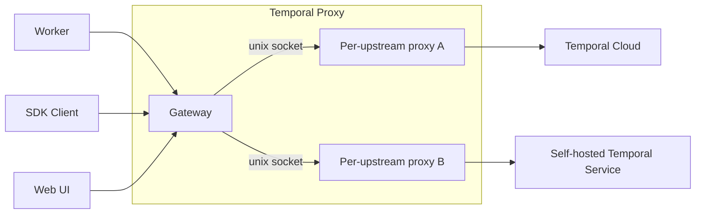

:::caution Pre-release

Temporal Proxy is under active development and evolving quickly. It is not ready for production use. Behavior and
configuration can change between releases. See the
[temporal-proxy repository](https://github.com/temporalio/temporal-proxy) for the current status and the definitive
configuration schema.

:::

The Temporal Proxy is a gRPC proxy that sits between your Temporal SDK Clients, Workers, and the Temporal Web UI on one
side and one or more upstream Temporal Services on the other. It handles Namespace translation and TLS termination so
your applications can target a single local endpoint while the proxy routes each request to the right upstream, whether
that is a local development Service, a self-hosted Service, or Temporal Cloud.

## Why use it

Without the proxy, connection details leak into your application code. Every Worker and Client has to know the
upstream's host, TLS material, credentials, and the exact Namespace name the upstream expects. That couples your code to
an environment: moving between a local Service, a self-hosted deployment, and Temporal Cloud becomes a code change.

The proxy owns that concern instead. Workers talk plaintext to a single local endpoint using a short Namespace name, and
the proxy adds TLS, credentials, and Namespace translation on the way out. Point a Worker at a different Namespace and
it reaches a different upstream, with no change to the Worker.

## How it works

The proxy is built from a gateway and one proxy per upstream, connected by unix sockets:

- The **gateway** is the single inbound endpoint that every Worker, SDK Client, and the Web UI connects to.
- Each **upstream** has its own proxy that handles communication with that destination.



For each request, the gateway:

1. peeks the target Namespace without parsing the payload; it is codec-transparent and relays raw frames in both
   directions.
2. picks an upstream: the first matching routing rule, otherwise the system upstream for Namespace-less calls, otherwise
   the default.
3. hands the request to that upstream's proxy over a unix socket.

The per-upstream proxy then rewrites the local Namespace to the name the upstream expects, attaches that upstream's TLS
and credentials, forwards to the Temporal Service, and translates the Namespace back on responses.

### Terms

| Term             | Meaning                                                                                                                                                                                         |
| ---------------- | ----------------------------------------------------------------------------------------------------------------------------------------------------------------------------------------------- |
| gateway          | The single inbound gRPC endpoint that every SDK Client, Worker, and the Web UI connects to. It routes each request to an upstream by Namespace and request metadata, and never parses payloads. |
| upstream         | A configured destination the proxy forwards to: a Temporal Service (local dev, self-hosted, or Temporal Cloud), or another Temporal Proxy.                                                      |
| system upstream  | The upstream that handles Namespace-less requests, such as the SDK's `GetSystemInfo` call on connect.                                                                                           |
| Temporal Service | A Temporal frontend the proxy connects to.                                                                                                                                                      |

## Prerequisites

- One or more upstream Temporal Services to route to, such as a local development Service, a self-hosted Service, or
  Temporal Cloud.
- The `hostPort` address for each upstream.
- Any credentials the upstreams require, such as a Temporal Cloud API key or mTLS certificates.
- Go installed, if you build the proxy from source. The container image and Helm chart do not require a local Go
  toolchain.

## Install the proxy

Install the `proxy` binary with Go:

```bash
go install github.com/temporalio/temporal-proxy/cmd/proxy@latest
```

Pin an explicit version instead of `@latest`:

```bash
go install github.com/temporalio/temporal-proxy/cmd/proxy@v0.1.0
```

Pull the container image:

```bash
docker pull temporalio/temporal-proxy:latest
```

Install with Helm from the Temporal Helm repo:

```bash
helm install temporal-proxy temporal-proxy \
  --repo https://go.temporal.io/helm-charts
```

Supply the proxy configuration under the `config` key of a Helm values file. The chart renders it into a ConfigMap
mounted at `/etc/temporal-proxy/config.yaml`.

Run the proxy with a configuration file passed through the `-c` (or `--config`) flag:

```bash
proxy serve -c config.yaml
```

## Configure the proxy

The proxy reads a single YAML file with three top-level sections: the gateway listener (`hostPort`), `routing`, and the
`upstreams` it forwards to. Values support `${VAR}` and `$VAR` environment variable expansion, and an upstream's
`hostPort` can be a template that resolves per request (for example `{{ .RemoteNamespace }}`).

The example below is the proxy's
[Temporal Cloud example](https://github.com/temporalio/temporal-proxy/tree/main/examples/cloud), which connects a Worker
to Temporal Cloud with an API key. The Worker carries no Cloud configuration: it talks plaintext to `127.0.0.1:7233`,
and the proxy adds TLS, the API key, and the Namespace rewrite on the way out.

```yaml
# Gateway: the local endpoint your Workers and Clients connect to (plaintext).
hostPort: 127.0.0.1:7233

routing:
  default: cloud # Namespaced requests.
  system: system # Namespace-less requests (for example GetSystemInfo on connect).

upstreams:
  # Namespaced traffic. The host is derived per request from the translated
  # Namespace, so one entry serves any number of Namespaces.
  - name: cloud
    hostPort: '{{ .RemoteNamespace }}.tmprl.cloud:7233'
    tls: {} # Enable outbound TLS with defaults.
    namespaces:
      rules:
        suffix: .$TEMPORAL_ACCOUNT # quickstart becomes quickstart.<account>
    credentials:
      static:
        apiKey: $TEMPORAL_API_KEY

  # Namespace-less calls have no Namespace to derive a host from, so they use a
  # fixed endpoint. Any Namespace endpoint in the account answers them.
  - name: system
    hostPort: ${TEMPORAL_NAMESPACE}.${TEMPORAL_ACCOUNT}.tmprl.cloud:7233
    tls: {}
    credentials:
      static:
        apiKey: ${TEMPORAL_API_KEY}
```

The [chart `values.yaml`](https://github.com/temporalio/helm-charts/tree/main/charts/temporal-proxy) and the
[temporal-proxy repository](https://github.com/temporalio/temporal-proxy) hold the complete, current set of options.

### Route requests

The `routing` section selects an upstream for each request:

- `default` is the fallback when no rule matches. It is optional; omit it to reject unmatched requests with an error.
- `system` is the upstream for Namespace-less requests, such as the SDK's `GetSystemInfo` and `GetClusterInfo` calls. It
  is optional; when unset, those requests fall back to `default`.
- `rules` is an ordered list, evaluated top to bottom. The first match wins.

Every upstream named by `default`, `system`, or a rule must exist in `upstreams`.

```yaml
routing:
  default: local # Fallback when no rule matches.
  system: cloud # Namespace-less requests.
  rules:
    - match:
        namespace: 'prod-*'
        metadata:
          x-tier: gold
      upstream: cloud
    - match:
        namespace: '*-test'
      upstream: local
```

A rule matches when its Namespace matches and every metadata condition matches (AND logic). A `match` must set at least
one of `namespace` or `metadata`; an empty match is a configuration error, since that is what `default` is for. Routing
runs on the local Namespace, before translation.

`namespace` is a string literal or a simple glob with a single leading or trailing `*`:

| Pattern    | Matches                     |
| ---------- | --------------------------- |
| `payments` | exactly `payments`          |
| `prod-*`   | names starting with `prod-` |
| `*-test`   | names ending with `-test`   |
| `*-test-*` | names containing `-test-`   |
| `*`        | any Namespace               |

A `*` in any other position, such as `a*b`, is invalid.

`metadata` matches gRPC request metadata (headers). Keys are case-insensitive and do not support wildcards; values use
the same glob syntax as `namespace`. A key matches when any of the request's values for it match.

### Translate Namespaces

Applications connected to the proxy use short, local Namespace names. Each upstream rewrites those names to the ones its
Temporal Service expects, under `namespaces.rules`. The rewrite applies to requests and is reversed on responses, so
callers only ever see the local name.

```yaml
upstreams:
  - name: cloud
    hostPort: '{{ .RemoteNamespace }}.tmprl.cloud:7233'
    tls: {}
    namespaces:
      rules:
        prefix: '' # Optional string prepended to the local name.
        suffix: .acct # payments becomes payments.acct
        overrides: # Explicit pairs that bypass prefix and suffix.
          - local: billing
            remote: payments.acct
```

- `prefix` and `suffix` wrap every local Namespace: the remote name is `prefix + local + suffix`, and responses are
  unwrapped back to the local name.
- `overrides` lists explicit `local` and `remote` pairs for names that do not follow the prefix and suffix convention.
  An override takes precedence over the prefix and suffix rules. Each local name and each remote name may appear only
  once.

An upstream's `hostPort` and `tls.serverName` can be Go templates resolved per request, so one upstream can serve many
Namespaces. Available variables:

- `{{ .LocalNamespace }}`: the Namespace before translation.
- `{{ .RemoteNamespace }}`: the Namespace after translation.
- `{{ .Metadata.<key> }}` or `{{ index .Metadata "<key>" }}`: a request metadata value.

Upstreams with a static `hostPort` connect eagerly at startup; templated ones connect lazily on first use.

### Authenticate inbound requests

Inbound authentication runs on the gateway and is off by default: omit the top-level `auth` block to accept all
requests. When present, `auth` must select exactly one authenticator, `staticToken` or `jwks`. The gateway validates the
credential on each request and strips it before forwarding upstream.

Compare an inbound bearer token against a fixed value with `staticToken`:

```yaml
auth:
  staticToken:
    token: ${GATEWAY_TOKEN} # Required. The expected token value.
    header: authorization # Header to read the token from.
    scheme: Bearer # Scheme prefix to strip before comparing.
```

Or verify a JWT's signature and claims against a JWKS endpoint with `jwks`:

```yaml
auth:
  jwks:
    url: https://issuer.example.com/.well-known/jwks.json # Required. Absolute https URL.
    audiences:
      - temporal-proxy
    issuer: https://issuer.example.com/
    header: authorization
    scheme: Bearer
```

`token` (for `staticToken`) and `url` (for `jwks`) are required; the remaining fields are optional. Only `staticToken`
or `jwks` may be set, not both.

### Present credentials to upstreams

Each upstream can present its own credential to the Temporal Service, set under `credentials`. `static` is the only
variant today; it injects a fixed API key as a bearer header on every outbound request, which is how you connect to
Temporal Cloud:

```yaml
upstreams:
  - name: cloud
    hostPort: my-ns.acct.tmprl.cloud:7233
    tls: {} # Required whenever credentials are set.
    credentials:
      static:
        apiKey: ${TEMPORAL_API_KEY} # Required.
        header: authorization # Optional header override.
        scheme: Bearer # Optional scheme override.
```

Credentials require TLS to the upstream. If you set `credentials` without a `tls` block, the configuration fails to
load.

### Configure TLS

TLS is terminated in two independent places, both using the same keys: `ca`, `cert`, `key`, and `serverName`.

**Inbound, on the gateway.** The top-level `tls` block secures connections from your applications. Set `cert` and `key`
for server TLS, and add `ca` to enforce mutual TLS, which requires each client to present a certificate signed by that
CA. Local development commonly omits `tls` and connects in plaintext.

**Outbound, per upstream.** Each upstream's `tls` block secures the connection from its proxy to the Temporal Service:

- `tls: {}` verifies the upstream against the system root certificate pool and presents no client certificate. This is
  what Temporal Cloud with an API key needs.
- `ca` alone verifies the upstream against a private trust anchor, still presenting no client certificate.
- `cert` and `key` together select mutual TLS and require `ca`. They must be set as a pair.

Set `serverName` when the host you dial does not match the common name or SAN on the server's certificate.

## Related

- [Temporal Proxy repository](https://github.com/temporalio/temporal-proxy)
- [Temporal Proxy Helm chart](https://github.com/temporalio/helm-charts/tree/main/charts/temporal-proxy)
- [Temporal Cloud example](https://github.com/temporalio/temporal-proxy/tree/main/examples/cloud)
- [Codecs and Encryption](/production-deployment/data-encryption)
- [Self-hosted guide: Security](/self-hosted-guide/security)
