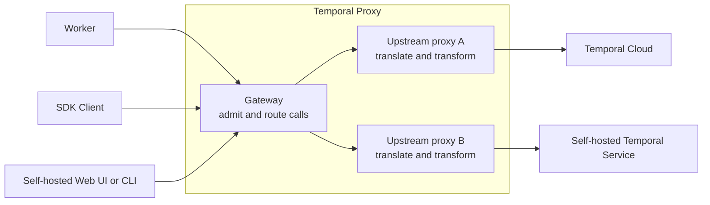

import { ReleaseNoteHeader } from '@site/src/components';

<ReleaseNoteHeader type="prerelease">
  Temporal Proxy is under active development and is not ready for production use. Behavior and configuration can change
  between releases. See the [temporal-proxy repository](https://github.com/temporalio/temporal-proxy) for current status
  and the definitive configuration schema.
</ReleaseNoteHeader>

Temporal Proxy is a gRPC intermediary between your Temporal SDK Clients, Workers, CLI, or self-hosted Temporal Web UI
and one or more upstream Temporal Services. Applications connect to one gateway endpoint. The proxy can then route each
request, translate its Namespace, authenticate and authorize the caller, present upstream credentials, and encrypt
supported Payload fields.

Use these pages to evaluate the prerelease project, run it against Temporal Cloud, and understand the operational and
security work required before placing it in a request path.

## Decide whether to use Temporal Proxy

Temporal Proxy centralizes connection and data-handling concerns that would otherwise live in every application. It is
most useful when you need one or more of the following outcomes:

| Goal | What the proxy does | Boundary to plan for |
| --- | --- | --- |
| Keep environment-specific connection details out of application configuration | Adds upstream TLS, credentials, and Namespace translation | Applications can still bypass the proxy unless you restrict their upstream credentials and network paths |
| Route applications to more than one Temporal Service | Selects an upstream by local Namespace and request metadata | The proxy becomes part of the request path and needs its own availability and capacity plan |
| Apply a common inbound access policy | Allows selected gRPC services and supports built-in or external authentication and authorization | The policy covers calls that enter the gateway, not direct calls to an upstream |
| Encrypt Payloads before they reach the Temporal Service | Applies envelope encryption to codec-capable Payload fields | Search Attributes and other non-Payload fields remain visible; existing plaintext Payloads remain readable during migration |

If one of these controls must be mandatory, treat the proxy as one layer in a larger security boundary. Restrict direct
access to every upstream in addition to configuring the proxy. See
[Plan a Temporal Proxy deployment](/production-deployment/temporal-proxy/plan-deployment) before evaluating it with
production-shaped traffic.

## Understand request handling

The proxy consists of one gateway and one per-upstream proxy server, connected by Unix sockets:


```mermaid
flowchart LR
    Worker[Worker]
    Client[SDK Client]
    UI[Self-hosted Web UI or CLI]

    subgraph Proxy[Temporal Proxy]
        direction LR
        Gateway["Gateway<br/>admit and route calls"]
        ProxyA["Upstream proxy A<br/>translate and transform"]
        ProxyB["Upstream proxy B<br/>translate and transform"]
        Gateway --> ProxyA
        Gateway --> ProxyB
    end

    Cloud[Temporal Cloud]
    SelfHosted[Self-hosted Temporal Service]

    Worker --> Gateway
    Client --> Gateway
    UI --> Gateway
    ProxyA --> Cloud
    ProxyB --> SelfHosted
```

For each request, the gateway:

1. Reads the target method and Namespace without decoding Payloads.
2. Applies configured inbound authentication or authorization to that target.
3. Rejects the call if its gRPC service is not allowed.
4. Selects the first matching route, the system route for Namespace-less calls, or the default route.
5. Sends the call to the selected per-upstream proxy.

The per-upstream proxy translates the local Namespace, resolves the destination, attaches TLS and credentials, and
forwards the call. When payload encryption is enabled, it also encrypts supported Payloads on outbound calls and
decrypts recognized encrypted Payloads on responses. See
[Encrypt Payloads](/production-deployment/temporal-proxy/encrypt-payloads) for the exact encryption coverage and
fail-closed behavior.

## Choose a deployment model

You can run the gateway as a shared service or place a proxy beside each application deployment:

| Model | Prefer it when | Account for |
| --- | --- | --- |
| Shared service | Several application deployments need the same routing and policy | Independent scaling, a larger failure domain, and securing the application-to-proxy network path |
| Sidecar or local proxy | You want a local endpoint and failure isolation per application deployment | More proxy instances, configuration distribution, and coordinated application rollouts |

Both models require enough instances, capacity, and regional placement for the availability of the upstreams they
serve. [Plan a Temporal Proxy deployment](/production-deployment/temporal-proxy/plan-deployment) covers topology,
trust boundaries, bypass prevention, and high availability.

## Choose your next step

| If you want to | Start here |
| --- | --- |
| Run the checked-in example against Temporal Cloud | [Get started with Temporal Cloud](/production-deployment/temporal-proxy/get-started-cloud) |
| Decide where the proxy belongs and which traffic it must cover | [Plan a Temporal Proxy deployment](/production-deployment/temporal-proxy/plan-deployment) |
| Build a complete configuration | [Configure Temporal Proxy](/production-deployment/temporal-proxy/configure) |
| Route traffic and translate Namespace names | [Route requests and translate Namespaces](/production-deployment/temporal-proxy/route-translate) |
| Configure TLS, authentication, authorization, and credentials | [Secure connections and authorize requests](/production-deployment/temporal-proxy/secure-connections) |
| Encrypt supported Payload fields | [Encrypt Payloads](/production-deployment/temporal-proxy/encrypt-payloads) |
| Rotate or retire encryption keys | [Manage encryption keys](/production-deployment/temporal-proxy/manage-encryption-keys) |
| Install the Helm chart | [Deploy Temporal Proxy to Kubernetes](/production-deployment/temporal-proxy/deploy-kubernetes) |
| Monitor or diagnose a deployment | [Operate and troubleshoot Temporal Proxy](/production-deployment/temporal-proxy/operate-troubleshoot) |
| Look up flags, configuration sections, metrics, or compatibility | [Temporal Proxy reference](/production-deployment/temporal-proxy/reference) |

## Install the proxy

Choose an installation method that matches your evaluation environment. Pin a release instead of using a moving tag
when you need repeatable behavior.

Install the `proxy` binary with Go:

```bash
go install github.com/temporalio/temporal-proxy/cmd/proxy@vX.Y.Z
```

Pull the container image:

```bash
docker pull temporalio/temporal-proxy:vX.Y.Z
```

Install the Helm chart from the Temporal chart repository:

```bash
helm install temporal-proxy temporal-proxy \
  --repo https://go.temporal.io/helm-charts \
  --version <chart-version>
```

See the [Temporal Proxy releases](https://github.com/temporalio/temporal-proxy/releases) and
[Helm chart releases](https://github.com/temporalio/helm-charts/releases) for available versions. The
[reference page](/production-deployment/temporal-proxy/reference) lists runtime flags and configuration sections.

## Review terminology

| Term | Meaning |
| --- | --- |
| gateway | The single inbound gRPC endpoint. It admits and routes requests without decoding Payloads. |
| upstream | A configured Temporal Service or another Temporal Proxy that receives forwarded calls. |
| system upstream | The upstream for Namespace-less calls such as `GetSystemInfo`. |
| per-upstream proxy | The internal server that applies translation, credentials, TLS, and optional payload encryption for one upstream definition. |
| extension server | A gRPC service you operate that wraps encryption keys or makes inbound authorization decisions. |

## Related

- [Temporal Proxy repository](https://github.com/temporalio/temporal-proxy)
- [Temporal Proxy Helm chart](https://github.com/temporalio/helm-charts/tree/main/charts/temporal-proxy)
- [Codecs and Encryption](/production-deployment/data-encryption)
- [Self-hosted guide: Security](/self-hosted-guide/security)
