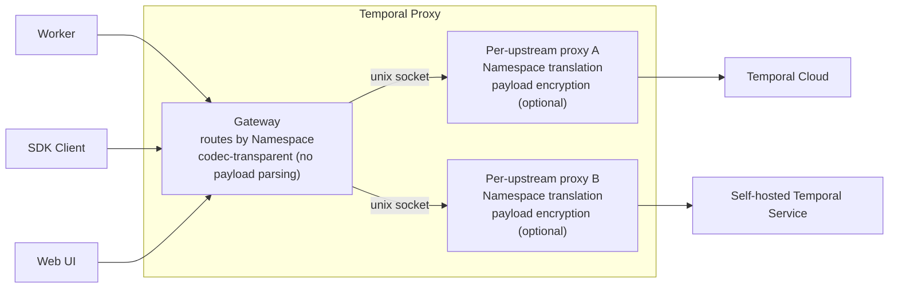
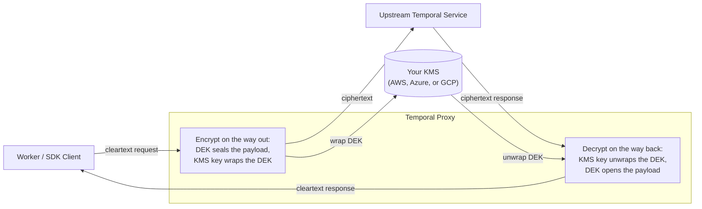

:::caution Pre-release

Temporal Proxy is under active development and evolving quickly. It is not ready for production use. Behavior and
configuration can change between releases. See the
[temporal-proxy repository](https://github.com/temporalio/temporal-proxy) for the current status and the definitive
configuration schema.

:::

The Temporal Proxy is a gRPC proxy that sits between your Temporal SDK Clients, Workers, and the Temporal Web UI on one
side and one or more upstream Temporal Services on the other. It handles Namespace translation, TLS termination, and
optional payload encryption so your applications can target a single local endpoint while the proxy routes each request
to the right upstream, whether that is a local development Service, a self-hosted Service, or Temporal Cloud.

## Why use it

Without the proxy, connection details leak into your application code. Every Worker and Client has to know the
upstream's host, TLS material, credentials, and the exact Namespace name the upstream expects. That couples your code to
an environment: moving between a local Service, a self-hosted deployment, and Temporal Cloud becomes a code change.

The proxy owns that concern instead. Workers talk plaintext to a single local endpoint using a short Namespace name, and
the proxy adds TLS, credentials, and Namespace translation on the way out. Point a Worker at a different Namespace and
it reaches a different upstream, with no change to the Worker.

## How it works

The proxy is built from a gateway and one proxy per upstream, connected by unix sockets:

- The **gateway** is the single inbound endpoint that every Worker, SDK Client, and the Web UI connects to.
- Each **upstream** has its own proxy that handles communication with that destination.


```mermaid
flowchart LR
    Worker[Worker]
    Client[SDK Client]
    UI[Web UI]

    subgraph Proxy[Temporal Proxy]
        direction LR
        Gateway["Gateway<br/>routes by Namespace<br/>codec-transparent (no payload parsing)"]
        ProxyA["Per-upstream proxy A<br/>Namespace translation<br/>payload encryption (optional)"]
        ProxyB["Per-upstream proxy B<br/>Namespace translation<br/>payload encryption (optional)"]
        Gateway -->|unix socket| ProxyA
        Gateway -->|unix socket| ProxyB
    end

    Cloud[Temporal Cloud]
    SelfHosted[Self-hosted Temporal Service]

    Worker --> Gateway
    Client --> Gateway
    UI --> Gateway
    ProxyA --> Cloud
    ProxyB --> SelfHosted
```

For each request, the gateway:

1. peeks the target Namespace without parsing the payload; it is codec-transparent and relays raw frames in both
   directions.
2. picks an upstream: the first matching routing rule, otherwise the system upstream for Namespace-less calls, otherwise
   the default.
3. hands the request to that upstream's proxy over a unix socket.

The per-upstream proxy then rewrites the local Namespace to the name the upstream expects, attaches that upstream's TLS
and credentials, forwards to the Temporal Service, and translates the Namespace back on responses. When payload
encryption is enabled, it also seals payloads on the way out and opens them on the way back, so the upstream only ever
stores ciphertext.

### Terms

| Term             | Meaning                                                                                                                                                                                         |
| ---------------- | ----------------------------------------------------------------------------------------------------------------------------------------------------------------------------------------------- |
| gateway          | The single inbound gRPC endpoint that every SDK Client, Worker, and the Web UI connects to. It routes each request to an upstream by Namespace and request metadata, and never parses payloads. |
| upstream         | A configured destination the proxy forwards to: a Temporal Service (local dev, self-hosted, or Temporal Cloud), or another Temporal Proxy.                                                      |
| system upstream  | The upstream that handles Namespace-less requests, such as the SDK's `GetSystemInfo` call on connect.                                                                                           |
| extension server | A gRPC service you run that the proxy calls out to for a capability it has no built-in backend for. Today that means wrapping data encryption keys as a key management backend.                 |
| Temporal Service | A Temporal frontend the proxy connects to.                                                                                                                                                      |

## Prerequisites

- One or more upstream Temporal Services to route to, such as a local development Service, a self-hosted Service, or
  Temporal Cloud.
- The `hostPort` address for each upstream.
- Any credentials the upstreams require, such as a Temporal Cloud API key or mTLS certificates.
- Go installed, if you build the proxy from source. The container image and Helm chart do not require a local Go
  toolchain.

## Install the proxy

Install the `proxy` binary with Go:

```bash
go install github.com/temporalio/temporal-proxy/cmd/proxy@latest
```

Pin an explicit version instead of `@latest`, using a tag from the
[releases page](https://github.com/temporalio/temporal-proxy/releases):

```bash
go install github.com/temporalio/temporal-proxy/cmd/proxy@vX.Y.Z
```

Pull the container image:

```bash
docker pull temporalio/temporal-proxy:latest
```

Install with Helm from the Temporal Helm repo, optionally pinning a chart version with `--version`:

```bash
helm install temporal-proxy temporal-proxy \
  --repo https://go.temporal.io/helm-charts
```

Each chart release deploys a proxy version by default. Override it with `--set image.tag=vX.Y.Z`. Supply the proxy
configuration under the `config` key of a Helm values file, as described in
[Deploy to Kubernetes](#deploy-to-kubernetes).

Run the proxy with a configuration file passed through the `-c` (or `--config`) flag:

```bash
proxy serve -c config.yaml
```

`--config` also reads the `PROXY_CONFIG` environment variable, which is how the Helm chart points the proxy at its
mounted configuration. See [Observability](#observability) for the remaining flags.

## Configure the proxy

The proxy reads a single YAML file. Three sections are the core of it: the gateway listener (`hostPort`), `routing`, and
the `upstreams` it forwards to. The optional `tls`, `auth`, `encryption`, and `extensionServers` sections add inbound
TLS, inbound authentication, and payload encryption. Values support `${VAR}` and `$VAR` environment variable expansion,
and an upstream's `hostPort` can be a template that resolves per request (for example `{{ .RemoteNamespace }}`).

The example below is the proxy's
[Temporal Cloud example](https://github.com/temporalio/temporal-proxy/tree/main/examples/cloud), which connects a Worker
to Temporal Cloud with an API key. The Worker carries no Cloud configuration: it talks plaintext to `127.0.0.1:7233`,
and the proxy adds TLS, the API key, and the Namespace rewrite on the way out.

```yaml
# Gateway: the local endpoint your Workers and Clients connect to (plaintext).
hostPort: 127.0.0.1:7233

routing:
  default: cloud # Namespaced requests.
  system: system # Namespace-less requests (for example GetSystemInfo on connect).

upstreams:
  # Namespaced traffic. The host is derived per request from the translated
  # Namespace, so one entry serves any number of Namespaces.
  - name: cloud
    hostPort: '{{ .RemoteNamespace }}.tmprl.cloud:7233'
    tls: {} # Enable outbound TLS with defaults.
    namespaces:
      rules:
        suffix: .$TEMPORAL_ACCOUNT # quickstart becomes quickstart.<account>
    credentials:
      static:
        apiKey: $TEMPORAL_API_KEY

  # Namespace-less calls have no Namespace to derive a host from, so they use a
  # fixed endpoint. Any Namespace endpoint in the account answers them.
  - name: system
    hostPort: ${TEMPORAL_NAMESPACE}.${TEMPORAL_ACCOUNT}.tmprl.cloud:7233
    tls: {}
    credentials:
      static:
        apiKey: ${TEMPORAL_API_KEY}
```

The [chart `values.yaml`](https://github.com/temporalio/helm-charts/tree/main/charts/temporal-proxy) and the
[temporal-proxy repository](https://github.com/temporalio/temporal-proxy) hold the complete, current set of options.

### Route requests

The `routing` section selects an upstream for each request:

- `default` is the fallback when no rule matches. It is optional; omit it to reject unmatched requests with an error.
- `system` is the upstream for Namespace-less requests, such as the SDK's `GetSystemInfo` and `GetClusterInfo` calls. It
  is optional; when unset, those requests fall back to `default`.
- `rules` is an ordered list, evaluated top to bottom. The first match wins.

Every upstream named by `default`, `system`, or a rule must exist in `upstreams`. Upstream `name` and `hostPort` values
must each be unique across the list: two upstreams sharing a name make a routing reference ambiguous, and two sharing an
address is a copy-paste error rather than a useful configuration.

```yaml
routing:
  default: local # Fallback when no rule matches.
  system: cloud # Namespace-less requests.
  rules:
    - match:
        namespace: 'prod-*'
        metadata:
          x-tier: gold
      upstream: cloud
    - match:
        namespace: '*-test'
      upstream: local
```

A rule matches when its Namespace matches and every metadata condition matches (AND logic). A `match` must set at least
one of `namespace` or `metadata`; an empty match is a configuration error, since that is what `default` is for. Routing
runs on the local Namespace, before translation.

`namespace` is a string literal or a simple glob with a single leading or trailing `*`:

| Pattern    | Matches                     |
| ---------- | --------------------------- |
| `payments` | exactly `payments`          |
| `prod-*`   | names starting with `prod-` |
| `*-test`   | names ending with `-test`   |
| `*-test-*` | names containing `-test-`   |
| `*`        | any Namespace               |

A `*` in any other position, such as `a*b`, is invalid.

`metadata` matches gRPC request metadata (headers). Keys are case-insensitive and do not support wildcards; values use
the same glob syntax as `namespace`. A key matches when any of the request's values for it match.

### Translate Namespaces

Applications connected to the proxy use short, local Namespace names. Each upstream rewrites those names to the ones its
Temporal Service expects, under `namespaces.rules`. The rewrite applies to requests and is reversed on responses, so
callers only ever see the local name.

```yaml
upstreams:
  - name: cloud
    hostPort: '{{ .RemoteNamespace }}.tmprl.cloud:7233'
    tls: {}
    namespaces:
      rules:
        prefix: '' # Optional string prepended to the local name.
        suffix: .acct # payments becomes payments.acct
        overrides: # Explicit pairs that bypass prefix and suffix.
          - local: billing
            remote: payments.acct
```

- `prefix` and `suffix` wrap every local Namespace: the remote name is `prefix + local + suffix`, and responses are
  unwrapped back to the local name.
- `overrides` lists explicit `local` and `remote` pairs for names that do not follow the prefix and suffix convention.
  An override takes precedence over the prefix and suffix rules. Each local name and each remote name may appear only
  once.

An upstream's `hostPort` and `tls.serverName` can be Go templates resolved per request, so one upstream can serve many
Namespaces. Available variables:

- `{{ .LocalNamespace }}`: the Namespace before translation.
- `{{ .RemoteNamespace }}`: the Namespace after translation.
- `{{ .Metadata.<key> }}` or `{{ index .Metadata "<key>" }}`: a request metadata value.

Upstreams with a static `hostPort` connect eagerly at startup; templated ones connect lazily on first use.

### Authenticate inbound requests

Inbound authentication runs on the gateway and is off by default: omit the top-level `auth` block to accept all
requests. When present, `auth` must select exactly one authenticator, `staticToken` or `jwks`. The gateway validates the
credential on each request and strips it before forwarding upstream.

Compare an inbound bearer token against a fixed value with `staticToken`:

```yaml
auth:
  staticToken:
    token: ${GATEWAY_TOKEN} # Required. The expected token value.
    header: authorization # Header to read the token from.
    scheme: Bearer # Scheme prefix to strip before comparing.
```

Or verify a JWT's signature and claims against a JWKS endpoint with `jwks`:

```yaml
auth:
  jwks:
    url: https://issuer.example.com/.well-known/jwks.json # Required. Absolute https URL.
    audiences:
      - temporal-proxy
    issuer: https://issuer.example.com/
    header: authorization
    scheme: Bearer
```

`token` (for `staticToken`) and `url` (for `jwks`) are required; the remaining fields are optional. Only `staticToken`
or `jwks` may be set, not both.

### Present credentials to upstreams

Each upstream can present its own credential to the Temporal Service, set under `credentials`. `static` is the only
variant today; it injects a fixed API key as a bearer header on every outbound request, which is how you connect to
Temporal Cloud:

```yaml
upstreams:
  - name: cloud
    hostPort: my-ns.acct.tmprl.cloud:7233
    tls: {} # Required whenever credentials are set.
    credentials:
      static:
        apiKey: ${TEMPORAL_API_KEY} # Required.
        header: authorization # Optional header override.
        scheme: Bearer # Optional scheme override.
```

Credentials require TLS to the upstream. If you set `credentials` without a `tls` block, the configuration fails to
load.

### Configure TLS

TLS is terminated in two independent places, both using the same keys: `ca`, `cert`, `key`, and `serverName`. `ca`,
`cert`, and `key` are paths to PEM files on disk, not inline PEM content. On Kubernetes, let the chart mount them from a
Secret and fill in the paths for you, as described in [Supply TLS material](#supply-tls-material).

**Inbound, on the gateway.** The top-level `tls` block secures connections from your applications. Set `cert` and `key`
for server TLS, and add `ca` to enforce mutual TLS, which requires each client to present a certificate signed by that
CA. Local development commonly omits `tls` and connects in plaintext.

**Outbound, per upstream.** Each upstream's `tls` block secures the connection from its proxy to the Temporal Service:

- `tls: {}` verifies the upstream against the system root certificate pool and presents no client certificate. This is
  what Temporal Cloud with an API key needs.
- `ca` alone verifies the upstream against a private trust anchor, still presenting no client certificate.
- `cert` and `key` together select mutual TLS and require `ca`. They must be set as a pair.

Set `serverName` when the host you dial does not match the common name or SAN on the server's certificate.

### Encrypt payloads

The proxy can encrypt Workflow and Activity payloads on the hop to an upstream and decrypt them on responses, set under
the top-level `encryption` block. It is off by default. Workers and Clients keep exchanging cleartext with the gateway;
the proxy seals payloads before they leave and opens them on the way back, so the upstream Temporal Service only ever
stores ciphertext. Encryption is transparent, requiring no change to Worker or Client code.

It uses envelope encryption: a short-lived data encryption key (DEK) encrypts each payload with AES-256-GCM, and a KMS
key you own wraps the DEK. The wrapped DEK and a reference to the key that wrapped it travel with the payload, so the
proxy never holds key material; it calls your KMS to wrap and unwrap DEKs. Supported key schemes are `awskms`,
`azurekeyvault`, and `gcpkms` for cloud KMS, `extension` for a
[key management backend you run yourself](#plug-in-your-own-key-management-backend), and `testing` for local development
only.


```mermaid
flowchart LR
    App[Worker / SDK Client]

    subgraph Proxy[Temporal Proxy]
        direction TB
        Seal["Encrypt on the way out:<br/>DEK seals the payload,<br/>KMS key wraps the DEK"]
        Open["Decrypt on the way back:<br/>KMS key unwraps the DEK,<br/>DEK opens the payload"]
    end

    KMS[("Your KMS<br/>(AWS, Azure, or GCP)")]
    Upstream[Upstream Temporal Service]

    App -->|cleartext request| Seal
    Seal -->|wrap DEK| KMS
    Seal -->|ciphertext| Upstream
    Upstream -->|ciphertext response| Open
    KMS -->|unwrap DEK| Open
    Open -->|cleartext response| App
```

**Configuration**

```yaml
encryption:
  enabled: true # Encrypt new payloads. Optional; defaults to false.
  cacheSize: 100 # Bounds the in-memory decrypted-DEK cache. Must be non-negative.
  default: # Fallback key policy for any Namespace without an override.
    uri: awskms:///arn:aws:kms:us-east-1:123456789012:key/abcd-1234?region=us-east-1
    duration: 1h # How long a DEK is used for new encryption before it rotates.
    renewBefore: 15m # Lead time before expiry to pre-rotate. Must be less than duration.
  overrides: # Per-Namespace policies, keyed by local (pre-translation) Namespace.
    payments:
      uri: gcpkms://projects/my-project/locations/global/keyRings/codec/cryptoKeys/v1
      duration: 30m
      renewBefore: 5m
```

- `default` is a key policy required whenever `enabled: true`. It makes encryption fail-closed: any Namespace without
  its own override, including Namespaces created after startup, uses the default rather than sending plaintext. Enabling
  encryption without a `default` is a startup error.
- `overrides` maps a local Namespace to its own key policy, which takes precedence over `default`. The keys are the
  local (pre-translation) Namespace names. Reach for overrides to scope blast radius, spread load across KMS keys, or
  keep a tenant's key in its own region or provider.
- `cacheSize` bounds the in-memory cache of decrypted DEKs, which avoids a KMS call on every message. It must be
  non-negative.

`default` and each `overrides` entry are key policies with the same shape:

| Field         | Meaning                                                                                                                                                                                                   |
| ------------- | --------------------------------------------------------------------------------------------------------------------------------------------------------------------------------------------------------- |
| `uri`         | Active key that wraps new DEKs. Required. Scheme must be `awskms`, `azurekeyvault`, `gcpkms`, `extension`, or `testing`. Each policy's `uri` must be unique across `default` and every `overrides` entry. |
| `decryptURIs` | Additional KMS keys accepted only when unwrapping existing DEKs, for key migration. Optional.                                                                                                             |
| `duration`    | How long a DEK is used for new encryption before it rotates. Must be greater than zero.                                                                                                                   |
| `renewBefore` | Lead time before expiry at which the proxy pre-rotates the DEK. Must be at least zero and less than `duration`.                                                                                           |

DEK rotation is automatic on the `duration` and `renewBefore` schedule; you do not manage it. Older payloads stay
decryptable because their wrapped DEK and key reference travel with them.

To change the active key without losing access to existing data, for example when switching providers, promote the new
key to `uri` and move the old one to `decryptURIs` in the same update. New payloads use the new key; older payloads
still resolve against the decrypt-only entry:

```yaml
encryption:
  default:
    uri: gcpkms://projects/my-project/locations/global/keyRings/codec/cryptoKeys/v2
    decryptURIs:
      - gcpkms://projects/my-project/locations/global/keyRings/codec/cryptoKeys/v1
```

:::note Multi-region deployments need a multi-region key

To stay available alongside a highly available upstream that fails over across regions, such as a Temporal Cloud High
Availability Namespace whose endpoint moves between regions, you typically run the proxy in more than one region. After
a failover, a payload sealed by the proxy in one region may be opened by the proxy in another, so every regional proxy
must be able to unwrap the others' DEKs. Back the key with a multi-region KMS key so the same key material is reachable
from every region. How you express that differs by provider:

- **AWS:** use a multi-Region key (its ID starts with `mrk-`) and replicate it into each region. The replicas share key
  material but each has its own regional ARN, so set each proxy's `uri` to its local ARN and list the other regions'
  ARNs in `decryptURIs`:

  ```yaml
  encryption:
    default:
      # Config for the us-east-1 proxy.
      uri: awskms:///arn:aws:kms:us-east-1:123456789012:key/mrk-abcd1234?region=us-east-1
      decryptURIs:
        - awskms:///arn:aws:kms:us-west-2:123456789012:key/mrk-abcd1234?region=us-west-2
  ```

- **Azure:** Key Vault keys are regional. Use a separate vault per region (or geo-replication), and, because each vault
  gives the key a distinct URI, set each proxy's `uri` to its local vault and list the other vaults' keys in
  `decryptURIs`.
- **GCP:** create the key in a multi-region location (for example `locations/us`) or in `global`. The resource name is
  the same everywhere, so every proxy uses the identical `uri` and no `decryptURIs` are needed:
  `gcpkms://projects/my-project/locations/us/keyRings/codec/cryptoKeys/my-key`.

For a single-region proxy deployment, a regional key is the right choice; reach for a multi-region key only when the
proxy itself spans regions.

:::

Decryption always runs on any payload that references a known key, regardless of `enabled`. Setting `enabled: false`
stops new encryption but keeps opening older payloads, which is a valid decrypt-only posture. The proxy reads encryption
configuration at startup, so restart it after changing keys or policies.

The `testing://` scheme holds its key material in the configuration itself and provides no real security. Use it only
for local development, and point production at `awskms`, `azurekeyvault`, `gcpkms`, or an extension server.

The proxy authenticates to each cloud provider through that provider's default credential chain, so no key material or
static cloud credentials live in the proxy configuration. On Kubernetes, bind the proxy's service account to a cloud
identity (IRSA or Pod Identity on AWS, Workload Identity on Azure and GCP); off Kubernetes, the SDKs resolve credentials
from the host. Grant that identity only the permission to encrypt and decrypt with the specific key, as shown for each
provider below.

#### AWS KMS

Wrap DEKs with an AWS KMS symmetric key, referenced by ARN. The `awskms://` scheme uses a triple slash (`awskms:///`) so
the ARN can sit in the URL path; add `?region=` when the key's region differs from the proxy's ambient region. See the
[AWS KMS documentation](https://docs.aws.amazon.com/kms/latest/developerguide/overview.html).

The proxy needs `kms:Encrypt` and `kms:Decrypt` on the key. Attach them as an inline policy to the IAM role the proxy
runs as:

```bash
aws iam put-role-policy \
  --role-name temporal-proxy \
  --policy-name temporal-proxy-kms \
  --policy-document '{
    "Version": "2012-10-17",
    "Statement": [
      {
        "Effect": "Allow",
        "Action": ["kms:Encrypt", "kms:Decrypt"],
        "Resource": "arn:aws:kms:us-east-1:123456789012:key/abcd-1234"
      }
    ]
  }'
```

```yaml
encryption:
  enabled: true
  default:
    uri: awskms:///arn:aws:kms:us-east-1:123456789012:key/abcd-1234?region=us-east-1
    duration: 1h
    renewBefore: 15m
```

#### Azure Key Vault

Wrap DEKs with a Key Vault key. The default algorithm is RSA-OAEP-256, so the key must be an RSA key; append
`?algorithm=` to the URI to override it. The key version is optional and defaults to the latest version. See the
[Azure Key Vault documentation](https://learn.microsoft.com/en-us/azure/key-vault/general/overview).

The proxy needs the `encrypt` and `decrypt` key operations, granted by the built-in Key Vault Crypto User role (Azure
RBAC) or an access policy that allows the Encrypt and Decrypt key permissions:

```bash
az role assignment create \
  --assignee <proxy-identity> \
  --role "Key Vault Crypto User" \
  --scope <key-vault-resource-id>
```

```yaml
encryption:
  enabled: true
  default:
    uri: azurekeyvault://my-vault.vault.azure.net/keys/my-key
    duration: 1h
    renewBefore: 15m
```

#### Google Cloud KMS

Wrap DEKs with a Cloud KMS key, referenced by its full resource name. See the
[Cloud KMS documentation](https://cloud.google.com/kms/docs).

The proxy needs `cloudkms.cryptoKeyVersions.useToEncrypt` and `cloudkms.cryptoKeyVersions.useToDecrypt`, granted by the
`roles/cloudkms.cryptoKeyEncrypterDecrypter` role on the key and bound to the proxy's service account:

```bash
gcloud kms keys add-iam-policy-binding my-key \
  --location global --keyring codec \
  --member serviceAccount:proxy@my-project.iam.gserviceaccount.com \
  --role roles/cloudkms.cryptoKeyEncrypterDecrypter
```

```yaml
encryption:
  enabled: true
  default:
    uri: gcpkms://projects/my-project/locations/global/keyRings/codec/cryptoKeys/my-key
    duration: 1h
    renewBefore: 15m
```

#### Plug in your own key management backend

To wrap DEKs with a backend the proxy has no built-in support for, such as an on-prem HSM or an internal key service,
run that backend as a gRPC server and point the proxy at it. The proxy calls it to wrap and unwrap DEKs only; payload
plaintext never reaches it.

Declare the server under the top-level `extensionServers` block, then address its keys with the `extension://` scheme:

```yaml
extensionServers:
  - name: kms
    hostPort: 127.0.0.1:9443 # Literal host:port. Templates are rejected.
    tls:
      ca: /etc/temporal-proxy/certs/kms/ca.pem
      serverName: kms.internal # Set when the dialed host does not match the certificate.
    credentials:
      static:
        apiKey: ${KMS_API_KEY} # Requires TLS, as with upstreams.

encryption:
  enabled: true
  default:
    uri: extension://kms/payloads # Host names an entry in extensionServers.
    duration: 1h
    renewBefore: 15m
```

- `name` identifies the server so key URIs can reference it. Names and `hostPort` values must be unique across the list,
  and every `extension://` URI must name a configured server.
- `hostPort` must be a literal address. Unlike an upstream, an extension server is dialed at a fixed address rather than
  resolved per request, so a templated value is rejected at startup.
- `tls` takes the same keys as an upstream's, and `credentials` works the same way, including the rule that credentials
  require TLS.
- The path segment in the key URI, `payloads` above, is a proxy-side key name. It never reaches the extension server,
  which selects keys by Namespace, but it must be unique across `default` and every `overrides` entry.

The server implements `api.kms.v1.EncryptionService`, two RPCs defined in
[`api/kms/v1`](https://github.com/temporalio/temporal-proxy/tree/main/api/kms/v1):

| RPC       | Receives                                          | Returns          |
| --------- | ------------------------------------------------- | ---------------- |
| `Encrypt` | the local Namespace and the DEK to wrap           | the wrapped DEK  |
| `Decrypt` | a wrapped DEK, with no Namespace or other context | the original DEK |

Two constraints follow from that shape. `Decrypt` gets ciphertext and nothing else, so whatever your server returns from
`Encrypt` must carry enough information to identify the key that produced it. And the Namespace on `Encrypt` is always
the local, pre-translation name, so a server keying on Namespace must use that name rather than the translated remote
one.

The proxy builds the connection when it builds its key policies, so a malformed address, credentials without TLS, or an
unreadable `ca` file all fail at startup. Peer verification happens later, because gRPC connects lazily: a `ca` or
`serverName` that does not match the server's certificate is not discovered until the first payload needs a key, and it
surfaces as a hung request rather than a clear error.

The [KMS extension server example](https://github.com/temporalio/temporal-proxy/tree/main/examples/kms) runs the whole
path on localhost, with a reference provider you can read as a starting point.

:::caution Deleting a key is irreversible

Deleting a KMS key destroys everything encrypted under it, and neither Temporal nor your cloud provider can recover it.
Keep every key reachable, as `uri` or in `decryptURIs`, until every payload it wrapped is gone from every system the
proxy decrypts for, including Workflow history, visibility, and Archival storage. In practice, keep a key at least until
the Workflow Retention Period has elapsed.

To retire a key, revoke the proxy's permissions rather than deleting it. Removing access is reversible: you can re-grant
it later if a payload still needs opening, whereas a deleted key is gone for good. Revoking only the encrypt permission
while leaving decrypt in place also lets you stop new encryption without stranding existing payloads.

:::

## Observability

The proxy serves Prometheus metrics at `/metrics` on `:9090` and logs JSON to stderr. Both the metrics listener and the
log level are set with flags on `proxy serve`, each with an environment variable equivalent:

| Flag                  | Environment variable | Default       | Sets                                         |
| --------------------- | -------------------- | ------------- | -------------------------------------------- |
| `--config`, `-c`      | `PROXY_CONFIG`       | none          | Path to the configuration file. Required.    |
| `--level`             | `LOG_LEVEL`          | `info`        | Log level: `debug`, `info`, `warn`, `error`. |
| `--metrics-addr`      | `METRICS_ADDR`       | `:9090`       | The `host:port` serving `/metrics`.          |
| `--metrics-namespace` | `METRICS_NAMESPACE`  | `tmprl_proxy` | Prometheus namespace prefixed onto metrics.  |

Metric names are `<namespace>_<subsystem>_<name>`, so with the default namespace the routing counter is
`tmprl_proxy_router_decisions_total`. There are three subsystems:

| Subsystem    | Metric                     | Labels                             | Reports                                           |
| ------------ | -------------------------- | ---------------------------------- | ------------------------------------------------- |
| `server`     | `requests_total`           | `method`, `code`                   | RPCs served, by gRPC status code                  |
| `server`     | `request_duration_seconds` | `method`                           | End-to-end time serving an RPC                    |
| `router`     | `decisions_total`          | `upstream`, `outcome`              | Routing decisions, by chosen upstream             |
| `router`     | `forwarding_errors_total`  | `upstream`, `reason`               | Forwarding failures the router originated         |
| `encryption` | `vault_ops_total`          | `operation`, `result`, `namespace` | Envelope operations, sealing and opening payloads |
| `encryption` | `vault_ops_duration_secs`  | `operation`, `namespace`           | Time per envelope operation, end to end           |
| `encryption` | `dek_ops_total`            | `operation`, `result`              | Outcome of the AES-256-GCM step alone             |
| `encryption` | `dek_ops_duration_secs`    | `operation`                        | Time in the AES-256-GCM step alone                |
| `encryption` | `kek_ops_total`            | `provider`, `operation`, `result`  | DEK wrap and unwrap calls to your KMS             |
| `encryption` | `kek_ops_duration_secs`    | `provider`, `operation`            | Time spent wrapping and unwrapping DEKs           |
| `encryption` | `dek_rotations_total`      | `reason`                           | DEK rotations, by why the DEK was replaced        |
| `encryption` | `dek_cache_hits_total`     | none                               | Reads served from the decrypted-DEK cache         |
| `encryption` | `dek_cache_misses_total`   | none                               | Reads that required a KMS unwrap                  |
| `encryption` | `dek_cache_size`           | none                               | Current entries in the decrypted-DEK cache        |

The `encryption` metrics only move when [payload encryption](#encrypt-payloads) is configured. They are layered, so pick
the one that matches the question you are asking:

- `vault_ops_*` is the whole envelope operation end to end, including any KEK call and cache lookup, and is the pair to
  alert on. It carries the local Namespace.
- `dek_ops_*` is the symmetric AES-256-GCM step by itself, with the KEK work excluded. Its `result` is that step's own
  outcome, so a payload that encrypts cleanly and then fails to wrap its DEK counts as a success here and an error under
  `kek_ops_total`, which keeps the blame with the KMS.
- `kek_ops_*` is the calls to your KMS. Watch `kek_ops_total{result="error"}`, since a failure to wrap or unwrap a DEK
  fails the request that needed it.

`dek_rotations_total` splits by `reason`: `initial` for a Namespace's first DEK, `scheduled` for the `renewBefore`
pre-rotation, and `on_demand` for a DEK replaced at request time because no fresh one was ready. A rising `on_demand`
rate means rotation is falling behind, so raise `renewBefore`. Compare the cache counters against `cacheSize` to see
whether the cache is absorbing read traffic.

## Deploy to Kubernetes

The [Helm chart](https://github.com/temporalio/helm-charts/tree/main/charts/temporal-proxy) provisions everything the
proxy needs: a Deployment, a Service, the ConfigMap that holds your configuration, a ServiceAccount, and an optional
HorizontalPodAutoscaler and PodDisruptionBudget. The `extraObjects` value renders additional manifests as-is, for
example an ExternalSecret that supplies upstream credentials.

### Supply the configuration

`config` mirrors the proxy's own configuration schema. Whatever you put under it is what lands in the ConfigMap the
chart mounts at `/etc/temporal-proxy/config.yaml`. The chart does not run `config` through Helm's `tpl` function, so the
proxy's own per-request templates, such as `{{ .RemoteNamespace }}` in an upstream `hostPort`, pass through untouched
and are evaluated by the proxy at request time.

```yaml
config:
  routing:
    default: default
  upstreams:
    - name: default
      hostPort: localhost:7233
```

If you leave `config.hostPort` unset, the chart defaults the gateway's listen address to `:<service.port>`.

Values the configuration references with `${VAR}` come from `env` and `envFrom` on the Deployment, which is how you
supply things like a Temporal Cloud account identifier:

```yaml
env:
  - name: TEMPORAL_ACCOUNT
    value: a1b2c

envFrom:
  - secretRef:
      name: proxy-env
```

### Supply credentials from a Secret

Two configuration fields accept either a plain string or a `secretKeyRef`, so the ConfigMap never has to hold a
credential in plaintext:

- `upstreams[].credentials.static.apiKey`
- `auth.staticToken.token`

Given a `secretKeyRef`, the chart adds an environment variable to the proxy container sourced from that Secret and
rewrites the configuration value to `${VAR}`, which the proxy expands at startup. The generated names are
`TP_UPSTREAM_<NAME>_API_KEY`, where `<NAME>` is the upstream's name upper-cased with non-alphanumeric characters
replaced by `_`, and `TP_AUTH_STATIC_TOKEN`.

```yaml
config:
  upstreams:
    - name: cloud
      hostPort: '{{ .RemoteNamespace }}.tmprl.cloud:7233'
      tls: {}
      credentials:
        static:
          apiKey:
            secretKeyRef:
              name: temporal-cloud
              key: api-key
```

That renders `apiKey: ${TP_UPSTREAM_CLOUD_API_KEY}` into the ConfigMap and adds a matching environment variable backed
by the `temporal-cloud` Secret's `api-key` entry.

### Supply TLS material

The gateway's `config.tls` block and each `upstreams[].tls` block accept a `secretName`. The chart mounts that Secret at
`/etc/temporal-proxy/certs/gateway` or `/etc/temporal-proxy/certs/upstream-<name>` and fills in the file paths for you:

| Configuration key | Value                                                         |
| ----------------- | ------------------------------------------------------------- |
| `cert`            | `<mount>/tls.crt`, or `<mount>/<certKey>` if `certKey` is set |
| `key`             | `<mount>/tls.key`, or `<mount>/<keyKey>` if `keyKey` is set   |
| `ca`              | `<mount>/<caKey>`, only when `caKey` is set                   |

`ca` is opt-in because it changes behavior rather than just adding material. On the gateway, a `ca` enforces mutual TLS,
so only set `caKey` on `config.tls` when you intend to require client certificates. See [Configure TLS](#configure-tls)
for what each combination means.

```yaml
config:
  tls:
    secretName: temporal-proxy-server-tls
  upstreams:
    - name: cloud
      hostPort: '{{ .RemoteNamespace }}.tmprl.cloud:7233'
      tls:
        secretName: temporal-cloud-client-tls
        caKey: ca.crt
```

The default keys match the `tls.crt` and `tls.key` pair [cert-manager](https://cert-manager.io/) issues, but
cert-manager is not required: any Secret works, and `certKey`, `keyKey`, and `caKey` point at whatever keys yours uses.
Keep upstream `name` values DNS-safe, meaning lowercase alphanumeric characters and `-`, since the chart builds a volume
name from them. To manage certificate files yourself instead, skip `secretName` and mount them with the chart's generic
`volumes` and `volumeMounts` values.

### Grant access to your KMS key

The one thing the chart cannot do for you is grant the proxy access to your cloud KMS key. When you enable
[payload encryption](#encrypt-payloads), the proxy needs a cloud identity that holds the encrypt and decrypt permissions
on the key. Bind the chart's Kubernetes ServiceAccount to that identity with workload identity, so the proxy
authenticates to your KMS with no static credentials. If you do not use encryption, you can skip this: API keys and TLS
material come from the configuration and mounted Secrets, so the proxy needs no cloud identity.

Grant the cloud identity the encrypt and decrypt permissions first, as described under
[Encrypt payloads](#encrypt-payloads), then bind it to the ServiceAccount as shown below. The bindings reference the
ServiceAccount by name, so set `serviceAccount.name` in your values to keep it stable and matching what you bind on the
cloud side.

#### AWS IRSA and Pod Identity

Create an IAM role whose trust policy lets your cluster's OIDC provider assume it from the proxy's ServiceAccount, and
attach the KMS policy from [AWS KMS](#aws-kms). Then annotate the ServiceAccount with the role ARN:

```yaml
serviceAccount:
  name: temporal-proxy
  annotations:
    eks.amazonaws.com/role-arn: arn:aws:iam::123456789012:role/temporal-proxy
```

On EKS you can use [Pod Identity](https://docs.aws.amazon.com/eks/latest/userguide/pod-identities.html) instead: create
an association between the role and the ServiceAccount with `aws eks create-pod-identity-association`, and no annotation
is required.

#### Azure Workload Identity

Create a federated identity credential that links a user-assigned managed identity (holding the key permissions) to the
proxy's ServiceAccount subject:

```bash
az identity federated-credential create \
  --name temporal-proxy \
  --identity-name <managed-identity-name> \
  --resource-group <resource-group> \
  --issuer <aks-oidc-issuer-url> \
  --subject system:serviceaccount:<namespace>:temporal-proxy
```

Then annotate the ServiceAccount with the identity's client ID and label the Pods so the webhook injects credentials:

```yaml
serviceAccount:
  name: temporal-proxy
  annotations:
    azure.workload.identity/client-id: <client-id>

podLabels:
  azure.workload.identity/use: 'true'
```

#### GCP Workload Identity

Bind the Google service account (GSA) that holds the key permissions to the proxy's Kubernetes service account (KSA):

```bash
gcloud iam service-accounts add-iam-policy-binding \
  proxy@my-project.iam.gserviceaccount.com \
  --role roles/iam.workloadIdentityUser \
  --member "serviceAccount:my-project.svc.id.goog[NAMESPACE/KSA_NAME]"
```

Then annotate the ServiceAccount through Helm so GKE maps it to the GSA:

```yaml
serviceAccount:
  name: temporal-proxy
  annotations:
    iam.gke.io/gcp-service-account: proxy@my-project.iam.gserviceaccount.com
```

## Related

- [Temporal Proxy repository](https://github.com/temporalio/temporal-proxy)
- [Temporal Proxy Helm chart](https://github.com/temporalio/helm-charts/tree/main/charts/temporal-proxy)
- [Temporal Cloud example](https://github.com/temporalio/temporal-proxy/tree/main/examples/cloud)
- [KMS extension server example](https://github.com/temporalio/temporal-proxy/tree/main/examples/kms)
- [Codecs and Encryption](/production-deployment/data-encryption)
- [Self-hosted guide: Security](/self-hosted-guide/security)
