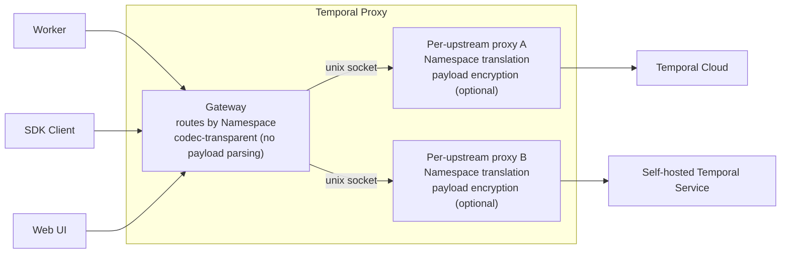

import { ReleaseNoteHeader } from '@site/src/components';

<ReleaseNoteHeader type="prerelease">
  Temporal Proxy is under active development and evolving quickly. Behavior and configuration can change between
  releases. See the [temporal-proxy repository](https://github.com/temporalio/temporal-proxy) for the current status
  and the definitive configuration schema.
</ReleaseNoteHeader>

The Temporal Proxy is a gRPC proxy that sits between your Temporal SDK Clients, Workers, and the Temporal Web UI on one
side and one or more upstream Temporal Services on the other. It handles Namespace translation, TLS termination, and
optional payload encryption so your applications can target a single local endpoint while the proxy routes each request
to the right upstream, whether that is a local development Service, a self-hosted Service, or Temporal Cloud.

## Why use it

Without the proxy, connection details leak into your application code. Every Worker and Client has to know the
upstream's host, TLS material, credentials, and the exact Namespace name the upstream expects. That couples your code to
an environment: moving between a local Service, a self-hosted deployment, and Temporal Cloud becomes a code change.

The proxy owns that concern instead. Workers talk plaintext to a single local endpoint using a short Namespace name, and
the proxy adds TLS, credentials, and Namespace translation on the way out. Point a Worker at a different Namespace and
it reaches a different upstream, with no change to the Worker.

## How it works

The proxy is built from a gateway and one proxy per upstream, connected by unix sockets:

- The **gateway** is the single inbound endpoint that every Worker, SDK Client, and the Web UI connects to.
- Each **upstream** has its own proxy that handles communication with that destination.


```mermaid
flowchart LR
    Worker[Worker]
    Client[SDK Client]
    UI[Web UI]

    subgraph Proxy[Temporal Proxy]
        direction LR
        Gateway["Gateway<br/>routes by Namespace<br/>codec-transparent (no payload parsing)"]
        ProxyA["Per-upstream proxy A<br/>Namespace translation<br/>payload encryption (optional)"]
        ProxyB["Per-upstream proxy B<br/>Namespace translation<br/>payload encryption (optional)"]
        Gateway -->|unix socket| ProxyA
        Gateway -->|unix socket| ProxyB
    end

    Cloud[Temporal Cloud]
    SelfHosted[Self-hosted Temporal Service]

    Worker --> Gateway
    Client --> Gateway
    UI --> Gateway
    ProxyA --> Cloud
    ProxyB --> SelfHosted
```

For each request, the gateway:

1. peeks the target Namespace without parsing the payload; it is codec-transparent and relays raw frames in both
   directions.
2. picks an upstream: the first matching routing rule, otherwise the system upstream for Namespace-less calls, otherwise
   the default.
3. hands the request to that upstream's proxy over a unix socket.

The per-upstream proxy then rewrites the local Namespace to the name the upstream expects, attaches that upstream's TLS
and credentials, forwards to the Temporal Service, and translates the Namespace back on responses. When payload
encryption is enabled, it also seals payloads on the way out and opens them on the way back, so the upstream only ever
stores ciphertext.

### Terms

| Term             | Meaning                                                                                                                                                                                         |
| ---------------- | ----------------------------------------------------------------------------------------------------------------------------------------------------------------------------------------------- |
| gateway          | The single inbound gRPC endpoint that every SDK Client, Worker, and the Web UI connects to. It routes each request to an upstream by Namespace and request metadata, and never parses payloads. |
| upstream         | A configured destination the proxy forwards to: a Temporal Service (local dev, self-hosted, or Temporal Cloud), or another Temporal Proxy.                                                      |
| system upstream  | The upstream that handles Namespace-less requests, such as the SDK's `GetSystemInfo` call on connect.                                                                                           |
| extension server | A gRPC service you run that the proxy calls out to for a capability it has no built-in backend for. Today that means wrapping data encryption keys as a key management backend.                 |
| Temporal Service | A Temporal frontend the proxy connects to.                                                                                                                                                      |

## Prerequisites

- One or more upstream Temporal Services to route to, such as a local development Service, a self-hosted Service, or
  Temporal Cloud.
- The `hostPort` address for each upstream.
- Any credentials the upstreams require, such as a Temporal Cloud API key or mTLS certificates.
- Go installed, if you build the proxy from source. The container image and Helm chart do not require a local Go
  toolchain.

## Install the proxy

Install the `proxy` binary with Go:

```bash
go install github.com/temporalio/temporal-proxy/cmd/proxy@latest
```

Pin an explicit version instead of `@latest`, using a tag from the
[releases page](https://github.com/temporalio/temporal-proxy/releases):

```bash
go install github.com/temporalio/temporal-proxy/cmd/proxy@vX.Y.Z
```

Pull the container image:

```bash
docker pull temporalio/temporal-proxy:latest
```

Install with Helm from the Temporal Helm repo, optionally pinning a chart version with `--version`:

```bash
helm install temporal-proxy temporal-proxy \
  --repo https://go.temporal.io/helm-charts
```

Each chart release deploys a proxy version by default. Override it with `--set image.tag=vX.Y.Z`. Supply the proxy
configuration under the `config` key of a Helm values file, as described in
[Deploy to Kubernetes](/production-deployment/temporal-proxy/deploy-kubernetes).

Run the proxy with a configuration file passed through the `-c` (or `--config`) flag:

```bash
proxy serve -c config.yaml
```

`--config` also reads the `PROXY_CONFIG` environment variable, which is how the Helm chart points the proxy at its
mounted configuration. See [Observability](#observability) for the remaining flags.

## Observability {/* #observability */}

The proxy serves Prometheus metrics at `/metrics` on `:9090` and logs JSON to stderr. Both the metrics listener and the
log level are set with flags on `proxy serve`, each with an environment variable equivalent:

| Flag                  | Environment variable | Default       | Sets                                         |
| --------------------- | -------------------- | ------------- | -------------------------------------------- |
| `--config`, `-c`      | `PROXY_CONFIG`       | none          | Path to the configuration file. Required.    |
| `--level`             | `LOG_LEVEL`          | `info`        | Log level: `debug`, `info`, `warn`, `error`. |
| `--metrics-addr`      | `METRICS_ADDR`       | `:9090`       | The `host:port` serving `/metrics`.          |
| `--metrics-namespace` | `METRICS_NAMESPACE`  | `tmprl_proxy` | Prometheus namespace prefixed onto metrics.  |

Metric names are `<namespace>_<subsystem>_<name>`, so with the default namespace the routing counter is
`tmprl_proxy_router_decisions_total`. There are three subsystems:

| Subsystem    | Metric                     | Labels                             | Reports                                           |
| ------------ | -------------------------- | ---------------------------------- | ------------------------------------------------- |
| `server`     | `requests_total`           | `method`, `code`                   | RPCs served, by gRPC status code                  |
| `server`     | `request_duration_seconds` | `method`                           | End-to-end time serving an RPC                    |
| `router`     | `decisions_total`          | `upstream`, `outcome`              | Routing decisions, by chosen upstream             |
| `router`     | `forwarding_errors_total`  | `upstream`, `reason`               | Forwarding failures the router originated         |
| `encryption` | `vault_ops_total`          | `operation`, `result`, `namespace` | Envelope operations, sealing and opening payloads |
| `encryption` | `vault_ops_duration_secs`  | `operation`, `namespace`           | Time per envelope operation, end to end           |
| `encryption` | `dek_ops_total`            | `operation`, `result`              | Outcome of the AES-256-GCM step alone             |
| `encryption` | `dek_ops_duration_secs`    | `operation`                        | Time in the AES-256-GCM step alone                |
| `encryption` | `kek_ops_total`            | `provider`, `operation`, `result`  | DEK wrap and unwrap calls to your KMS             |
| `encryption` | `kek_ops_duration_secs`    | `provider`, `operation`            | Time spent wrapping and unwrapping DEKs           |
| `encryption` | `dek_rotations_total`      | `reason`                           | DEK rotations, by why the DEK was replaced        |
| `encryption` | `dek_cache_hits_total`     | none                               | Reads served from the decrypted-DEK cache         |
| `encryption` | `dek_cache_misses_total`   | none                               | Reads that required a KMS unwrap                  |
| `encryption` | `dek_cache_size`           | none                               | Current entries in the decrypted-DEK cache        |

The `encryption` metrics only move when [payload encryption](/production-deployment/temporal-proxy/encrypt-payloads) is configured. They are layered, so pick
the one that matches the question you are asking:

- `vault_ops_*` is the whole envelope operation end to end, including any KEK call and cache lookup, and is the pair to
  alert on. It carries the local Namespace.
- `dek_ops_*` is the symmetric AES-256-GCM step by itself, with the KEK work excluded. Its `result` is that step's own
  outcome, so a payload that encrypts cleanly and then fails to wrap its DEK counts as a success here and an error under
  `kek_ops_total`, which keeps the blame with the KMS.
- `kek_ops_*` is the calls to your KMS. Watch `kek_ops_total{result="error"}`, since a failure to wrap or unwrap a DEK
  fails the request that needed it.

`dek_rotations_total` splits by `reason`: `initial` for a Namespace's first DEK, `scheduled` for the `renewBefore`
pre-rotation, and `on_demand` for a DEK replaced at request time because no fresh one was ready. A rising `on_demand`
rate means rotation is falling behind, so raise `renewBefore`. Compare the cache counters against `cacheSize` to see
whether the cache is absorbing read traffic.


## Related

- [Temporal Proxy repository](https://github.com/temporalio/temporal-proxy)
- [Temporal Proxy Helm chart](https://github.com/temporalio/helm-charts/tree/main/charts/temporal-proxy)
- [Temporal Cloud example](https://github.com/temporalio/temporal-proxy/tree/main/examples/cloud)
- [KMS extension server example](https://github.com/temporalio/temporal-proxy/tree/main/examples/kms)
- [Codecs and Encryption](/production-deployment/data-encryption)
- [Self-hosted guide: Security](/self-hosted-guide/security)
