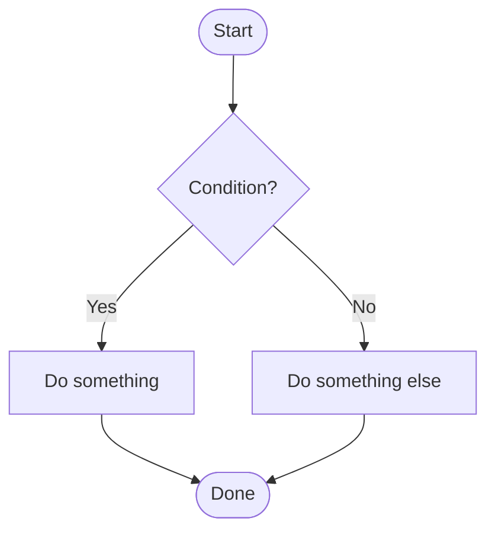
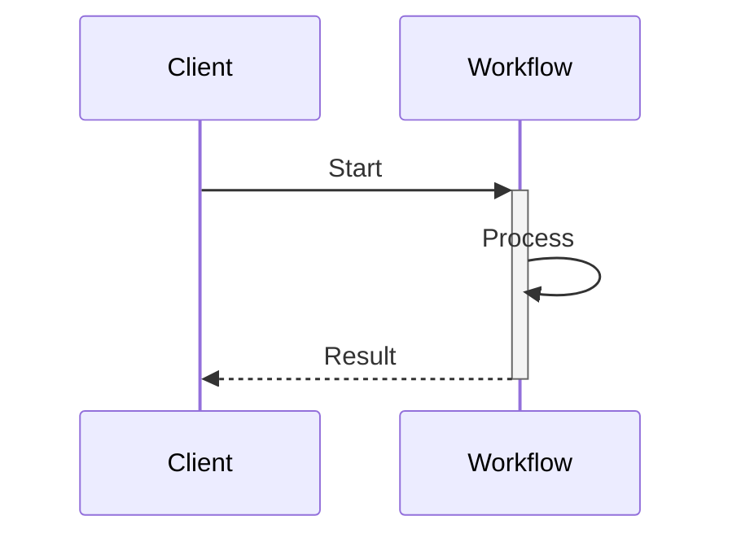

# Mermaid diagrams

Guidance for authoring [Mermaid](https://mermaid.js.org) diagrams in this repository. Read this before adding or editing a diagram — the two most common ways to break dark mode (hardcoding colors, and one specific `%%{init}%%` option) are both covered below.

- [How diagrams are styled](#how-diagrams-are-styled)
- [Quick start](#quick-start)
- [Adding color: use classDef, never hardcode hex](#adding-color-use-classdef-never-hardcode-hex)
- [Layout and spacing](#layout-and-spacing)
- [Common pitfalls](#common-pitfalls)
- [Where this lives](#where-this-lives)

## How diagrams are styled

Every diagram on the site gets brand colors, a consistent font, and theme-aware light/dark adaptation automatically, with no per-diagram configuration. This works by overriding Mermaid's generated SVG classes globally via CSS custom properties, rather than through Mermaid's own `theme`/`themeVariables` API — Docusaurus's `themeConfig.mermaid` can't express different colors for light vs. dark mode (its `options` are shared across both), and Mermaid's own themes reject `var()` inside `themeVariables` outright. So don't reach for `%%{init}%%` to set colors — it won't survive dark mode, and it isn't necessary.

Write a plain ` ```mermaid ` block with no styling directives and it will already match the rest of the site in both themes.

## Quick start

A minimal flowchart and sequence diagram, copyable as a starting point:

````markdown

````

````markdown

````

Neither needs a `classDef`, a color, or a spacing option. If a diagram feels cramped, that's worth reporting as a global spacing issue (see [Where this lives](#where-this-lives)) rather than fixing with a per-diagram `%%{init}%%` override.

## Adding color: use classDef, never hardcode hex

If a diagram needs to call out specific nodes or subgraphs — a success path, a failure branch, a small set of parallel categories — use Mermaid's `classDef` + `class` mechanism, **not** `style NodeId fill:#hex` and not a `classDef` with a literal color in it. A hardcoded hex value is baked in as an inline `style="fill:#hex !important"` attribute, which no external stylesheet can override — the box is stuck with whatever color you picked, in both themes, forever. This is a real bug that shipped and had to be migrated back out (see `docs/guides/rate-limit-downstream-apis.mdx` and `docs/guides/route-specialized-workloads.mdx` in git history for the before/after).

Instead, register a semantic class with no color in it, and let the site's CSS supply the actual (theme-aware) colors:

```
classDef success stroke-width:1px
class Step1,Step2 success
```

Both nodes and subgraphs support this (`class SomeSubgraph success` works the same as `class SomeNode success`).

Available classes today:

| Class | Meaning | Use for |
|---|---|---|
| `success` | Good / completed | A step that succeeded |
| `compensation` | Rollback / cleanup | A saga compensation step |
| `wait` | Pending / waiting | A step blocked on a signal, timer, or external event |
| `complete` | Final success | The terminal success state of a flow |
| `fail` | Error / failure | A terminal failure state |
| `highlight` | Emphasis | Something worth calling out that isn't a state |
| `blue`, `amber`, `purple` | No inherent meaning | Distinguishing N parallel categories/branches with nothing to do with success or failure (e.g. resource types, downstream services) |

`blue`/`amber`/`purple` are named for their color, not a state, on purpose — don't repurpose `success`/`fail`/etc. for a categorical distinction just because the color happens to look right; it reads as a state to the next person editing the file.

Need a category these don't cover? Add a new class following the exact pattern in `src/css/custom.css` (search for `--dp-mermaid-`) rather than reaching for `style fill:`.

## Layout and spacing

Font, node/rank spacing, and curve style are all set once, globally, in `themeConfig.mermaid.options` in `docusaurus.config.js` (sourced from `src/constants/mermaidTheme.js`). Don't set `flowchart`/`sequence` spacing per-diagram via `%%{init}%%` — it'll be inconsistent with every other diagram on the site, and if you're trying to fix cramped text, the global settings are almost certainly the better place to do it.

One exception exists in the wild (`docs/cloud/connectivity/aws-connectivity.mdx`, predating this convention) — don't copy it for new diagrams.

## Common pitfalls

- **Don't hardcode hex colors** (`style X fill:#hex`) — see [above](#adding-color-use-classdef-never-hardcode-hex).
- **Don't set `sequence: { wrap: true }`** in a per-diagram `%%{init}%%`. It's deliberately left out of the global config: Mermaid mis-sizes a note or message box whenever the text already has an explicit `<br/>` line break (a common pattern here) while wrap is on — the box comes out narrower than the text actually needs, and the overflow isn't clipped, so it renders as a broken, near-collapsed sliver. Confirmed directly; this cost real debugging time in production once already.
- **Wrap long lines manually with `<br/>`** instead of relying on auto-wrap — sequence diagrams don't auto-wrap by design (see above), so a long single-line message or note will render as one long line unless you break it yourself at a sensible point.
- **A subgraph title needs to fit on one line at the width Mermaid gives it.** Don't add padding/margin to try to fix a cramped-looking title — Mermaid measures the *unpadded* text to size its container with no slack, so added padding can tip an otherwise-fine title into wrapping, and the overflow won't be clipped (this happened, and was fixed by removing padding, not adding it).
- **Sequence diagram notes/messages inside a `rect rgb(...) ... end` highlight block** get a fixed, non-theme-aware background color from Mermaid — there's no way to detect this from CSS (the highlight rect has no DOM relationship to the text drawn over it), so don't assume message text will always sit on the true page background.

## Where this lives

- `src/constants/mermaidTheme.js` — font, spacing, curve style, and the light/dark base theme names. Single source of truth.
- `src/css/custom.css` (search `--mermaid-` and `--dp-mermaid-`) — every color, in both themes, plus the fixes for Mermaid rendering quirks referenced above. Each rule has a comment explaining why it exists; read one before changing it; there's usually a reason a fix looks the way it does.
- `docusaurus.config.js` — wires `mermaidTheme.js` into `themeConfig.mermaid`.

If you want to preview a CSS or config change against every diagram in the repo before/after, in both themes, without rendering the whole site — it's straightforward to script directly against the `mermaid` package (already a transitive dependency via `@docusaurus/theme-mermaid`) and a headless render of each ` ```mermaid ` block found under `docs/`. Nothing checked in currently does this; build one locally if you need it.
